# AI 产品生产指南

本指南旨在提供一套完整的企业级 AI 产品开发、部署与运维的技术栈选型与最佳实践。涵盖了从开发环境、前后端框架、数据处理、模型服务到 LLMOps 的全链路解决方案。

## 🏗️ 全景架构图

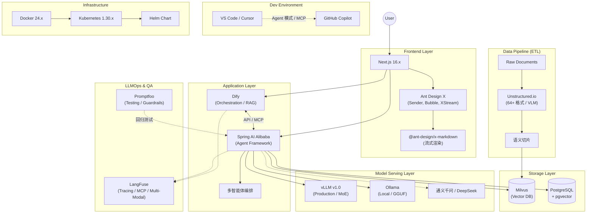

## 📚 模块详解与指南

### 1. 开发环境与协同 (IDE)

- **工具**: [VS Code](https://code.visualstudio.com/) v1.107.x + [GitHub Copilot](https://github.com/features/copilot) v1.107.x, [Cursor](https://cursor.sh/) v2.1.x
- **定位**: 高效的 AI 辅助编程环境。前端推荐 VS Code，后端推荐 Cursor。
- **优势**: VS Code 生态丰富，支持 Copilot Chat、Inline Chat 及 Agent 模式与 MCP 服务器扩展；Cursor 深度集成 AI，提供代码库嵌入与 Bugbot 代码审查能力，支持 GPT-5.x / Claude 4.5 / Gemini 3 等多模型切换。
- 👉 [VS Code Copilot & Cursor：前后端高效开发协同指南](vscode-copilot-cursor-guide.md)

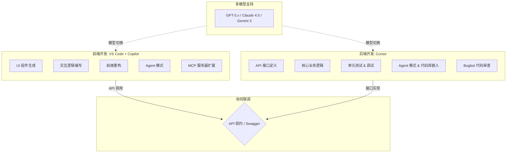

### 2. 前端交互层 (Frontend)

- **工具**: [Next.js](https://nextjs.org/) 16.x, [Ant Design X](https://x.ant.design/) 2.x
- **定位**: 构建高性能、流式响应的 AI 对话界面。
- **优势**: Next.js 基于 React Server Components (RSC) 的 App Router 架构，支持 React 19 特性，提供 SSR/SSG/ISR 多种渲染模式；Ant Design X 专为 AI 场景设计，提供 `@ant-design/x-sdk`（useXChat, XStream）和 `@ant-design/x-markdown`（流式渲染）等开箱即用的对话组件。
- 👉 [Next.js & Ant Design X：构建现代化 AI 驱动的前端应用](nextjs-ant-design-x-guide.md)

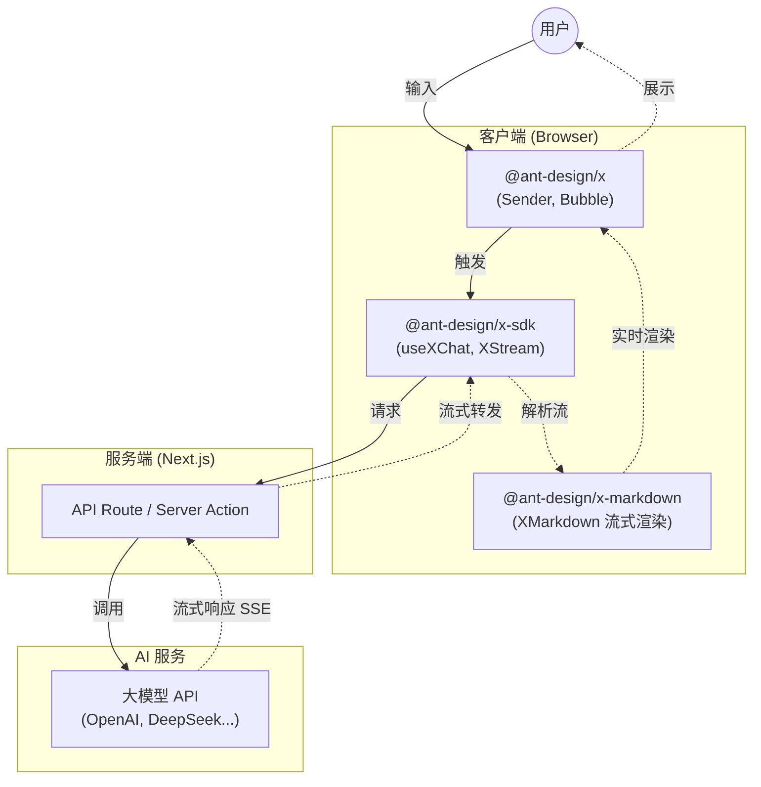

### 3. 应用编排与后端 (Backend)

- **工具**: [Dify](https://dify.ai/) v1.11.x, [Spring AI Alibaba](https://github.com/alibaba/spring-ai-alibaba) v1.1.x
- **定位**: Dify 负责可视化工作流编排与 RAG 引擎，Spring AI Alibaba 负责 Agent 智能体框架与多智能体编排。
- **优势**: Dify 降低了 AI 应用编排门槛，快速验证想法；Spring AI Alibaba 提供了 Agent Framework、多智能体编排能力，支持 MCP 协议，无缝对接阿里云通义大模型等国产算力。
- 👉 [Dify & Spring AI Alibaba：构建下一代 AI 应用的双重利器](dify-spring-ai-alibaba-guide.md)

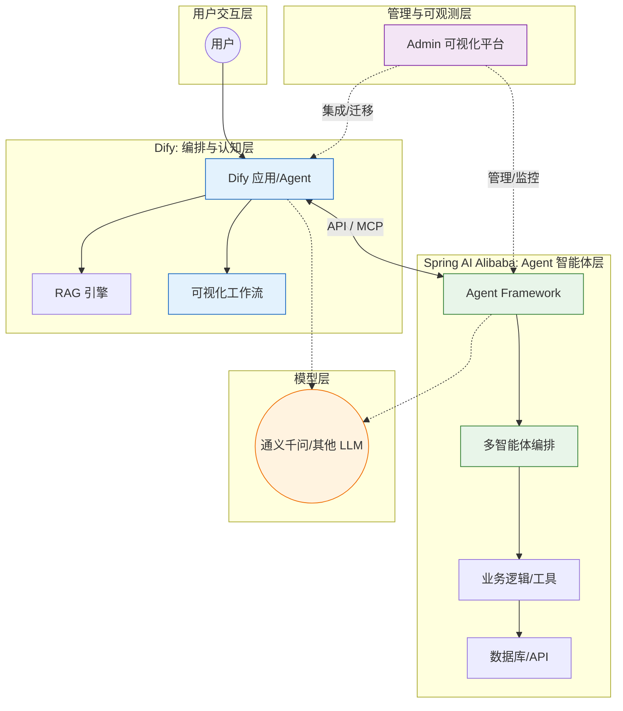

### 4. 数据存储与 ETL (Data)

- **工具**: [PostgreSQL](https://www.postgresql.org/) v15.x + pgvector v0.8.1, [Milvus](https://milvus.io/) v2.5.x, [Unstructured.io](https://unstructured.io/) v0.18.x
- **定位**: Unstructured 处理 64+ 种格式的非结构化数据清洗（含 VLM 增强），Milvus 存储向量索引，PostgreSQL 存储业务元数据并支持轻量级向量检索。
- **优势**: Unstructured 支持语义切片（Semantic Chunking）与 OCR；Milvus 支持 Lite/Standalone/Distributed 三种部署模式，亿级向量毫秒级响应；PostgreSQL 通过 pgvector 插件实现向量与结构化数据混合查询，简化架构。
- 👉 [PostgreSQL & Milvus：结构化与非结构化数据的存储双雄](postgresql-milvus-guide.md)
- 👉 [Unstructured.io & ETL：构建 AI 时代的数据流水线](unstructured-etl-guide.md)

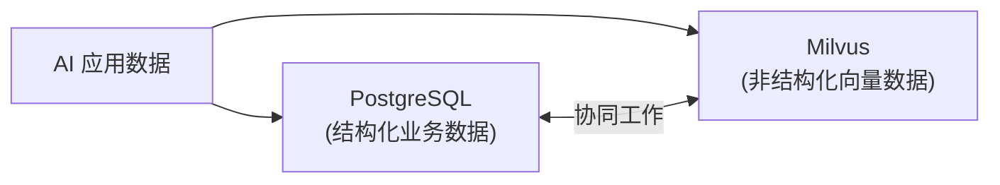

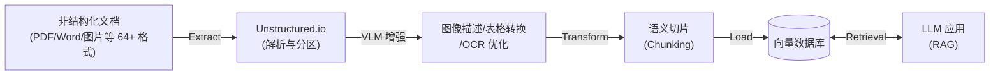

### 5. 模型服务 (Inference)

- **工具**: [Ollama](https://ollama.com/) v0.13.5, [vLLM](https://github.com/vllm-project/vllm) v1.0.x (PyTorch Foundation 托管)
- **定位**: Ollama 用于本地快速验证与边缘计算，vLLM 用于生产环境的高并发推理与 MoE 模型部署。
- **优势**: Ollama 基于 GGUF 格式，支持 Llama 4、DeepSeek-R1、Qwen 等主流模型及多模态视觉模型；vLLM 采用 V1 架构与 PagedAttention 技术，支持 Expert Parallelism（适用于 DeepSeek-V3/Mixtral 等 MoE 模型），是工业界首选方案。
- 👉 [Ollama & vLLM：大模型推理的“简”与“强”](ollama-vllm-guide.md)

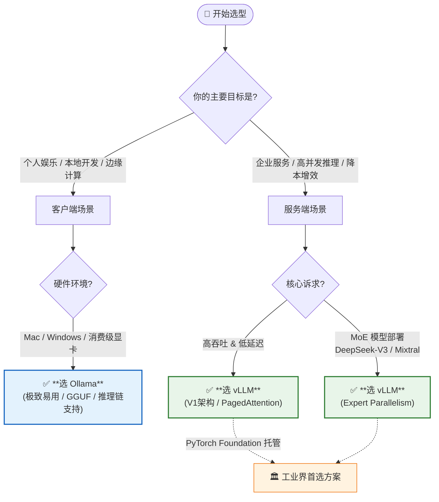

### 6. 质量保障与运维 (LLMOps)

- **工具**: [LangFuse](https://langfuse.com/) v1.0.x, [Promptfoo](https://www.promptfoo.dev/) v0.9.x
- **定位**: Promptfoo 负责上线前的 Prompt 回归测试、红队测试与 Guardrails 验证，LangFuse 负责上线后的全链路追踪与 Prompt 版本管理。
- **优势**: Promptfoo 确保 Prompt 变更不引入回归问题；LangFuse 基于 OpenTelemetry，支持 Agent Graphs 可视化、MCP Tracing、多模态追踪，提供细粒度的 Token 消耗统计与成本分析。
- 👉 [LangFuse & Promptfoo：LLM 应用的观测与评估双壁](langfuse-promptfoo-guide.md)

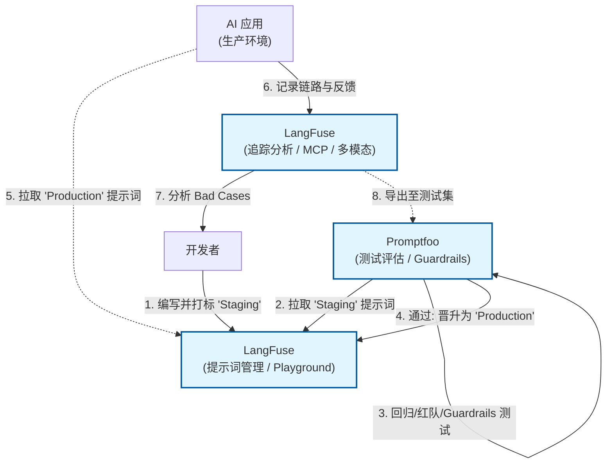

### 7. 基础设施 (Infra)

- **工具**: [Docker](https://www.docker.com/) 24.x, [Kubernetes](https://kubernetes.io/) 1.30.x
- **定位**: 容器化交付与集群编排，保障应用的高可用与弹性伸缩。
- **优势**: Docker 实现环境一致性，分层存储机制高效构建镜像；K8s 基于 containerd 运行时，结合 Helm Chart 进行应用打包分发，提供 Deployment、Service、Ingress 等强大的服务编排能力。
- 👉 [Docker & Kubernetes：云原生时代的基石](docker-kubernetes-guide.md)

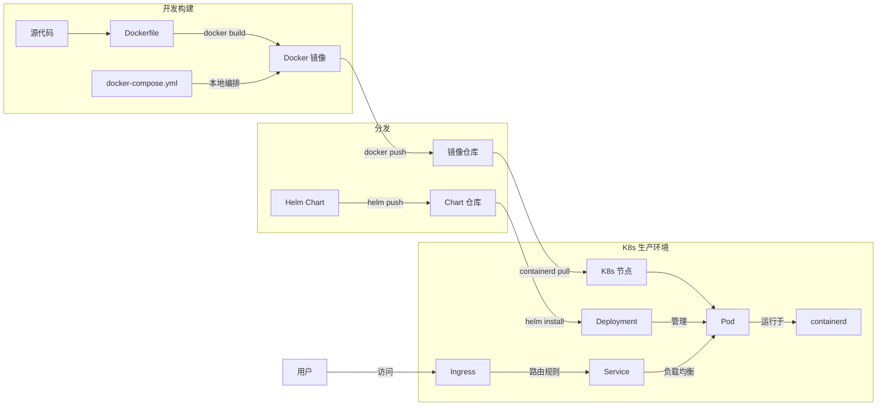

## 🔄 协作流程与搭配指南

本指南中的技术栈并非孤立存在，而是通过紧密的协作形成完整的 AI 生产力闭环：

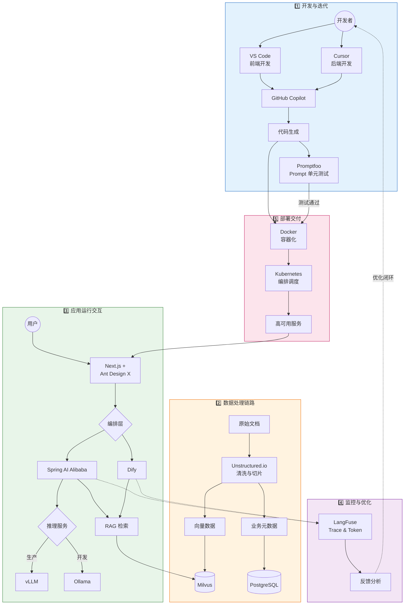

1. **开发与迭代**:

   - 开发者使用 **VS Code** (前端) 和 **Cursor** (后端) 编写代码，**GitHub Copilot** 辅助生成。
   - **Promptfoo** 用于在开发阶段对 Prompt 进行单元测试，确保变更不破坏现有逻辑。

2. **数据处理链路**:

   - 原始文档通过 **Unstructured.io** 进行清洗和切片 (ETL)。
   - 处理后的向量数据存入 **Milvus**，业务元数据存入 **PostgreSQL**。

3. **应用运行交互**:

   - 用户在 **Next.js** + **Ant Design X** 构建的前端界面发起对话。
   - 请求转发至 **Spring AI Alibaba** 或 **Dify** 进行编排。
   - 后端调用 **Milvus** 进行 RAG 检索，并请求 **vLLM** (生产) 或 **Ollama** (开发) 进行推理。

4. **监控与优化**:

   - 应用运行时的所有 Trace 和 Token 消耗实时上报至 **LangFuse**。
   - 基于 LangFuse 的反馈数据，开发者优化 Prompt 和代码，形成闭环。

5. **部署交付**:
   - 所有服务通过 **Docker** 容器化，最终由 **Kubernetes** 统一编排调度，保障高可用。

---

# VS Code Copilot & Cursor：前后端高效开发协同指南

> 2025 年 12 月
> 版本：VS Code v1.107.x | GitHub Copilot v1.107.x | Cursor v2.1.x

本文档旨在介绍如何结合使用 **VS Code + GitHub Copilot** 进行前端开发，以及使用 **Cursor** 进行 Java 后端开发，以构建高效的 AI 辅助全栈开发工作流。


## 1. 前端开发：VS Code + GitHub Copilot

VS Code 拥有庞大的插件生态，是前端开发的首选编辑器。结合 GitHub Copilot，可以极大地提升 HTML/CSS/JavaScript/TypeScript 以及主流框架（React, Vue, Angular）的开发效率。

### 核心优势

- **强大的生态系统**：ESLint, Prettier, Tailwind CSS 等插件完美集成。
- **Copilot Chat**：集成在侧边栏，可随时提问、解释代码或生成代码片段。
- **Inline Chat (行内对话)**：直接在编辑器中通过 `Ctrl+I` (Windows) / `Cmd+I` (Mac) 唤起，进行代码生成或重构。

### 实战场景

#### 1.1 组件生成

在编写 React 或 Vue 组件时，可以通过注释描述需求，Copilot 会自动补全整个组件结构。

**示例**：
在 `.tsx` 文件中输入注释：

```typescript
// 创建一个响应式的导航栏组件，包含 Logo、菜单项（首页、产品、关于我们）和登录按钮，使用 Tailwind CSS 样式
```

Copilot 将自动生成包含 JSX 结构和 Tailwind 类名的完整代码。

#### 1.2 样式辅助

编写 CSS 或使用 CSS-in-JS 时，Copilot 能根据上下文推断样式属性。

#### 1.3 代码解释与重构

选中一段复杂的逻辑代码，右键选择 "Copilot" -> "Explain This"（解释这段代码），或者使用 Inline Chat 指令 `/fix` 修复 Lint 错误。

#### 1.4 终端命令辅助

在 VS Code 终端中，如果遇到报错或不知道如何写命令，可以直接输入 `Cmd+I` (Mac) / `Ctrl+I` (Windows) 唤起 Copilot，它会根据上下文生成正确的 Shell 命令（如 Git 操作、依赖安装等）。

#### 1.5 多文件编辑

VS Code Copilot 支持跨文件编辑会话：

- 通过单个提示即可对项目中的多个文件进行协调修改
- Copilot 会分析项目结构并进行协调变更
- 结合 **Agent 模式** 可实现更复杂的跨组件重构

> 💡 **提示**：现已演进为更强大的 Agent 模式，详见 1.7 节

#### 1.6 模型选择

GitHub Copilot 支持多模型切换。用户可以在 Chat 界面中选择不同模型，包括：

- **GPT-5.2** / **GPT-5.1** / **GPT-5.1-Codex-Max**（OpenAI 最新模型）
- **Claude Opus 4.5** / **Claude Sonnet 4.5**（Anthropic 最新模型）
- **Gemini 3 Pro** / **Gemini 3 Flash**（Google 模型）

此外，VS Code 还支持 **Auto 模型选择**，可根据任务自动选择最优模型。

#### 1.7 Agent 模式（自主编码代理）

最新的 Copilot 引入了 **Agent 模式**，可以自主规划和执行复杂的开发任务：

- 自动执行终端命令、创建文件、搜索文档
- 支持跨文件协调修改
- 可安装 **MCP 服务器** 扩展能力（如数据库查询、外部 API 连接）
- 在 Chat 视图中通过 Agent 选择器切换模式（快捷键 `Ctrl+Alt+I`）

**示例任务**：

> 使用 OAuth 实现身份认证
> 将代码库迁移到新框架
> 调试失败的测试并应用修复

#### 1.8 自定义指令与 MCP

- **自定义指令**：定义项目特定的编码规范，AI 将按照您的风格生成代码
- **自定义代理**：创建专注于特定工作流的 Agent（如架构讨论）
- **MCP 服务器**：扩展 Chat 功能，添加数据库查询、外部 API 等工具

## 2. 后端开发：Cursor (Java)

Cursor 是一款基于 VS Code 二次开发的 AI 原生编辑器，它对代码库的索引和理解能力非常出色，特别适合处理强类型的 Java 后端项目（如 Spring Boot）。

### 核心优势

- **全库索引 (Codebase Indexing)**：Cursor 会索引整个项目文件，理解类之间的依赖关系，这对于复杂的 Java 项目至关重要。
- **Cursor Tab**：超越传统自动补全的“预测性编程”功能。它不仅补全代码，还能预测你的下一个光标位置和修改意图，支持多行差异（Diff）预览，按 `Tab` 键即可一键采纳。
- **Cmd+K (Ctrl+K)**：强大的行内编辑功能，可以直接修改现有代码逻辑。
- **Chat with Codebase**：在对话框中使用 `@Codebase`，可以基于整个项目上下文回答问题，例如“找到所有使用了 UserDTO 的 Controller”。

### 实战场景

#### 2.1 Spring Boot 样板代码生成

Java 开发往往涉及大量的样板代码（Controller, Service, Repository, DTO）。

**示例**：
在 Chat 中输入：

> 创建一个用户管理模块，包含 User 实体（id, name, email），对应的 JPA Repository，Service 接口及实现，以及 RESTful Controller。使用 Lombok 注解。

Cursor 会一次性生成多个文件的代码建议，并考虑到项目现有的包结构。

#### 2.2 单元测试生成

Java 强调测试覆盖率。选中一个 Service 方法，使用 `Cmd+K` 输入 "Generate JUnit 5 tests for this method, mocking dependencies with Mockito"。Cursor 能精准地生成包含 Mock 逻辑的测试用例。

#### 2.3 遗留代码理解与维护

对于接手的老旧 Java 项目，使用 `@Codebase` 提问：“分析一下订单处理的完整流程，从 Controller 入口到数据库落库”。Cursor 会跨文件追踪调用链并给出解释。

#### 2.4 Agent 模式（原 Composer）

Cursor 的核心功能 **Agent** 允许进行深度代码库理解和多文件协同编辑：

- **代码库嵌入**：深度理解项目结构和依赖关系
- **自主执行**：自动执行终端命令、创建文件、搜索文档
- **MCP 服务器**：连接外部工具和数据源
- **计划模式**：复杂任务自动规划执行步骤

**示例任务**：

> 添加一个新的 API 端点，包括 Controller, Service, DTO 和数据库迁移
> 实现用户认证功能并编写测试

💡 Agent 可从 Slack、问题跟踪器、移动端等启动任务，在 IDE 中完成。

#### 2.5 灵活的模型选择

Cursor 支持多种顶级模型切换：

| 模型                            | 提供商    | 特点                           |
| ------------------------------- | --------- | ------------------------------ |
| **Claude 4.5 Opus / Sonnet**    | Anthropic | 擅长编码和逻辑推理，支持思维链 |
| **GPT-5.2 / GPT-5.1-Codex-Max** | OpenAI    | 最新 GPT 系列，高速高质量      |
| **Gemini 3 Pro / Flash**        | Google    | 支持超长上下文（200k+）        |
| **Grok Code**                   | xAI       | 专为代码优化                   |
| **Composer 1**                  | Cursor    | Cursor 自研代理模型            |

Cursor 还支持 **Auto 模式**，根据任务自动选择最优模型。

#### 2.6 最新功能（2025 年 12 月）

- **调试模式**：智能调试和错误修复
- **计划模式**：复杂任务的步骤规划
- **多智能体评审**：代码审查与建议
- **Bugbot**：自动识别问题并一键修复
- **CLI 支持**：在任意终端运行 Agent
- **规则与记忆**：通过可复用的作用域指令自定义模型行为

## 3. 协同工作流建议

虽然可以在同一个编辑器中完成所有工作，但根据工具特性进行分工可以最大化效率：

| 开发领域                  | 推荐工具              | 理由                                                                                                                         |
| :------------------------ | :-------------------- | :--------------------------------------------------------------------------------------------------------------------------- |
| **前端 (Web/Mobile)**     | **VS Code + Copilot** | 适合习惯原生 VS Code 体验、需要企业级合规管理的团队。Agent 模式 + MCP 扩展能力强大。支持 GPT-5/Claude 4.5/Gemini 3。         |
| **后端 (Java/Go/Python)** | **Cursor**            | 后端逻辑通常更复杂，依赖引用多。Cursor 的代码库嵌入和 Agent 模式能更好地处理跨文件重构和复杂业务逻辑。支持 Bugbot 代码审查。 |

### 最佳实践

1.  **前端**：在 VS Code 中打开前端项目文件夹，利用 Copilot 快速构建 UI 和交互逻辑。
2.  **后端**：在 Cursor 中打开后端项目文件夹，利用其深度理解能力编写业务逻辑和 API 接口。
3.  **联调**：前后端通过 API 文档（如 Swagger/OpenAPI）对接，AI 工具均可辅助生成 API 调用代码。

## 总结

- **VS Code Copilot** 胜在**原生集成**、**企业级生态**与**Agent 自主编码能力**，支持 MCP 服务器扩展，是前端开发和企业环境的稳健选择。
- **Cursor** 胜在**深度代码库理解**、**Agent 模式**与 **Bugbot 代码审查**，是处理复杂后端逻辑和全栈重构的强力引擎。

两者现已支持最新的 **GPT-5 系列**、**Claude 4.5 系列** 和 **Gemini 3** 模型，合理搭配将显著提升全栈开发的产出速度与代码质量。

# Next.js & Ant Design X：构建现代化 AI 驱动的前端应用

> **文档更新日期**：2025 年 12 月  
> **Next.js 版本**：16.x | **Ant Design X 版本**：2.x

本文档旨在介绍 React 生态中最流行的全栈框架 **Next.js**，以及 Ant Design 团队专为 AI 场景打造的组件库 **Ant Design X**，并探讨如何结合两者快速构建高质量的 AI 应用前端。


## 1. Next.js：React 框架的集大成者

Next.js 是由 Vercel 开发的开源 React 框架，它解决了传统 React 单页应用 (SPA) 在 SEO、首屏加载速度和路由管理上的痛点，是目前构建生产级 React 应用的首选方案。

### 核心特性

- **App Router (应用路由器)**：基于 React Server Components (RSC) 的全新路由架构。允许在服务器端直接获取数据并渲染组件，大幅减少发送到客户端的 JavaScript 体积，提升性能。
- **React 19 支持**：App Router 内置 React canary 版本，包含所有稳定的 React 19 特性，以及正在框架中验证的新功能。
- **混合渲染模式**：
  - **SSR (服务端渲染)**：每次请求时在服务器生成 HTML，利于 SEO 和动态内容。
  - **SSG (静态站点生成)**：构建时生成 HTML，适合博客、文档等静态内容，访问速度极快。
  - **ISR (增量静态再生)**：在运行时更新静态页面，无需重新构建整个站点。
- **内置优化**：自动优化图像 (`next/image`)、字体 (`next/font`) 和脚本加载，开箱即用。
- **API Routes / Route Handlers**：直接在 Next.js 项目中编写后端 API 逻辑，轻松构建全栈应用。
- **Turbopack**：新一代 Rust 构建工具，提供更快的开发体验。

### 适用场景

- SEO 要求高的官网、电商平台。
- 内容密集型网站（博客、新闻门户）。
- 需要极致性能的大型 Web 应用。

## 2. Ant Design X：专为 AI 时代打造的组件库

Ant Design X 是 Ant Design 团队推出的全新组件库，专注于 **AI 对话 (Chat UI)** 和 **生成式 AI** 交互场景。它填补了传统 UI 组件库在 AI 特定交互模式上的空白。

> **重要提示**：Ant Design X 2.0 采用 Monorepo 架构，分为三个独立包：
>
> - `@ant-design/x` - UI 组件库
> - `@ant-design/x-sdk` - AI 聊天数据流管理工具
> - `@ant-design/x-markdown` - 高性能流式 Markdown 渲染引擎

### 核心特性

- **开箱即用的 AI 组件**：
  - `XProvider`：管理 AI 上下文和主题。
  - `Bubble`：对话气泡，支持 Markdown 渲染、代码高亮、加载状态等。新增 `Bubble.System` 和 `Bubble.Divider` 子组件。
  - `Sender`：智能输入框，支持语音输入、附件上传、提示词触发、**Slot 插槽模式**。
  - `Prompts`：预设提示词卡片，引导用户提问。
  - `ThoughtChain`：思维链展示组件，可视化 AI 的推理过程。
  - `Think`：（2.0 新增）思考过程展示组件。
  - `Conversations`：对话列表管理组件。
  - `Welcome`：欢迎页组件。
  - `Attachments`：附件上传组件。
  - `Suggestion`：建议提示组件。
  - `Actions`：操作按钮组件，包含 `Actions.Copy`、`Actions.Audio` 等子组件。
  - `FileCard`：（2.0 新增）文件卡片展示组件。
  - `Sources`：（2.0 新增）引用来源展示组件。
  - `CodeHighlighter`：（2.0 新增）代码高亮组件。
  - `Mermaid`：（2.0 新增）Mermaid 流程图组件。
  - `Notification`：（2.0 新增）通知组件。
- **独立的数据流管理包 (`@ant-design/x-sdk`)**：
  - `useXChat`：聊天状态管理 Hook，支持 `setMessages` 回调函数、`isRequesting` 响应式变量、`abort` 状态等。
  - `useXConversations`：对话管理 Hook。
  - `XRequest`：HTTP 请求工具。
  - `XStream`：流式数据处理工具。
  - `Chat Provider`：多种大模型服务商适配器（如 `DeepSeekChatProvider`）。
- **独立的 Markdown 渲染包 (`@ant-design/x-markdown`)**：
  - `XMarkdown`：高性能流式 Markdown 渲染组件。
  - 内置插件：Latex 公式、代码高亮、Mermaid 流程图。
  - 支持流式渲染动画效果。
- **灵活的主题定制**：继承了 Ant Design 的 Design Token 系统，可以轻松定制品牌色和样式，与现有的 Ant Design 组件无缝融合。
- **React Server Components 兼容**：完美支持 Next.js 的 App Router 架构，适应现代前端开发流。
- **多模型适配**：UI 层与模型层解耦，可以轻松对接 OpenAI、通义千问、DeepSeek 等各种大模型 API。

> **注意**：Ant Design X 2.x 依赖 **Ant Design 6.x**，如果你使用的是 antd 5.x，请使用 Ant Design X 1.x 版本。

### 适用场景

- AI 聊天助手 (Chatbot) 界面。
- Copilot 风格的侧边栏助手。
- 基于 LLM 的内容生成工具。
- 支持思维链展示的 AI Agent 应用。

结合 Next.js 的高性能架构与 Ant Design X 的专业 AI 组件，可以极速构建一个生产级的 AI 对话应用。

### 架构优势

1.  **流式响应 (Streaming)**：
    Next.js 的 App Router 天然支持流式传输。结合 AI 模型的流式输出 (Server-Sent Events)，可以实现打字机效果，让用户在 AI 生成内容的同时就能看到结果，极大降低等待焦虑。

2.  **服务端数据安全**：
    在 Next.js 的 Server Actions 或 Route Handlers 中调用大模型 API，可以确保 API Key 等敏感信息不暴露给客户端。

3.  **快速迭代**：
    使用 `@ant-design/x-sdk` 中的 `useXChat` 等 Hooks，配合 Next.js 的快速刷新 (Fast Refresh) 和 Turbopack，开发体验极佳。

## 总结

- **Next.js** 提供了坚实的应用骨架，解决了路由、渲染和性能问题，支持 React 19 和 Turbopack。
- **Ant Design X 2.x** 采用 Monorepo 架构，提供了专业的 AI 交互组件、独立的数据流管理工具和高性能 Markdown 渲染引擎。

两者结合，是目前构建 Web 端 AI 应用的最佳实践组合之一。

## 参考资源

- [Next.js 官方文档](https://nextjs.org/docs)
- [Ant Design X 官方文档](https://x.ant.design/)
- [Ant Design X 更新日志](https://x.ant.design/changelog)
- [Ant Design X v2 迁移指南](https://x.ant.design/docs/react/migration-v2)
- [@ant-design/x-sdk 文档](https://github.com/ant-design/x/blob/x-sdk/README.md)
- [@ant-design/x-markdown 文档](https://github.com/ant-design/x/blob/x-markdown/README.md)

---

# Dify & Spring AI Alibaba：构建下一代 AI 应用的双重利器

> 2025 年 12 月
> 版本：Dify v1.11.x | Spring AI Alibaba v1.1.x

本文档旨在介绍两款在 AI 应用开发领域备受关注的工具：**Dify**（开源 LLM 应用开发平台）和 **Spring AI Alibaba**（Java 生态的 AI 开发框架），并探讨它们各自的优势及协同模式。


## 1. Dify：开源 LLM 应用开发平台

Dify 是一款开源的 LLM 应用开发平台，旨在帮助开发者（甚至是非技术人员）快速构建和运营生成式 AI 应用。它融合了 Backend-as-a-Service (BaaS) 和 LLMOps 的理念。

### 核心特性

- **可视化工作流编排 (Workflow Orchestration)**：通过拖拽式的画布，将 LLM、工具、逻辑分支等节点组合成复杂的业务流程，极大地降低了开发门槛。
- **强大的 RAG 引擎**：内置了文档解析、分段、清洗和检索功能，支持多种向量数据库，能够轻松构建基于私有数据的问答助手。
- **Agent 智能体构建**：支持 Function Calling 和 ReAct 模式，可以让 AI 自主调用工具（如搜索、API）来完成任务。
- **模型中立**：支持接入 OpenAI、Anthropic、Llama 以及国内的通义千问、文心一言等主流大模型，切换模型成本极低。
- **API 发布**：构建好的应用可以直接发布为 API，供前端或其他系统调用。
- **MCP 协议支持 (Model Context Protocol)**：支持接入 MCP Server 扩展工具能力，或将 Dify 应用发布为 MCP Server 供其他客户端调用，实现生态互联。

### 适用场景

- 企业内部知识库问答系统。
- 复杂的客户服务 AI Agent。
- 快速原型验证（MVP）和低代码开发。

## 2. Spring AI Alibaba：构建 Agent 智能体应用的 Java 框架

Spring AI Alibaba 1.1 是基于 Spring AI 构建的生产就绪框架，专注于构建 **Agentic、Workflow 和 Multi-agent 应用**。它是阿里云通义系列模型及服务在 Java AI 应用开发领域的最佳实践。

> 官网: [java2ai.com](https://java2ai.com/) | 当前版本: **1.1.0.0-RC2**

### 核心架构

- **Agent Framework**：以 `ReactAgent` 为核心的智能体开发框架，内置上下文工程（Context Engineering）和人机协同（Human In The Loop）支持。
- **Graph**：底层工作流运行时，支持条件路由、嵌套图、并行执行和状态管理，可导出为 PlantUML 和 Mermaid 格式。
- **Augmented LLM**：基于 Spring AI 的底层抽象，包括 Model、Tool、MCP、Message、Vector Store 等。

### 核心特性

- **多智能体编排 (Multi-Agent Orchestration)**：内置 `SequentialAgent`、`ParallelAgent`、`RoutingAgent`、`LoopAgent`、`SupervisorAgent` 等模式，轻松组合多个智能体完成复杂任务。
- **上下文工程 (Context Engineering)**：内置最佳实践，包括人机协同、上下文压缩、上下文编辑、模型与工具调用限制、工具重试、规划、动态工具选择等。
- **A2A 支持 (Agent-to-Agent)**：通过 Nacos 集成实现分布式智能体间通信与协作。
- **丰富的模型与 MCP 支持**：支持多种 LLM 提供商（DashScope、OpenAI 等）、工具调用和 Model Context Protocol (MCP)。
- **Admin 可视化平台**：一站式 Agent 平台，支持可视化 Agent 开发、可观测性、评估和 MCP 管理，可与 Dify 等低代码平台集成。
- **结构化输出 (Structured Output)**：将 LLM 输出自动映射为 Java Bean (POJO)。
- **流式传输与错误处理**：实时流式响应，强大的错误恢复和重试机制。

### 适用场景

- 构建具备自主决策能力的 AI Agent 应用。
- 需要多智能体协作的复杂业务场景。
- 现有 Spring Boot 微服务集成 AI 能力。
- 需要深度定制业务逻辑、对性能和并发有要求的后端系统。

## 3. 选型对比与协同模式

### 选型建议

| 维度         | Dify (v1.11.x)                      | Spring AI Alibaba (v1.1.x)           |
| :----------- | :---------------------------------- | :----------------------------------- |
| **开发模式** | 低代码/无代码，可视化编排           | 纯代码开发 (Java)，支持 Admin 可视化 |
| **目标用户** | 全栈开发者、产品经理、Prompt 工程师 | Java 后端工程师、架构师              |
| **核心能力** | RAG 引擎、工作流编排、快速原型      | 多智能体编排、上下文工程、A2A 通信   |
| **灵活性**   | 流程编排灵活，但底层逻辑受限于平台  | 逻辑控制极其灵活，可深度集成现有业务 |
| **部署运维** | 需要部署 Dify 平台 (Docker/K8s)     | 随 Spring Boot 应用打包部署          |

### 协同开发模式

在复杂的企业级应用中，两者并非互斥，而是可以互补的：

1.  **Dify 作为“大脑”与编排层**：
    利用 Dify 强大的 Prompt 管理和工作流编排能力，处理用户意图识别、上下文管理和复杂的 RAG 检索流程。

2.  **Spring AI Alibaba 作为“手脚”与工具层**：
    使用 Spring AI Alibaba 开发具体的业务功能接口（如查询数据库订单状态、执行复杂的计算逻辑）。将这些接口封装为 API，注册为 Dify 的**自定义工具 (Custom Tool)**。

3.  **基于 MCP 协议的互联**：
    利用 Model Context Protocol (MCP)，Spring AI Alibaba 应用可以作为 MCP Server 运行，直接被 Dify 发现和调用；反之，Dify 应用也可以作为 MCP Server 被 Spring AI Alibaba 的 Agent 调用。

4.  **Admin 平台与 Dify 的集成**：
    Spring AI Alibaba Admin 支持与 Dify 等开源低代码平台集成，可将 Dify DSL 快速迁移为 Spring AI Alibaba 项目，实现从原型到生产的平滑过渡。

5.  **"原型到生产"的渐进式开发**：
    产品经理在 Dify 上快速搭建 MVP 验证想法；验证成功后，开发团队参考 Dify 的流程设计，使用 Spring AI Alibaba 重构核心链路，以获得更高的性能和可维护性。

**场景示例**：
用户在 Dify 构建的客服助手中询问：“我的订单发货了吗？”

1.  Dify 识别意图，决定调用“查询订单状态”工具。
2.  Dify 向 Spring AI Alibaba 后端发送 API 请求。
3.  Spring AI Alibaba 后端查询数据库，返回订单信息。
4.  Dify 接收数据，利用 LLM 生成友好的回复反馈给用户。

## 总结

- **Dify** 让 AI 应用的构建变得简单、可视、可运营，适合快速原型验证和 RAG 场景。
- **Spring AI Alibaba** 让 Java 开发者能以最熟悉的方式构建生产级 Agent 智能体应用，支持多智能体编排和复杂工作流。

结合两者的力量，企业可以构建出既具备强大认知能力（Dify），又拥有深厚业务处理能力和智能体协作能力（Spring AI Alibaba）的现代化 AI 应用。

---

# PostgreSQL & Milvus：结构化与非结构化数据的存储双雄

> 2025 年 12 月
> 版本：PostgreSQL v15.x | pgvector v0.8.1

本文档旨在介绍两款在现代数据架构中至关重要的数据库：**PostgreSQL**（全能型关系数据库）和 **Milvus**（高性能向量数据库），并探讨它们在 AI 时代的角色及协同应用。


## 1. PostgreSQL：世界上最先进的开源关系型数据库

PostgreSQL 是一款功能强大、开源的对象-关系型数据库系统（ORDBMS），以其可靠性、功能的稳健性和性能著称。在 AI 浪潮下，通过插件扩展，它也成为了向量存储的有力竞争者。

### 核心特性

- **极致的可靠性与 ACID**：支持复杂的事务处理，确保数据的一致性和完整性，是核心业务数据的首选存储。
- **强大的扩展性 (Extensions)**：拥有丰富的插件生态。最著名的是 **pgvector**（当前版本 v0.8.1），它让 PostgreSQL 原生支持向量存储和相似度搜索。支持 **IVFFlat** 和 **HNSW** 索引，大大提升了查询性能。
- **多种向量类型**：支持 `vector`（最高 16,000 维）、`halfvec`（半精度，最高 16,000 维）、`sparsevec`（稀疏向量）、`bit`（二进制向量）等多种类型。
- **丰富的距离函数**：支持 L2 距离 (`<->`)、内积 (`<#>`)、余弦距离 (`<=>`)、L1 距离 (`<+>`)、汉明距离 (`<~>`)、杰卡德距离 (`<%>`) 等。
- **JSON 支持**：优秀的 JSONB 数据类型支持，使其能像 NoSQL 数据库一样处理半结构化数据。
- **标准 SQL**：完全兼容 SQL 标准，拥有强大的查询优化器和复杂的联结（Join）能力。

### 适用场景

- **核心业务系统**：用户管理、订单交易、金融账务等需要强一致性的场景。
- **轻量级 AI 应用**：利用 `pgvector` 插件，在同一个数据库中同时存储业务数据和向量数据（如知识库 Embeddings），简化架构，避免数据同步问题。
- **混合查询**：需要同时进行“向量相似度搜索”和“结构化字段过滤”（如：查找“语义相似”且“价格低于 100 元”的商品）的场景。

## 2. Milvus：为 AI 而生的云原生向量数据库

Milvus 是一款开源的云原生向量数据库，专为处理非结构化数据（文本、图像、音频、视频等转化后的向量）而设计。它在大规模向量检索领域表现卓越。当前稳定版本为 **v2.5.x**，PyMilvus SDK 最新版本为 **v2.5.16**。

### 核心特性

- **高性能向量检索**：专为向量运算优化，支持多种索引类型（IVF, HNSW, DiskANN 等），能在亿级数据规模下实现毫秒级响应。
- **灵活的部署模式**：
  - **Milvus Lite**：可像 SQLite 一样嵌入 Python 应用，适合开发测试及轻量级场景（支持最多几百万向量）。
  - **Milvus Standalone**：单机部署，适合中等规模生产环境（可扩展至 1 亿向量）。
  - **Milvus Distributed**：云原生分布式部署（存储计算分离），适合大规模生产环境（支持数百亿向量）。
- **多模态支持**：不仅支持文本向量，还能高效处理图像、视频、音频等多模态数据的向量检索。
- **混合搜索 (Hybrid Search)**：支持在向量检索的同时进行标量过滤，虽然比传统 DB 弱，但在不断增强。
- **丰富的 SDK 支持**：Python、Java、Go、Node.js、C#、RESTful 等多语言客户端。

### 适用场景

- **大规模 RAG 系统**：企业级知识库，文档切片数量达到千万或亿级。
- **推荐系统**：用户画像与物品向量的实时匹配。
- **以图搜图/视频检索**：涉及海量多媒体数据的特征检索。
- **生物特征识别**：人脸识别、指纹比对等。

## 3. 选型对比与协同模式

### 选型建议：pgvector 还是 Milvus？

| 维度             | PostgreSQL (pgvector v0.8.1)       | Milvus (v2.5.x)                      |
| :--------------- | :--------------------------------- | :----------------------------------- |
| **数据规模**     | 中小规模 (百万级向量以内表现良好)  | 大规模 (千万级至百亿级向量)          |
| **架构复杂度**   | **低** (复用现有 DB，无需新增组件) | **中/高** (需要独立部署和维护)       |
| **向量维度**     | 最高 16,000 维 (halfvec)           | 无硬性限制                           |
| **检索性能**     | 够用 (随着数据量增加性能下降较快)  | **极致** (专为高并发、低延迟设计)    |
| **数据一致性**   | 强一致性 (ACID)                    | 最终一致性 (通常情况)                |
| **混合查询能力** | **极强** (SQL 极其成熟)            | 较好 (支持标量过滤，但不如 SQL 灵活) |

### 协同开发模式

在构建复杂的企业级 AI 应用时，往往需要结合两者的优势：

**架构模式：结构化元数据 + 非结构化向量**

1.  **PostgreSQL 负责业务与元数据**：
    存储用户表、权限表、文档的元信息（作者、创建时间、分类标签）、原始文本内容等。利用其强大的事务能力保证数据准确。

2.  **Milvus 负责向量索引**：
    仅存储数据的唯一标识符（ID）和对应的向量 Embedding。利用其高性能引擎处理相似度计算。

**工作流示例**：

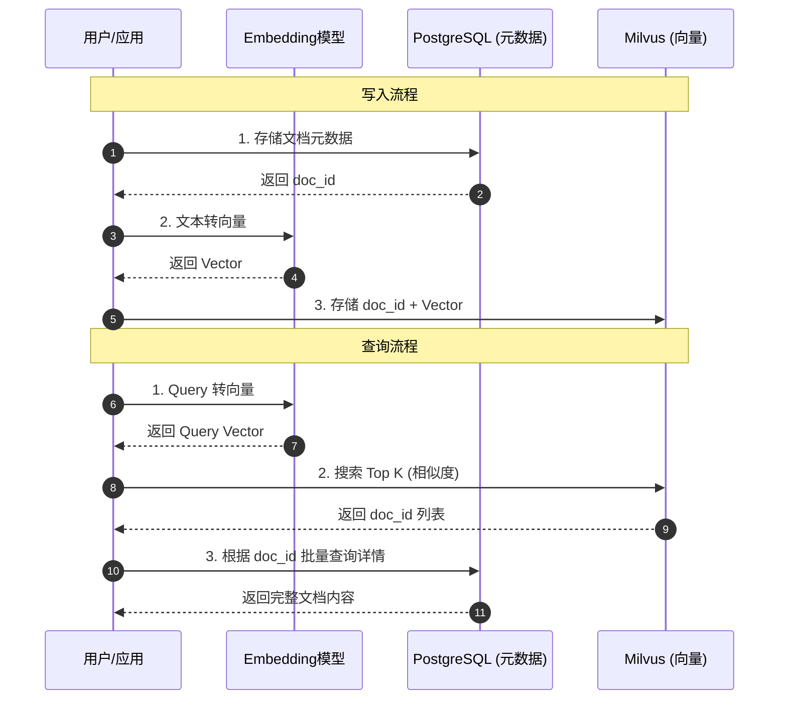

- **写入**：
  1.  将文档存入 PostgreSQL，获取生成的 `doc_id`。
  2.  将文档内容转化为向量，连同 `doc_id` 一起写入 Milvus。
- **查询**：
  1.  用户发起搜索，将 Query 转化为向量。
  2.  在 Milvus 中搜索最相似的 Top K 向量，返回一组 `doc_id`。
  3.  拿着这组 `doc_id` 去 PostgreSQL 中查询文档的详细内容（标题、正文、作者），并返回给前端。

## 总结

- **PostgreSQL** 是**全能选手**，对于大多数起步阶段或中等规模的 AI 应用，配合 `pgvector`（v0.8.1）是性价比最高的选择，架构最简单。新版本支持最高 16,000 维向量、多种距离函数、迭代索引扫描等高级特性。
- **Milvus** 是**专业选手**，当你的向量数据量巨大，或者对检索性能有极致要求时，它是不可或缺的基础设施。v2.5.x 版本提供 Lite/Standalone/Distributed 三种部署模式，灵活适配不同规模。

根据业务发展阶段灵活选择，甚至可以从 PG 开始，随着数据量增长平滑迁移至 Milvus。

---

# Unstructured.io & ETL：构建 AI 时代的数据流水线

> 2025 年 12 月
> 版本：Unstructured.io v0.18.x

本文档旨在介绍 AI 数据处理领域的关键概念 **ETL**，以及在非结构化数据处理方面表现卓越的工具 **Unstructured.io**，帮助开发者理解如何为 LLM 应用（如 RAG）准备高质量的数据。


## 1. ETL：数据处理的基石

ETL 是数据仓库和大数据领域最经典的概念，代表了数据从源头到目标的三个核心步骤：**Extract（抽取）、Transform（转换）、Load（加载）**。在 AI 时代，ETL 的内涵发生了演变，被称为 **ETL for LLMs**。

### 核心流程

1.  **Extract (抽取)**：
    - 从各种数据源（数据库、API、文件系统、网页）获取原始数据。
    - _AI 场景挑战_：数据源不再局限于结构化表格，更多是 PDF、Word、PPT、图片、HTML 等非结构化数据。
2.  **Transform (转换)**：
    - 对数据进行清洗、格式化、去重、脱敏。
    - _AI 场景挑战_：需要进行**文档切分 (Chunking)**、**向量化 (Embedding)**、元数据提取等操作，以便 LLM 理解。
3.  **Load (加载)**：
    - 将处理好的数据写入目标存储。
    - _AI 场景挑战_：目标通常是**向量数据库** (Milvus, Pinecone) 或图数据库，而非传统的数据仓库。

### 关键转换步骤：Chunking (切分)

在 Transform 阶段，**Chunking** 是最关键的一环。直接将长文档喂给 LLM 会导致上下文窗口溢出或检索精度下降。

- **Fixed-size Chunking (固定大小)**：简单粗暴，按字符数或 Token 数切分（如每 500 字符切一段）。缺点是容易切断语义。
- **Semantic Chunking (语义切分)**：基于文档结构（段落、标题）或语义相似度进行切分。Unstructured.io 的优势在于它能识别文档元素，天然支持基于 Title/Table/Paragraph 的语义切分，效果远优于固定大小切分。

## 2. Unstructured.io：非结构化数据的 ETL 利器

Unstructured.io 是一个开源库（也有 SaaS 服务），专门致力于解决 LLM 应用中最头疼的问题：**如何从任意格式的非结构化文档中提取出干净、可用的文本数据**。它是构建 RAG (检索增强生成) 系统的重要基础设施。

### 核心特性

- **全格式支持 (Ingest Any Data)**：
  - 支持解析 PDF, HTML, Word (.docx), PowerPoint (.pptx), Excel (.xlsx), Email (.eml/.msg), Markdown, Images, EPUB, RTF, XML 等 **64+ 种文件格式**。
  - 即使是扫描版的 PDF 或图片，也能通过集成的 OCR (Tesseract/PaddleOCR) 提取文本。
- **智能分区 (Partitioning)**：
  - 不仅仅是提取纯文本，还能识别文档结构。它能将文档切分为 Title (标题), NarrativeText (正文), Table (表格), ListItem (列表项) 等语义块。
  - 这对于 RAG 至关重要，因为保留文档结构能显著提升检索的准确性。
- **VLM 增强功能 (Enrichments)**：
  - **Image Description**：使用视觉语言模型 (VLM) 为检测到的图像生成文本摘要。
  - **Generative OCR**：使用 VLM 提升文本块的 OCR 识别准确度。
  - **Table to HTML**：使用 VLM 将检测到的表格转换为 HTML 结构化表示。
- **清洗与优化 (Cleaning)**：
  - 内置多种清洗函数，如去除多余的空白、去除乱码、标准化日期格式、去除页眉页脚等噪音数据。
- **连接器生态 (Connectors)**：
  - 提供 **30+ 连接器和 1,250+ 管道**，包括 Source Connectors (S3, Google Drive, SharePoint, Dropbox, Slack) 和 Destination Connectors (Pinecone, Weaviate, MongoDB, Databricks, Snowflake, Elastic)，轻松构建 ETL 管道。

### 部署方式：Local vs Platform

- **Open Source Library (Local)**：完全免费，数据不出本地。但需要自行安装复杂的依赖（如 `tesseract-ocr`, `poppler-utils`, `libreoffice`），且处理 PDF/Image 极其消耗 CPU/GPU 资源。**注意：当前版本已不再支持 Python 3.9，建议使用 Python 3.10+**。
- **Unstructured Platform**：官方提供的托管服务，包含 **UI 界面**和 **API** 两种使用方式。
  - **UI 界面**：无需编码，通过拖放文件即可快速处理，支持实时预览分区结果和 VLM 增强。
  - **API**：通过 HTTP 请求处理文件，速度更快且支持自动扩缩容，适合生产环境快速集成。
  - **定价方案**：提供 Let's Go（免费试用）、Pay-As-You-Go（按需付费）、Business（企业级）等多种方案。

### 适用场景

- **RAG 知识库构建**：将企业内部堆积如山的 PDF 报告、合同、技术手册转化为向量数据库可索引的格式。
- **表格数据提取**：从 PDF 财报中提取表格数据，并保持其结构，供 LLM 进行数据分析。
- **多模态数据预处理**：处理包含图文混排的复杂文档。

## 3. 实战：构建一个简单的 PDF 处理流水线

结合 ETL 概念与 Unstructured.io，我们可以构建一个典型的 AI 数据处理流程：

### 流程图

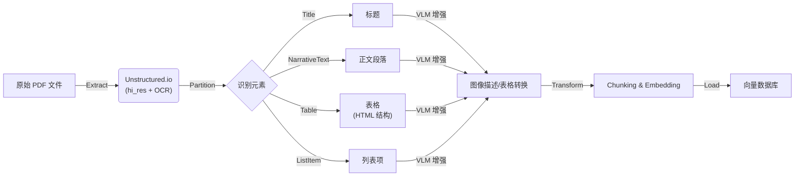

**前置准备**：
除了安装 Python 库 `pip install "unstructured[all-docs]"` 外，处理 PDF 还需要安装系统级依赖：

- **Poppler (poppler-utils)**：用于 PDF 渲染。
- **Tesseract (tesseract-ocr)**：用于 OCR 文字识别（可安装 `tesseract-lang` 获取更多语言支持）。
- **LibreOffice**：用于处理 MS Office 文档。
- **Pandoc (2.14.2+)**：用于处理 EPUB、RTF 和 Open Office 文档。

## 总结

- **ETL** 是方法论，定义了数据流动的标准过程。在 AI 时代，它从“表到表”变成了“文档到向量”。
- **Unstructured.io** 是实现这一方法论的最佳工具之一，它填平了“人类可读文档”与“机器可读数据”之间的鸿沟。
- **最新版本 (0.18.x)** 已支持 64+ 种文件格式、VLM 增强功能、30+ 连接器，并提供 UI 和 API 两种使用方式。

掌握 Unstructured.io，就掌握了高质量 RAG 应用的数据入口。

## 参考资源

- [Unstructured 官方文档](https://docs.unstructured.io/)
- [Unstructured GitHub 仓库](https://github.com/Unstructured-IO/unstructured)
- [Unstructured Platform](https://platform.unstructured.io/)
- [Unstructured 官方博客](https://unstructured.io/blog)

---

# Ollama & vLLM：大模型推理的“简”与“强”

> 2025 年 12 月
> 版本：Ollama v0.13.5 | vLLM v1.0.x

本文档旨在介绍两款在大模型（LLM）推理领域极具代表性的工具：**Ollama**（最易用的本地运行工具）和 **vLLM**（最高效的生产级推理引擎，现为 PyTorch Foundation 托管项目），帮助开发者根据场景选择合适的部署方案。

### 快速选型决策图


## 1. Ollama：让大模型触手可及

Ollama 是目前最流行的本地大模型运行工具，它极大地简化了在个人电脑（Mac, Linux, Windows）上下载、运行和管理开源大模型的过程。截至 2025 年 12 月，Ollama 已发布 **v0.13.5** 版本。

### 核心特性

- **极致易用**：
  - 安装简单，通常一条命令即可完成。
  - 运行模型只需 `ollama run llama4`，自动处理模型下载、权重加载和环境配置。
- **丰富的模型库**：
  - 拥有类似 Docker Hub 的模型仓库，支持 **Llama 4**, **Llama 3.3**, **DeepSeek-R1**, **Gemma 3**, **Qwen**, **QwQ**, **Phi 4** 等主流开源模型。
  - **多模态支持**：支持 LLaVA, Llama 3.2 Vision 等视觉模型，可进行图像分析。
  - **云模型支持**（新）：2025 年新增云端模型访问能力。
- **核心技术 (GGUF)**：
  - 基于 `llama.cpp`，使用 **GGUF** 量化格式。这种格式专为 CPU 和 Apple Silicon (统一内存) 优化，使得在消费级硬件上运行大模型成为可能。
- **Modelfile**：
  - 引入了类似 Dockerfile 的 `Modelfile` 概念，允许用户通过简单的配置文件自定义模型（设置系统提示词、调整参数、打包微调权重）。
  - 新增 `REQUIRES` 命令支持硬件要求声明。
- **推理链支持**（新）：
  - 支持 Thinking/Reasoning 模式，适配 DeepSeek-R1、QwQ 等推理模型。
- **标准 API**：
  - 提供开箱即用的 REST API，兼容 OpenAI API 格式（包括 v1/responses），方便与其他应用（如 Dify, LangChain）集成。

### 适用场景

- **本地开发与测试**：开发者在笔记本上快速验证 Prompt 或模型效果。
- **个人 AI 助手**：配合 WebUI 构建完全隐私的本地聊天机器人。
- **边缘计算**：在资源受限的设备上部署轻量级模型。

## 2. vLLM：生产级的高吞吐推理引擎

vLLM 是一个开源的大模型推理和服务引擎，以其惊人的推理速度和吞吐量著称。它主要面向服务器端部署，旨在榨干 GPU 的每一滴性能。**2025 年 5 月，vLLM 正式成为 PyTorch Foundation 托管项目**，标志着其在行业中的重要地位。

### 核心特性

- **PagedAttention 算法**：
  - 这是 vLLM 的核心创新。它像操作系统管理内存一样管理显存（KV Cache），几乎消除了显存碎片，极大提高了显存利用率，从而支持更大的 Batch Size。
- **vLLM V1 架构**（2025 年新发布）：
  - 重大架构升级，实现 **1.7x 加速**。
  - 代码更简洁、执行循环优化、零开销前缀缓存、增强的多模态支持。
- **极高的吞吐量 (Throughput)**：
  - 在并发场景下，vLLM 的吞吐量通常是 HuggingFace Transformers 的 10-20 倍。
- **Continuous Batching**：
  - 支持连续批处理，即在一个请求处理完生成后，立即插入新的请求，而不是等待整个 Batch 完成，显著降低延迟。
- **高级量化与分布式推理**：
  - **量化支持**：原生支持 **AWQ, GPTQ, AutoRound, INT4, INT8, FP8, GGUF** 等量化方法，在保持精度的同时降低显存占用。
  - **Tensor Parallelism (张量并行)**：支持多 GPU 分布式推理，能够将巨大的模型（如 DeepSeek-V3, Llama 4 405B）切分到多张显卡上运行。
  - **Expert Parallelism**：针对 MoE 模型（如 Mixtral, DeepSeek）的专家并行支持。
- **广泛的硬件支持**：
  - NVIDIA GPU (包括最新的 Blackwell 架构)
  - AMD CPU 和 GPU
  - Intel CPU 和 GPU (XPU)
  - Google TPU
  - 插件支持：Intel Gaudi, IBM Spyre, Huawei Ascend
- **OpenAI 兼容 API**：
  - 提供与 OpenAI API 完全兼容的接口服务器，这意味着你可以直接用 vLLM 替换 OpenAI 的后端，而无需修改客户端代码。

### 适用场景

- **企业级生产环境**：需要对外提供高并发、低延迟的 AI 服务。
- **大规模推理任务**：需要批量处理海量数据的场景。
- **私有化部署平台**：构建公司内部的“ChatGPT”服务后端。

## 3. 选型对比与场景建议

### 核心差异对比

| 维度         | Ollama                                | vLLM                                       |
| :----------- | :------------------------------------ | :----------------------------------------- |
| **定位**     | **个人/开发者工具** (Client-side)     | **服务端推理引擎** (Server-side)           |
| **上手难度** | 极低 (傻瓜式操作)                     | 中等 (需要 Python/Docker 环境)             |
| **显存管理** | 简单，适合单任务                      | **PagedAttention**，极致优化，适合高并发   |
| **量化格式** | **GGUF** (CPU/Mac 友好)               | **AWQ/GPTQ/FP8/INT4/INT8/GGUF** (全面支持) |
| **多卡支持** | 基础支持 (主要用于分担显存)           | **Tensor/Expert Parallelism** (高性能并行) |
| **主要优势** | 易用性、Modelfile 定制、推理链支持    | **吞吐量**、并发性能、显存利用率、V1 架构  |
| **典型硬件** | MacBook, 消费级 PC (NVIDIA/AMD/Intel) | 数据中心 GPU (A100, H100, B200 等)         |

### 选型建议

1.  **如果你是开发者/个人用户**：

    - 想在自己的 MacBook 或游戏本上跑 Llama 4、DeepSeek-R1 玩玩。
    - 想给自己的应用快速接一个本地 LLM 后端进行调试。
    - 需要使用推理链模型（如 QwQ、DeepSeek-R1）。
    - **选 Ollama**。它是目前体验最好的入门工具。

2.  **如果你是运维/算法工程师**：
    - 需要将大模型部署到公司的 GPU 服务器上，供全公司几百人使用。
    - 对 API 的响应速度（Latency）和并发处理能力（Throughput）有严格指标。
    - 需要部署 MoE 架构模型（如 DeepSeek-V3、Mixtral）。
    - **选 vLLM**。它是目前工业界部署开源大模型的首选方案（PyTorch Foundation 托管项目）。

## 总结

- **Ollama** 解决了“**能不能跑**”和“**好不好用**”的问题，让大模型走入千家万户。
- **vLLM** 解决了“**快不快**”和“**贵不贵**”的问题，让大模型服务在商业上具备了可行性（通过提升吞吐量降低单次推理成本）。

## 两者分别统治了**本地开发**和**生产部署**两个不同的战场。

## 参考资源

- [Ollama 官网](https://ollama.com/) | [GitHub](https://github.com/ollama/ollama)
- [vLLM 文档](https://docs.vllm.ai/) | [GitHub](https://github.com/vllm-project/vllm)
- [vLLM V1 发布博客](https://blog.vllm.ai/2025/01/27/v1-alpha-release.html)
- [PyTorch Foundation 公告](https://pytorch.org/blog/pytorch-foundation-welcomes-vllm/)

---

# LangFuse & Promptfoo：LLM 应用的观测与评估双壁

> 2025 年 12 月
> 版本：LangFuse v1.0.x | Promptfoo v0.9.x

本文档旨在介绍两款在 LLM 工程化（LLMOps）中不可或缺的工具：**LangFuse**（全链路观测与管理平台）和 **Promptfoo**（专业的提示词测试与评估工具），帮助开发者构建可靠、可迭代的 AI 应用。

### 核心工作流概览


## 1. LangFuse：开源的 LLM 工程化平台

LangFuse 是一款开源的 LLM 工程平台，专注于解决 LLM 应用在开发、测试和生产阶段的“黑盒”问题。它提供了从调试到生产监控的全套解决方案。

### 核心特性

- **全链路追踪 (Tracing)**：
  - 可视化展示 LLM 调用的完整链路（Trace），包括输入、输出、耗时、Token 消耗和成本。
  - 支持 LangChain, LlamaIndex, OpenAI SDK, Vercel AI SDK 等主流框架的无缝集成。
  - **基于 OpenTelemetry**：增强兼容性，减少供应商锁定。
  - **Agent Graphs**：能够深入查看 Agent 的每一步思考过程、工具调用详情及复杂的多轮交互。
  - **MCP Tracing**：支持 Model Context Protocol (MCP) 的链路追踪。
  - **多模态支持 (Multi-Modality)**：支持文本、图像等多种模态的追踪。
- **提示词管理 (Prompt Management)**：
  - 将 Prompt 从代码中解耦，在 LangFuse 平台上进行版本管理、编辑和发布。
  - **Playground**：内置交互式沙箱，可直接在平台上调试 Prompt 并即时查看效果。
  - 支持在代码中通过 SDK 动态拉取最新版本的 Prompt，实现"运营配置，代码即更"。
  - **Prompt 组合 (Composability)**：支持 Prompt 模块化组合。
  - **GitHub 集成**：可与 GitHub 仓库同步 Prompt 版本。
  - **MCP Server**：提供 MCP 服务器支持，便于与其他 AI 工具集成。
- **评估与数据集 (Evaluation & Datasets)**：
  - 支持基于真实生产数据构建数据集。
  - 提供基于模型（LLM-as-a-Judge）或人工标注的评分机制，持续监控回答质量。
  - **Annotation Queues**：支持标注队列，便于团队协作进行人工评估。
  - **Experiments**：支持 A/B 测试和基于数据集的实验，量化对比不同 Prompt 或模型版本的表现。
- **指标与分析 (Metrics & Analytics)**：
  - 提供 Token 使用量、延迟、成本、错误率等关键指标的实时仪表盘。
  - **自定义仪表盘 (Custom Dashboards)**：可创建自定义的数据可视化看板。
  - **Metrics API**：提供指标 API，支持导出数据到 PostHog、Mixpanel 等分析工具。
- **API 与数据平台**：
  - 支持导出到 Blob 存储、用于模型微调的数据导出。
  - 提供 Python、JavaScript/TypeScript 及 **Java SDK**。
- **部署灵活**：
  - 支持 SaaS 版，也提供基于 Docker 和 Kubernetes 的**私有化部署 (Self-Hosting)** 方案，满足数据合规需求。
  - 符合 SOC 2 Type II、ISO 27001、GDPR、HIPAA 等安全合规标准。

### 适用场景

- **生产环境监控**：实时监控 AI 应用的运行状态和成本。
- **调试与排错**：快速定位 Bad Case，查看具体的 Prompt 和 Context。
- **持续优化**：基于用户反馈（点赞/点踩）和评分数据，迭代优化 Prompt。

## 2. Promptfoo：开发者友好的 LLM 测试工具

Promptfoo 是一款专注于 LLM 提示词（Prompt）测试和评估的 CLI 工具。它采用“测试驱动开发”（TDD）的理念，帮助开发者在代码提交前确保 Prompt 的质量和稳定性。

### 核心特性

- **配置驱动测试**：
  - 通过 YAML 或 JSON 文件定义测试用例。
  - **广泛的模型支持**：不仅支持 OpenAI, Anthropic 等云端模型，还原生支持 **Ollama, vLLM, LocalAI** 等本地模型，方便低成本测试。
  - 支持矩阵测试：一次性对比多个模型（如 GPT-4 vs Claude 3）、多个 Prompt 版本和多组输入变量。
- **丰富的断言 (Assertions)**：
  - 内置多种评估标准，如：`contains`（包含特定关键词）、`similar`（语义相似度）、`cost`（成本限制）、`latency`（延迟限制）。
  - 支持使用 LLM 作为裁判（LLM-as-a-Judge）来评估输出的语气、准确性等主观指标。
- **可视化报告**：
  - 生成直观的 HTML 矩阵视图，清晰展示不同模型/Prompt 在各种测试用例下的表现差异。
  - 提供 `npx promptfoo view` 命令启动本地 Web 查看器，方便团队协作分析。
- **安全与红队测试 (Red Teaming)**：
  - 自动化扫描潜在的安全漏洞，如越狱 (Jailbreaks)、PII 泄露、Prompt 注入和有害内容生成。 - 符合 OWASP LLM Top 10、NIST AI RMF 等安全标准。
- **Guardrails（防护栏）**：
  - 提供运行时防护功能，实时检测和拦截有害输出。
- **MCP Proxy**：
  - 支持 Model Context Protocol 代理，便于监控和测试 MCP 服务。- **CI/CD 集成**：
  - 作为命令行工具，极易集成到 GitHub Actions 或 GitLab CI 中，防止 Prompt 修改导致的“劣化”（Regression）。

### 适用场景

- **模型选型**：对比不同模型在特定业务场景下的表现和性价比。
- **Prompt 调优**：修改 Prompt 后，一键运行回归测试，确保没有破坏之前的 Case。
- **红队测试 (Red Teaming)**：批量测试潜在的越狱或有害输入，评估安全性。

## 3. 协同工作流：从开发到生产

LangFuse 和 Promptfoo 分别把守了 LLM 应用生命周期的不同阶段，结合使用可构建闭环的质量保障体系。

| 阶段                               | 工具                      | 核心任务                                                                              |
| :--------------------------------- | :------------------------ | :------------------------------------------------------------------------------------ |
| **开发/测试阶段 (Pre-production)** | **Promptfoo**             | **离线评估**。在代码合并前，批量运行测试用例，对比 Prompt 变动的影响，确保基准质量。  |
| **生产/运营阶段 (Production)**     | **LangFuse**              | **在线观测**。记录真实用户交互，监控成本和延迟，收集 Bad Case。                       |
| **迭代闭环**                       | **LangFuse -> Promptfoo** | 将 LangFuse 中收集到的真实 Bad Case 导出，添加到 Promptfoo 的测试集中，防止问题复发。 |

### 深度集成：Promptfoo 直接调用 LangFuse Prompts

Promptfoo 支持通过 `langfuse://` 协议直接拉取 LangFuse 中管理的 Prompt 进行测试，打通了“管理-测试”的自动化链路。

### 最佳实践流程

1.  **编写与管理 (LangFuse)**：在 LangFuse 平台上编写 Prompt，利用 Playground 调试，并打上 `staging` 标签。
2.  **自动化测试 (Promptfoo)**：配置 Promptfoo 直接拉取 `langfuse://...@staging` 的 Prompt，运行回归测试集。
3.  **发布上线**：测试通过后，在 LangFuse 上将该 Prompt 版本晋升为 `production` 标签。
4.  **应用更新**：生产环境的应用代码通过 LangFuse SDK 自动拉取 `production` 标签的 Prompt，无需重新部署代码。
5.  **监控闭环**：LangFuse 持续监控线上效果，发现 Bad Case 后导出给 Promptfoo 补充测试用例。

## 总结

- **Promptfoo** 是你的**测试实验室**，确保"发版前"的质量，拒绝盲目上线。新增 Guardrails 和 MCP Proxy 功能进一步增强了安全防护能力。
- **LangFuse** 是你的**飞行记录仪**，保障"上线后"的可视化，提供优化依据。基于 OpenTelemetry 标准，支持多模态追踪和 MCP 协议。

两者结合，让 LLM 应用开发从"玄学"走向"工程化"。

---

# Docker & Kubernetes：云原生时代的基石

> 2025 年 12 月
> 版本：Docker 24.x | Kubernetes 1.30.x

本文档旨在介绍现代云计算和微服务架构中不可或缺的两大核心技术：**Docker**（容器化标准）和 **Kubernetes**（容器编排霸主），帮助开发者理解它们如何改变了软件交付与运行的方式。


## 1. Docker：应用交付的标准集装箱

Docker 是一种开源的容器化平台，它将应用程序及其所有依赖项（代码、运行时、系统工具、库）打包到一个轻量级、可移植的容器中。

### 核心概念

- **镜像 (Image)**：
  - 应用的只读模板，类似于“类”或“安装包”。它包含了运行应用所需的一切。
  - 分层存储（Layered Storage）机制使得镜像构建和传输非常高效。
- **容器 (Container)**：
  - 镜像的运行实例，类似于“对象”或“进程”。
  - 容器之间相互隔离，启动速度极快（毫秒级），且资源占用远少于传统虚拟机（VM）。
- **Dockerfile**：
  - 用于构建镜像的文本脚本，定义了镜像的构建步骤（如：基于什么系统、安装什么软件、复制什么代码）。

### 核心优势

- **环境一致性**：解决了“在我的机器上能跑，在服务器上跑不起来”的经典问题。无论在开发、测试还是生产环境，容器内的行为完全一致。
- **轻量高效**：直接利用宿主机内核，无需模拟硬件和运行完整操作系统，启动快，密度高。
- **敏捷交付**：配合 CI/CD 流水线，可以实现分钟级的应用构建与部署。

### Docker Desktop：开发者的一站式工具

**Docker Desktop** 是一个易于安装的桌面应用程序（支持 Mac、Windows、Linux），它集成了：

- Docker 守护进程 (`dockerd`) 和 Docker 客户端 (`docker`)
- Docker Compose
- 内置的 Kubernetes 集群（可选启用）
- Docker Content Trust 和凭证助手

这使得开发者可以在本地轻松构建、测试容器化应用，甚至无需额外配置即可使用 Kubernetes。

### Docker Compose：多容器编排利器

在开发环境中，一个应用往往由多个服务组成（如 Web 应用 + 数据库 + 缓存）。**Docker Compose** 是一个用于定义和运行多容器 Docker 应用程序的工具。

- 通过一个 YAML 文件来配置应用的所有服务。
- 使用一个命令，就可以从配置中创建并启动所有服务。
- 支持生产、预发布、开发、测试环境以及 CI 工作流。

## 2. Kubernetes (K8s)：容器舰队的指挥官

当你的应用从几个容器扩展到成百上千个容器，分布在多台服务器上时，手动管理（启动、停止、重启、扩容）就变得不可能了。这时就需要 **Kubernetes**。

Kubernetes（常简称为 K8s）是 Google 开源的容器编排平台，用于自动化容器化应用程序的部署、扩展和管理。

### 核心概念

- **Pod**：
  - K8s 中最小的部署单元。一个 Pod 可以包含一个或多个紧密协作的容器（通常是一个）。它们共享网络 IP 和存储卷。
- **Node (节点)**：
  - 运行 Pod 的物理机或虚拟机。
- **Deployment**：
  - 定义应用的期望状态（如：我要运行 3 个 Nginx 副本）。K8s 会自动维持这个状态，如果有一个挂了，它会自动补一个新的。
- **Service**：
  - 为一组 Pod 提供统一的访问入口（负载均衡）。无论 Pod 的 IP 如何变化，Service 的 IP 始终稳定。
- **Ingress**：
  - 管理外部访问集群内服务的规则（通常是 HTTP/HTTPS），提供 URL 路由、SSL 终端等功能。
- **Namespace (命名空间)**：
  - 用于在同一集群中隔离资源，类似于“虚拟集群”。常用于区分开发、测试、生产环境。
- **ConfigMap & Secret**：
  - **ConfigMap** 用于存储非机密的配置数据（如配置文件）。
  - **Secret** 用于存储敏感数据（如密码、Token），并进行加密。
  - 实现了配置与代码的分离。
- **Volume (存储卷)**：
  - 解决了容器重启后数据丢失的问题。
  - **PV (PersistentVolume)** 和 **PVC (PersistentVolumeClaim)** 提供了持久化存储的抽象，让应用可以使用云盘、NFS 等存储资源。

### 核心能力

- **自动扩缩容 (Auto-scaling)**：根据 CPU/内存使用率或自定义指标，自动增加或减少 Pod 数量。
- **自我修复 (Self-healing)**：当容器失败、节点故障时，自动重启或重新调度容器，保证服务高可用。
- **服务发现与负载均衡**：自动为容器分配 IP 和 DNS 名，并在它们之间分配流量。
- **滚动更新与回滚**：在不中断服务的情况下更新应用版本，如果出问题还能一键回滚。
- **IPv4/IPv6 双栈**：支持同时为 Pod 和 Service 分配 IPv4 和 IPv6 地址。
- **批处理执行**：除了长期运行的服务外，还可以管理批处理和 CI 工作负载。
- **可扩展性设计**：无需修改上游源代码即可为集群添加新功能。

### Kubernetes 的包管理器：Helm

**Helm** 是 Kubernetes 的包管理工具，类似于 Linux 的 `apt` 或 `yum`。Helm 是 CNCF 毕业项目，目前最新版本为 **v4.0.0**（2025 年发布）。

- **Chart**：Helm 的打包格式，包含了一组相关的 K8s 资源定义。
- **Repository**：Chart 仓库，可以在 [Artifact Hub](https://artifacthub.io/) 上搜索 800+ 公开 Charts。
- **优势**：简化了复杂应用的部署和管理，支持版本控制和一键升级/回滚。
- **Helm 4 新特性**：引入了新的架构模式和增强功能，同时保持对 Charts 的向后兼容性。

## 3. Docker 与 Kubernetes 的关系

一个常见的误解是“Docker vs Kubernetes”，实际上它们是**互补**关系，而非竞争关系。

- **Docker** 负责**造船**（打包应用为容器）。
- **Kubernetes** 负责**掌舵和指挥舰队**（管理和调度这些容器）。

| 维度         | Docker (Engine)                 | Kubernetes                      |
| :----------- | :------------------------------ | :------------------------------ |
| **关注点**   | 单个容器的生命周期 (构建、运行) | 容器集群的生命周期 (编排、调度) |
| **作用范围** | 单机 (通常)                     | 多机集群                        |
| **类比**     | 乐高积木块                      | 乐高搭建说明书与搭建者          |
| **使用场景** | 开发环境、简单的单机部署        | 生产环境、大规模微服务集群      |

> **注**：虽然 Docker 也有自己的编排工具 Docker Swarm，但在工业界，Kubernetes 已经成为了事实上的标准。从 **Kubernetes 1.24 版本**（2022 年）开始，K8s 正式移除了对 Docker Engine（dockershim）的直接支持，转而使用 **containerd** 或 **CRI-O** 等符合 CRI（Container Runtime Interface）标准的运行时。但这对开发者几乎没有影响——开发者依然使用 Docker 工具链来构建镜像，这些镜像完全兼容任何符合 OCI 标准的容器运行时。

## 4. 总结

- **Docker** 改变了我们**打包和分发**软件的方式，实现了“一次构建，到处运行”。
- **Kubernetes** 改变了我们**运行和管理**软件的方式，实现了“自动化运维”和“云原生架构”。

掌握这两者，是成为现代云原生开发者的必经之路。
