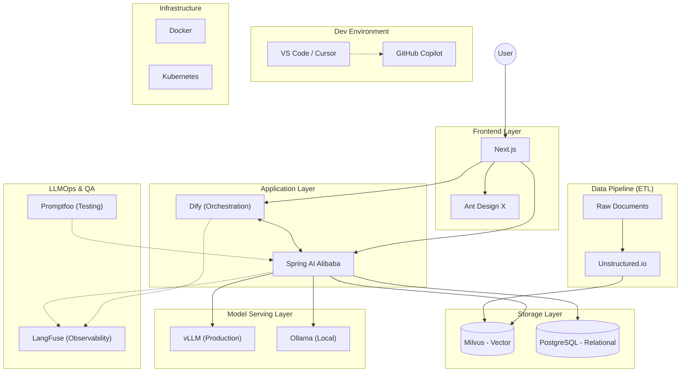

# AI Product Production Guide

本指南旨在提供一套完整的企业级 AI 产品开发、部署与运维的技术栈选型与最佳实践。涵盖了从开发环境、前后端框架、数据处理、模型服务到 LLMOps 的全链路解决方案。

## 🏗️ 全景架构图

## 📚 模块详解与指南

### 1. 开发环境与协同 (IDE)

- **工具**: [VS Code](https://code.visualstudio.com/) + [GitHub Copilot](https://github.com/features/copilot), [Cursor](https://cursor.sh/)
- **定位**: 高效的 AI 辅助编程环境。前端推荐 VS Code，后端推荐 Cursor。
- **优势**: VS Code 生态丰富，插件支持最全；Cursor 深度集成 AI，代码生成与重构体验极佳。两者结合覆盖全场景开发需求。
- 👉 [详细指南: VS Code Copilot & Cursor 开发协同](vscode-copilot-cursor-guide.md)

### 2. 前端交互层 (Frontend)

- **工具**: [Next.js](https://nextjs.org/), [Ant Design X](https://x.ant.design/)
- **定位**: 构建高性能、流式响应的 AI 对话界面。
- **优势**: Next.js 提供服务端渲染 (SSR) 与优秀的 SEO 支持；Ant Design X 专为 AI 场景设计，提供开箱即用的对话组件与流式交互体验。
- 👉 [详细指南: Next.js & Ant Design X](nextjs-ant-design-x-guide.md)

### 3. 应用编排与后端 (Backend)

- **工具**: [Dify](https://dify.ai/), [Spring AI Alibaba](https://github.com/alibaba/spring-ai-alibaba)
- **定位**: Dify 负责可视化工作流编排，Spring AI Alibaba 负责复杂的业务逻辑与 Java 生态集成。
- **优势**: Dify 降低了 AI 应用编排门槛，快速验证想法；Spring AI Alibaba 提供了企业级 Java 开发标准，无缝对接阿里云通义大模型等国产算力。
- 👉 [详细指南: Dify & Spring AI Alibaba](dify-spring-ai-alibaba-guide.md)

### 4. 数据存储与 ETL (Data)

- **工具**: [PostgreSQL](https://www.postgresql.org/), [Milvus](https://milvus.io/), [Unstructured.io](https://unstructured.io/)
- **定位**: Unstructured 处理非结构化数据清洗，Milvus 存储向量索引，PostgreSQL 存储业务元数据。
- **优势**: Unstructured 简化了复杂文档的解析流程；Milvus 具备高性能向量检索能力，支持亿级数据规模；PostgreSQL 稳定可靠，适合混合存储。
- 👉 [详细指南: PostgreSQL & Milvus](postgresql-milvus-guide.md)
- 👉 [详细指南: Unstructured.io & ETL](unstructured-etl-guide.md)

### 5. 模型服务 (Inference)

- **工具**: [Ollama](https://ollama.com/), [vLLM](https://github.com/vllm-project/vllm)
- **定位**: Ollama 用于本地快速验证，vLLM 用于生产环境的高并发推理。
- **优势**: Ollama 部署极其简单，适合开发者本地调试；vLLM 通过 PagedAttention 技术显著提升推理吞吐量，降低生产成本。
- 👉 [详细指南: Ollama & vLLM](ollama-vllm-guide.md)

### 6. 质量保障与运维 (LLMOps)

- **工具**: [LangFuse](https://langfuse.com/), [Promptfoo](https://www.promptfoo.dev/)
- **定位**: Promptfoo 负责上线前的 Prompt 自动化测试，LangFuse 负责上线后的全链路追踪与监控。
- **优势**: Promptfoo 确保 Prompt 变更不引入回归问题；LangFuse 提供细粒度的 Token 消耗统计与 Trace 追踪，帮助优化成本与效果。
- 👉 [详细指南: LangFuse & Promptfoo](langfuse-promptfoo-guide.md)

### 7. 基础设施 (Infra)

- **工具**: [Docker](https://www.docker.com/), [Kubernetes](https://kubernetes.io/)
- **定位**: 容器化交付与集群编排，保障应用的高可用与弹性伸缩。
- **优势**: Docker 实现环境一致性，消除“在我机器上能跑”的问题；K8s 提供强大的服务编排能力，保障大规模 AI 应用的稳定性与扩展性。
- 👉 [详细指南: Docker & Kubernetes](docker-kubernetes-guide.md)

## 🔄 协作流程与搭配指南

本指南中的技术栈并非孤立存在，而是通过紧密的协作形成完整的 AI 生产力闭环：

1. **开发与迭代**:

   - 开发者使用 **VS Code** (前端) 和 **Cursor** (后端) 编写代码，**GitHub Copilot** 辅助生成。
   - **Promptfoo** 用于在开发阶段对 Prompt 进行单元测试，确保变更不破坏现有逻辑。

2. **数据处理链路**:

   - 原始文档通过 **Unstructured.io** 进行清洗和切片 (ETL)。
   - 处理后的向量数据存入 **Milvus**，业务元数据存入 **PostgreSQL**。

3. **应用运行交互**:

   - 用户在 **Next.js** + **Ant Design X** 构建的前端界面发起对话。
   - 请求转发至 **Spring AI Alibaba** 或 **Dify** 进行编排。
   - 后端调用 **Milvus** 进行 RAG 检索，并请求 **vLLM** (生产) 或 **Ollama** (开发) 进行推理。

4. **监控与优化**:

   - 应用运行时的所有 Trace 和 Token 消耗实时上报至 **LangFuse**。
   - 基于 LangFuse 的反馈数据，开发者优化 Prompt 和代码，形成闭环。

5. **部署交付**:
   - 所有服务通过 **Docker** 容器化，最终由 **Kubernetes** 统一编排调度，保障高可用。
