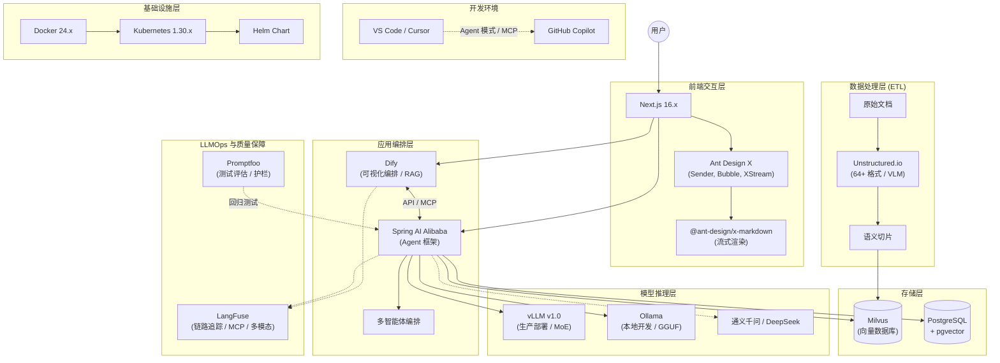
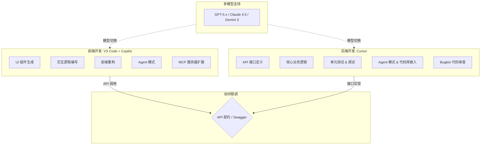
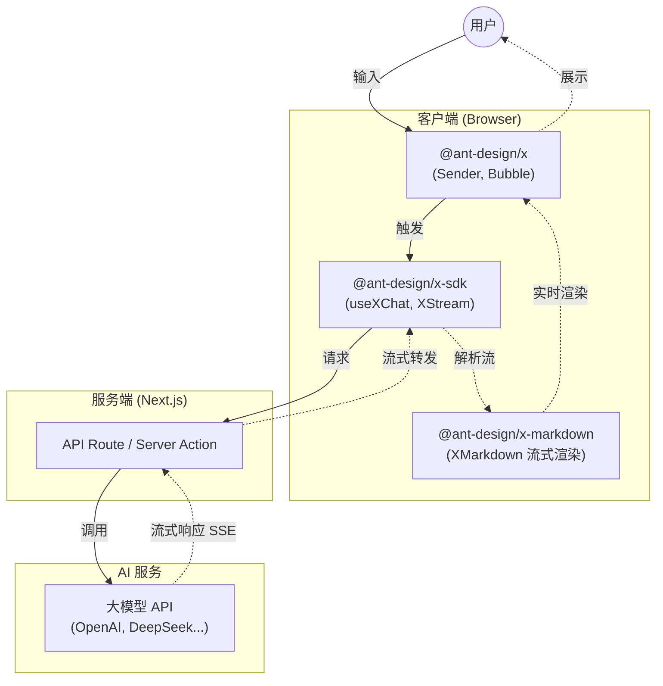
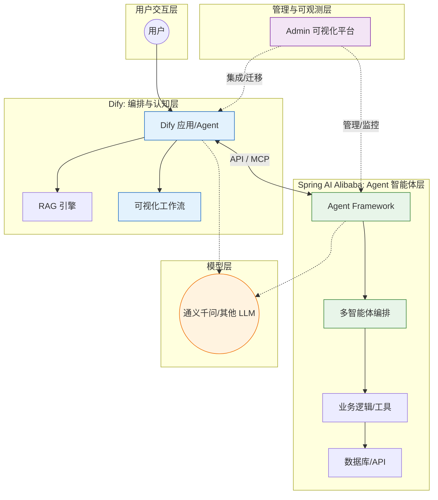
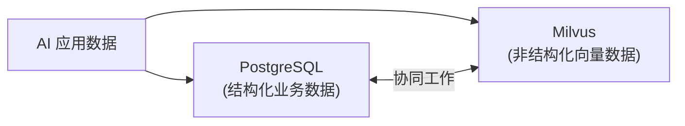
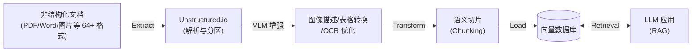
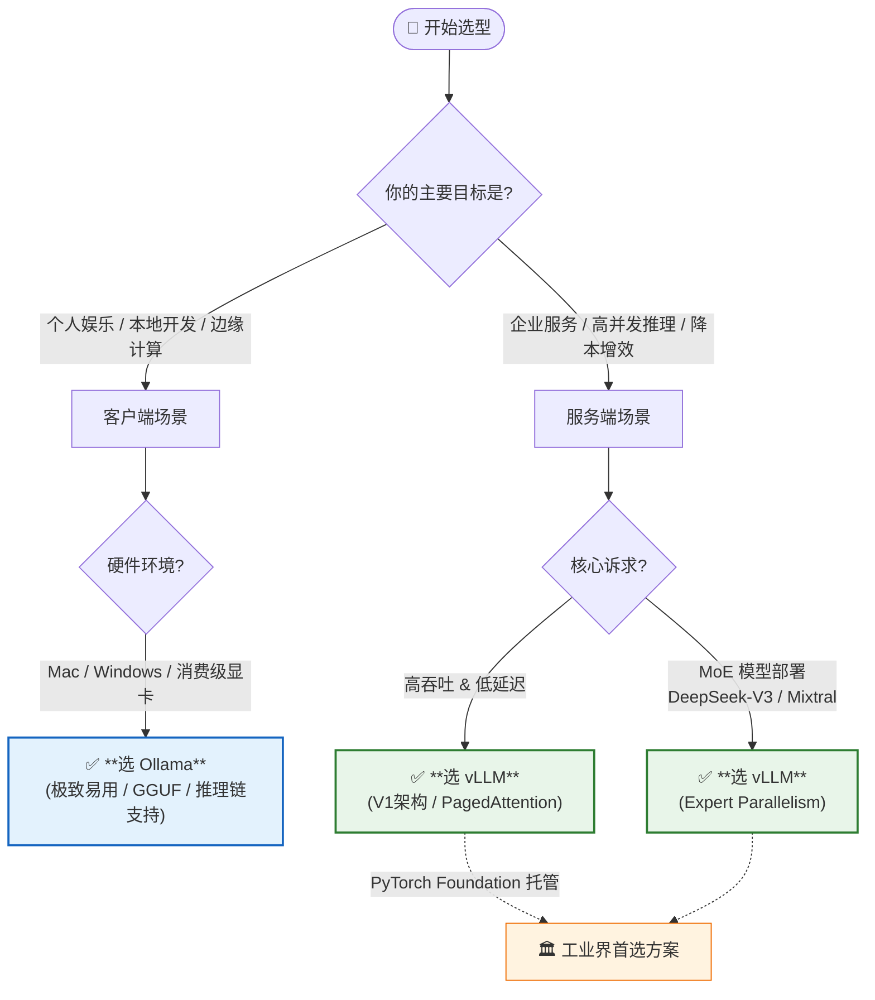
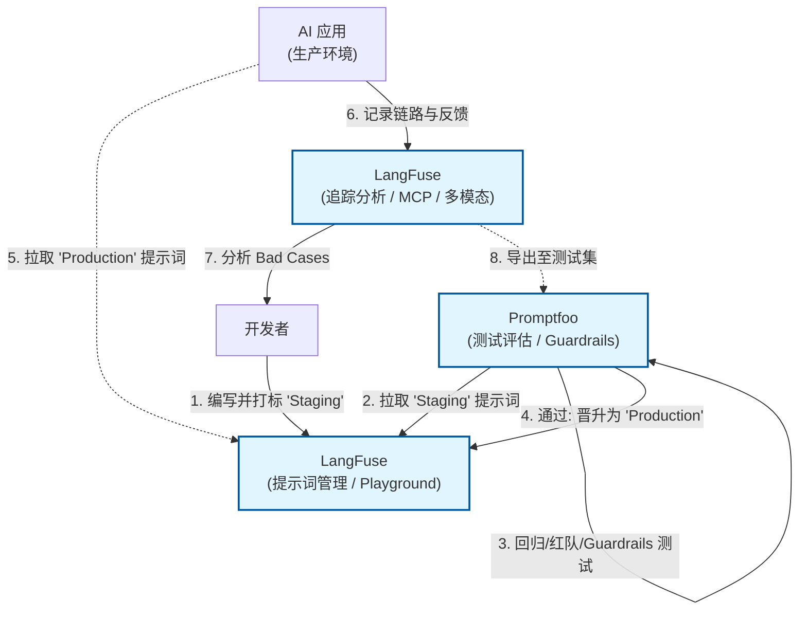
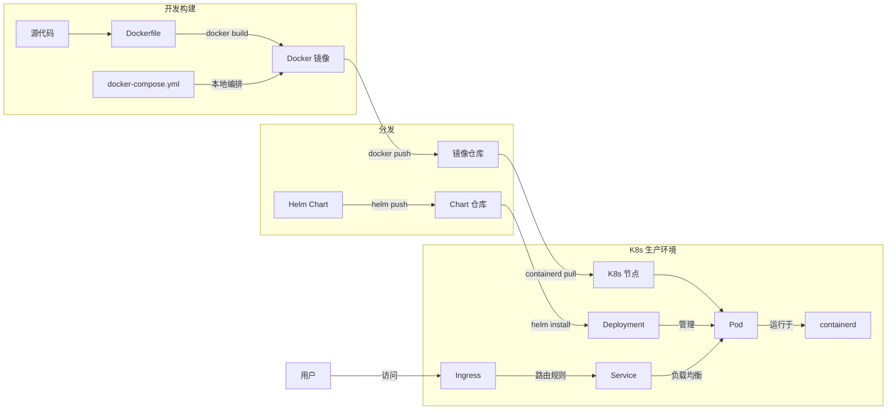
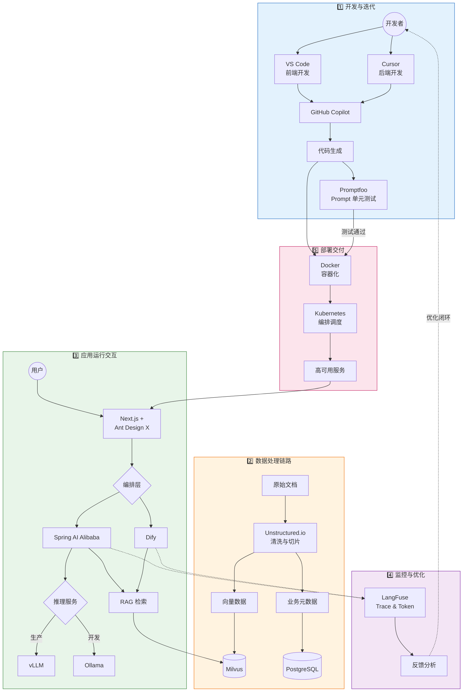

# AI 产品生产指南

本指南旨在提供一套完整的企业级 AI 产品开发、部署与运维的技术栈选型与最佳实践。涵盖了从开发环境、前后端框架、数据处理、模型服务到 LLMOps 的全链路解决方案。

## 🏗️ 全景架构图

## 📚 模块详解与指南

### 1. 开发环境与协同 (IDE)

- **工具**: [VS Code](https://code.visualstudio.com/) v1.107.x + [GitHub Copilot](https://github.com/features/copilot) v1.107.x, [Cursor](https://cursor.sh/) v2.1.x
- **定位**: 高效的 AI 辅助编程环境。前端推荐 VS Code，后端推荐 Cursor。
- **优势**: VS Code 生态丰富，支持 Copilot Chat、Inline Chat 及 Agent 模式与 MCP 服务器扩展；Cursor 深度集成 AI，提供代码库嵌入与 Bugbot 代码审查能力，支持 GPT-5.x / Claude 4.5 / Gemini 3 等多模型切换。
- 👉 [VS Code Copilot & Cursor：前后端高效开发协同指南](vscode-copilot-cursor-guide.md)

### 2. 前端交互层 (Frontend)

- **工具**: [Next.js](https://nextjs.org/) 16.x, [Ant Design X](https://x.ant.design/) 2.x
- **定位**: 构建高性能、流式响应的 AI 对话界面。
- **优势**: Next.js 基于 React Server Components (RSC) 的 App Router 架构，支持 React 19 特性，提供 SSR/SSG/ISR 多种渲染模式；Ant Design X 专为 AI 场景设计，提供 `@ant-design/x-sdk`（useXChat, XStream）和 `@ant-design/x-markdown`（流式渲染）等开箱即用的对话组件。
- 👉 [Next.js & Ant Design X：构建现代化 AI 驱动的前端应用](nextjs-ant-design-x-guide.md)

### 3. 应用编排与后端 (Backend)

- **工具**: [Dify](https://dify.ai/) v1.11.x, [Spring AI Alibaba](https://github.com/alibaba/spring-ai-alibaba) v1.1.x
- **定位**: Dify 负责可视化工作流编排与 RAG 引擎，Spring AI Alibaba 负责 Agent 智能体框架与多智能体编排。
- **优势**: Dify 降低了 AI 应用编排门槛，快速验证想法；Spring AI Alibaba 提供了 Agent Framework、多智能体编排能力，支持 MCP 协议，无缝对接阿里云通义大模型等国产算力。
- 👉 [Dify & Spring AI Alibaba：构建下一代 AI 应用的双重利器](dify-spring-ai-alibaba-guide.md)

### 4. 数据存储与 ETL (Data)

- **工具**: [PostgreSQL](https://www.postgresql.org/) v15.x + pgvector v0.8.1, [Milvus](https://milvus.io/) v2.5.x, [Unstructured.io](https://unstructured.io/) v0.18.x
- **定位**: Unstructured 处理 64+ 种格式的非结构化数据清洗（含 VLM 增强），Milvus 存储向量索引，PostgreSQL 存储业务元数据并支持轻量级向量检索。
- **优势**: Unstructured 支持语义切片（Semantic Chunking）与 OCR；Milvus 支持 Lite/Standalone/Distributed 三种部署模式，亿级向量毫秒级响应；PostgreSQL 通过 pgvector 插件实现向量与结构化数据混合查询，简化架构。
- 👉 [PostgreSQL & Milvus：结构化与非结构化数据的存储双雄](postgresql-milvus-guide.md)
- 👉 [Unstructured.io & ETL：构建 AI 时代的数据流水线](unstructured-etl-guide.md)

### 5. 模型服务 (Inference)

- **工具**: [Ollama](https://ollama.com/) v0.13.5, [vLLM](https://github.com/vllm-project/vllm) v1.0.x (PyTorch Foundation 托管)
- **定位**: Ollama 用于本地快速验证与边缘计算，vLLM 用于生产环境的高并发推理与 MoE 模型部署。
- **优势**: Ollama 基于 GGUF 格式，支持 Llama 4、DeepSeek-R1、Qwen 等主流模型及多模态视觉模型；vLLM 采用 V1 架构与 PagedAttention 技术，支持 Expert Parallelism（适用于 DeepSeek-V3/Mixtral 等 MoE 模型），是工业界首选方案。
- 👉 [Ollama & vLLM：大模型推理的“简”与“强”](ollama-vllm-guide.md)

### 6. 质量保障与运维 (LLMOps)

- **工具**: [LangFuse](https://langfuse.com/) v1.0.x, [Promptfoo](https://www.promptfoo.dev/) v0.9.x
- **定位**: Promptfoo 负责上线前的 Prompt 回归测试、红队测试与 Guardrails 验证，LangFuse 负责上线后的全链路追踪与 Prompt 版本管理。
- **优势**: Promptfoo 确保 Prompt 变更不引入回归问题；LangFuse 基于 OpenTelemetry，支持 Agent Graphs 可视化、MCP Tracing、多模态追踪，提供细粒度的 Token 消耗统计与成本分析。
- 👉 [LangFuse & Promptfoo：LLM 应用的观测与评估双壁](langfuse-promptfoo-guide.md)

### 7. 基础设施 (Infra)

- **工具**: [Docker](https://www.docker.com/) 24.x, [Kubernetes](https://kubernetes.io/) 1.30.x
- **定位**: 容器化交付与集群编排，保障应用的高可用与弹性伸缩。
- **优势**: Docker 实现环境一致性，分层存储机制高效构建镜像；K8s 基于 containerd 运行时，结合 Helm Chart 进行应用打包分发，提供 Deployment、Service、Ingress 等强大的服务编排能力。
- 👉 [Docker & Kubernetes：云原生时代的基石](docker-kubernetes-guide.md)

## 🔄 协作流程与搭配指南

本指南中的技术栈并非孤立存在，而是通过紧密的协作形成完整的 AI 生产力闭环：

1. **开发与迭代**:

   - 开发者使用 **VS Code** (前端) 和 **Cursor** (后端) 编写代码，**GitHub Copilot** 辅助生成。
   - **Promptfoo** 用于在开发阶段对 Prompt 进行单元测试，确保变更不破坏现有逻辑。

2. **数据处理链路**:

   - 原始文档通过 **Unstructured.io** 进行清洗和切片 (ETL)。
   - 处理后的向量数据存入 **Milvus**，业务元数据存入 **PostgreSQL**。

3. **应用运行交互**:

   - 用户在 **Next.js** + **Ant Design X** 构建的前端界面发起对话。
   - 请求转发至 **Spring AI Alibaba** 或 **Dify** 进行编排。
   - 后端调用 **Milvus** 进行 RAG 检索，并请求 **vLLM** (生产) 或 **Ollama** (开发) 进行推理。

4. **监控与优化**:

   - 应用运行时的所有 Trace 和 Token 消耗实时上报至 **LangFuse**。
   - 基于 LangFuse 的反馈数据，开发者优化 Prompt 和代码，形成闭环。

5. **部署交付**:
   - 所有服务通过 **Docker** 容器化，最终由 **Kubernetes** 统一编排调度，保障高可用。
