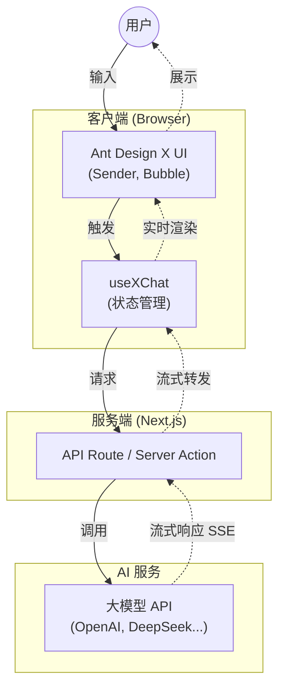

# Next.js & Ant Design X：构建现代化 AI 驱动的前端应用

本文档旨在介绍 React 生态中最流行的全栈框架 **Next.js**，以及 Ant Design 团队专为 AI 场景打造的组件库 **Ant Design X**，并探讨如何结合两者快速构建高质量的 AI 应用前端。



## 1. Next.js：React 框架的集大成者

Next.js 是由 Vercel 开发的开源 React 框架，它解决了传统 React 单页应用 (SPA) 在 SEO、首屏加载速度和路由管理上的痛点，是目前构建生产级 React 应用的首选方案。

### 核心特性

- **App Router (应用路由器)**：基于 React Server Components (RSC) 的全新路由架构。允许在服务器端直接获取数据并渲染组件，大幅减少发送到客户端的 JavaScript 体积，提升性能。
- **混合渲染模式**：
  - **SSR (服务端渲染)**：每次请求时在服务器生成 HTML，利于 SEO 和动态内容。
  - **SSG (静态站点生成)**：构建时生成 HTML，适合博客、文档等静态内容，访问速度极快。
  - **ISR (增量静态再生)**：在运行时更新静态页面，无需重新构建整个站点。
- **内置优化**：自动优化图像 (`next/image`)、字体 (`next/font`) 和脚本加载，开箱即用。
- **API Routes / Route Handlers**：直接在 Next.js 项目中编写后端 API 逻辑，轻松构建全栈应用。

### 适用场景

- SEO 要求高的官网、电商平台。
- 内容密集型网站（博客、新闻门户）。
- 需要极致性能的大型 Web 应用。

---

## 2. Ant Design X：专为 AI 时代打造的组件库

Ant Design X 是 Ant Design 团队推出的全新组件库，专注于 **AI 对话 (Chat UI)** 和 **生成式 AI** 交互场景。它填补了传统 UI 组件库在 AI 特定交互模式上的空白。

### 核心特性

- **开箱即用的 AI 组件**：
  - `XProvider`：管理 AI 上下文和主题。
  - `Bubble`：对话气泡，支持 Markdown 渲染、代码高亮、加载状态等。
  - `Sender`：智能输入框，支持语音输入、附件上传、提示词触发。
  - `Prompts`：预设提示词卡片，引导用户提问。
  - `ThoughtChain`：思维链展示组件，可视化 AI 的推理过程。
- **灵活的主题定制**：继承了 Ant Design 5 的 Design Token 系统，可以轻松定制品牌色和样式，与现有的 Ant Design 组件无缝融合。
- **React Server Components 兼容**：完美支持 Next.js 的 App Router 架构，适应现代前端开发流。
- **多模型适配**：UI 层与模型层解耦，可以轻松对接 OpenAI、通义千问、DeepSeek 等各种大模型 API。

### 适用场景

- AI 聊天助手 (Chatbot) 界面。
- Copilot 风格的侧边栏助手。
- 基于 LLM 的内容生成工具。

---

## 3. 协同开发：Next.js + Ant Design X 实战

结合 Next.js 的高性能架构与 Ant Design X 的专业 AI 组件，可以极速构建一个生产级的 AI 对话应用。

### 架构优势

1.  **流式响应 (Streaming)**：
    Next.js 的 App Router 天然支持流式传输。结合 AI 模型的流式输出 (Server-Sent Events)，可以实现打字机效果，让用户在 AI 生成内容的同时就能看到结果，极大降低等待焦虑。

2.  **服务端数据安全**：
    在 Next.js 的 Server Actions 或 Route Handlers 中调用大模型 API，可以确保 API Key 等敏感信息不暴露给客户端。

3.  **快速迭代**：
    使用 Ant Design X 的 `useXAgent` 或 `useXChat` 等 Hooks，配合 Next.js 的快速刷新 (Fast Refresh)，开发体验极佳。

### 快速开始示例

```bash
# 1. 创建 Next.js 项目
npx create-next-app@latest my-ai-app

# 2. 安装 Ant Design X 及相关依赖
npm install antd @ant-design/x @ant-design/icons
```

**代码片段 (page.tsx)**：

```tsx
import { Bubble, Sender, XProvider, useXChat } from '@ant-design/x'

export default function AIChatPage() {
  // 使用 useXChat 钩子管理对话状态，开箱即用
  const { messages, onRequest, isRequesting } = useXChat({
    // 定义请求逻辑
    request: async (content) => {
      const response = await fetch('/api/chat', {
        method: 'POST',
        body: JSON.stringify({ content })
      })
      const data = await response.json()
      return data.reply
    }
  })

  return (
    <XProvider>
      <div style={{ maxWidth: 800, margin: '0 auto', padding: 20 }}>
        {messages.map((msg) => (
          <Bubble
            key={msg.id}
            placement={msg.role === 'user' ? 'end' : 'start'}
            content={msg.content}
            loading={msg.status === 'loading'}
          />
        ))}
        <Sender loading={isRequesting} onSubmit={onRequest} />
      </div>
    </XProvider>
  )
}
```

### 进阶：实现流式响应 (Streaming)

为了提供更好的用户体验，建议在 `request` 方法中处理流式响应。Next.js 的 API Routes 可以轻松返回 `ReadableStream`，而 `useXChat` 可以配合处理增量更新。

```tsx
// 示例：在 request 中处理流式数据
request: async (content, { onUpdate }) => {
  const response = await fetch('/api/chat/stream', {
    method: 'POST',
    body: JSON.stringify({ content })
  })

  const reader = response.body.getReader()
  const decoder = new TextDecoder()
  let result = ''

  while (true) {
    const { done, value } = await reader.read()
    if (done) break
    const chunk = decoder.decode(value, { stream: true })
    result += chunk
    // 实时更新 UI
    onUpdate(result)
  }

  return result
}
```

---

## 总结

- **Next.js** 提供了坚实的应用骨架，解决了路由、渲染和性能问题。
- **Ant Design X** 提供了专业的 AI 交互皮肤，解决了对话、思维链展示等特定 UI 难题。

两者结合，是目前构建 Web 端 AI 应用的最佳实践组合之一。
