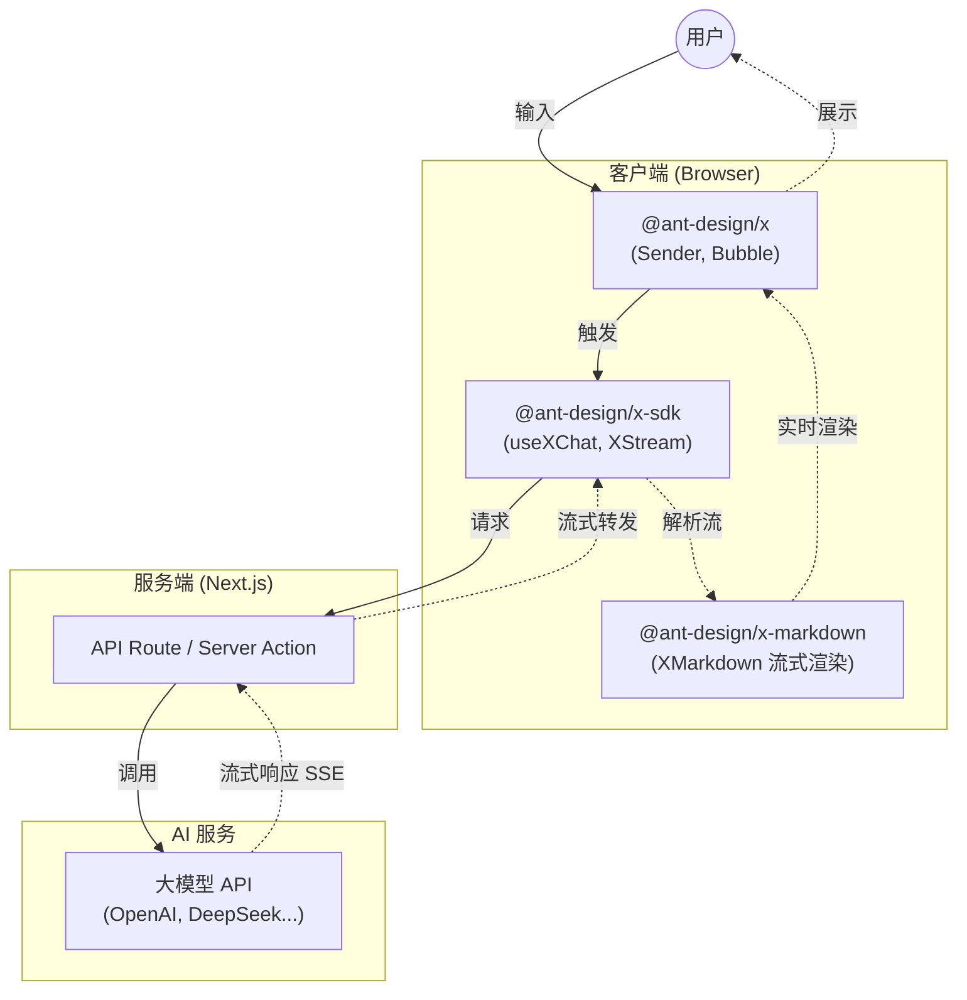

# Next.js & Ant Design X：构建现代化 AI 驱动的前端应用

> **文档更新日期**：2025 年 12 月  
> **Next.js 版本**：16.x | **Ant Design X 版本**：2.x

本文档旨在介绍 React 生态中最流行的全栈框架 **Next.js**，以及 Ant Design 团队专为 AI 场景打造的组件库 **Ant Design X**，并探讨如何结合两者快速构建高质量的 AI 应用前端。



## 1. Next.js：React 框架的集大成者

Next.js 是由 Vercel 开发的开源 React 框架，它解决了传统 React 单页应用 (SPA) 在 SEO、首屏加载速度和路由管理上的痛点，是目前构建生产级 React 应用的首选方案。

### 核心特性

- **App Router (应用路由器)**：基于 React Server Components (RSC) 的全新路由架构。允许在服务器端直接获取数据并渲染组件，大幅减少发送到客户端的 JavaScript 体积，提升性能。
- **React 19 支持**：App Router 内置 React canary 版本，包含所有稳定的 React 19 特性，以及正在框架中验证的新功能。
- **混合渲染模式**：
  - **SSR (服务端渲染)**：每次请求时在服务器生成 HTML，利于 SEO 和动态内容。
  - **SSG (静态站点生成)**：构建时生成 HTML，适合博客、文档等静态内容，访问速度极快。
  - **ISR (增量静态再生)**：在运行时更新静态页面，无需重新构建整个站点。
- **内置优化**：自动优化图像 (`next/image`)、字体 (`next/font`) 和脚本加载，开箱即用。
- **API Routes / Route Handlers**：直接在 Next.js 项目中编写后端 API 逻辑，轻松构建全栈应用。
- **Turbopack**：新一代 Rust 构建工具，提供更快的开发体验。

### 适用场景

- SEO 要求高的官网、电商平台。
- 内容密集型网站（博客、新闻门户）。
- 需要极致性能的大型 Web 应用。

---

## 2. Ant Design X：专为 AI 时代打造的组件库

Ant Design X 是 Ant Design 团队推出的全新组件库，专注于 **AI 对话 (Chat UI)** 和 **生成式 AI** 交互场景。它填补了传统 UI 组件库在 AI 特定交互模式上的空白。

> **重要提示**：Ant Design X 2.0 采用 Monorepo 架构，分为三个独立包：
>
> - `@ant-design/x` - UI 组件库
> - `@ant-design/x-sdk` - AI 聊天数据流管理工具
> - `@ant-design/x-markdown` - 高性能流式 Markdown 渲染引擎

### 核心特性

- **开箱即用的 AI 组件**：
  - `XProvider`：管理 AI 上下文和主题。
  - `Bubble`：对话气泡，支持 Markdown 渲染、代码高亮、加载状态等。新增 `Bubble.System` 和 `Bubble.Divider` 子组件。
  - `Sender`：智能输入框，支持语音输入、附件上传、提示词触发、**Slot 插槽模式**。
  - `Prompts`：预设提示词卡片，引导用户提问。
  - `ThoughtChain`：思维链展示组件，可视化 AI 的推理过程。
  - `Think`：（2.0 新增）思考过程展示组件。
  - `Conversations`：对话列表管理组件。
  - `Welcome`：欢迎页组件。
  - `Attachments`：附件上传组件。
  - `Suggestion`：建议提示组件。
  - `Actions`：操作按钮组件，包含 `Actions.Copy`、`Actions.Audio` 等子组件。
  - `FileCard`：（2.0 新增）文件卡片展示组件。
  - `Sources`：（2.0 新增）引用来源展示组件。
  - `CodeHighlighter`：（2.0 新增）代码高亮组件。
  - `Mermaid`：（2.0 新增）Mermaid 流程图组件。
  - `Notification`：（2.0 新增）通知组件。
- **独立的数据流管理包 (`@ant-design/x-sdk`)**：
  - `useXChat`：聊天状态管理 Hook，支持 `setMessages` 回调函数、`isRequesting` 响应式变量、`abort` 状态等。
  - `useXConversations`：对话管理 Hook。
  - `XRequest`：HTTP 请求工具。
  - `XStream`：流式数据处理工具。
  - `Chat Provider`：多种大模型服务商适配器（如 `DeepSeekChatProvider`）。
- **独立的 Markdown 渲染包 (`@ant-design/x-markdown`)**：
  - `XMarkdown`：高性能流式 Markdown 渲染组件。
  - 内置插件：Latex 公式、代码高亮、Mermaid 流程图。
  - 支持流式渲染动画效果。
- **灵活的主题定制**：继承了 Ant Design 的 Design Token 系统，可以轻松定制品牌色和样式，与现有的 Ant Design 组件无缝融合。
- **React Server Components 兼容**：完美支持 Next.js 的 App Router 架构，适应现代前端开发流。
- **多模型适配**：UI 层与模型层解耦，可以轻松对接 OpenAI、通义千问、DeepSeek 等各种大模型 API。

> **注意**：Ant Design X 2.x 依赖 **Ant Design 6.x**，如果你使用的是 antd 5.x，请使用 Ant Design X 1.x 版本。

### 适用场景

- AI 聊天助手 (Chatbot) 界面。
- Copilot 风格的侧边栏助手。
- 基于 LLM 的内容生成工具。
- 支持思维链展示的 AI Agent 应用。

---

## 3. 协同开发：Next.js + Ant Design X 实战

结合 Next.js 的高性能架构与 Ant Design X 的专业 AI 组件，可以极速构建一个生产级的 AI 对话应用。

### 架构优势

1.  **流式响应 (Streaming)**：
    Next.js 的 App Router 天然支持流式传输。结合 AI 模型的流式输出 (Server-Sent Events)，可以实现打字机效果，让用户在 AI 生成内容的同时就能看到结果，极大降低等待焦虑。

2.  **服务端数据安全**：
    在 Next.js 的 Server Actions 或 Route Handlers 中调用大模型 API，可以确保 API Key 等敏感信息不暴露给客户端。

3.  **快速迭代**：
    使用 `@ant-design/x-sdk` 中的 `useXChat` 等 Hooks，配合 Next.js 的快速刷新 (Fast Refresh) 和 Turbopack，开发体验极佳。

### 快速开始示例

```bash
# 1. 创建 Next.js 项目
npx create-next-app@latest my-ai-app

# 2. 安装 Ant Design X 及相关依赖 (2.x 版本)
npm install antd@6 @ant-design/x @ant-design/x-sdk @ant-design/x-markdown @ant-design/icons
```

**代码片段 (page.tsx)**：

```tsx
'use client'

import { Bubble, Sender, XProvider } from '@ant-design/x'
import { useXChat } from '@ant-design/x-sdk'

export default function AIChatPage() {
  // 使用 @ant-design/x-sdk 中的 useXChat 钩子管理对话状态
  const { messages, onRequest, isRequesting } = useXChat({
    // 定义请求逻辑
    request: async (content) => {
      const response = await fetch('/api/chat', {
        method: 'POST',
        body: JSON.stringify({ content })
      })
      const data = await response.json()
      return data.reply
    }
  })

  return (
    <XProvider>
      <div style={{ maxWidth: 800, margin: '0 auto', padding: 20 }}>
        <Bubble.List
          items={messages.map((msg) => ({
            key: msg.id,
            placement: msg.role === 'user' ? 'end' : 'start',
            content: msg.content,
            loading: msg.status === 'loading'
          }))}
        />
        <Sender loading={isRequesting} onSubmit={onRequest} />
      </div>
    </XProvider>
  )
}
```

### 进阶：实现流式响应 (Streaming)

为了提供更好的用户体验，建议在 `request` 方法中处理流式响应。Next.js 的 API Routes 可以轻松返回 `ReadableStream`，而 `@ant-design/x-sdk` 的 `useXChat` 可以配合处理增量更新。

```tsx
'use client'

import { useXChat, XStream } from '@ant-design/x-sdk'

// 示例：在 request 中处理流式数据
const { messages, onRequest, isRequesting } = useXChat({
  request: async (content, { onUpdate }) => {
    const response = await fetch('/api/chat/stream', {
      method: 'POST',
      body: JSON.stringify({ content })
    })

    // 使用 XStream 处理流式响应
    const stream = XStream({
      readableStream: response.body
    })

    let result = ''
    for await (const chunk of stream) {
      result += chunk.data
      // 实时更新 UI
      onUpdate(result)
    }

    return result
  },
  // 请求失败时的回调
  requestFallback: (errorInfo) => {
    console.error('请求失败:', errorInfo)
    return '抱歉，请求出现问题，请重试。'
  }
})
```

### 进阶：使用 XMarkdown 渲染流式内容

`@ant-design/x-markdown` 提供了专门针对流式内容优化的 Markdown 渲染组件：

```tsx
import { XMarkdown } from '@ant-design/x-markdown'
import { Bubble } from '@ant-design/x'

// 自定义 Bubble 内容渲染
;<Bubble.List
  items={messages.map((msg) => ({
    key: msg.id,
    placement: msg.role === 'user' ? 'end' : 'start',
    content: <XMarkdown>{msg.content}</XMarkdown>
  }))}
/>
```

---

## 总结

- **Next.js** 提供了坚实的应用骨架，解决了路由、渲染和性能问题，支持 React 19 和 Turbopack。
- **Ant Design X 2.x** 采用 Monorepo 架构，提供了专业的 AI 交互组件、独立的数据流管理工具和高性能 Markdown 渲染引擎。

两者结合，是目前构建 Web 端 AI 应用的最佳实践组合之一。

---

## 参考资源

- [Next.js 官方文档](https://nextjs.org/docs)
- [Ant Design X 官方文档](https://x.ant.design/)
- [Ant Design X 更新日志](https://x.ant.design/changelog)
- [Ant Design X v2 迁移指南](https://x.ant.design/docs/react/migration-v2)
- [@ant-design/x-sdk 文档](https://github.com/ant-design/x/blob/x-sdk/README.md)
- [@ant-design/x-markdown 文档](https://github.com/ant-design/x/blob/x-markdown/README.md)
