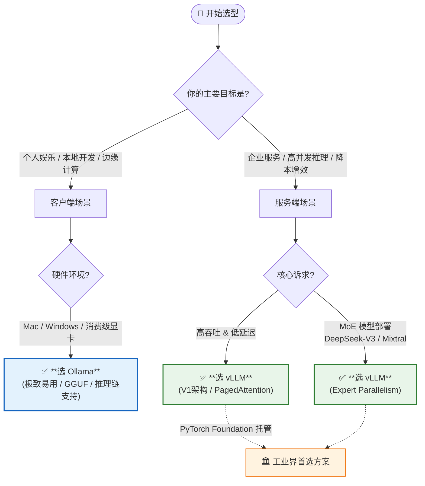

# Ollama & vLLM：大模型推理的“简”与“强”

> 2025 年 12 月
> 版本：Ollama v0.13.5 | vLLM v1.0.x

本文档旨在介绍两款在大模型（LLM）推理领域极具代表性的工具：**Ollama**（最易用的本地运行工具）和 **vLLM**（最高效的生产级推理引擎，现为 PyTorch Foundation 托管项目），帮助开发者根据场景选择合适的部署方案。

### 快速选型决策图

## 1. Ollama：让大模型触手可及

Ollama 是目前最流行的本地大模型运行工具，它极大地简化了在个人电脑（Mac, Linux, Windows）上下载、运行和管理开源大模型的过程。截至 2025 年 12 月，Ollama 已发布 **v0.13.5** 版本。

### 核心特性

- **极致易用**：
  - 安装简单，通常一条命令即可完成。
  - 运行模型只需 `ollama run llama4`，自动处理模型下载、权重加载和环境配置。
- **丰富的模型库**：
  - 拥有类似 Docker Hub 的模型仓库，支持 **Llama 4**, **Llama 3.3**, **DeepSeek-R1**, **Gemma 3**, **Qwen**, **QwQ**, **Phi 4** 等主流开源模型。
  - **多模态支持**：支持 LLaVA, Llama 3.2 Vision 等视觉模型，可进行图像分析。
  - **云模型支持**（新）：2025 年新增云端模型访问能力。
- **核心技术 (GGUF)**：
  - 基于 `llama.cpp`，使用 **GGUF** 量化格式。这种格式专为 CPU 和 Apple Silicon (统一内存) 优化，使得在消费级硬件上运行大模型成为可能。
- **Modelfile**：
  - 引入了类似 Dockerfile 的 `Modelfile` 概念，允许用户通过简单的配置文件自定义模型（设置系统提示词、调整参数、打包微调权重）。
  - 新增 `REQUIRES` 命令支持硬件要求声明。
- **推理链支持**（新）：
  - 支持 Thinking/Reasoning 模式，适配 DeepSeek-R1、QwQ 等推理模型。
- **标准 API**：
  - 提供开箱即用的 REST API，兼容 OpenAI API 格式（包括 v1/responses），方便与其他应用（如 Dify, LangChain）集成。

### 适用场景

- **本地开发与测试**：开发者在笔记本上快速验证 Prompt 或模型效果。
- **个人 AI 助手**：配合 WebUI 构建完全隐私的本地聊天机器人。
- **边缘计算**：在资源受限的设备上部署轻量级模型。

---

## 2. vLLM：生产级的高吞吐推理引擎

vLLM 是一个开源的大模型推理和服务引擎，以其惊人的推理速度和吞吐量著称。它主要面向服务器端部署，旨在榨干 GPU 的每一滴性能。**2025 年 5 月，vLLM 正式成为 PyTorch Foundation 托管项目**，标志着其在行业中的重要地位。

### 核心特性

- **PagedAttention 算法**：
  - 这是 vLLM 的核心创新。它像操作系统管理内存一样管理显存（KV Cache），几乎消除了显存碎片，极大提高了显存利用率，从而支持更大的 Batch Size。
- **vLLM V1 架构**（2025 年新发布）：
  - 重大架构升级，实现 **1.7x 加速**。
  - 代码更简洁、执行循环优化、零开销前缀缓存、增强的多模态支持。
- **极高的吞吐量 (Throughput)**：
  - 在并发场景下，vLLM 的吞吐量通常是 HuggingFace Transformers 的 10-20 倍。
- **Continuous Batching**：
  - 支持连续批处理，即在一个请求处理完生成后，立即插入新的请求，而不是等待整个 Batch 完成，显著降低延迟。
- **高级量化与分布式推理**：
  - **量化支持**：原生支持 **AWQ, GPTQ, AutoRound, INT4, INT8, FP8, GGUF** 等量化方法，在保持精度的同时降低显存占用。
  - **Tensor Parallelism (张量并行)**：支持多 GPU 分布式推理，能够将巨大的模型（如 DeepSeek-V3, Llama 4 405B）切分到多张显卡上运行。
  - **Expert Parallelism**：针对 MoE 模型（如 Mixtral, DeepSeek）的专家并行支持。
- **广泛的硬件支持**：
  - NVIDIA GPU (包括最新的 Blackwell 架构)
  - AMD CPU 和 GPU
  - Intel CPU 和 GPU (XPU)
  - Google TPU
  - 插件支持：Intel Gaudi, IBM Spyre, Huawei Ascend
- **OpenAI 兼容 API**：
  - 提供与 OpenAI API 完全兼容的接口服务器，这意味着你可以直接用 vLLM 替换 OpenAI 的后端，而无需修改客户端代码。

### 适用场景

- **企业级生产环境**：需要对外提供高并发、低延迟的 AI 服务。
- **大规模推理任务**：需要批量处理海量数据的场景。
- **私有化部署平台**：构建公司内部的“ChatGPT”服务后端。

---

## 3. 选型对比与场景建议

### 核心差异对比

| 维度         | Ollama                                | vLLM                                       |
| :----------- | :------------------------------------ | :----------------------------------------- |
| **定位**     | **个人/开发者工具** (Client-side)     | **服务端推理引擎** (Server-side)           |
| **上手难度** | 极低 (傻瓜式操作)                     | 中等 (需要 Python/Docker 环境)             |
| **显存管理** | 简单，适合单任务                      | **PagedAttention**，极致优化，适合高并发   |
| **量化格式** | **GGUF** (CPU/Mac 友好)               | **AWQ/GPTQ/FP8/INT4/INT8/GGUF** (全面支持) |
| **多卡支持** | 基础支持 (主要用于分担显存)           | **Tensor/Expert Parallelism** (高性能并行) |
| **主要优势** | 易用性、Modelfile 定制、推理链支持    | **吞吐量**、并发性能、显存利用率、V1 架构  |
| **典型硬件** | MacBook, 消费级 PC (NVIDIA/AMD/Intel) | 数据中心 GPU (A100, H100, B200 等)         |

### 选型建议

1.  **如果你是开发者/个人用户**：

    - 想在自己的 MacBook 或游戏本上跑 Llama 4、DeepSeek-R1 玩玩。
    - 想给自己的应用快速接一个本地 LLM 后端进行调试。
    - 需要使用推理链模型（如 QwQ、DeepSeek-R1）。
    - **选 Ollama**。它是目前体验最好的入门工具。

2.  **如果你是运维/算法工程师**：
    - 需要将大模型部署到公司的 GPU 服务器上，供全公司几百人使用。
    - 对 API 的响应速度（Latency）和并发处理能力（Throughput）有严格指标。
    - 需要部署 MoE 架构模型（如 DeepSeek-V3、Mixtral）。
    - **选 vLLM**。它是目前工业界部署开源大模型的首选方案（PyTorch Foundation 托管项目）。

---

## 总结

- **Ollama** 解决了“**能不能跑**”和“**好不好用**”的问题，让大模型走入千家万户。
- **vLLM** 解决了“**快不快**”和“**贵不贵**”的问题，让大模型服务在商业上具备了可行性（通过提升吞吐量降低单次推理成本）。

## 两者分别统治了**本地开发**和**生产部署**两个不同的战场。

## 参考资源

- [Ollama 官网](https://ollama.com/) | [GitHub](https://github.com/ollama/ollama)
- [vLLM 文档](https://docs.vllm.ai/) | [GitHub](https://github.com/vllm-project/vllm)
- [vLLM V1 发布博客](https://blog.vllm.ai/2025/01/27/v1-alpha-release.html)
- [PyTorch Foundation 公告](https://pytorch.org/blog/pytorch-foundation-welcomes-vllm/)
