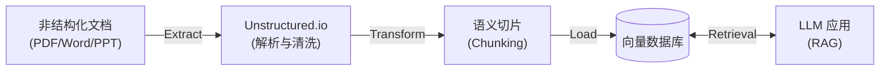
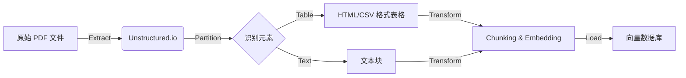

# Unstructured.io & ETL：构建 AI 时代的数据流水线

本文档旨在介绍 AI 数据处理领域的关键概念 **ETL**，以及在非结构化数据处理方面表现卓越的工具 **Unstructured.io**，帮助开发者理解如何为 LLM 应用（如 RAG）准备高质量的数据。



## 1. ETL：数据处理的基石

ETL 是数据仓库和大数据领域最经典的概念，代表了数据从源头到目标的三个核心步骤：**Extract（抽取）、Transform（转换）、Load（加载）**。在 AI 时代，ETL 的内涵发生了演变，被称为 **ETL for LLMs**。

### 核心流程

1.  **Extract (抽取)**：
    - 从各种数据源（数据库、API、文件系统、网页）获取原始数据。
    - _AI 场景挑战_：数据源不再局限于结构化表格，更多是 PDF、Word、PPT、图片、HTML 等非结构化数据。
2.  **Transform (转换)**：
    - 对数据进行清洗、格式化、去重、脱敏。
    - _AI 场景挑战_：需要进行**文档切分 (Chunking)**、**向量化 (Embedding)**、元数据提取等操作，以便 LLM 理解。
3.  **Load (加载)**：
    - 将处理好的数据写入目标存储。
    - _AI 场景挑战_：目标通常是**向量数据库** (Milvus, Pinecone) 或图数据库，而非传统的数据仓库。

### 关键转换步骤：Chunking (切分)

在 Transform 阶段，**Chunking** 是最关键的一环。直接将长文档喂给 LLM 会导致上下文窗口溢出或检索精度下降。

- **Fixed-size Chunking (固定大小)**：简单粗暴，按字符数或 Token 数切分（如每 500 字符切一段）。缺点是容易切断语义。
- **Semantic Chunking (语义切分)**：基于文档结构（段落、标题）或语义相似度进行切分。Unstructured.io 的优势在于它能识别文档元素，天然支持基于 Title/Table/Paragraph 的语义切分，效果远优于固定大小切分。

---

## 2. Unstructured.io：非结构化数据的 ETL 利器

Unstructured.io 是一个开源库（也有 SaaS 服务），专门致力于解决 LLM 应用中最头疼的问题：**如何从任意格式的非结构化文档中提取出干净、可用的文本数据**。它是构建 RAG (检索增强生成) 系统的重要基础设施。

### 核心特性

- **全格式支持 (Ingest Any Data)**：
  - 支持解析 PDF, HTML, Word (.docx), PowerPoint (.pptx), Excel (.xlsx), Email (.eml), Markdown, Images 等 20+ 种主流格式。
  - 即使是扫描版的 PDF 或图片，也能通过集成的 OCR (Tesseract/PaddleOCR) 提取文本。
- **智能分区 (Partitioning)**：
  - 不仅仅是提取纯文本，还能识别文档结构。它能将文档切分为 Title (标题), NarrativeText (正文), Table (表格), ListItem (列表项) 等语义块。
  - 这对于 RAG 至关重要，因为保留文档结构能显著提升检索的准确性。
- **清洗与优化 (Cleaning)**：
  - 内置多种清洗函数，如去除多余的空白、去除乱码、标准化日期格式、去除页眉页脚等噪音数据。
- **连接器生态 (Connectors)**：
  - 提供丰富的 Source Connectors (S3, Google Drive, SharePoint, Slack) 和 Destination Connectors (Chroma, Weaviate, MongoDB)，轻松构建 ETL 管道。

### 部署方式：Local vs API

- **Open Source Library (Local)**：完全免费，数据不出本地。但需要自行安装复杂的依赖（如 `tesseract-ocr`, `poppler`），且处理 PDF/Image 极其消耗 CPU/GPU 资源。
- **Serverless API**：Unstructured 提供的托管服务。无需配置环境，通过 HTTP 请求即可处理文件，速度更快且支持自动扩缩容，适合生产环境快速集成。

### 适用场景

- **RAG 知识库构建**：将企业内部堆积如山的 PDF 报告、合同、技术手册转化为向量数据库可索引的格式。
- **表格数据提取**：从 PDF 财报中提取表格数据，并保持其结构，供 LLM 进行数据分析。
- **多模态数据预处理**：处理包含图文混排的复杂文档。

---

## 3. 实战：构建一个简单的 PDF 处理流水线

结合 ETL 概念与 Unstructured.io，我们可以构建一个典型的 AI 数据处理流程：

### 流程图



### 代码示例 (Python)

**前置准备**：
除了安装 Python 库 `pip install unstructured[all-docs]` 外，处理 PDF 还需要安装系统级依赖：

- **Poppler**：用于 PDF 渲染。
- **Tesseract**：用于 OCR 文字识别。

使用 `unstructured` 库处理 PDF 的简单示例：

```python
from unstructured.partition.pdf import partition_pdf

# 1. Extract & Transform (Partitioning)
# 使用 "hi_res" 策略，利用 OCR 和视觉模型识别文档布局
elements = partition_pdf(
    filename="annual_report.pdf",
    strategy="hi_res",
    infer_table_structure=True
)

# 2. 处理提取出的元素
for element in elements:
    if element.category == "Table":
        print(f"[表格内容]: {element.metadata.text_as_html}") # 保留表格的 HTML 结构
    elif element.category == "Title":
        print(f"[标题]: {element.text}")
    else:
        print(f"[正文]: {element.text}")

# 3. Load (伪代码)
# vector_db.upsert(embeddings(elements))
```

---

## 总结

- **ETL** 是方法论，定义了数据流动的标准过程。在 AI 时代，它从“表到表”变成了“文档到向量”。
- **Unstructured.io** 是实现这一方法论的最佳工具之一，它填平了“人类可读文档”与“机器可读数据”之间的鸿沟。

掌握 Unstructured.io，就掌握了高质量 RAG 应用的数据入口。
