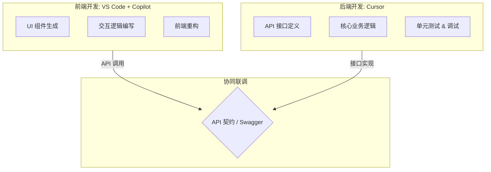

# VS Code Copilot & Cursor：前后端高效开发协同指南



本文档旨在介绍如何结合使用 **VS Code + GitHub Copilot** 进行前端开发，以及使用 **Cursor** 进行 Java 后端开发，以构建高效的 AI 辅助全栈开发工作流。

## 1. 前端开发：VS Code + GitHub Copilot

VS Code 拥有庞大的插件生态，是前端开发的首选编辑器。结合 GitHub Copilot，可以极大地提升 HTML/CSS/JavaScript/TypeScript 以及主流框架（React, Vue, Angular）的开发效率。

### 核心优势

- **强大的生态系统**：ESLint, Prettier, Tailwind CSS 等插件完美集成。
- **Copilot Chat**：集成在侧边栏，可随时提问、解释代码或生成代码片段。
- **Inline Chat (行内对话)**：直接在编辑器中通过 `Ctrl+I` (Windows) / `Cmd+I` (Mac) 唤起，进行代码生成或重构。

### 实战场景

#### 1.1 组件生成

在编写 React 或 Vue 组件时，可以通过注释描述需求，Copilot 会自动补全整个组件结构。

**示例**：
在 `.tsx` 文件中输入注释：

```typescript
// 创建一个响应式的导航栏组件，包含 Logo、菜单项（首页、产品、关于我们）和登录按钮，使用 Tailwind CSS 样式
```

Copilot 将自动生成包含 JSX 结构和 Tailwind 类名的完整代码。

#### 1.2 样式辅助

编写 CSS 或使用 CSS-in-JS 时，Copilot 能根据上下文推断样式属性。

#### 1.3 代码解释与重构

选中一段复杂的逻辑代码，右键选择 "Copilot" -> "Explain This"（解释这段代码），或者使用 Inline Chat 指令 `/fix` 修复 Lint 错误。

#### 1.4 终端命令辅助

在 VS Code 终端中，如果遇到报错或不知道如何写命令，可以直接输入 `Cmd+I` (Mac) / `Ctrl+I` (Windows) 唤起 Copilot，它会根据上下文生成正确的 Shell 命令（如 Git 操作、依赖安装等）。

#### 1.5 多文件编辑 (Copilot Edits)

最新的 VS Code 更新引入了跨文件编辑能力。在 Copilot Chat 中，可以明确指示修改多个文件，Copilot 会分析依赖关系并同时对相关联的文件提出修改建议，适合进行跨组件的重构。

---

## 2. 后端开发：Cursor (Java)

Cursor 是一款基于 VS Code 二次开发的 AI 原生编辑器，它对代码库的索引和理解能力非常出色，特别适合处理强类型的 Java 后端项目（如 Spring Boot）。

### 核心优势

- **全库索引 (Codebase Indexing)**：Cursor 会索引整个项目文件，理解类之间的依赖关系，这对于复杂的 Java 项目至关重要。
- **Cmd+K (Ctrl+K)**：强大的行内编辑功能，可以直接修改现有代码逻辑。
- **Chat with Codebase**：在对话框中使用 `@Codebase`，可以基于整个项目上下文回答问题，例如“找到所有使用了 UserDTO 的 Controller”。

### 实战场景

#### 2.1 Spring Boot 样板代码生成

Java 开发往往涉及大量的样板代码（Controller, Service, Repository, DTO）。

**示例**：
在 Chat 中输入：

> 创建一个用户管理模块，包含 User 实体（id, name, email），对应的 JPA Repository，Service 接口及实现，以及 RESTful Controller。使用 Lombok 注解。

Cursor 会一次性生成多个文件的代码建议，并考虑到项目现有的包结构。

#### 2.2 单元测试生成

Java 强调测试覆盖率。选中一个 Service 方法，使用 `Cmd+K` 输入 "Generate JUnit 5 tests for this method, mocking dependencies with Mockito"。Cursor 能精准地生成包含 Mock 逻辑的测试用例。

#### 2.3 遗留代码理解与维护

对于接手的老旧 Java 项目，使用 `@Codebase` 提问：“分析一下订单处理的完整流程，从 Controller 入口到数据库落库”。Cursor 会跨文件追踪调用链并给出解释。

#### 2.4 Composer (多文件协同生成)

Cursor 的杀手级功能 **Composer** (`Cmd+I` 打开 Composer 模式) 允许在一个独立的窗口中进行多文件编辑。你可以描述一个复杂的需求（例如“添加一个新的 API 端点，包括 Controller, Service, DTO 和数据库迁移”），Composer 会自动创建或修改所有相关文件，并展示 Diff 供你确认。

#### 2.5 灵活的模型选择

Cursor 允许用户在不同的顶级模型之间切换，如 **Claude 3.5 Sonnet**（擅长编码和逻辑推理）、**GPT-4o** 等。对于复杂的 Java 业务逻辑，Claude 3.5 Sonnet 通常能提供更精准的代码建议。

---

## 3. 协同工作流建议

虽然可以在同一个编辑器中完成所有工作，但根据工具特性进行分工可以最大化效率：

| 开发领域                  | 推荐工具              | 理由                                                                                                    |
| :------------------------ | :-------------------- | :------------------------------------------------------------------------------------------------------ |
| **前端 (Web/Mobile)**     | **VS Code + Copilot** | 适合习惯原生 VS Code 体验、需要企业级合规管理（Copilot Enterprise）或轻量级开发的团队。                 |
| **后端 (Java/Go/Python)** | **Cursor**            | 后端逻辑通常更复杂，依赖引用多。Cursor 的全库索引和 Composer 模式能更好地处理跨文件重构和复杂业务逻辑。 |

### 最佳实践

1.  **前端**：在 VS Code 中打开前端项目文件夹，利用 Copilot 快速构建 UI 和交互逻辑。
2.  **后端**：在 Cursor 中打开后端项目文件夹，利用其深度理解能力编写业务逻辑和 API 接口。
3.  **联调**：前后端通过 API 文档（如 Swagger/OpenAPI）对接，AI 工具均可辅助生成 API 调用代码。

---

## 总结

- **VS Code Copilot** 胜在**原生集成**与**企业级生态**，是前端开发和企业环境的稳健选择。
- **Cursor** 胜在**深度上下文**与**多文件生成能力**，是处理复杂后端逻辑和全栈重构的强力引擎。

合理搭配两者，将显著提升全栈开发的产出速度与代码质量。
