# AI 产品后端开发计划

本计划基于 [README.md](README.md) 全景架构，将后端系统拆分为 **7 个核心服务**，按依赖关系分 **5 个阶段**渐进式交付。

## 📋 技术决策摘要

| 决策项     | 选择                               | 理由                                       |
| ---------- | ---------------------------------- | ------------------------------------------ |
| 向量数据库 | **Milvus Standalone** (起步即部署) | 避免后期迁移成本，支持亿级向量扩展         |
| 缓存层     | **Redis 7.x**                      | 推理缓存、会话存储、限流，降低成本提升性能 |
| Dify 定位  | **长期保留**                       | 作为非技术人员的低代码编排入口             |
| RAG 服务   | **独立拆分 rag-service**           | 解耦复杂检索逻辑，便于独立优化             |

---

## 🏗️ 服务架构总览

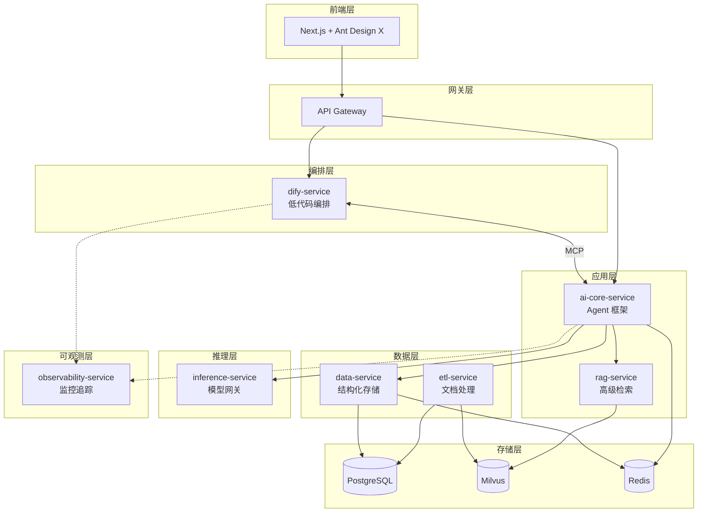

---

## 📦 服务清单与职责

| #   | 服务名                    | 技术栈                          | 职责                                   | 通信方式            | 优先级 |
| --- | ------------------------- | ------------------------------- | -------------------------------------- | ------------------- | ------ |
| 1   | **data-service**          | PostgreSQL 15.x                 | 业务元数据、用户数据、会话历史         | REST / JDBC         | P0     |
| 2   | **inference-service**     | Ollama (dev) / vLLM (prod)      | 统一模型推理网关，屏蔽底层差异         | OpenAI 兼容 API     | P0     |
| 3   | **ai-core-service**       | Spring AI Alibaba 1.1.x         | Agent 框架、多智能体编排、Tool Calling | REST / gRPC / MCP   | P0     |
| 4   | **rag-service**           | LangChain 1.x (Python 独立服务) | 多路召回、重排序、高级 RAG 策略        | gRPC / REST         | P1     |
| 5   | **etl-service**           | Unstructured.io 0.18.x (Python) | 64+ 格式文档解析、语义切片、VLM 增强   | REST / 消息队列     | P2     |
| 6   | **dify-service**          | Dify 1.11.x                     | 低代码工作流、知识库管理、Prompt 灰度  | REST / MCP          | P2     |
| 7   | **observability-service** | LangFuse 1.0.x + Promptfoo      | 链路追踪、Token 统计、Prompt 测试      | OpenTelemetry / SDK | P1     |

> ⚠️ **跨语言通信说明**: `rag-service` 和 `etl-service` 为 Python 服务，与 Java 服务（ai-core-service）通过 gRPC 或 REST API 通信。建议使用 Protocol Buffers 定义接口契约。

---

## 🔗 服务间通信矩阵

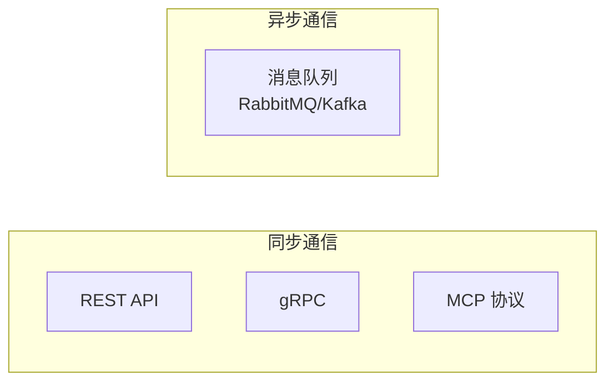

| 调用方          | 被调用方              | 协议               | 场景                 |
| --------------- | --------------------- | ------------------ | -------------------- |
| ai-core-service | inference-service     | REST (OpenAI 兼容) | 模型推理调用         |
| ai-core-service | rag-service           | gRPC               | 向量检索             |
| ai-core-service | data-service          | REST               | 业务数据 CRUD        |
| dify-service    | ai-core-service       | MCP                | 工具互调、Agent 协作 |
| etl-service     | rag-service           | REST               | 文档入库             |
| etl-service     | 消息队列              | AMQP               | 异步任务分发         |
| 所有服务        | observability-service | OpenTelemetry      | 链路追踪上报         |

---

## 📅 开发阶段规划

### 阶段一：基础设施搭建 (Week 1-2)

**目标**: 搭建开发环境，部署核心依赖服务

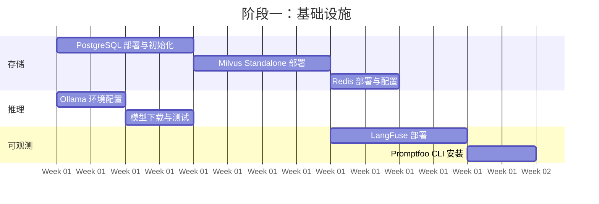

> 📅 **时间说明**: 甘特图中的日期为示意，实际开发请根据项目启动时间调整。各阶段周期为参考值。

#### 任务清单

| 任务              | 技术要点                                 | 交付物                            |
| ----------------- | ---------------------------------------- | --------------------------------- |
| PostgreSQL 部署   | Docker, 初始化脚本, 连接池配置           | `docker-compose.yml`, DDL 脚本    |
| Milvus Standalone | Docker, Collection 设计, 索引策略        | Milvus 配置, Collection Schema    |
| Redis 部署        | Docker, 持久化配置, 缓存策略             | Redis 配置, 缓存 Key 命名规范文档 |
| Ollama 配置       | GPU 驱动, 模型拉取 (qwen2.5/deepseek-r1) | 模型列表, 健康检查脚本            |
| LangFuse 部署     | Docker Compose, 环境变量                 | 观测平台可访问                    |

> 💡 **配置文件**: 基础设施 Docker Compose 配置详见 [Docker & Kubernetes 基础设施](../技术选型/docker-kubernetes-guide.md)

---

### 阶段二：核心应用开发 (Week 3-5)

**目标**: 完成 ai-core-service 基础功能，实现单轮对话与简单 RAG

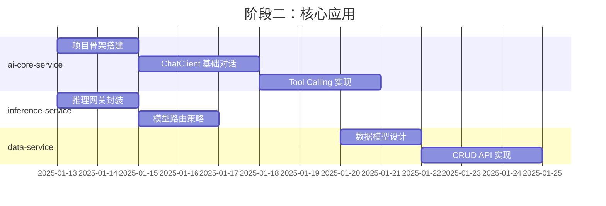

#### ai-core-service 技术架构

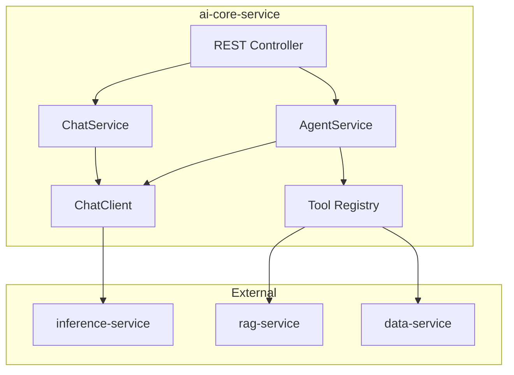

#### 核心技术栈

| 组件              | 版本   | 用途                      |
| ----------------- | ------ | ------------------------- |
| Spring AI Alibaba | 1.1.x  | Agent 框架、ChatClient    |
| Milvus SDK        | 2.5.x  | 向量数据库客户端          |
| OpenTelemetry     | 1.43.x | 链路追踪（集成 LangFuse） |

> ⚠️ **注意**: LangFuse 目前无官方 Java SDK，推荐通过 OpenTelemetry 协议将链路数据导出至 LangFuse。详见 [LangFuse OpenTelemetry 集成文档](https://langfuse.com/docs/integrations/opentelemetry)。
>
> 📖 详细配置请参考 [ai-core-service 设计文档](服务设计/03-ai-core-service-design.md)

---

### 阶段三：RAG 与 ETL 服务 (Week 6-8)

**目标**: 完成文档处理管道与高级检索能力

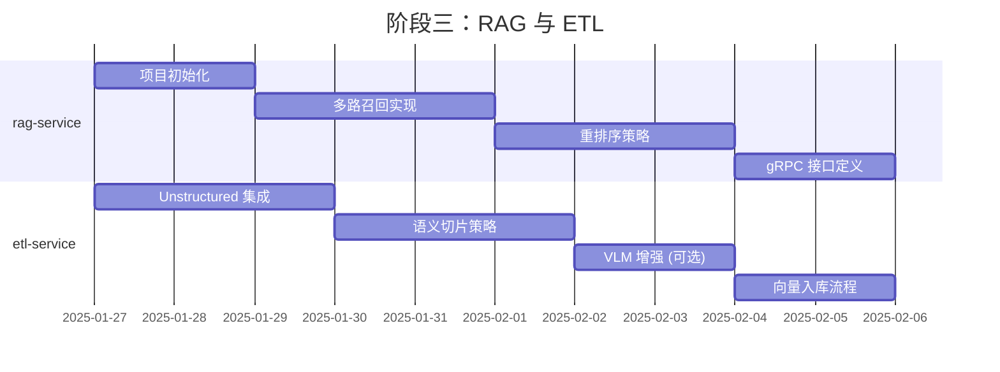

#### rag-service 架构

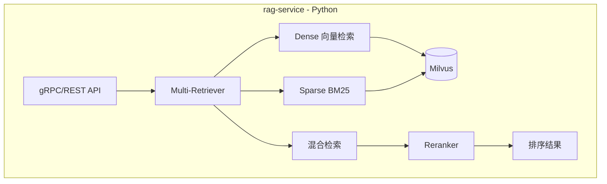

#### 关键技术点

| 能力       | 实现方式                | 说明       |
| ---------- | ----------------------- | ---------- |
| 多路召回   | Dense + Sparse + Hybrid | 提升召回率 |
| 重排序     | BGE-Reranker / Cohere   | 提升精度   |
| Query 改写 | HyDE / Multi-Query      | 语义扩展   |
| 上下文压缩 | LongContextReorder      | 长文本优化 |

#### etl-service 处理流程

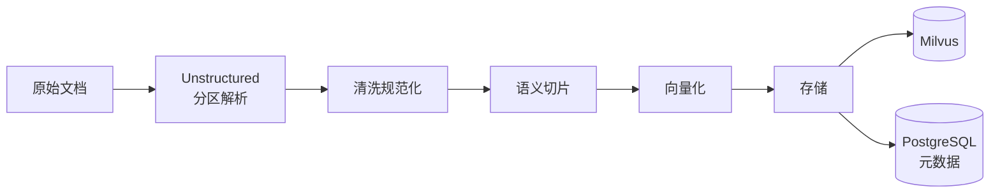

> 📖 详细实现请参考：
>
> - [rag-service 设计文档](服务设计/04-rag-service-design.md)
> - [etl-service 设计文档](服务设计/05-etl-service-design.md)
> - [Unstructured ETL 指南](../技术选型/unstructured-etl-guide.md)

---

### 阶段四：编排与智能体进阶 (Week 9-11)

**目标**: 实现多智能体编排，完成 Dify 集成

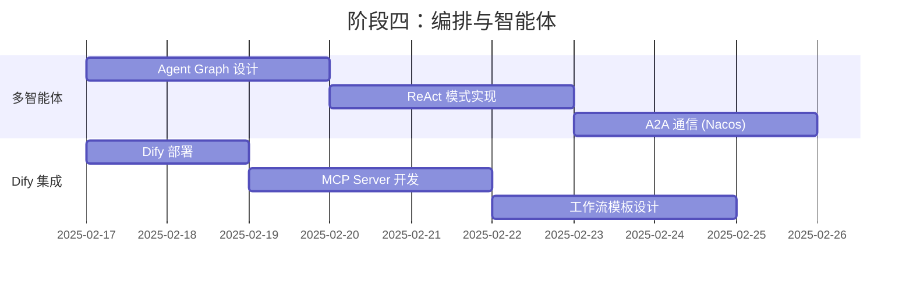

#### 多智能体架构

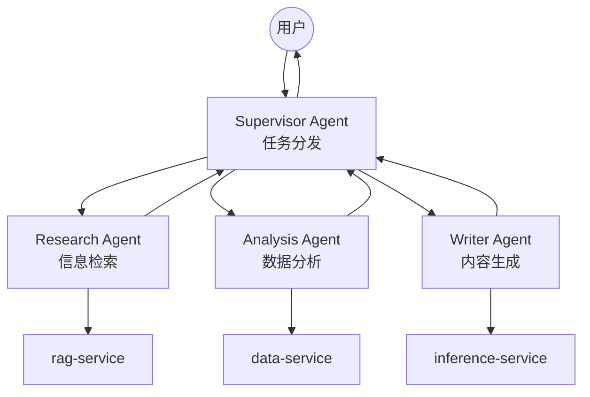

#### Dify MCP 集成

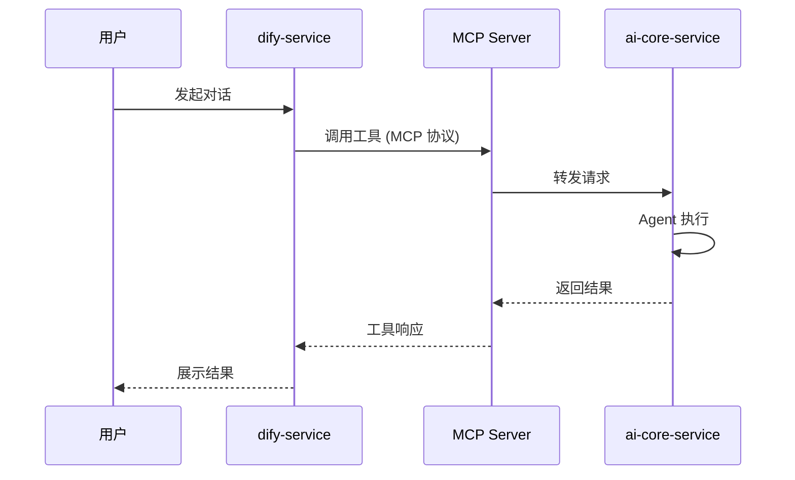

> 📖 详细实现请参考：
>
> - [ai-core-service 设计文档](服务设计/03-ai-core-service-design.md)
> - [dify-service 设计文档](服务设计/06-dify-service-design.md)
> - [Dify & Spring AI Alibaba 指南](../技术选型/dify-spring-ai-alibaba-guide.md)

---

### 阶段五：生产就绪 (Week 12-14)

**目标**: 完成生产环境部署准备，性能优化与测试

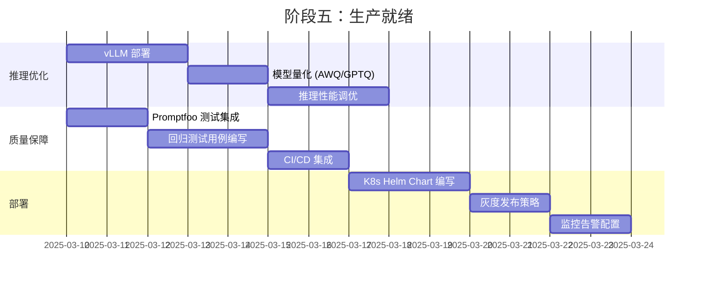

#### 阶段五任务说明

| 任务           | 技术要点                           | 参考文档                                                                 |
| -------------- | ---------------------------------- | ------------------------------------------------------------------------ |
| vLLM 部署      | K8s Deployment, GPU 调度, 模型量化 | [Ollama & vLLM 推理指南](../技术选型/ollama-vllm-guide.md)               |
| Promptfoo 集成 | CI/CD Pipeline, Prompt 回归测试    | [LangFuse & Promptfoo 观测指南](../技术选型/langfuse-promptfoo-guide.md) |
| K8s 部署       | Helm Chart, 灰度发布, 监控告警     | [Docker & Kubernetes 基础设施](../技术选型/docker-kubernetes-guide.md)   |

---

## 📊 资源规划

### 开发环境 (单机)

| 资源 | 规格          | 用途          |
| ---- | ------------- | ------------- |
| CPU  | 16 核         | 服务运行      |
| 内存 | 64 GB         | Milvus + 应用 |
| GPU  | RTX 4090 24GB | Ollama 推理   |
| 存储 | 1 TB SSD      | 模型 + 数据   |

### 生产环境 (K8s 集群)

| 节点类型 | 数量 | 规格            | 用途        |
| -------- | ---- | --------------- | ----------- |
| Master   | 3    | 8C16G           | K8s 控制面  |
| Worker   | 3    | 16C64G          | 应用服务    |
| GPU Node | 2    | 8C64G + A100\*4 | vLLM 推理   |
| Storage  | 3    | 8C32G + 2TB SSD | Milvus + PG |

---

## 🔍 风险与缓解

| 风险                   | 影响 | 缓解措施                                              |
| ---------------------- | ---- | ----------------------------------------------------- |
| Milvus 运维复杂度      | 中   | 使用 Helm Chart 标准化部署，配置监控告警              |
| 多服务通信延迟         | 中   | 关键路径使用 gRPC，非关键异步化                       |
| Prompt 劣化            | 高   | Promptfoo 强制集成 CI，阻断问题合并                   |
| 模型推理成本           | 高   | 开发用量化小模型，生产按需扩缩容                      |
| Java-Python 跨语言通信 | 中   | 使用 Protocol Buffers 定义接口契约，gRPC 保证类型安全 |
| LangFuse Java 集成     | 低   | 采用 OpenTelemetry 标准协议，避免 SDK 依赖            |

---

## 🔧 补充：跨语言服务通信

### 通信方式说明

| 通信类型 | 协议           | 适用场景                       | 参考                          |
| -------- | -------------- | ------------------------------ | ----------------------------- |
| 同步调用 | gRPC           | ai-core ↔ rag-service 向量检索 | Protocol Buffers 定义接口契约 |
| 同步调用 | REST           | 通用 API 调用                  | OpenAPI 规范                  |
| 服务发现 | Nacos          | 微服务注册与配置               | Spring Cloud Alibaba          |
| 异步通信 | RabbitMQ/Kafka | ETL 任务分发                   | 消息队列                      |

> 📖 详细接口定义请参考各服务设计文档：
>
> - [rag-service 设计文档](服务设计/04-rag-service-design.md) - 包含 gRPC Proto 定义
> - [ai-core-service 设计文档](服务设计/03-ai-core-service-design.md) - 包含 Nacos 配置

---

## 📎 相关文档

- [Dify & Spring AI Alibaba 指南](dify-spring-ai-alibaba-guide.md)
- [Spring AI vs LangChain 对比](spring-ai-langchain-guide.md)
- [PostgreSQL & Milvus 存储指南](postgresql-milvus-guide.md)
- [Unstructured ETL 指南](unstructured-etl-guide.md)
- [Ollama & vLLM 推理指南](ollama-vllm-guide.md)
- [LangFuse & Promptfoo 观测指南](langfuse-promptfoo-guide.md)
- [Docker & Kubernetes 基础设施](docker-kubernetes-guide.md)
