# Data Service 详细设计文档

> 版本：v1.0 | 优先级：P0 | 技术栈：Spring Boot 3.x + PostgreSQL 15.x

## 1. 服务概述

### 1.1 服务定位

**data-service** 是 AI 产品后端架构中的**基础数据层服务**，负责管理所有结构化业务数据的持久化存储与访问。作为 P0 优先级服务，它是其他所有业务服务的数据基础设施。

### 1.2 核心职责

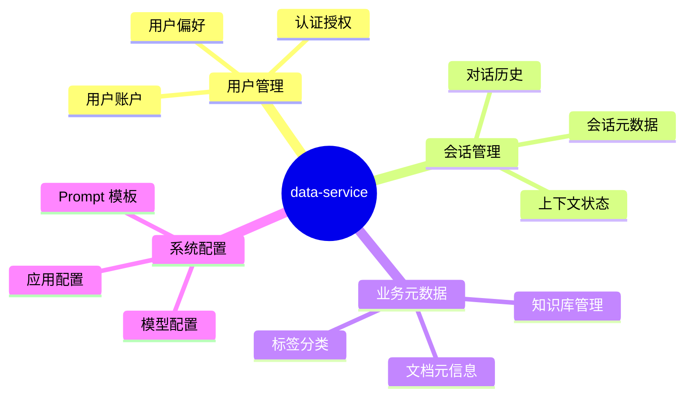

### 1.3 服务边界

| 属于本服务职责        | 不属于本服务职责           |
| --------------------- | -------------------------- |
| 用户、租户、权限数据  | 向量数据存储 (Milvus)      |
| 对话历史与会话状态    | 文档原文存储 (对象存储)    |
| 知识库/文档元数据     | 实时推理请求 (inference)   |
| Prompt 模板与版本管理 | 文档解析与切片 (etl)       |
| 系统配置与特性开关    | 向量检索逻辑 (rag-service) |

---

## 2. 系统架构

### 2.1 服务架构图

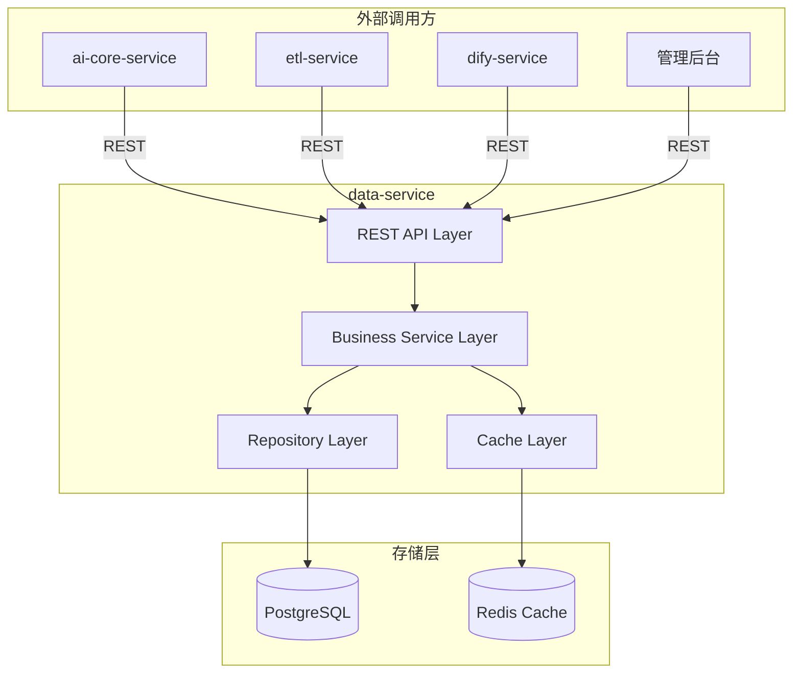

### 2.2 分层架构

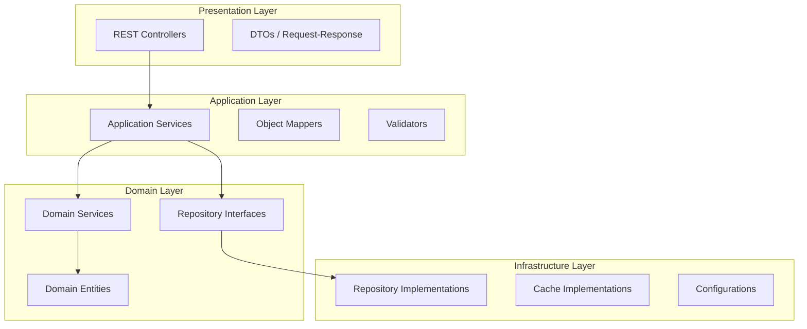

---

## 3. 数据模型设计

### 3.1 核心实体关系图 (ERD)

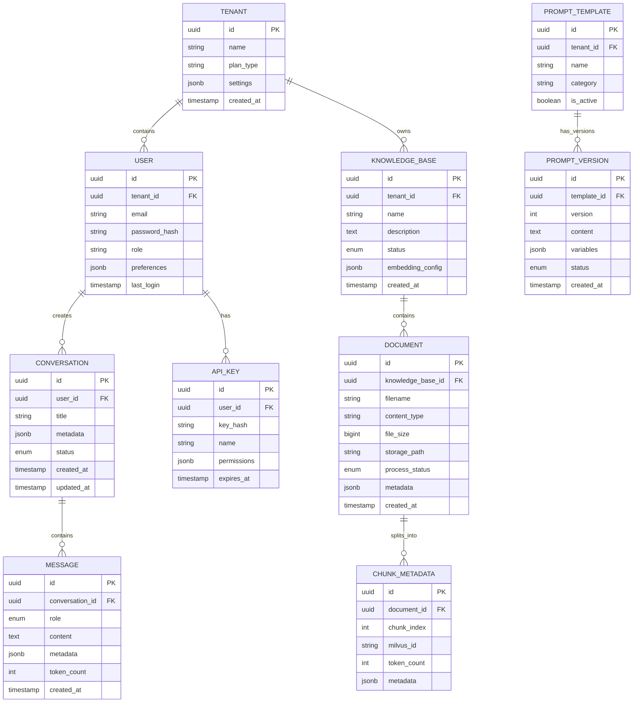

### 3.2 核心表设计

#### 3.2.1 租户与用户

| 表名       | 说明         | 核心字段                                       |
| ---------- | ------------ | ---------------------------------------------- |
| `tenants`  | 租户/组织    | id, name, plan_type, settings, quota_limits    |
| `users`    | 用户账户     | id, tenant_id, email, role, preferences        |
| `api_keys` | API 密钥管理 | id, user_id, key_hash, permissions, expires_at |

#### 3.2.2 会话与消息

| 表名            | 说明     | 核心字段                                        |
| --------------- | -------- | ----------------------------------------------- |
| `conversations` | 对话会话 | id, user_id, title, status, metadata            |
| `messages`      | 消息记录 | id, conversation_id, role, content, token_count |

#### 3.2.3 知识库

| 表名              | 说明       | 核心字段                                          |
| ----------------- | ---------- | ------------------------------------------------- |
| `knowledge_bases` | 知识库     | id, tenant_id, name, embedding_config, status     |
| `documents`       | 文档元信息 | id, kb_id, filename, storage_path, process_status |
| `chunk_metadata`  | 切片元数据 | id, document_id, chunk_index, milvus_id           |

#### 3.2.4 Prompt 管理

| 表名               | 说明        | 核心字段                                  |
| ------------------ | ----------- | ----------------------------------------- |
| `prompt_templates` | Prompt 模板 | id, tenant_id, name, category, is_active  |
| `prompt_versions`  | 版本历史    | id, template_id, version, content, status |

### 3.3 数据分区策略

针对大数据量场景，建议对以下表进行分区：

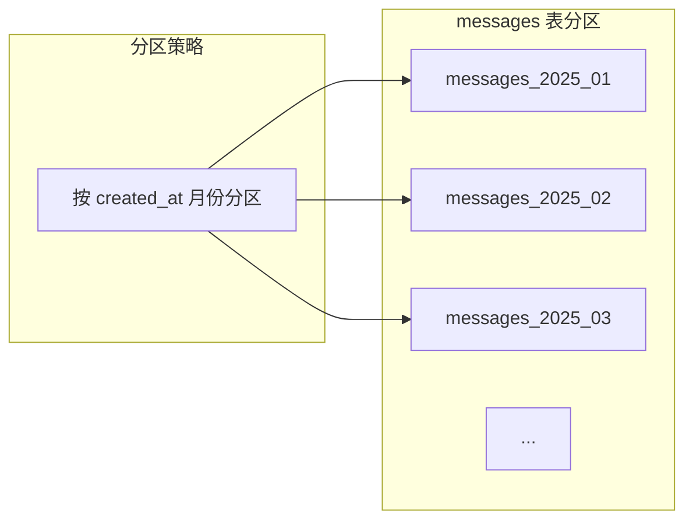

| 表名       | 分区键       | 分区类型   | 保留策略     |
| ---------- | ------------ | ---------- | ------------ |
| `messages` | `created_at` | RANGE 月份 | 滚动 12 个月 |
| `api_logs` | `created_at` | RANGE 月份 | 滚动 6 个月  |

---

## 4. API 设计

### 4.1 API 设计原则

- **RESTful 风格**：资源导向，使用标准 HTTP 方法
- **版本控制**：URI 路径包含版本号 `/api/v1/`
- **统一响应格式**：所有响应使用统一的 JSON 结构
- **分页规范**：使用 `page` + `size` 参数，返回 `total` 计数
- **幂等性**：PUT/DELETE 操作保证幂等

### 4.2 API 模块划分

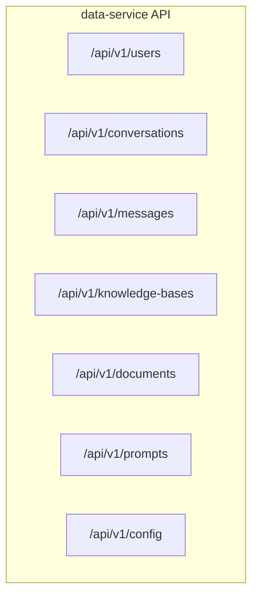

### 4.3 核心 API 清单

#### 4.3.1 用户管理

| 方法   | 端点                 | 说明         |
| ------ | -------------------- | ------------ |
| POST   | `/api/v1/users`      | 创建用户     |
| GET    | `/api/v1/users/{id}` | 获取用户详情 |
| PUT    | `/api/v1/users/{id}` | 更新用户信息 |
| DELETE | `/api/v1/users/{id}` | 删除用户     |
| GET    | `/api/v1/users`      | 用户列表     |

#### 4.3.2 会话管理

| 方法   | 端点                                   | 说明             |
| ------ | -------------------------------------- | ---------------- |
| POST   | `/api/v1/conversations`                | 创建会话         |
| GET    | `/api/v1/conversations/{id}`           | 获取会话详情     |
| GET    | `/api/v1/conversations/{id}/messages`  | 获取会话消息列表 |
| POST   | `/api/v1/conversations/{id}/messages`  | 添加消息         |
| DELETE | `/api/v1/conversations/{id}`           | 删除会话         |
| GET    | `/api/v1/users/{userId}/conversations` | 用户会话列表     |

#### 4.3.3 知识库管理

| 方法   | 端点                                     | 说明           |
| ------ | ---------------------------------------- | -------------- |
| POST   | `/api/v1/knowledge-bases`                | 创建知识库     |
| GET    | `/api/v1/knowledge-bases/{id}`           | 获取知识库详情 |
| PUT    | `/api/v1/knowledge-bases/{id}`           | 更新知识库     |
| DELETE | `/api/v1/knowledge-bases/{id}`           | 删除知识库     |
| GET    | `/api/v1/knowledge-bases/{id}/documents` | 知识库文档列表 |
| POST   | `/api/v1/knowledge-bases/{id}/documents` | 添加文档元信息 |

#### 4.3.4 Prompt 模板管理

| 方法 | 端点                                           | 说明        |
| ---- | ---------------------------------------------- | ----------- |
| POST | `/api/v1/prompts`                              | 创建 Prompt |
| GET  | `/api/v1/prompts/{id}`                         | 获取 Prompt |
| POST | `/api/v1/prompts/{id}/versions`                | 创建新版本  |
| GET  | `/api/v1/prompts/{id}/versions`                | 版本历史    |
| PUT  | `/api/v1/prompts/{id}/versions/{ver}/activate` | 激活版本    |

### 4.4 统一响应格式

#### 成功响应

```json
{
  "code": 0,
  "message": "success",
  "data": { ... },
  "timestamp": "2025-01-15T10:30:00Z"
}
```

#### 分页响应

```json
{
  "code": 0,
  "message": "success",
  "data": {
    "items": [ ... ],
    "pagination": {
      "page": 1,
      "size": 20,
      "total": 156,
      "totalPages": 8
    }
  }
}
```

#### 错误响应

```json
{
  "code": 40001,
  "message": "Validation failed",
  "errors": [{ "field": "email", "message": "Invalid email format" }],
  "timestamp": "2025-01-15T10:30:00Z"
}
```

---

## 5. 服务集成

### 5.1 被调用关系

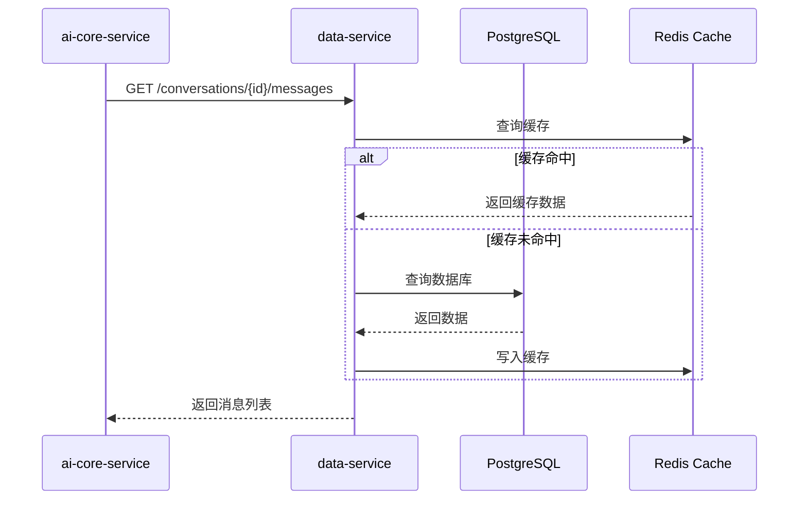

### 5.2 与其他服务的集成点

| 调用方              | 调用场景            | 接口                         |
| ------------------- | ------------------- | ---------------------------- |
| **ai-core-service** | 获取/保存对话历史   | Conversations & Messages API |
| **ai-core-service** | 获取 Prompt 模板    | Prompts API                  |
| **ai-core-service** | 用户认证校验        | Users API                    |
| **etl-service**     | 创建/更新文档元信息 | Documents API                |
| **etl-service**     | 保存切片元数据      | Chunk Metadata API           |
| **dify-service**    | 同步知识库配置      | Knowledge Bases API          |
| **管理后台**        | 全量 CRUD 操作      | All APIs                     |

### 5.3 事件发布 (可选)

对于需要异步通知的场景，可发布领域事件：

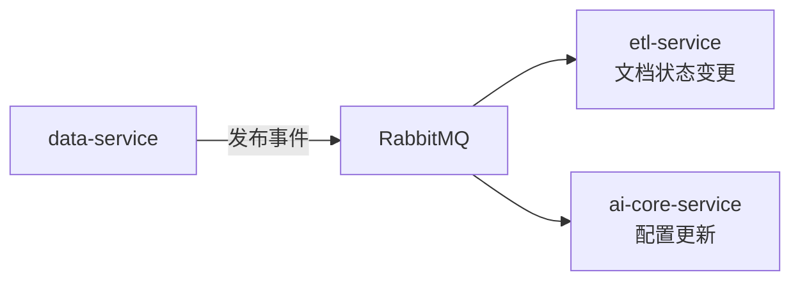

| 事件名称                   | 触发条件         | 消费者          |
| -------------------------- | ---------------- | --------------- |
| `document.created`         | 文档元信息创建   | etl-service     |
| `document.status.changed`  | 文档处理状态变更 | ai-core-service |
| `prompt.version.activated` | Prompt 版本激活  | ai-core-service |
| `knowledge_base.updated`   | 知识库配置更新   | rag-service     |

---

## 6. 非功能性设计

### 6.1 性能要求

| 指标         | 目标值      | 说明                    |
| ------------ | ----------- | ----------------------- |
| API 响应时间 | P99 < 100ms | 常规 CRUD 操作          |
| 吞吐量       | > 1000 QPS  | 单实例                  |
| 数据库连接池 | 20-50 连接  | HikariCP                |
| 缓存命中率   | > 80%       | 热点数据 (会话、Prompt) |

### 6.2 缓存策略

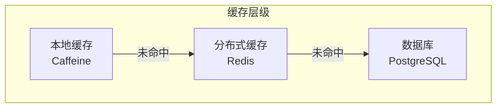

| 数据类型    | 缓存位置 | TTL    | 失效策略           |
| ----------- | -------- | ------ | ------------------ |
| 用户信息    | Redis    | 30 min | 更新时主动失效     |
| 会话列表    | Redis    | 10 min | 更新时主动失效     |
| Prompt 模板 | 本地     | 5 min  | 版本变更时广播失效 |
| 系统配置    | 本地     | 1 min  | 定时刷新           |

### 6.3 安全设计

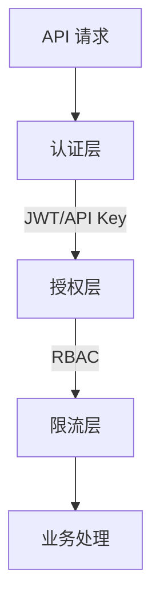

| 安全措施     | 实现方式                           |
| ------------ | ---------------------------------- |
| 身份认证     | JWT Token / API Key                |
| 授权控制     | RBAC (角色: Admin, User, Readonly) |
| 数据隔离     | 租户级别数据隔离 (tenant_id)       |
| API 限流     | 基于用户/IP 的滑动窗口限流         |
| 敏感数据脱敏 | 日志中脱敏处理                     |
| 密码存储     | BCrypt 哈希                        |
| SQL 注入防护 | 参数化查询 (JPA/MyBatis)           |

### 6.4 可观测性

| 观测维度 | 实现方式                                    |
| -------- | ------------------------------------------- |
| 日志     | 结构化 JSON 日志，接入 ELK/Loki             |
| 指标     | Micrometer + Prometheus 暴露业务指标        |
| 链路追踪 | OpenTelemetry → LangFuse (作为上游的一部分) |
| 健康检查 | `/actuator/health` 包含数据库连接状态       |

#### 关键业务指标

- `data_service_api_requests_total` - API 请求总数 (按端点、状态码)
- `data_service_api_latency_seconds` - API 响应延迟分布
- `data_service_db_connections_active` - 数据库活跃连接数
- `data_service_cache_hit_ratio` - 缓存命中率

---

## 7. 部署架构

### 7.1 开发环境

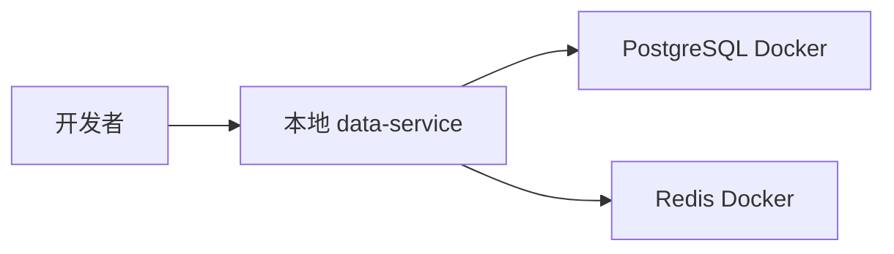

### 7.2 生产环境

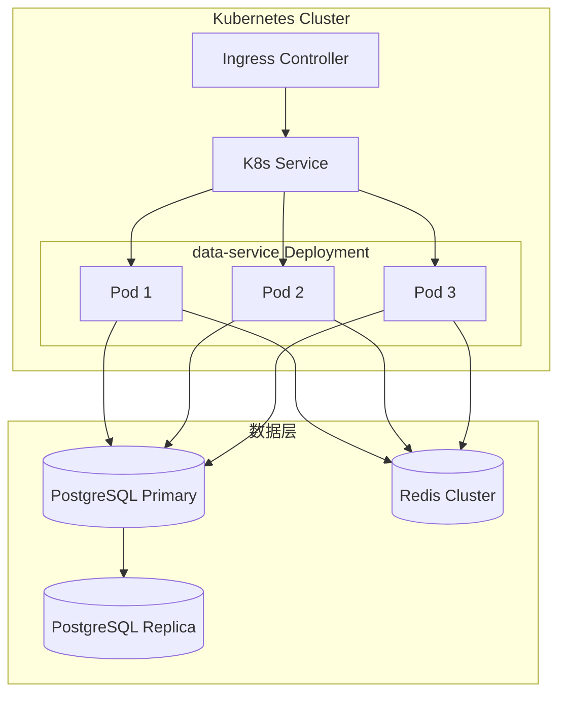

### 7.3 资源配置建议

| 环境 | 副本数 | CPU Request | Memory Request | CPU Limit | Memory Limit |
| ---- | ------ | ----------- | -------------- | --------- | ------------ |
| 开发 | 1      | 0.5 核      | 512 MB         | 1 核      | 1 GB         |
| 生产 | 3      | 1 核        | 1 GB           | 2 核      | 2 GB         |

---

## 8. 开发里程碑

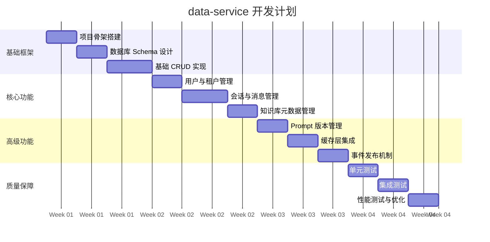

---

## 9. 技术选型摘要

| 类别     | 技术选型          | 版本  | 说明           |
| -------- | ----------------- | ----- | -------------- |
| 框架     | Spring Boot       | 3.3.x | 主框架         |
| 持久层   | Spring Data JPA   | -     | ORM 框架       |
| 数据库   | PostgreSQL        | 15.x  | 主数据库       |
| 缓存     | Redis             | 7.x   | 分布式缓存     |
| 本地缓存 | Caffeine          | 3.x   | 二级缓存       |
| 连接池   | HikariCP          | -     | 数据库连接池   |
| API 文档 | SpringDoc OpenAPI | 2.x   | Swagger UI     |
| 数据迁移 | Flyway            | 10.x  | 数据库版本管理 |
| 对象映射 | MapStruct         | 1.5.x | DTO 转换       |

---

## 10. 相关文档

- [后端开发计划总览](../backend-development-plan.md)
- [PostgreSQL & Milvus 存储指南](../../技术选型/postgresql-milvus-guide.md)
- [Docker & Kubernetes 基础设施](../../技术选型/docker-kubernetes-guide.md)

---

## 附录 A：错误码定义

| 错误码 | HTTP Status | 说明                  |
| ------ | ----------- | --------------------- |
| 40001  | 400         | 请求参数校验失败      |
| 40002  | 400         | 请求体格式错误        |
| 40101  | 401         | 未认证                |
| 40102  | 401         | Token 已过期          |
| 40301  | 403         | 无权限访问            |
| 40401  | 404         | 资源不存在            |
| 40901  | 409         | 资源冲突 (如重复创建) |
| 50001  | 500         | 服务内部错误          |
| 50002  | 500         | 数据库操作失败        |
| 50301  | 503         | 服务暂时不可用        |

---

## 附录 B：配置项清单

| 配置项                                       | 默认值    | 说明                 |
| -------------------------------------------- | --------- | -------------------- |
| `spring.datasource.url`                      | -         | 数据库连接 URL       |
| `spring.datasource.hikari.maximum-pool-size` | 20        | 最大连接数           |
| `spring.data.redis.host`                     | localhost | Redis 地址           |
| `app.cache.conversation.ttl`                 | 600       | 会话缓存 TTL (秒)    |
| `app.cache.prompt.ttl`                       | 300       | Prompt 缓存 TTL (秒) |
| `app.security.jwt.expiration`                | 86400     | JWT 有效期 (秒)      |
| `app.pagination.default-size`                | 20        | 默认分页大小         |
| `app.pagination.max-size`                    | 100       | 最大分页大小         |
