# Inference Service 详细设计文档

> 版本：v1.1 | 优先级：P0 | 更新日期：2025-12-27
> 技术栈：Ollama (开发) / vLLM (生产)

## 1. 服务概述

### 1.1 服务定位

**inference-service** 是 AI 产品后端架构中的**模型推理网关层**，作为统一的 LLM 推理入口，屏蔽底层推理引擎的差异，为上层应用提供标准化的 OpenAI 兼容 API。

### 1.2 核心职责

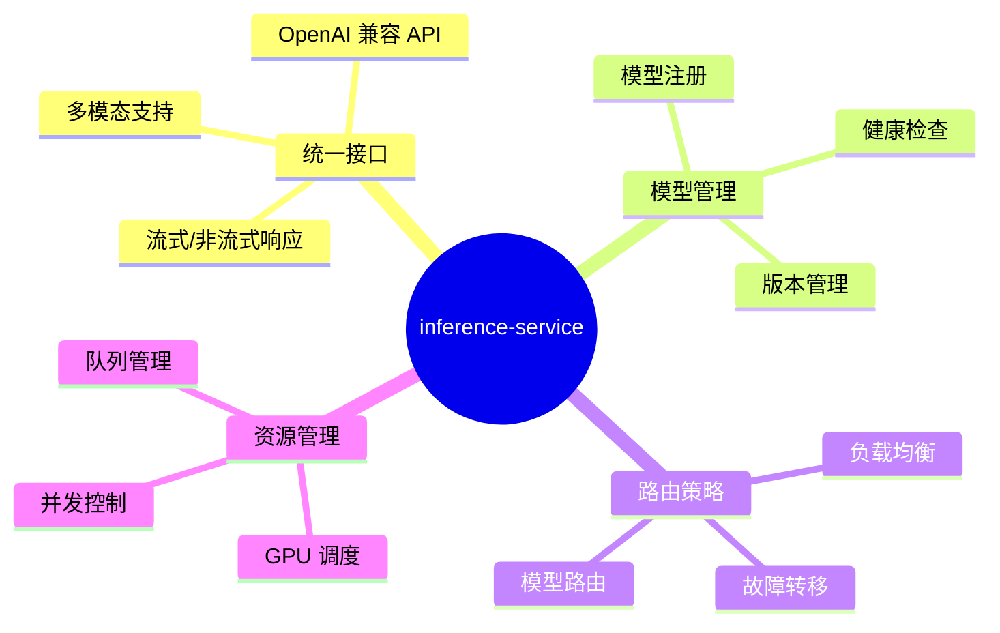

### 1.3 服务边界

| 属于本服务职责     | 不属于本服务职责               |
| ------------------ | ------------------------------ |
| 统一推理 API 接口  | 业务逻辑处理 (ai-core-service) |
| 模型加载与管理     | Prompt 编排 (ai-core-service)  |
| 请求路由与负载均衡 | 向量检索 (rag-service)         |
| 推理性能优化       | 对话历史存储 (data-service)    |
| 开发/生产环境切换  | 链路追踪展示 (observability)   |
| Token 计数与限流   | 用户认证授权 (data-service)    |

---

## 2. 系统架构

### 2.1 整体架构图

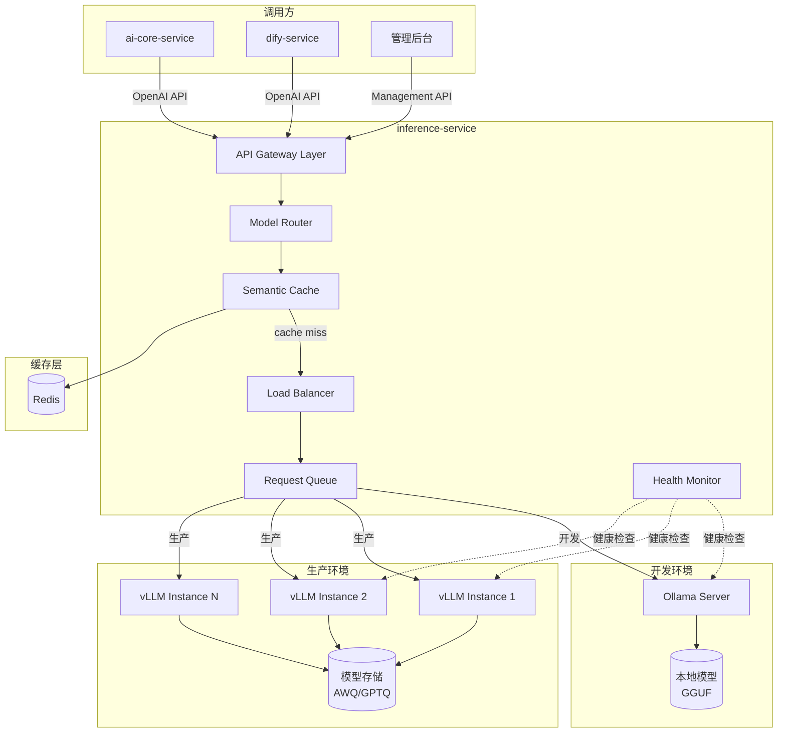

### 2.2 环境差异化架构

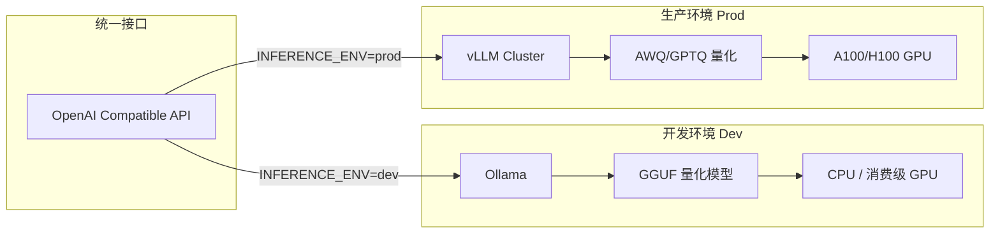

---

## 3. 模型管理设计

### 3.1 支持的模型类型

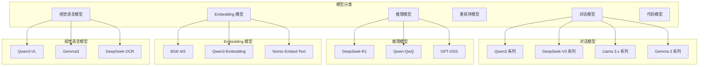

### 3.2 模型注册表设计

| 字段           | 类型   | 说明                            |
| -------------- | ------ | ------------------------------- |
| `model_id`     | string | 模型唯一标识                    |
| `model_name`   | string | 模型显示名称                    |
| `model_type`   | enum   | chat / embedding / rerank / vlm |
| `provider`     | enum   | ollama / vllm / openai          |
| `endpoint`     | string | 推理端点地址                    |
| `max_tokens`   | int    | 最大上下文长度                  |
| `capabilities` | array  | 支持的能力 (streaming, tools)   |
| `status`       | enum   | active / inactive / loading     |
| `priority`     | int    | 路由优先级                      |
| `quota`        | object | 并发限制配置                    |

### 3.3 模型配置示例

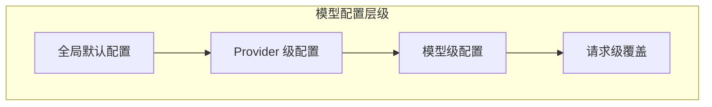

| 配置层级 | 配置项示例                            |
| -------- | ------------------------------------- |
| 全局     | 默认超时、重试策略、日志级别          |
| Provider | Ollama/vLLM 特有参数                  |
| 模型     | temperature、top_p、max_tokens 默认值 |
| 请求     | 单次请求覆盖参数                      |

---

## 4. 路由策略设计

### 4.1 路由决策流程

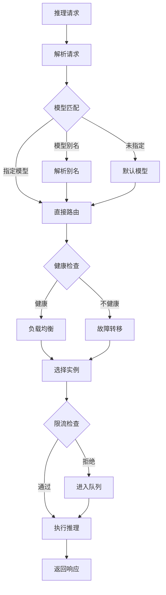

### 4.2 负载均衡策略

| 策略                     | 说明                | 适用场景       |
| ------------------------ | ------------------- | -------------- |
| **Round Robin**          | 轮询分发            | 实例规格一致   |
| **Weighted Round Robin** | 加权轮询            | 实例规格不同   |
| **Least Connections**    | 最少连接            | 长连接场景     |
| **Least Latency**        | 最低延迟            | 延迟敏感场景   |
| **Consistent Hash**      | 一致性哈希 (按用户) | 会话亲和性需求 |

### 4.3 故障转移策略

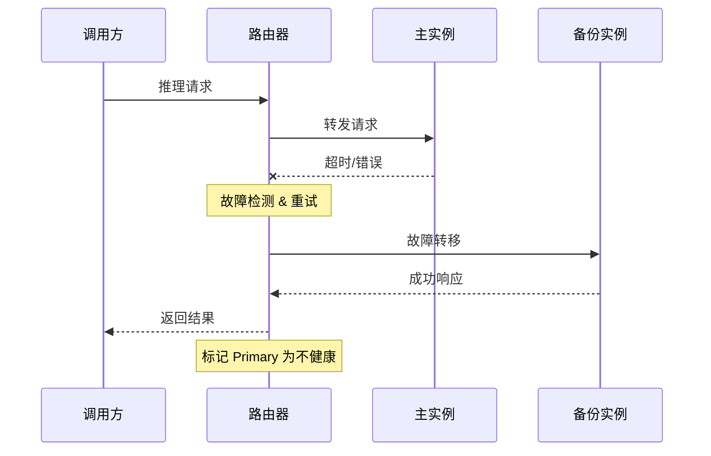

| 故障类型   | 检测方式     | 处理策略        |
| ---------- | ------------ | --------------- |
| 连接超时   | TCP 连接失败 | 立即转移        |
| 请求超时   | 响应超时     | 重试 1 次后转移 |
| 5xx 错误   | HTTP 状态码  | 重试 1 次后转移 |
| 模型未加载 | 模型状态检查 | 等待或转移      |
| GPU OOM    | 错误信息解析 | 转移到其他实例  |

---

## 5. API 设计

### 5.1 OpenAI 兼容 API

服务提供完全兼容 OpenAI API 规范的接口，确保与现有生态无缝集成。

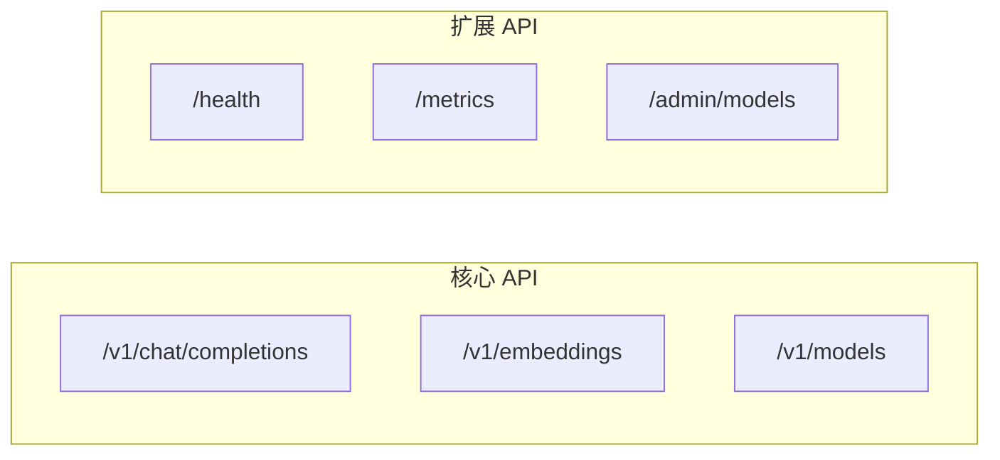

### 5.2 API 端点清单

#### 5.2.1 推理 API (OpenAI 兼容)

| 方法 | 端点                    | 说明                |
| ---- | ----------------------- | ------------------- |
| POST | `/v1/chat/completions`  | 对话补全 (支持流式) |
| POST | `/v1/completions`       | 文本补全            |
| POST | `/v1/embeddings`        | 向量嵌入            |
| GET  | `/v1/models`            | 模型列表            |
| GET  | `/v1/models/{model_id}` | 模型详情            |

#### 5.2.2 管理 API

| 方法   | 端点                        | 说明         |
| ------ | --------------------------- | ------------ |
| GET    | `/admin/models`             | 模型管理列表 |
| POST   | `/admin/models`             | 注册模型     |
| PUT    | `/admin/models/{id}`        | 更新模型配置 |
| DELETE | `/admin/models/{id}`        | 注销模型     |
| POST   | `/admin/models/{id}/load`   | 加载模型     |
| POST   | `/admin/models/{id}/unload` | 卸载模型     |

#### 5.2.3 运维 API

| 方法 | 端点            | 说明            |
| ---- | --------------- | --------------- |
| GET  | `/health`       | 健康检查        |
| GET  | `/health/live`  | 存活探针        |
| GET  | `/health/ready` | 就绪探针        |
| GET  | `/metrics`      | Prometheus 指标 |

### 5.3 请求/响应格式

#### Chat Completions 请求

```json
{
  "model": "qwen2.5-72b-instruct",
  "messages": [
    {"role": "system", "content": "You are a helpful assistant."},
    {"role": "user", "content": "Hello!"}
  ],
  "temperature": 0.7,
  "max_tokens": 2048,
  "stream": true,
  "tools": [...]  // 可选：Function Calling
}
```

#### Chat Completions 响应 (流式)

```json
{
  "id": "chatcmpl-xxx",
  "object": "chat.completion.chunk",
  "created": 1234567890,
  "model": "qwen2.5-72b-instruct",
  "choices": [
    {
      "index": 0,
      "delta": { "content": "Hello" },
      "finish_reason": null
    }
  ]
}
```

---

## 6. 性能优化设计

### 6.1 推理优化技术栈

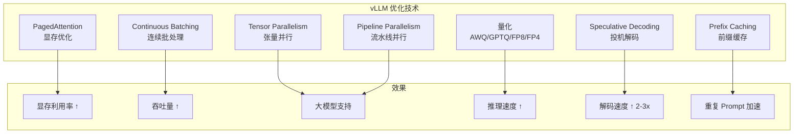

### 6.2 关键性能指标

| 指标                | 开发环境目标 | 生产环境目标 |
| ------------------- | ------------ | ------------ |
| Time to First Token | < 2s         | < 500ms      |
| Tokens per Second   | > 20 tok/s   | > 100 tok/s  |
| 并发请求数          | 5            | 100+         |
| GPU 显存利用率      | -            | > 90%        |
| 请求成功率          | > 95%        | > 99.9%      |

### 6.3 批处理策略

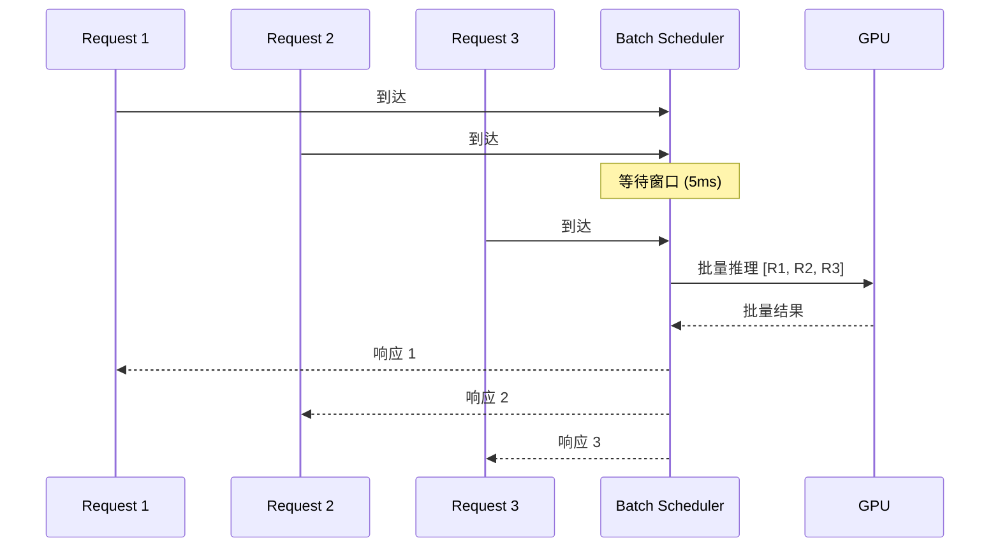

| 参数                 | 说明              | 推荐值 |
| -------------------- | ----------------- | ------ |
| `max_batch_size`     | 最大批处理大小    | 32-64  |
| `batch_timeout_ms`   | 批处理等待超时    | 5-10ms |
| `max_waiting_tokens` | 最大等待 Token 数 | 8192   |

---

## 7. 开发/生产环境配置

### 7.1 环境对比

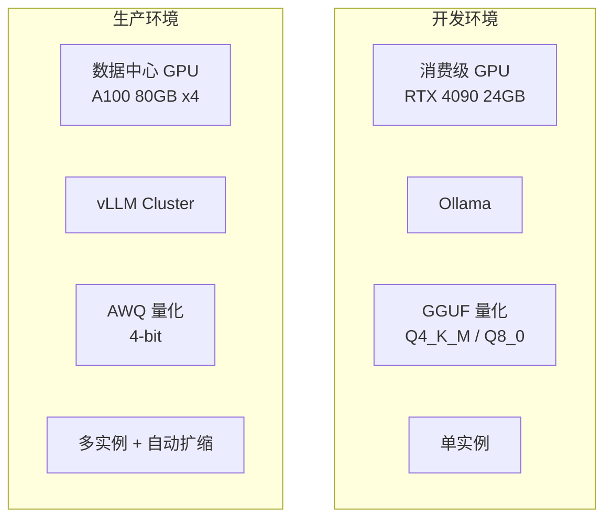

### 7.2 Ollama 开发配置

| 配置项                     | 值            | 说明                            |
| -------------------------- | ------------- | ------------------------------- |
| `OLLAMA_HOST`              | 0.0.0.0:11434 | 监听地址                        |
| `OLLAMA_NUM_PARALLEL`      | 2             | 并行请求数                      |
| `OLLAMA_MAX_LOADED_MODELS` | 2             | 最大加载模型数                  |
| `OLLAMA_KEEP_ALIVE`        | 5m            | 模型保持时间                    |
| `OLLAMA_FLASH_ATTENTION`   | 1             | 启用 Flash Attention (默认启用) |
| `OLLAMA_VULKAN`            | 0             | Vulkan 加速 (可选)              |

> **Ollama 0.13.x 新特性**:
>
> - Flash Attention 默认启用
> - 支持 Logprobs API
> - 支持 Vulkan 加速 (opt-in)
> - 直接运行 Embedding 模型
> - 支持 DeepSeek-V3.1/OCR 等新架构

### 7.3 vLLM 生产配置

| 配置项                     | 值    | 说明                    |
| -------------------------- | ----- | ----------------------- |
| `--tensor-parallel-size`   | 4     | 张量并行度              |
| `--max-model-len`          | 32768 | 最大上下文长度          |
| `--quantization`           | awq   | 量化方法 (awq/gptq/fp8) |
| `--gpu-memory-utilization` | 0.95  | GPU 显存利用率          |
| `--enable-chunked-prefill` | true  | 分块预填充              |
| `--max-num-seqs`           | 256   | 最大并发序列            |
| `--enable-prefix-caching`  | true  | 前缀缓存 (KV 复用)      |
| `--speculative-model`      | -     | 投机解码模型 (可选)     |

> **vLLM 0.13.x 新特性**:
>
> - V1 引擎默认启用 (V0 已弃用)
> - 支持 FP8/FP4 量化
> - 支持 LoRA 动态加载
> - 支持投机解码 (Speculative Decoding)
> - PyTorch 2.8 支持

---

## 8. 服务集成

### 8.1 被调用关系

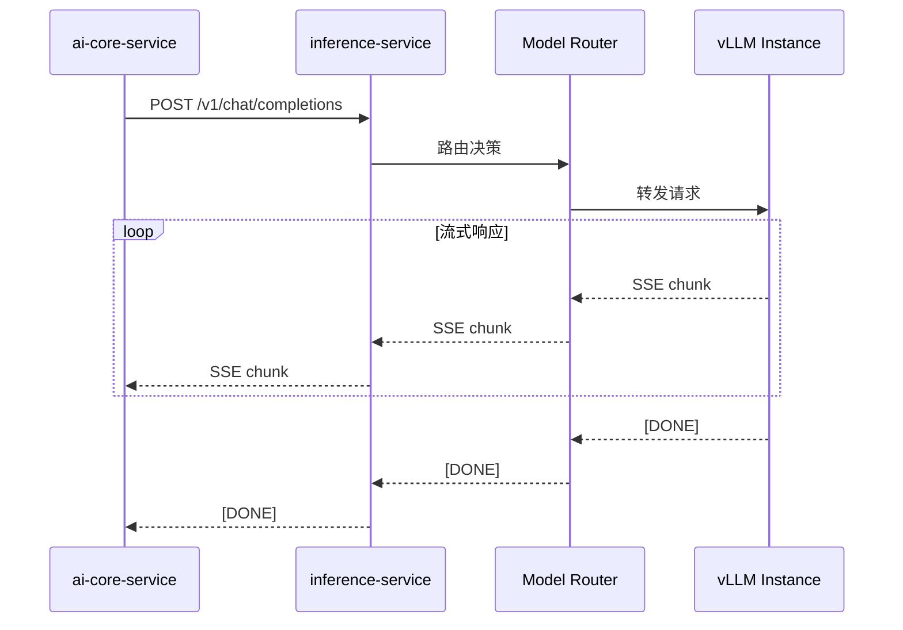

### 8.2 与其他服务的集成点

| 调用方              | 调用场景          | 接口                   |
| ------------------- | ----------------- | ---------------------- |
| **ai-core-service** | 对话推理          | `/v1/chat/completions` |
| **ai-core-service** | 文本嵌入          | `/v1/embeddings`       |
| **rag-service**     | 向量化 (可选直连) | `/v1/embeddings`       |
| **dify-service**    | 模型调用          | `/v1/chat/completions` |
| **etl-service**     | 文档向量化        | `/v1/embeddings`       |
| **管理后台**        | 模型管理          | `/admin/models`        |

### 8.3 外部依赖

| 依赖服务              | 类型       | 用途                     |
| --------------------- | ---------- | ------------------------ |
| Ollama Server         | 必需(开发) | 开发环境推理引擎         |
| vLLM Cluster          | 必需(生产) | 生产环境推理引擎         |
| 模型存储 (S3/NFS)     | 必需       | 模型文件存储             |
| Redis                 | 建议       | 语义缓存、请求去重、限流 |
| observability-service | 可选       | 指标上报                 |

---

## 9. 可观测性设计

### 9.1 关键指标

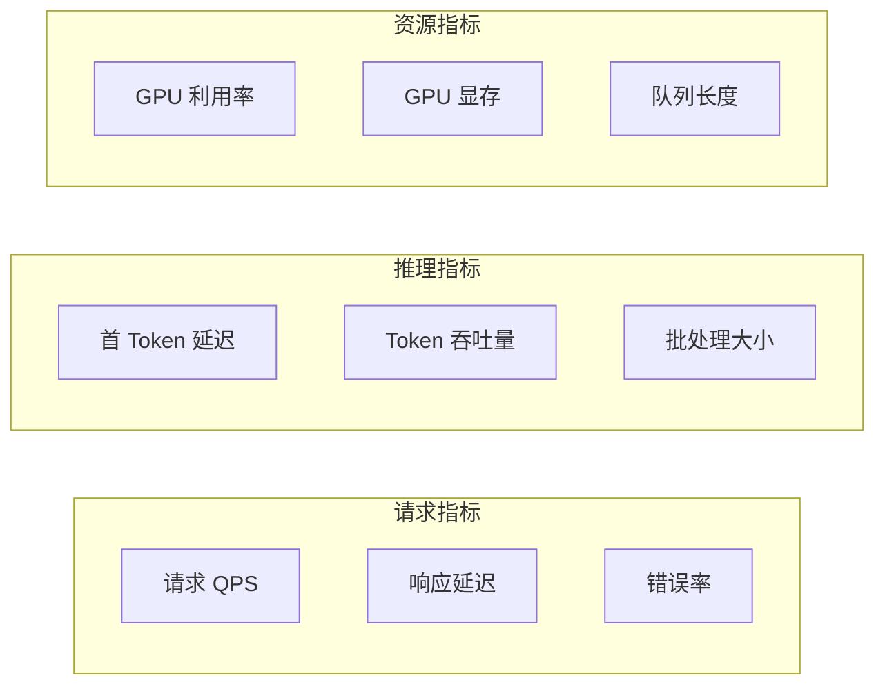

### 9.2 Prometheus 指标

| 指标名称                                | 类型      | 说明            |
| --------------------------------------- | --------- | --------------- |
| `inference_requests_total`              | Counter   | 请求总数        |
| `inference_request_duration_seconds`    | Histogram | 请求延迟分布    |
| `inference_time_to_first_token_seconds` | Histogram | 首 Token 延迟   |
| `inference_tokens_generated_total`      | Counter   | 生成 Token 总数 |
| `inference_tokens_per_second`           | Gauge     | 实时 Token 吞吐 |
| `inference_active_requests`             | Gauge     | 活跃请求数      |
| `inference_queue_length`                | Gauge     | 等待队列长度    |
| `inference_model_loaded`                | Gauge     | 已加载模型数    |
| `inference_gpu_memory_used_bytes`       | Gauge     | GPU 显存使用    |
| `inference_gpu_utilization_percent`     | Gauge     | GPU 利用率      |

### 9.3 日志规范

| 日志级别 | 场景                         |
| -------- | ---------------------------- |
| ERROR    | 推理失败、模型加载失败       |
| WARN     | 请求超时、重试、限流触发     |
| INFO     | 请求开始/结束、模型加载/卸载 |
| DEBUG    | 路由决策、批处理详情         |

---

## 10. 安全设计

### 10.1 认证授权

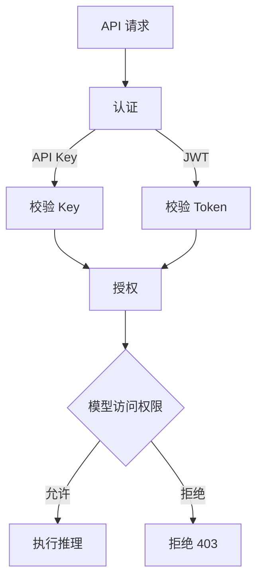

### 10.2 安全措施

| 安全措施 | 实现方式                    |
| -------- | --------------------------- |
| API 认证 | API Key / JWT Token         |
| 请求限流 | 滑动窗口限流 (按用户/租户)  |
| 输入校验 | Prompt 长度限制、敏感词过滤 |
| 输出过滤 | 有害内容检测 (可选)         |
| 传输加密 | TLS 1.3                     |
| 内网隔离 | 推理引擎仅内网可访问        |

### 10.3 限流策略

| 维度 | 限制                 | 说明           |
| ---- | -------------------- | -------------- |
| 全局 | 1000 req/s           | 服务总容量     |
| 租户 | 100 req/min          | 防止单租户过载 |
| 用户 | 20 req/min           | 防止滥用       |
| 模型 | 基于模型容量动态调整 | 保护大模型     |

---

## 11. 部署架构

### 11.1 开发环境

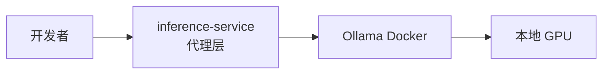

### 11.2 生产环境

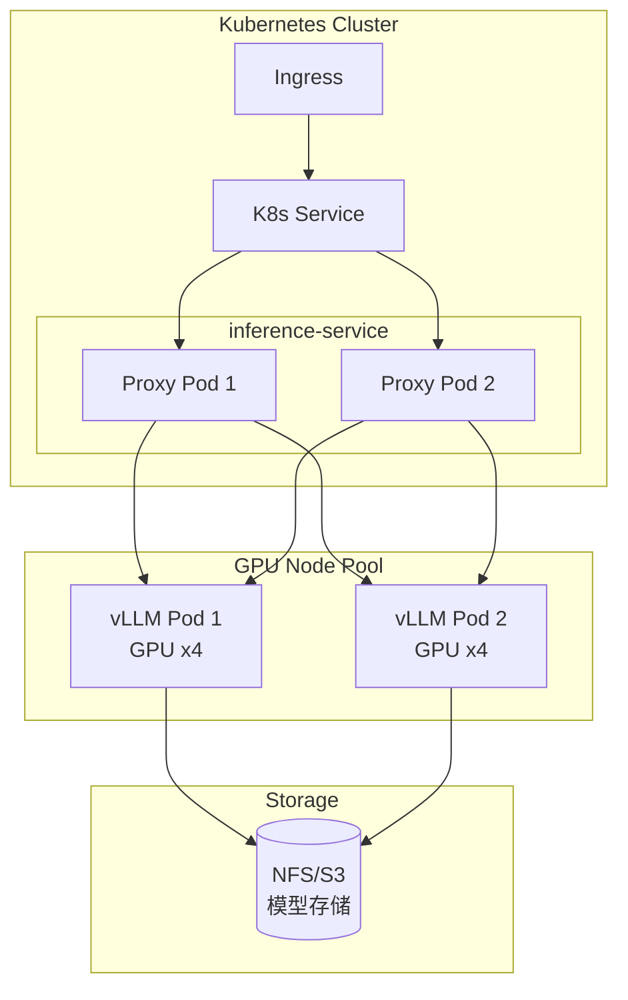

### 11.3 资源配置建议

#### 代理层 (inference-service)

| 环境 | 副本数 | CPU Request | Memory Request |
| ---- | ------ | ----------- | -------------- |
| 开发 | 1      | 0.5 核      | 512 MB         |
| 生产 | 2-3    | 1 核        | 1 GB           |

#### 推理层 (vLLM)

| 模型规模 | GPU 配置          | 显存需求     |
| -------- | ----------------- | ------------ |
| 7B       | 1x A100 40GB      | ~20GB (AWQ)  |
| 14B      | 1x A100 80GB      | ~40GB (AWQ)  |
| 72B      | 4x A100 80GB (TP) | ~160GB (AWQ) |

---

## 12. 开发里程碑

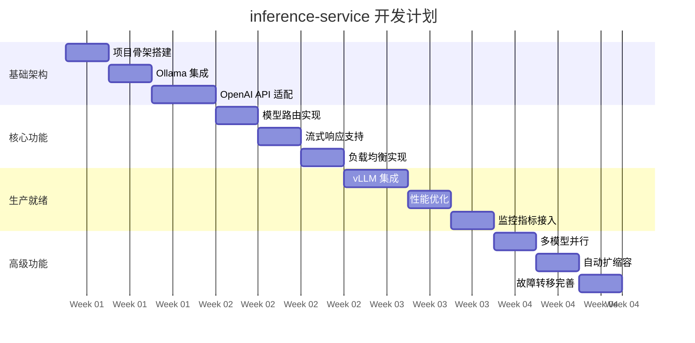

---

## 13. 技术选型摘要

| 类别           | 技术选型            | 版本   | 说明           |
| -------------- | ------------------- | ------ | -------------- |
| 代理框架       | Go / Python FastAPI | -      | 高性能代理层   |
| 开发推理引擎   | Ollama              | 0.13.x | 本地开发       |
| 生产推理引擎   | vLLM                | 0.13.x | 高性能生产推理 |
| 模型格式(开发) | GGUF                | -      | Ollama 专用    |
| 模型格式(生产) | AWQ / GPTQ / FP8    | -      | vLLM 量化      |
| 负载均衡       | 内置 / Envoy        | -      | 请求分发       |
| 指标暴露       | Prometheus          | -      | 可观测性       |

> **注意**: vLLM 0.13.x 版本相比之前版本有重大更新，包括 V1 引擎默认启用、PyTorch 2.8 支持等。V0 引擎已弃用。

---

## 14. 相关文档

- [后端开发计划总览](../backend-development-plan.md)
- [Ollama & vLLM 推理指南](../../技术选型/ollama-vllm-guide.md)
- [Docker & Kubernetes 基础设施](../../技术选型/docker-kubernetes-guide.md)

---

## 附录 A：模型推荐列表

### 对话模型

| 模型名称                 | 参数量 | 量化格式 | 显存需求 | 推荐场景   |
| ------------------------ | ------ | -------- | -------- | ---------- |
| qwen3-8b-instruct        | 8B     | Q4_K_M   | 6GB      | 开发测试   |
| qwen3-14b-instruct       | 14B    | AWQ      | 12GB     | 轻量生产   |
| qwen3-32b-instruct       | 32B    | AWQ      | 24GB     | 标准生产   |
| qwen3-235b-a22b-instruct | 235B   | FP8      | 160GB+   | 高质量生产 |
| deepseek-v3              | 671B   | FP8      | 320GB+   | 顶级生产   |

### 推理模型 (Reasoning)

| 模型名称         | 参数量 | 量化格式 | 显存需求 | 推荐场景    |
| ---------------- | ------ | -------- | -------- | ----------- |
| deepseek-r1-7b   | 7B     | Q4_K_M   | 6GB      | 开发/轻推理 |
| deepseek-r1-32b  | 32B    | AWQ      | 24GB     | 标准推理    |
| deepseek-r1-671b | 671B   | FP8      | 320GB+   | 顶级推理    |
| qwq-32b          | 32B    | AWQ      | 24GB     | 数学/代码   |
| gpt-oss-20b      | 20B    | AWQ      | 16GB     | 通用推理    |

### 视觉语言模型

| 模型名称        | 参数量 | 量化格式 | 显存需求 | 推荐场景  |
| --------------- | ------ | -------- | -------- | --------- |
| qwen3-vl-8b     | 8B     | Q4_K_M   | 8GB      | 开发/轻量 |
| qwen3-vl-32b    | 32B    | AWQ      | 28GB     | 生产      |
| gemma3-27b      | 27B    | Q4_K_M   | 20GB     | 高效视觉  |
| deepseek-ocr-3b | 3B     | Q8_0     | 4GB      | OCR 专用  |

### Embedding 模型

| 模型名称            | 维度 | 显存需求 | 推荐场景   |
| ------------------- | ---- | -------- | ---------- |
| bge-m3              | 1024 | 2GB      | 多语言     |
| bge-large-zh-v1.5   | 1024 | 2GB      | 中文专用   |
| qwen3-embedding-8b  | 4096 | 8GB      | 高质量嵌入 |
| nomic-embed-text-v2 | 768  | 1GB      | 轻量多语言 |

### 代码模型

| 模型名称              | 参数量 | 量化格式 | 显存需求 | 推荐场景 |
| --------------------- | ------ | -------- | -------- | -------- |
| qwen3-coder-30b       | 30B    | AWQ      | 24GB     | 代码生成 |
| deepseek-coder-v2-16b | 16B    | AWQ      | 12GB     | 轻量代码 |
| devstral-24b          | 24B    | AWQ      | 18GB     | 代码代理 |

---

## 附录 B：错误码定义

| 错误码 | HTTP Status | 说明             |
| ------ | ----------- | ---------------- |
| 40001  | 400         | 请求参数无效     |
| 40002  | 400         | 模型不存在       |
| 40101  | 401         | API Key 无效     |
| 40301  | 403         | 无权访问该模型   |
| 42901  | 429         | 请求频率超限     |
| 50001  | 500         | 推理引擎内部错误 |
| 50002  | 500         | 模型加载失败     |
| 50301  | 503         | 服务暂时不可用   |
| 50302  | 503         | 模型未就绪       |
| 50401  | 504         | 推理超时         |

---

## 附录 C：高级 API 特性

### Logprobs (日志概率)

支持返回 Token 的对数概率，用于：

- 分类任务评估
- 检索问答评估
- 自动补全置信度
- 困惑度计算

```json
// 请求
{
  "model": "qwen3-8b-instruct",
  "messages": [...],
  "logprobs": true,
  "top_logprobs": 3
}

// 响应
{
  "choices": [{
    "logprobs": {
      "content": [{
        "token": "Hello",
        "logprob": -0.836,
        "top_logprobs": [
          {"token": "Hello", "logprob": -0.836},
          {"token": "Hi", "logprob": -1.259},
          {"token": "Hey", "logprob": -1.268}
        ]
      }]
    }
  }]
}
```

### Structured Outputs (结构化输出)

支持通过 JSON Schema 约束输出格式：

```json
{
  "model": "qwen3-8b-instruct",
  "messages": [...],
  "response_format": {
    "type": "json_schema",
    "json_schema": {
      "name": "response",
      "strict": true,
      "schema": {
        "type": "object",
        "properties": {
          "answer": {"type": "string"},
          "confidence": {"type": "number"}
        },
        "required": ["answer", "confidence"]
      }
    }
  }
}
```

### Thinking Mode (思考模式)

支持推理模型的思考链输出：

```json
{
  "model": "deepseek-r1-32b",
  "messages": [...],
  "thinking": {
    "type": "enabled",
    "budget_tokens": 4096
  }
}
```
