# AI Core Service 详细设计文档

> 版本：v1.0 | 优先级：P0 | 技术栈：Spring Boot 3.x + Spring AI Alibaba 1.1.x

## 1. 服务概述

### 1.1 服务定位

**ai-core-service** 是 AI 产品后端架构中的**核心应用层服务**，作为整个 AI 系统的"大脑"，负责 Agent 框架实现、多智能体编排、Tool Calling 管理以及与其他服务的协调调度。它是连接用户交互层与底层能力层的核心枢纽。

### 1.2 核心职责

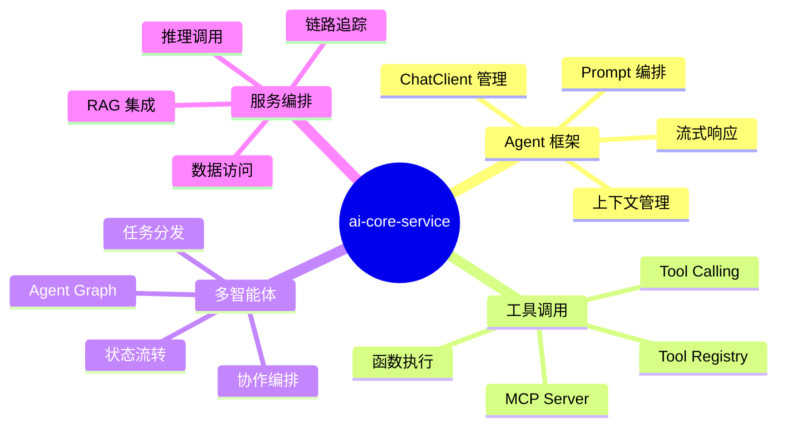
```mermaid
mindmap
  root((ai-core-service))
    Agent 框架
      ChatClient 管理
      Prompt 编排
      上下文管理
      流式响应
    工具调用
      Tool Registry
      Tool Calling
      MCP Server
      函数执行
    多智能体
      Agent Graph
      任务分发
      协作编排
      状态流转
    服务编排
      RAG 集成
      推理调用
      数据访问
      链路追踪
```

### 1.3 服务边界

| 属于本服务职责             | 不属于本服务职责        |
| -------------------------- | ----------------------- |
| Agent 逻辑与对话编排       | 模型推理 (inference)    |
| Prompt 模板组装与变量填充  | 向量检索实现 (rag)      |
| Tool Calling 注册与调度    | 文档解析切片 (etl)      |
| 多智能体协作与状态管理     | 结构化数据存储 (data)   |
| MCP Server 实现            | 低代码工作流 (dify)     |
| 与 Dify 的 MCP 协议通信    | 链路追踪存储 (langfuse) |
| 请求上下文与会话状态管理   | 用户认证授权 (data)     |
| Advisor 链 (RAG/Memory 等) | GPU 资源管理 (vLLM)     |

---

## 2. 系统架构

### 2.1 整体架构图

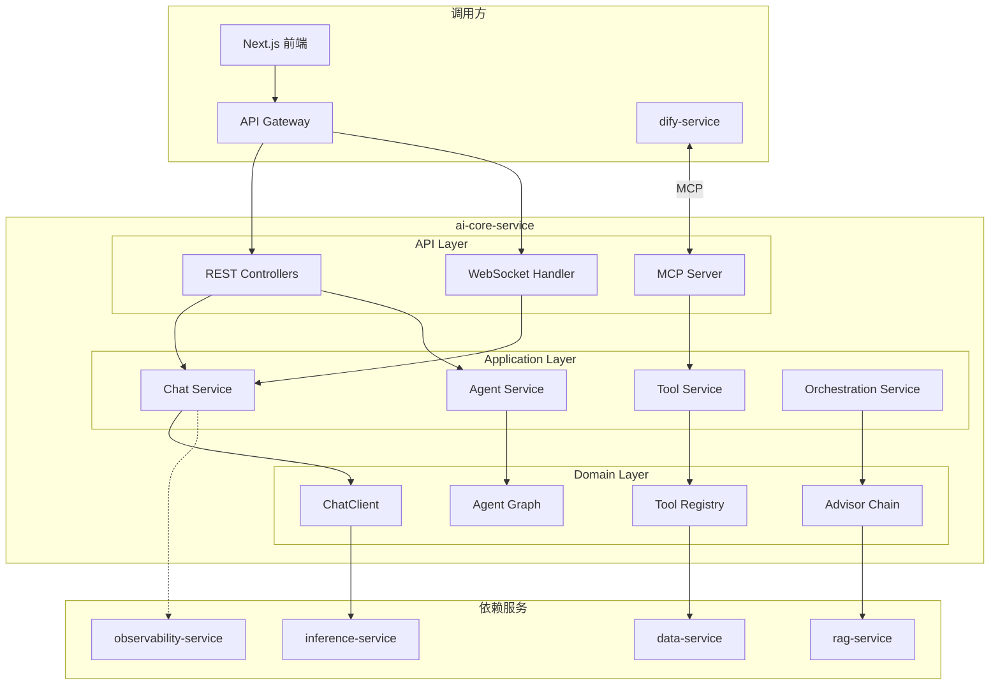
```mermaid
graph TD
    subgraph 调用方
        UI[Next.js 前端]
        Gateway[API Gateway]
        Dify[dify-service]
    end

    subgraph ai-core-service
        subgraph API Layer
            REST[REST Controllers]
            MCP[MCP Server]
            WS[WebSocket Handler]
        end

        subgraph Application Layer
            ChatService[Chat Service]
            AgentService[Agent Service]
            ToolService[Tool Service]
            OrchestrationService[Orchestration Service]
        end

        subgraph Domain Layer
            ChatClient[ChatClient]
            ToolRegistry[Tool Registry]
            AgentGraph[Agent Graph]
            AdvisorChain[Advisor Chain]
        end
    end

    subgraph 依赖服务
        Inference[inference-service]
        RAG[rag-service]
        Data[data-service]
        Obs[observability-service]
    end

    UI --> Gateway
    Gateway --> REST
    Gateway --> WS
    Dify <-->|MCP| MCP

    REST --> ChatService
    REST --> AgentService
    WS --> ChatService
    MCP --> ToolService

    ChatService --> ChatClient
    AgentService --> AgentGraph
    ToolService --> ToolRegistry
    OrchestrationService --> AdvisorChain

    ChatClient --> Inference
    AdvisorChain --> RAG
    ToolRegistry --> Data
    ChatService -.-> Obs
```

### 2.2 分层架构设计

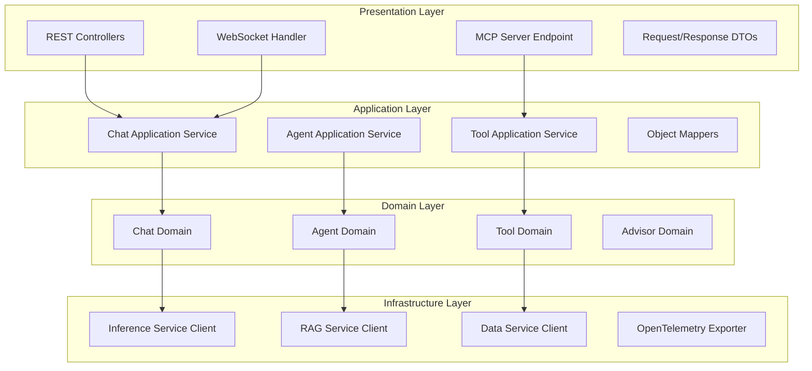
```mermaid
graph TB
    subgraph Presentation Layer
        REST[REST Controllers]
        MCP[MCP Server Endpoint]
        WebSocket[WebSocket Handler]
        DTO[Request/Response DTOs]
    end

    subgraph Application Layer
        ChatApp[Chat Application Service]
        AgentApp[Agent Application Service]
        ToolApp[Tool Application Service]
        Mapper[Object Mappers]
    end

    subgraph Domain Layer
        ChatDomain[Chat Domain]
        AgentDomain[Agent Domain]
        ToolDomain[Tool Domain]
        AdvisorDomain[Advisor Domain]
    end

    subgraph Infrastructure Layer
        InferenceClient[Inference Service Client]
        RagClient[RAG Service Client]
        DataClient[Data Service Client]
        TraceExporter[OpenTelemetry Exporter]
    end

    REST --> ChatApp
    MCP --> ToolApp
    WebSocket --> ChatApp
    ChatApp --> ChatDomain
    AgentApp --> AgentDomain
    ToolApp --> ToolDomain
    ChatDomain --> InferenceClient
    AgentDomain --> RagClient
    ToolDomain --> DataClient
```

### 2.3 核心组件关系

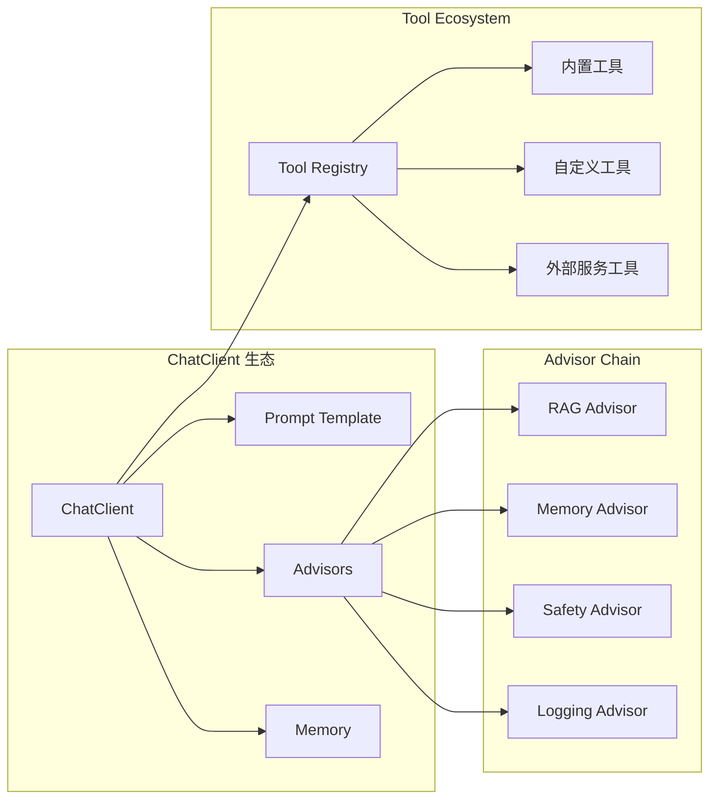
```mermaid
graph LR
    subgraph ChatClient 生态
        ChatClient[ChatClient]
        Prompt[Prompt Template]
        Advisor[Advisors]
        Memory[Memory]
    end

    subgraph Advisor Chain
        RAGAdvisor[RAG Advisor]
        MemoryAdvisor[Memory Advisor]
        SafetyAdvisor[Safety Advisor]
        LoggingAdvisor[Logging Advisor]
    end

    subgraph Tool Ecosystem
        ToolRegistry[Tool Registry]
        BuiltinTools[内置工具]
        CustomTools[自定义工具]
        ExternalTools[外部服务工具]
    end

    ChatClient --> Prompt
    ChatClient --> Advisor
    ChatClient --> Memory

    Advisor --> RAGAdvisor
    Advisor --> MemoryAdvisor
    Advisor --> SafetyAdvisor
    Advisor --> LoggingAdvisor

    ChatClient --> ToolRegistry
    ToolRegistry --> BuiltinTools
    ToolRegistry --> CustomTools
    ToolRegistry --> ExternalTools
```

---

## 3. 核心模块设计

### 3.1 Chat 模块

#### 3.1.1 ChatClient 架构

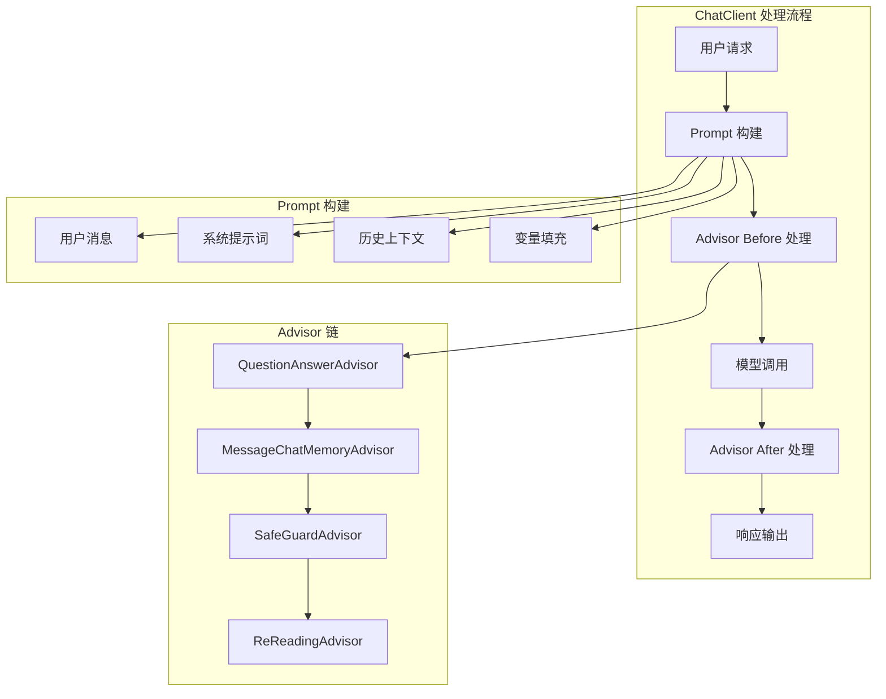
```mermaid
flowchart TD
    subgraph ChatClient 处理流程
        Request[用户请求] --> PromptBuild[Prompt 构建]
        PromptBuild --> AdvisorBefore[Advisor Before 处理]
        AdvisorBefore --> ModelCall[模型调用]
        ModelCall --> AdvisorAfter[Advisor After 处理]
        AdvisorAfter --> Response[响应输出]
    end

    subgraph Prompt 构建
        UserMsg[用户消息]
        SystemMsg[系统提示词]
        History[历史上下文]
        Variables[变量填充]
    end

    subgraph Advisor 链
        A1[QuestionAnswerAdvisor]
        A2[MessageChatMemoryAdvisor]
        A3[SafeGuardAdvisor]
        A4[ReReadingAdvisor]
    end

    PromptBuild --> UserMsg
    PromptBuild --> SystemMsg
    PromptBuild --> History
    PromptBuild --> Variables

    AdvisorBefore --> A1
    A1 --> A2
    A2 --> A3
    A3 --> A4
```

#### 3.1.2 对话模式支持

| 模式     | 说明              | 技术实现              |
| -------- | ----------------- | --------------------- |
| 单轮对话 | 无上下文单次交互  | 简单 ChatClient 调用  |
| 多轮对话 | 带历史上下文      | MessageChatMemory     |
| 流式对话 | 逐 Token 实时返回 | Flux<String> 响应     |
| RAG 对话 | 结合知识库检索    | QuestionAnswerAdvisor |
| Agent    | 支持工具调用      | Tool Calling 启用     |

#### 3.1.3 上下文管理策略

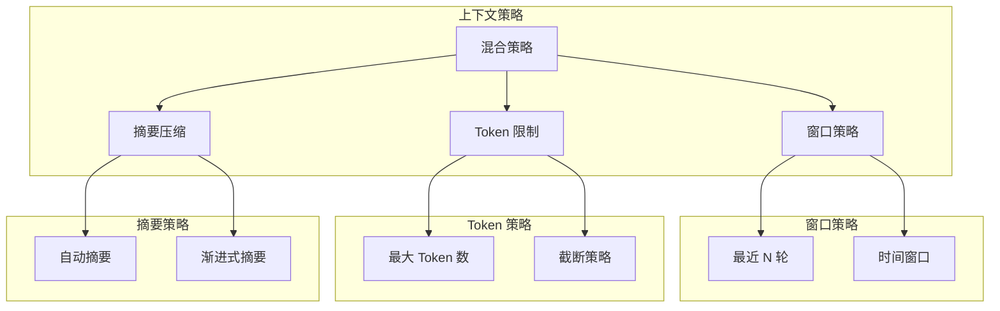
```mermaid
graph TD
    subgraph 上下文策略
        Window[窗口策略]
        Token[Token 限制]
        Summary[摘要压缩]
        Hybrid[混合策略]
    end

    subgraph 窗口策略
        LastN[最近 N 轮]
        TimeWindow[时间窗口]
    end

    subgraph Token 策略
        MaxToken[最大 Token 数]
        Truncate[截断策略]
    end

    subgraph 摘要策略
        AutoSummary[自动摘要]
        ProgressiveSummary[渐进式摘要]
    end

    Window --> LastN
    Window --> TimeWindow
    Token --> MaxToken
    Token --> Truncate
    Summary --> AutoSummary
    Summary --> ProgressiveSummary
    Hybrid --> Window
    Hybrid --> Token
    Hybrid --> Summary
```

### 3.2 Agent 模块

#### 3.2.1 Agent 类型分类

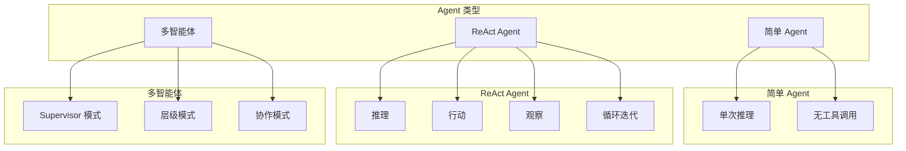
```mermaid
graph TD
    subgraph Agent 类型
        Simple[简单 Agent]
        ReAct[ReAct Agent]
        Multi[多智能体]
    end

    subgraph 简单 Agent
        OneShot[单次推理]
        NoTool[无工具调用]
    end

    subgraph ReAct Agent
        Reason[推理]
        Act[行动]
        Observe[观察]
        Loop[循环迭代]
    end

    subgraph 多智能体
        Supervisor[Supervisor 模式]
        Hierarchical[层级模式]
        Collaborative[协作模式]
    end

    Simple --> OneShot
    Simple --> NoTool
    ReAct --> Reason
    ReAct --> Act
    ReAct --> Observe
    ReAct --> Loop
    Multi --> Supervisor
    Multi --> Hierarchical
    Multi --> Collaborative
```

#### 3.2.2 ReAct 执行流程

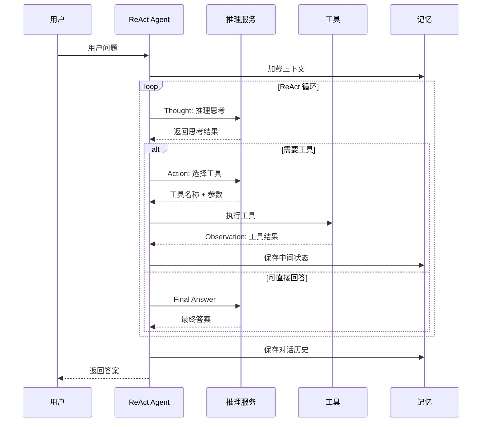
```mermaid
sequenceDiagram
    participant User as 用户
    participant Agent as ReAct Agent
    participant LLM as 推理服务
    participant Tool as 工具
    participant Memory as 记忆

    User->>Agent: 用户问题
    Agent->>Memory: 加载上下文

    loop ReAct 循环
        Agent->>LLM: Thought: 推理思考
        LLM-->>Agent: 返回思考结果

        alt 需要工具
            Agent->>LLM: Action: 选择工具
            LLM-->>Agent: 工具名称 + 参数
            Agent->>Tool: 执行工具
            Tool-->>Agent: Observation: 工具结果
            Agent->>Memory: 保存中间状态
        else 可直接回答
            Agent->>LLM: Final Answer
            LLM-->>Agent: 最终答案
        end
    end

    Agent->>Memory: 保存对话历史
    Agent-->>User: 返回答案
```

#### 3.2.3 多智能体架构 (Supervisor 模式)

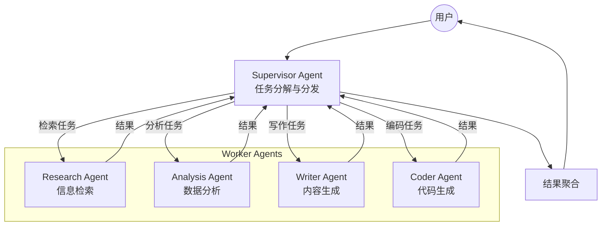
```mermaid
graph TD
    User((用户)) --> Supervisor[Supervisor Agent<br/>任务分解与分发]

    subgraph Worker Agents
        Research[Research Agent<br/>信息检索]
        Analysis[Analysis Agent<br/>数据分析]
        Writer[Writer Agent<br/>内容生成]
        Coder[Coder Agent<br/>代码生成]
    end

    Supervisor -->|检索任务| Research
    Supervisor -->|分析任务| Analysis
    Supervisor -->|写作任务| Writer
    Supervisor -->|编码任务| Coder

    Research -->|结果| Supervisor
    Analysis -->|结果| Supervisor
    Writer -->|结果| Supervisor
    Coder -->|结果| Supervisor

    Supervisor --> Aggregator[结果聚合]
    Aggregator --> User
```

#### 3.2.4 Agent 状态机

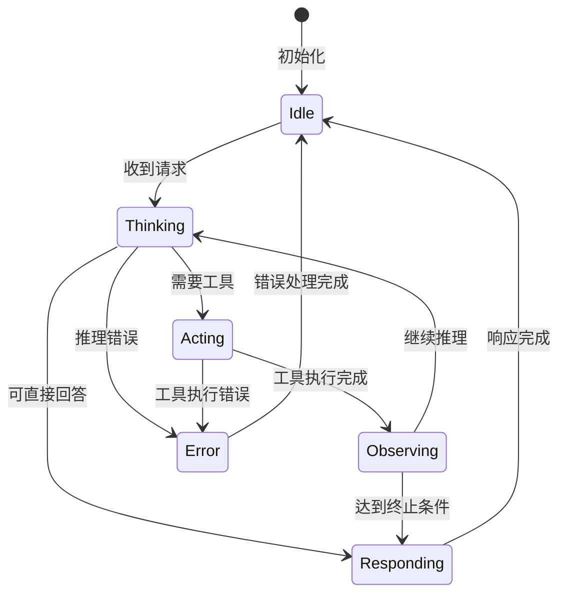
```mermaid
stateDiagram-v2
    [*] --> Idle: 初始化
    Idle --> Thinking: 收到请求
    Thinking --> Acting: 需要工具
    Thinking --> Responding: 可直接回答
    Acting --> Observing: 工具执行完成
    Observing --> Thinking: 继续推理
    Observing --> Responding: 达到终止条件
    Responding --> Idle: 响应完成
    Thinking --> Error: 推理错误
    Acting --> Error: 工具执行错误
    Error --> Idle: 错误处理完成
```

### 3.3 Tool 模块

#### 3.3.1 Tool Registry 架构

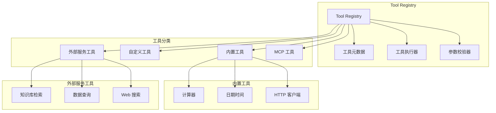
```mermaid
graph TD
    subgraph Tool Registry
        Registry[Tool Registry]
        Metadata[工具元数据]
        Executor[工具执行器]
        Validator[参数校验器]
    end

    subgraph 工具分类
        Builtin[内置工具]
        Custom[自定义工具]
        External[外部服务工具]
        MCP[MCP 工具]
    end

    subgraph 内置工具
        Calculator[计算器]
        DateTime[日期时间]
        HttpClient[HTTP 客户端]
    end

    subgraph 外部服务工具
        RAGTool[知识库检索]
        DataTool[数据查询]
        SearchTool[Web 搜索]
    end

    Registry --> Metadata
    Registry --> Executor
    Registry --> Validator

    Registry --> Builtin
    Registry --> Custom
    Registry --> External
    Registry --> MCP

    Builtin --> Calculator
    Builtin --> DateTime
    Builtin --> HttpClient

    External --> RAGTool
    External --> DataTool
    External --> SearchTool
```

#### 3.3.2 工具定义规范

| 属性          | 类型   | 必填 | 说明                       |
| ------------- | ------ | ---- | -------------------------- |
| `name`        | string | ✅   | 工具唯一标识符             |
| `description` | string | ✅   | 工具功能描述 (供 LLM 理解) |
| `parameters`  | object | ✅   | JSON Schema 格式参数定义   |
| `returnType`  | string | ✅   | 返回值类型描述             |
| `category`    | enum   | ❌   | 工具分类                   |
| `timeout`     | int    | ❌   | 执行超时时间 (ms)          |
| `retryPolicy` | object | ❌   | 重试策略配置               |

#### 3.3.3 Tool Calling 流程

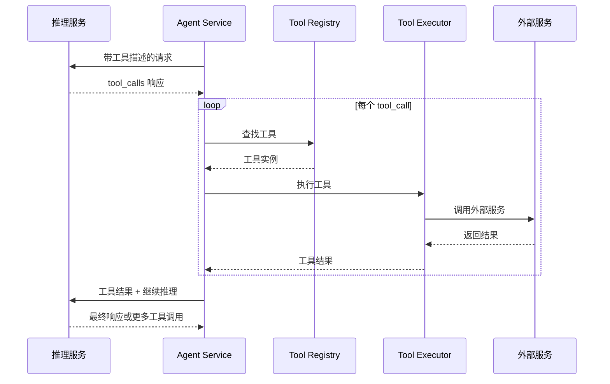
```mermaid
sequenceDiagram
    participant LLM as 推理服务
    participant Agent as Agent Service
    participant Registry as Tool Registry
    participant Executor as Tool Executor
    participant External as 外部服务

    Agent->>LLM: 带工具描述的请求
    LLM-->>Agent: tool_calls 响应

    loop 每个 tool_call
        Agent->>Registry: 查找工具
        Registry-->>Agent: 工具实例
        Agent->>Executor: 执行工具
        Executor->>External: 调用外部服务
        External-->>Executor: 返回结果
        Executor-->>Agent: 工具结果
    end

    Agent->>LLM: 工具结果 + 继续推理
    LLM-->>Agent: 最终响应或更多工具调用
```

### 3.4 MCP Server 模块

#### 3.4.1 MCP 协议架构

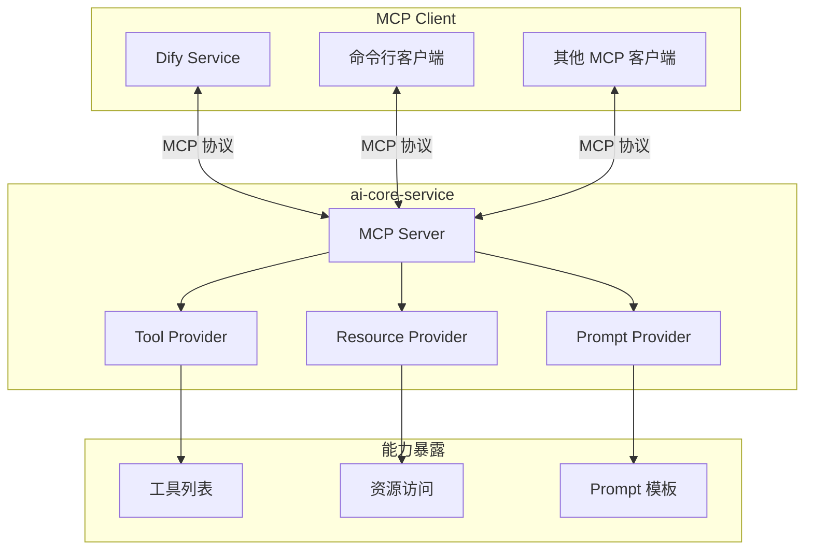
```mermaid
graph TD
    subgraph MCP Client
        Dify[Dify Service]
        CLI[命令行客户端]
        Other[其他 MCP 客户端]
    end

    subgraph ai-core-service
        MCPServer[MCP Server]
        ToolProvider[Tool Provider]
        ResourceProvider[Resource Provider]
        PromptProvider[Prompt Provider]
    end

    subgraph 能力暴露
        Tools[工具列表]
        Resources[资源访问]
        Prompts[Prompt 模板]
    end

    Dify <-->|MCP 协议| MCPServer
    CLI <-->|MCP 协议| MCPServer
    Other <-->|MCP 协议| MCPServer

    MCPServer --> ToolProvider
    MCPServer --> ResourceProvider
    MCPServer --> PromptProvider

    ToolProvider --> Tools
    ResourceProvider --> Resources
    PromptProvider --> Prompts
```

#### 3.4.2 MCP 消息流程

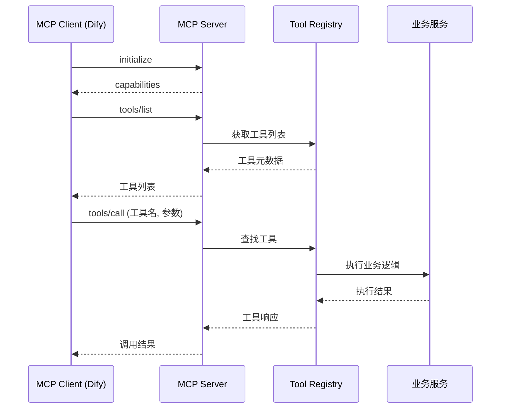
```mermaid
sequenceDiagram
    participant Client as MCP Client (Dify)
    participant Server as MCP Server
    participant Tool as Tool Registry
    participant Service as 业务服务

    Client->>Server: initialize
    Server-->>Client: capabilities

    Client->>Server: tools/list
    Server->>Tool: 获取工具列表
    Tool-->>Server: 工具元数据
    Server-->>Client: 工具列表

    Client->>Server: tools/call (工具名, 参数)
    Server->>Tool: 查找工具
    Tool->>Service: 执行业务逻辑
    Service-->>Tool: 执行结果
    Tool-->>Server: 工具响应
    Server-->>Client: 调用结果
```

#### 3.4.3 MCP 暴露的能力

| 能力类型  | 说明                   | 示例                         |
| --------- | ---------------------- | ---------------------------- |
| Tools     | 可调用的工具           | search_knowledge, query_data |
| Resources | 可访问的资源           | 知识库列表、文档列表         |
| Prompts   | 可用的 Prompt 模板     | 问答模板、摘要模板、翻译模板 |
| Sampling  | 模型采样能力 (可选)    | 直接调用 ai-core 的模型能力  |
| Roots     | 文件系统访问根 (可选） | 工作目录、配置目录           |

---

## 4. Advisor 链设计

### 4.1 Advisor 类型

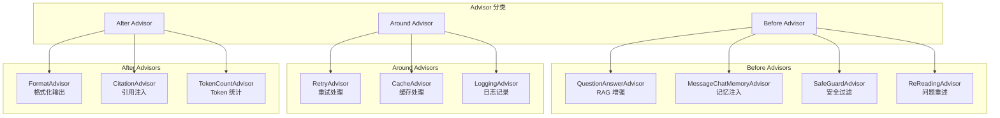
```mermaid
graph TD
    subgraph Advisor 分类
        Before[Before Advisor]
        Around[Around Advisor]
        After[After Advisor]
    end

    subgraph Before Advisors
        RAGAdvisor[QuestionAnswerAdvisor<br/>RAG 增强]
        MemoryAdvisor[MessageChatMemoryAdvisor<br/>记忆注入]
        SafetyAdvisor[SafeGuardAdvisor<br/>安全过滤]
        RereadAdvisor[ReReadingAdvisor<br/>问题重述]
    end

    subgraph Around Advisors
        RetryAdvisor[RetryAdvisor<br/>重试处理]
        CacheAdvisor[CacheAdvisor<br/>缓存处理]
        LogAdvisor[LoggingAdvisor<br/>日志记录]
    end

    subgraph After Advisors
        FormatAdvisor[FormatAdvisor<br/>格式化输出]
        CitationAdvisor[CitationAdvisor<br/>引用注入]
        TokenAdvisor[TokenCountAdvisor<br/>Token 统计]
    end

    Before --> RAGAdvisor
    Before --> MemoryAdvisor
    Before --> SafetyAdvisor
    Before --> RereadAdvisor

    Around --> RetryAdvisor
    Around --> CacheAdvisor
    Around --> LogAdvisor

    After --> FormatAdvisor
    After --> CitationAdvisor
    After --> TokenAdvisor
```

### 4.2 Advisor 执行顺序

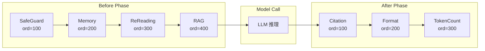
```mermaid
flowchart LR
    subgraph Before Phase
        B1[SafeGuard<br/>ord=100] --> B2[Memory<br/>ord=200]
        B2 --> B3[ReReading<br/>ord=300]
        B3 --> B4[RAG<br/>ord=400]
    end

    subgraph Model Call
        LLM[LLM 推理]
    end

    subgraph After Phase
        A1[Citation<br/>ord=100] --> A2[Format<br/>ord=200]
        A2 --> A3[TokenCount<br/>ord=300]
    end

    B4 --> LLM
    LLM --> A1
```

### 4.3 核心 Advisor 设计

#### 4.3.1 QuestionAnswerAdvisor (RAG)

| 配置项                | 类型   | 默认值 | 说明            |
| --------------------- | ------ | ------ | --------------- |
| `vectorStore`         | object | -      | 向量存储实例    |
| `topK`                | int    | 5      | 检索文档数量    |
| `similarityThreshold` | float  | 0.7    | 相似度阈值      |
| `promptTemplate`      | string | -      | RAG Prompt 模板 |
| `documentJoiner`      | string | "\n\n" | 文档连接符      |

#### 4.3.2 MessageChatMemoryAdvisor

| 配置项           | 类型   | 默认值 | 说明           |
| ---------------- | ------ | ------ | -------------- |
| `chatMemory`     | object | -      | 记忆存储实例   |
| `conversationId` | string | -      | 会话 ID        |
| `maxMessages`    | int    | 10     | 最大历史消息数 |
| `systemPrompt`   | string | -      | 系统提示词     |

#### 4.3.3 SafeGuardAdvisor

| 配置项           | 类型 | 默认值 | 说明         |
| ---------------- | ---- | ------ | ------------ |
| `enableInput`    | bool | true   | 输入内容过滤 |
| `enableOutput`   | bool | true   | 输出内容过滤 |
| `sensitiveWords` | list | []     | 敏感词列表   |
| `blockedTopics`  | list | []     | 禁止话题列表 |

---

## 5. 服务通信设计

### 5.1 通信方式总览

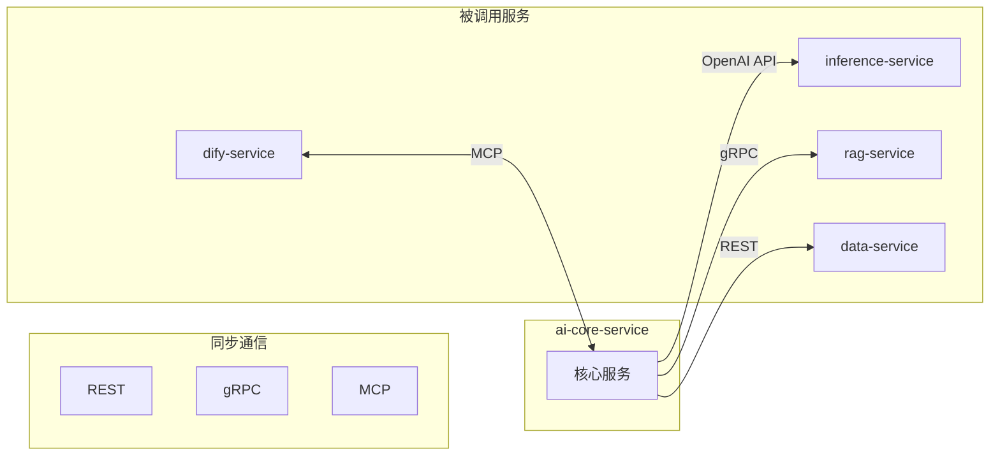
```mermaid
graph LR
    subgraph ai-core-service
        Core[核心服务]
    end

    subgraph 同步通信
        REST1[REST]
        gRPC1[gRPC]
        MCP1[MCP]
    end

    subgraph 被调用服务
        Inference[inference-service]
        RAG[rag-service]
        Data[data-service]
        Dify[dify-service]
    end

    Core -->|OpenAI API| Inference
    Core -->|gRPC| RAG
    Core -->|REST| Data
    Dify <-->|MCP| Core
```

### 5.2 服务调用详情

| 被调用服务        | 协议               | 场景                             | 超时时间 | 重试策略 |
| ----------------- | ------------------ | -------------------------------- | -------- | -------- |
| inference-service | REST (OpenAI 兼容) | 模型推理、Embedding 生成         | 120s     | 2 次重试 |
| rag-service       | gRPC               | 向量检索、多路召回               | 10s      | 1 次重试 |
| data-service      | REST               | 用户数据、会话历史、知识库元数据 | 5s       | 2 次重试 |
| dify-service      | MCP (被调用)       | 响应 Dify 的工具调用请求         | 30s      | 无重试   |

### 5.3 gRPC 客户端配置

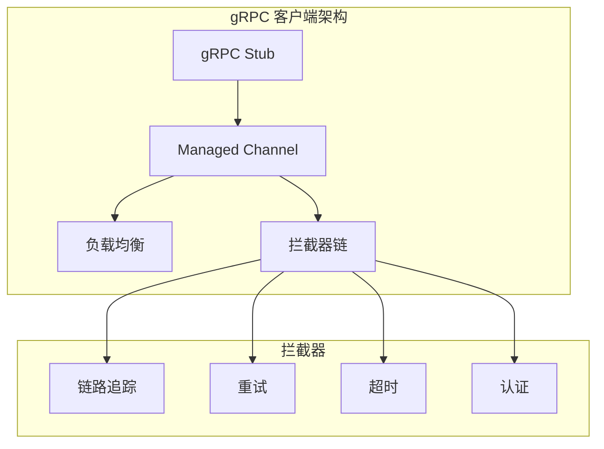
```mermaid
graph TD
    subgraph gRPC 客户端架构
        Stub[gRPC Stub]
        Channel[Managed Channel]
        LB[负载均衡]
        Interceptor[拦截器链]
    end

    subgraph 拦截器
        Trace[链路追踪]
        Retry[重试]
        Timeout[超时]
        Auth[认证]
    end

    Stub --> Channel
    Channel --> LB
    Channel --> Interceptor
    Interceptor --> Trace
    Interceptor --> Retry
    Interceptor --> Timeout
    Interceptor --> Auth
```

### 5.4 服务发现集成

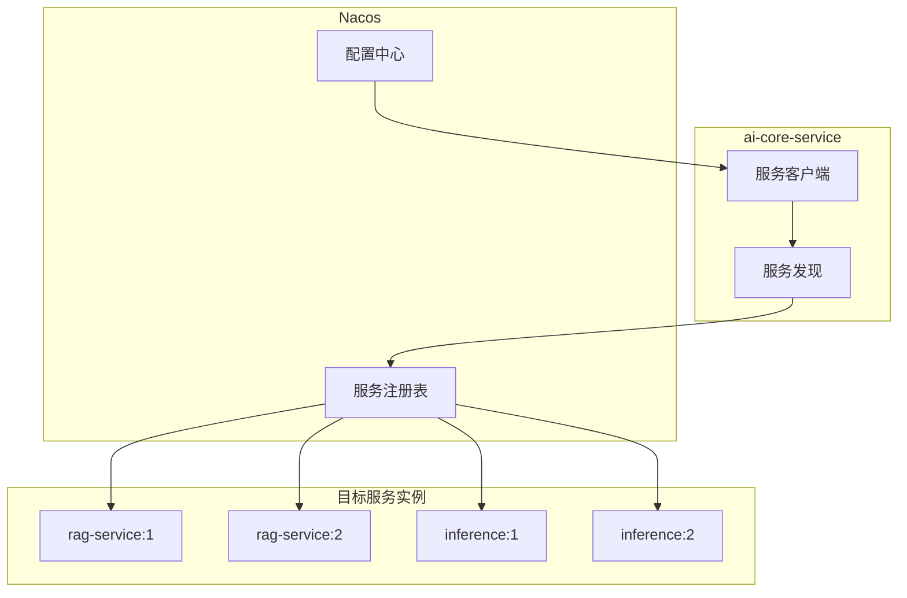
```mermaid
graph TD
    subgraph ai-core-service
        Client[服务客户端]
        Discovery[服务发现]
    end

    subgraph Nacos
        Registry[服务注册表]
        Config[配置中心]
    end

    subgraph 目标服务实例
        RAG1[rag-service:1]
        RAG2[rag-service:2]
        Inference1[inference:1]
        Inference2[inference:2]
    end

    Client --> Discovery
    Discovery --> Registry
    Registry --> RAG1
    Registry --> RAG2
    Registry --> Inference1
    Registry --> Inference2
    Config --> Client
```

---

## 6. 可观测性设计

### 6.1 链路追踪架构

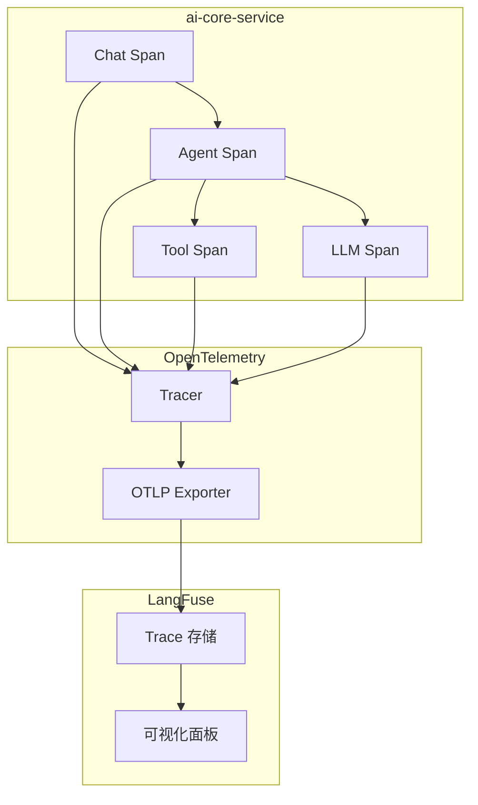
```mermaid
graph TD
    subgraph ai-core-service
        Span1[Chat Span]
        Span2[Agent Span]
        Span3[Tool Span]
        Span4[LLM Span]
    end

    subgraph OpenTelemetry
        Tracer[Tracer]
        Exporter[OTLP Exporter]
    end

    subgraph LangFuse
        Trace[Trace 存储]
        Dashboard[可视化面板]
    end

    Span1 --> Span2
    Span2 --> Span3
    Span2 --> Span4

    Span1 --> Tracer
    Span2 --> Tracer
    Span3 --> Tracer
    Span4 --> Tracer

    Tracer --> Exporter
    Exporter --> Trace
    Trace --> Dashboard
```

### 6.2 关键指标定义

| 指标名称                | 类型      | 说明               |
| ----------------------- | --------- | ------------------ |
| `chat.request.count`    | Counter   | 对话请求总数       |
| `chat.request.duration` | Histogram | 对话请求延迟分布   |
| `agent.tool.calls`      | Counter   | 工具调用次数       |
| `agent.iteration.count` | Histogram | Agent 迭代次数分布 |
| `llm.tokens.input`      | Counter   | 输入 Token 总数    |
| `llm.tokens.output`     | Counter   | 输出 Token 总数    |
| `rag.retrieval.count`   | Counter   | RAG 检索次数       |
| `rag.retrieval.latency` | Histogram | RAG 检索延迟       |
| `mcp.request.count`     | Counter   | MCP 请求总数       |

### 6.3 日志规范

| 日志级别 | 使用场景                                  |
| -------- | ----------------------------------------- |
| ERROR    | 异常、服务调用失败、业务错误              |
| WARN     | 可恢复错误、性能警告、配置异常            |
| INFO     | 请求入口/出口、关键业务节点、状态变更     |
| DEBUG    | 详细处理过程、中间变量、调试信息          |
| TRACE    | 完整请求/响应内容、Prompt 全文 (敏感控制) |

---

## 7. 安全设计

### 7.1 安全架构

```mermaid
graph TD
    subgraph 输入安全
        InputValidation[输入校验]
        RateLimiting[限流控制]
        ContentFilter[内容过滤]
    end

    subgraph 处理安全
        PromptInjection[Prompt 注入防护]
        ToolSandbox[工具沙箱]
        TokenLimit[Token 限制]
    end

    subgraph 输出安全
        OutputFilter[输出过滤]
        PIIMasking[PII 脱敏]
        ResponseValidation[响应校验]
    end

    InputValidation --> PromptInjection
    RateLimiting --> PromptInjection
    ContentFilter --> PromptInjection

    PromptInjection --> OutputFilter
    ToolSandbox --> OutputFilter
    TokenLimit --> OutputFilter

    OutputFilter --> PIIMasking
    PIIMasking --> ResponseValidation
```

### 7.2 Prompt 注入防护策略

| 策略           | 说明                         |
| -------------- | ---------------------------- |
| 系统提示词隔离 | 用户输入与系统指令严格分离   |
| 输入清洗       | 过滤特殊字符、控制指令       |
| 角色边界强化   | 在 Prompt 中明确 AI 职责边界 |
| 输出验证       | 检测输出是否包含未授权信息   |
| 敏感词拦截     | 阻断包含敏感词的请求/响应    |

### 7.3 工具调用安全

| 安全措施   | 说明                            |
| ---------- | ------------------------------- |
| 白名单机制 | 仅允许注册的工具被调用          |
| 参数校验   | 严格验证工具输入参数            |
| 权限控制   | 基于用户/租户限制可用工具       |
| 执行超时   | 工具执行时间限制                |
| 资源隔离   | 工具执行的资源隔离 (如文件访问) |
| 审计日志   | 记录所有工具调用详情            |

---

## 8. 性能设计

### 8.1 性能优化策略

```mermaid
graph TD
    subgraph 请求层优化
        Async[异步非阻塞]
        Streaming[流式响应]
        Compress[响应压缩]
    end

    subgraph 缓存策略
        PromptCache[Prompt 模板缓存]
        ToolCache[工具定义缓存]
        EmbeddingCache[Embedding 缓存]
    end

    subgraph 资源优化
        ConnectionPool[连接池复用]
        ThreadPool[线程池调优]
        CircuitBreaker[熔断降级]
    end

    Async --> PromptCache
    Streaming --> ToolCache
    Compress --> EmbeddingCache

    PromptCache --> ConnectionPool
    ToolCache --> ThreadPool
    EmbeddingCache --> CircuitBreaker
```

### 8.2 并发模型

| 场景          | 并发策略                   |
| ------------- | -------------------------- |
| HTTP 请求处理 | WebFlux 反应式、异步非阻塞 |
| LLM 推理调用  | 异步 + 流式、超时控制      |
| 工具并行执行  | 多工具并行调用 (独立工具)  |
| RAG 检索      | gRPC 异步调用              |
| 数据访问      | 连接池 + 异步 Repository   |

### 8.3 关键性能指标

| 指标     | 目标值    | 说明            |
| -------- | --------- | --------------- |
| P50 延迟 | < 2s      | 常规对话请求    |
| P99 延迟 | < 10s     | 复杂 Agent 任务 |
| 吞吐量   | > 100 QPS | 单实例          |
| 内存占用 | < 2GB     | 基础服务运行    |
| 启动时间 | < 30s     | 冷启动          |

---

## 9. 配置管理

### 9.1 配置分层

```mermaid
graph TD
    subgraph 配置层级
        Env[环境变量]
        Nacos[Nacos 配置中心]
        YAML[本地 YAML]
        Code[代码默认值]
    end

    Env -->|最高优先级| Nacos
    Nacos --> YAML
    YAML --> Code
```

### 9.2 核心配置项

| 配置分类 | 配置项                  | 说明          |
| -------- | ----------------------- | ------------- |
| 推理服务 | inference.base-url      | 推理服务地址  |
| 推理服务 | inference.default-model | 默认模型      |
| 推理服务 | inference.timeout       | 推理超时时间  |
| RAG 服务 | rag.grpc-address        | gRPC 服务地址 |
| RAG 服务 | rag.default-top-k       | 默认检索数量  |
| Agent    | agent.max-iterations    | 最大迭代次数  |
| Agent    | agent.tool-timeout      | 工具执行超时  |
| MCP      | mcp.server.port         | MCP 服务端口  |
| 可观测   | otel.exporter.endpoint  | OTLP 导出端点 |
| 安全     | security.rate-limit     | 限流阈值      |

### 9.3 动态配置

| 支持热更新的配置 | 需要重启的配置 |
| ---------------- | -------------- |
| 限流阈值         | 服务端口       |
| 敏感词列表       | gRPC 配置      |
| Prompt 模板      | 线程池核心配置 |
| 模型路由策略     | 数据库连接池   |
| 日志级别         | 缓存类型       |

---

## 10. 部署架构

### 10.1 开发环境

```mermaid
graph TD
    subgraph 本地开发
        IDE[IDE]
        LocalService[ai-core-service<br/>localhost:8080]
        MockInference[Mock Inference<br/>或 Ollama]
    end

    subgraph Docker Compose
        Infra[基础设施容器]
    end

    IDE --> LocalService
    LocalService --> MockInference
    LocalService --> Infra
```

### 10.2 生产环境

```mermaid
graph TD
    subgraph K8s Cluster
        subgraph ai-core Deployment
            Pod1[Pod 1]
            Pod2[Pod 2]
            PodN[Pod N]
        end

        Service[K8s Service]
        HPA[Horizontal Pod Autoscaler]
        ConfigMap[ConfigMap]
        Secret[Secret]
    end

    subgraph External
        Ingress[Ingress / Gateway]
        Nacos[Nacos]
    end

    Ingress --> Service
    Service --> Pod1
    Service --> Pod2
    Service --> PodN
    HPA --> Pod1
    HPA --> Pod2
    HPA --> PodN
    ConfigMap --> Pod1
    Secret --> Pod1
    Nacos --> Pod1
```

### 10.3 资源配置建议

| 环境 | CPU  | 内存 | 副本数 | HPA 策略            |
| ---- | ---- | ---- | ------ | ------------------- |
| 开发 | 2 核 | 2 GB | 1      | 无                  |
| 测试 | 4 核 | 4 GB | 2      | CPU > 70%           |
| 生产 | 8 核 | 8 GB | 3-10   | CPU > 60%, QPS > 50 |

---

## 11. 错误处理

### 11.1 错误分类

```mermaid
graph TD
    subgraph 错误类型
        Client[客户端错误 4xx]
        Server[服务端错误 5xx]
        Downstream[下游服务错误]
    end

    subgraph 客户端错误
        BadRequest[400 参数错误]
        Unauthorized[401 未认证]
        Forbidden[403 无权限]
        NotFound[404 资源不存在]
        RateLimit[429 限流]
    end

    subgraph 服务端错误
        Internal[500 内部错误]
        Timeout[504 超时]
    end

    subgraph 下游错误
        InferenceError[推理服务错误]
        RAGError[RAG 服务错误]
        DataError[数据服务错误]
    end

    Client --> BadRequest
    Client --> Unauthorized
    Client --> Forbidden
    Client --> NotFound
    Client --> RateLimit

    Server --> Internal
    Server --> Timeout

    Downstream --> InferenceError
    Downstream --> RAGError
    Downstream --> DataError
```

### 11.2 错误处理策略

| 错误类型     | 处理策略                          |
| ------------ | --------------------------------- |
| 推理超时     | 重试 1 次，超时后降级返回通用回复 |
| RAG 检索失败 | 降级为无 RAG 模式，记录告警       |
| 工具执行失败 | 返回工具错误信息，继续 Agent 推理 |
| 参数校验失败 | 返回详细错误信息，阻断请求        |
| 内容安全拦截 | 返回友好提示，记录审计日志        |

### 11.3 熔断降级

| 降级场景       | 降级策略                     |
| -------------- | ---------------------------- |
| 推理服务不可用 | 返回 "服务繁忙" 提示         |
| RAG 服务不可用 | 禁用 RAG Advisor，纯对话模式 |
| 数据服务不可用 | 使用本地缓存历史             |
| Token 超限     | 截断上下文，保留最近消息     |

---

## 12. 测试策略

### 12.1 测试金字塔

```mermaid
graph TD
    subgraph 测试层级
        E2E[端到端测试<br/>5%]
        Integration[集成测试<br/>25%]
        Unit[单元测试<br/>70%]
    end

    E2E --> Integration
    Integration --> Unit
```

### 12.2 测试场景

| 测试类型   | 覆盖场景                             |
| ---------- | ------------------------------------ |
| 单元测试   | Advisor 逻辑、工具注册、参数校验     |
| 集成测试   | ChatClient 调用、gRPC 通信、MCP 协议 |
| 端到端测试 | 完整对话流程、多轮对话、Agent 任务   |
| 性能测试   | 并发压测、延迟分布、内存泄漏         |
| 混沌测试   | 下游服务故障、网络延迟、超时场景     |

### 12.3 Prompt 回归测试

| 测试项      | 工具         | 说明                    |
| ----------- | ------------ | ----------------------- |
| Prompt 质量 | Promptfoo    | 自动化评估 Prompt 效果  |
| 回归检测    | Promptfoo CI | PR 阻断问题 Prompt 合并 |
| A/B 测试    | LangFuse     | 生产环境 Prompt 对比    |

---

## 13. 扩展性设计

### 13.1 插件化架构

```mermaid
graph TD
    subgraph 核心框架
        Core[ai-core 核心]
    end

    subgraph 扩展点
        AdvisorExt[Advisor 扩展]
        ToolExt[Tool 扩展]
        ProviderExt[Provider 扩展]
    end

    subgraph 插件实现
        CustomAdvisor[自定义 Advisor]
        CustomTool[业务工具]
        CustomProvider[新模型 Provider]
    end

    Core --> AdvisorExt
    Core --> ToolExt
    Core --> ProviderExt

    AdvisorExt --> CustomAdvisor
    ToolExt --> CustomTool
    ProviderExt --> CustomProvider
```

### 13.2 扩展点清单

| 扩展点      | 扩展方式              | 使用场景            |
| ----------- | --------------------- | ------------------- |
| Advisor     | 实现 Advisor 接口     | 自定义请求/响应处理 |
| Tool        | @Tool 注解            | 新增业务工具        |
| ChatModel   | 实现 ChatModel 接口   | 接入新的模型提供商  |
| Memory      | 实现 ChatMemory 接口  | 自定义记忆存储      |
| VectorStore | 实现 VectorStore 接口 | 接入新的向量数据库  |

---

## 14. 相关文档

- [后端开发计划总览](../backend-development-plan.md)
- [Data Service 设计](./01-data-service-design.md)
- [Inference Service 设计](./02-inference-service-design.md)
- [Spring AI Alibaba 指南](../../技术选型/dify-spring-ai-alibaba-guide.md)
- [LangFuse & Promptfoo 指南](../../技术选型/langfuse-promptfoo-guide.md)
