# RAG Service 详细设计文档

> 版本：v1.0 | 优先级：P1 | 技术栈：Python 3.11+ / LangChain 1.x / Milvus

## 1. 服务概述

### 1.1 服务定位

**rag-service** 是 AI 产品后端架构中的**高级检索服务层**，专注于实现复杂的 RAG (Retrieval-Augmented Generation) 策略。作为独立的 Python 服务，它封装了多路召回、重排序、Query 改写等高级检索能力，为 ai-core-service 提供高质量的上下文检索支持。

### 1.2 核心职责

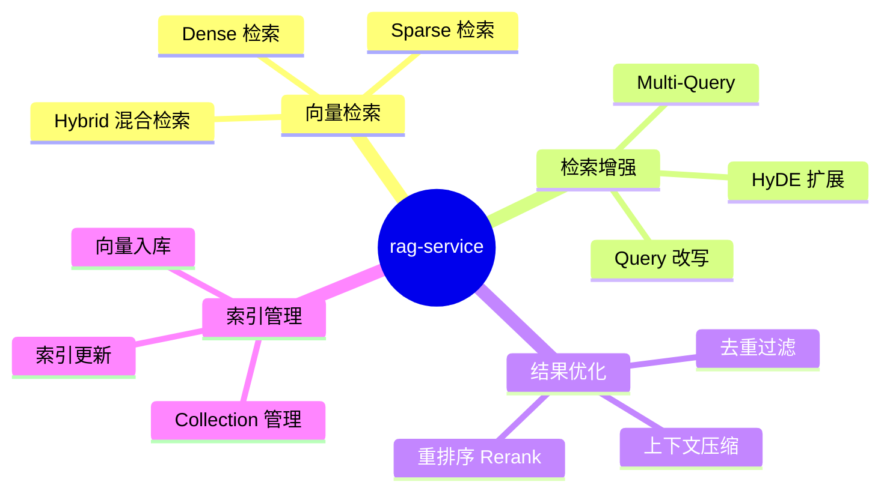

### 1.3 服务边界

| 属于本服务职责       | 不属于本服务职责         |
| -------------------- | ------------------------ |
| 向量检索与多路召回   | 文档解析与切片 (etl)     |
| 检索结果重排序       | 模型推理 (inference)     |
| Query 改写与语义扩展 | Agent 编排 (ai-core)     |
| 向量入库与索引管理   | 元数据存储 (data)        |
| 检索策略配置与调优   | 对话上下文管理 (ai-core) |
| Milvus 交互封装      | Embedding 模型部署       |

---

## 2. 系统架构

### 2.1 整体架构图

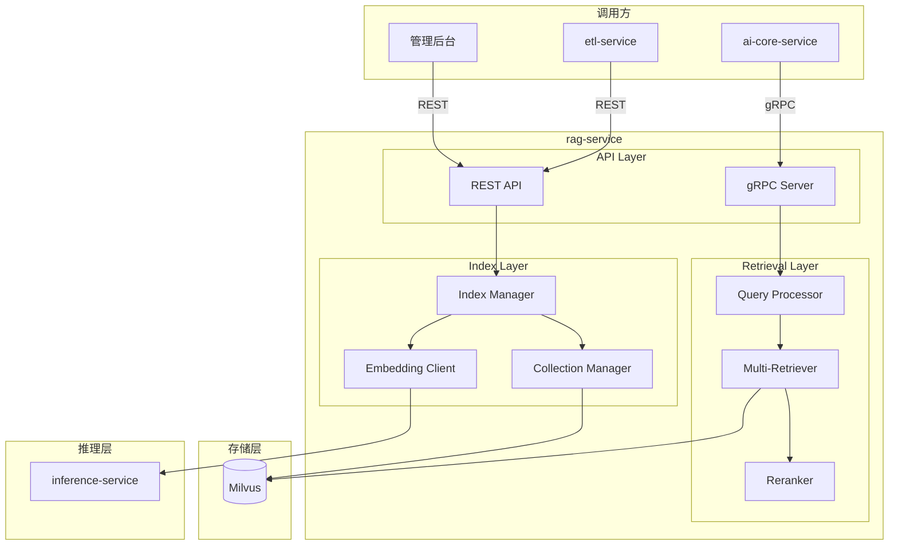

### 2.2 分层架构设计

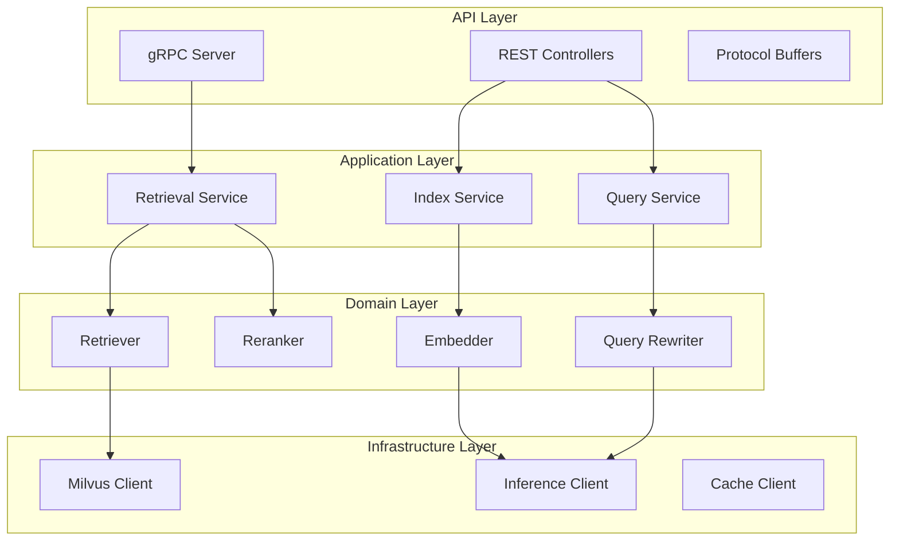

### 2.3 核心组件关系

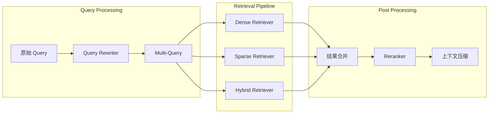

---

## 3. 检索策略设计

### 3.1 多路召回架构

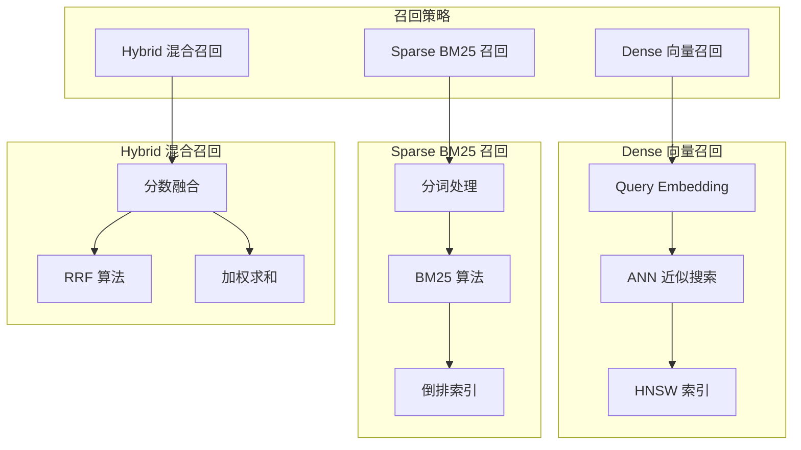

### 3.2 召回策略对比

| 策略   | 优势                   | 劣势                | 适用场景           |
| ------ | ---------------------- | ------------------- | ------------------ |
| Dense  | 语义理解强，跨语言支持 | 依赖 Embedding 质量 | 语义相似性检索     |
| Sparse | 关键词精确匹配         | 无语义理解          | 专业术语、实体名称 |
| Hybrid | 兼顾语义与关键词       | 计算成本较高        | 通用场景，推荐默认 |

### 3.3 检索参数配置

| 参数                   | 类型  | 默认值 | 说明                     |
| ---------------------- | ----- | ------ | ------------------------ |
| `top_k`                | int   | 10     | 召回文档数量             |
| `similarity_threshold` | float | 0.5    | 相似度阈值               |
| `dense_weight`         | float | 0.7    | Dense 召回权重 (Hybrid)  |
| `sparse_weight`        | float | 0.3    | Sparse 召回权重 (Hybrid) |
| `rerank_top_k`         | int   | 5      | 重排序后返回数量         |
| `enable_rerank`        | bool  | true   | 是否启用重排序           |

### 3.4 Hybrid 融合算法

#### 3.4.1 RRF (Reciprocal Rank Fusion)

```mermaid
graph LR
    subgraph RRF 算法
        Dense[Dense 排名]
        Sparse[Sparse 排名]
        Formula[score = Σ 1/(k + rank)]
        FinalRank[最终排名]
    end

    Dense --> Formula
    Sparse --> Formula
    Formula --> FinalRank
```

| 参数 | 默认值 | 说明     |
| ---- | ------ | -------- |
| `k`  | 60     | 平滑常数 |

#### 3.4.2 加权求和

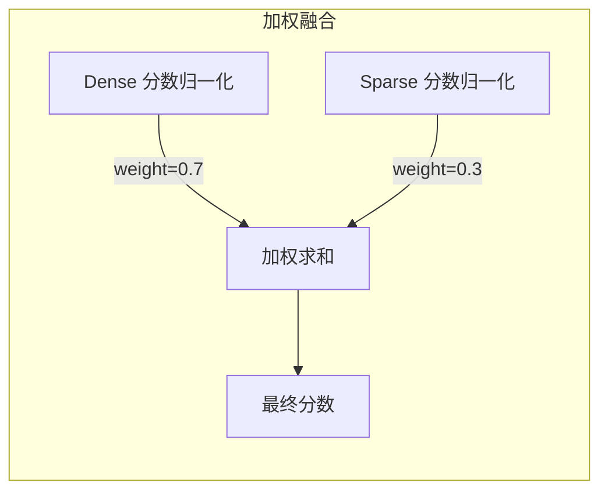

---

## 4. Query 增强设计

### 4.1 Query 改写策略

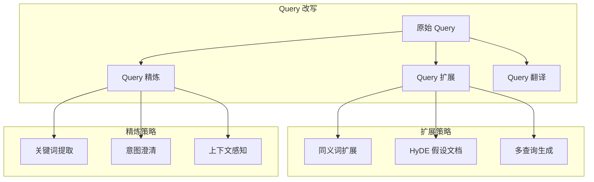

### 4.2 HyDE (Hypothetical Document Embeddings)

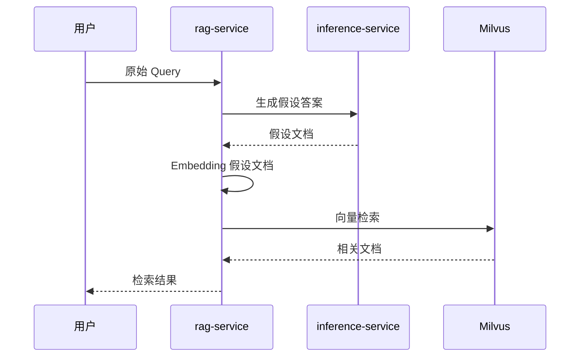

### 4.3 Multi-Query 策略

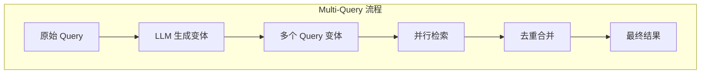

| 配置项            | 默认值 | 说明                 |
| ----------------- | ------ | -------------------- |
| `num_queries`     | 3      | 生成 Query 变体数量  |
| `diversity_score` | 0.7    | 变体多样性分数       |
| `merge_strategy`  | union  | 合并策略 (union/rrf) |

---

## 5. 重排序设计

### 5.1 重排序架构

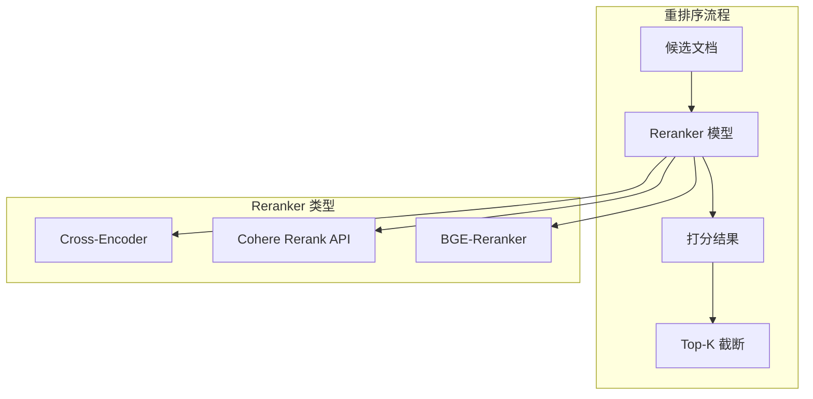

### 5.2 支持的 Reranker

| Reranker        | 类型     | 特点               | 适用场景     |
| --------------- | -------- | ------------------ | ------------ |
| BGE-Reranker-v2 | 本地模型 | 中文优化，开源免费 | 通用场景     |
| Cohere Rerank   | API 服务 | 效果好，多语言支持 | 高质量需求   |
| Cross-Encoder   | 本地模型 | 灵活可定制         | 特定领域微调 |
| LLM-as-Reranker | LLM 推理 | 无需额外模型       | 资源受限场景 |

### 5.3 重排序配置

| 配置项          | 类型   | 默认值          | 说明          |
| --------------- | ------ | --------------- | ------------- |
| `reranker_type` | enum   | bge-reranker-v2 | Reranker 类型 |
| `model_path`    | string | -               | 本地模型路径  |
| `api_endpoint`  | string | -               | API 服务地址  |
| `batch_size`    | int    | 32              | 批处理大小    |
| `max_length`    | int    | 512             | 最大输入长度  |

---

## 6. 索引管理设计

### 6.1 Collection 架构

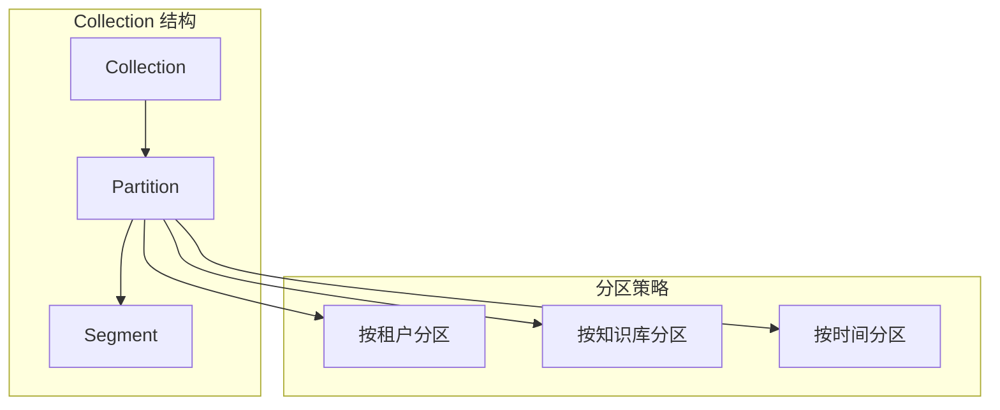

### 6.2 Schema 设计

| 字段名          | 类型          | 索引类型 | 说明               |
| --------------- | ------------- | -------- | ------------------ |
| `id`            | VARCHAR(64)   | 主键     | 文档块唯一标识     |
| `vector`        | FLOAT_VECTOR  | HNSW     | 向量字段 (1024 维) |
| `sparse_vector` | SPARSE_VECTOR | SPARSE   | 稀疏向量 (BM25)    |
| `content`       | VARCHAR(4096) | -        | 文本内容           |
| `doc_id`        | VARCHAR(64)   | -        | 原始文档 ID        |
| `chunk_index`   | INT32         | -        | 块序号             |
| `tenant_id`     | VARCHAR(64)   | 过滤索引 | 租户 ID            |
| `kb_id`         | VARCHAR(64)   | 过滤索引 | 知识库 ID          |
| `metadata`      | JSON          | -        | 扩展元数据         |
| `created_at`    | INT64         | -        | 创建时间戳         |

### 6.3 索引策略

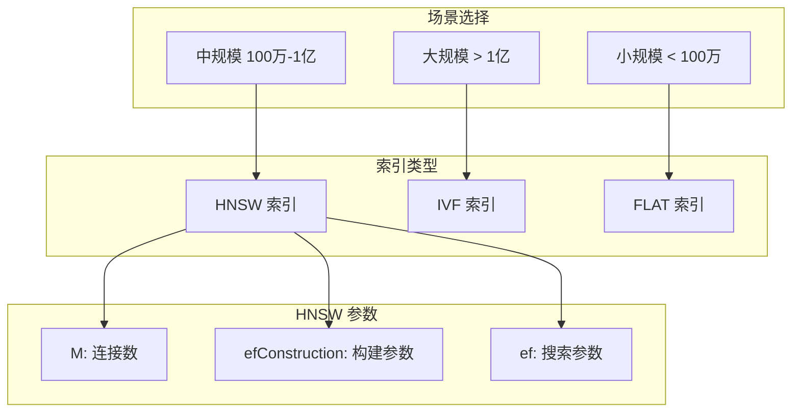

### 6.4 索引参数建议

| 数据规模    | 索引类型 | 关键参数                         |
| ----------- | -------- | -------------------------------- |
| < 100 万    | HNSW     | M=16, efConstruction=200, ef=100 |
| 100 万-1 亿 | HNSW     | M=32, efConstruction=256, ef=128 |
| > 1 亿      | IVF_HNSW | nlist=4096, M=16, ef=64          |

---

## 7. 向量入库设计

### 7.1 入库流程

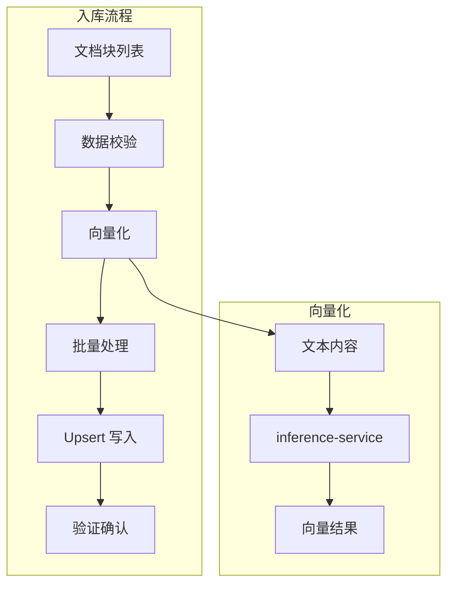

### 7.2 批量入库策略

| 策略项   | 配置         | 说明             |
| -------- | ------------ | ---------------- |
| 批次大小 | 100-500      | 单批次文档数     |
| 并发度   | 4-8          | 并行写入任务数   |
| 重试策略 | 3 次指数退避 | 失败重试机制     |
| 去重策略 | 基于 doc_id  | 相同 ID 覆盖更新 |

### 7.3 增量更新策略

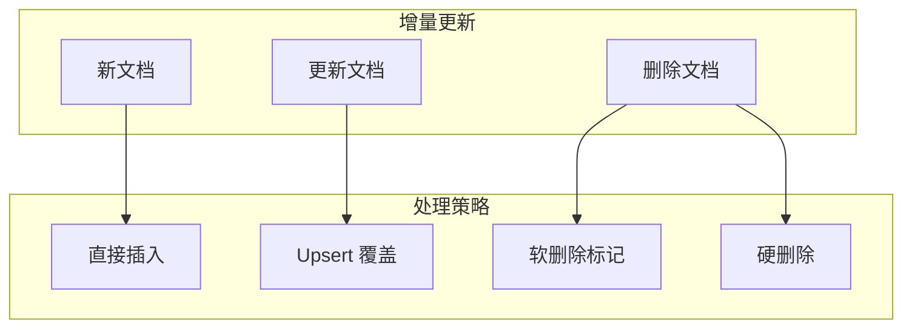

---

## 8. gRPC 接口设计

### 8.1 Proto 定义

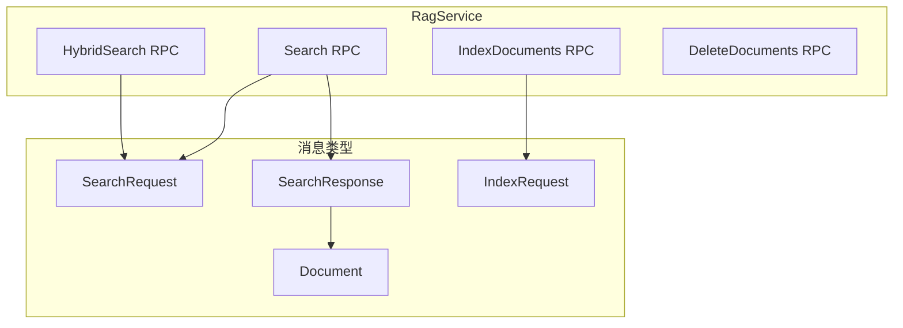

### 8.2 接口清单

| 接口名称          | 方法类型 | 描述                    |
| ----------------- | -------- | ----------------------- |
| `Search`          | Unary    | 基础向量检索            |
| `HybridSearch`    | Unary    | 混合检索 (Dense+Sparse) |
| `StreamSearch`    | Server   | 流式检索结果            |
| `IndexDocuments`  | Unary    | 批量索引文档            |
| `DeleteDocuments` | Unary    | 删除指定文档            |
| `GetCollection`   | Unary    | 获取 Collection 信息    |
| `HealthCheck`     | Unary    | 健康检查                |

### 8.3 请求/响应结构

| 消息类型       | 核心字段                                   |
| -------------- | ------------------------------------------ |
| SearchRequest  | query, top_k, collection, filters, options |
| SearchResponse | documents, latency_ms, total_count         |
| Document       | id, content, score, metadata               |
| IndexRequest   | collection, documents, options             |
| SearchOptions  | enable_rerank, rerank_top_k, strategy      |

---

## 9. REST API 设计

### 9.1 接口概览

| 端点                         | 方法   | 描述                 |
| ---------------------------- | ------ | -------------------- |
| `/api/v1/search`             | POST   | 执行检索             |
| `/api/v1/collections`        | GET    | 获取 Collection 列表 |
| `/api/v1/collections/{name}` | GET    | 获取 Collection 详情 |
| `/api/v1/collections/{name}` | POST   | 创建 Collection      |
| `/api/v1/collections/{name}` | DELETE | 删除 Collection      |
| `/api/v1/documents`          | POST   | 索引文档             |
| `/api/v1/documents/{id}`     | DELETE | 删除文档             |
| `/health`                    | GET    | 健康检查             |
| `/metrics`                   | GET    | Prometheus 指标      |

### 9.2 请求示例

#### 检索请求

| 字段         | 类型   | 必填 | 说明               |
| ------------ | ------ | ---- | ------------------ |
| `query`      | string | ✅   | 查询文本           |
| `collection` | string | ✅   | Collection 名称    |
| `top_k`      | int    | ❌   | 返回数量 (默认 10) |
| `filters`    | object | ❌   | 过滤条件           |
| `options`    | object | ❌   | 检索选项           |

#### 索引请求

| 字段         | 类型   | 必填 | 说明            |
| ------------ | ------ | ---- | --------------- |
| `collection` | string | ✅   | Collection 名称 |
| `documents`  | array  | ✅   | 文档列表        |
| `upsert`     | bool   | ❌   | 是否 Upsert     |

---

## 10. 性能优化设计

### 10.1 优化策略

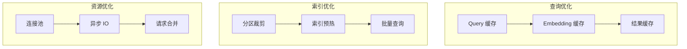

### 10.2 缓存策略

| 缓存层级     | 缓存内容   | TTL     | 缓存键              |
| ------------ | ---------- | ------- | ------------------- |
| L1 Embedding | Query 向量 | 1 小时  | hash(query)         |
| L2 Result    | 检索结果   | 10 分钟 | hash(query+filters) |
| L3 Rerank    | 重排序结果 | 5 分钟  | hash(candidates)    |

### 10.3 性能指标

| 指标                 | 目标值    | 说明     |
| -------------------- | --------- | -------- |
| P50 延迟             | < 100ms   | 单次检索 |
| P99 延迟             | < 500ms   | 含重排序 |
| 吞吐量               | > 500 QPS | 单实例   |
| 召回率               | > 90%     | Top-10   |
| Embedding 缓存命中率 | > 60%     | 热点查询 |

---

## 11. 可观测性设计

### 11.1 链路追踪

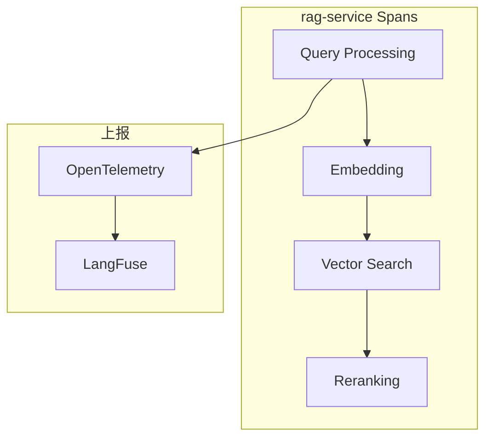

### 11.2 关键指标

| 指标名称                   | 类型      | 说明               |
| -------------------------- | --------- | ------------------ |
| `rag.search.count`         | Counter   | 检索请求总数       |
| `rag.search.latency`       | Histogram | 检索延迟分布       |
| `rag.rerank.latency`       | Histogram | 重排序延迟         |
| `rag.embedding.cache_hit`  | Counter   | Embedding 缓存命中 |
| `rag.milvus.connections`   | Gauge     | Milvus 连接数      |
| `rag.documents.indexed`    | Counter   | 索引文档数         |
| `rag.search.empty_results` | Counter   | 空结果检索数       |

### 11.3 日志规范

| 日志级别 | 使用场景                      |
| -------- | ----------------------------- |
| ERROR    | Milvus 连接失败、索引错误     |
| WARN     | 检索超时、缓存失效            |
| INFO     | 请求入口/出口、索引操作       |
| DEBUG    | Query 改写详情、候选文档列表  |
| TRACE    | 完整向量内容、Milvus 原始响应 |

---

## 12. 错误处理设计

### 12.1 错误分类

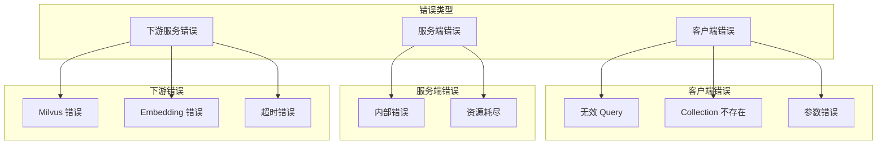

### 12.2 错误处理策略

| 错误类型          | gRPC 状态码        | 处理策略         |
| ----------------- | ------------------ | ---------------- |
| 参数校验失败      | INVALID_ARGUMENT   | 返回详细错误信息 |
| Collection 不存在 | NOT_FOUND          | 返回友好提示     |
| Milvus 连接失败   | UNAVAILABLE        | 重试 3 次后熔断  |
| Embedding 超时    | DEADLINE_EXCEEDED  | 使用缓存或降级   |
| 资源耗尽          | RESOURCE_EXHAUSTED | 限流排队         |

### 12.3 降级策略

| 降级场景           | 降级策略                     |
| ------------------ | ---------------------------- |
| Reranker 不可用    | 禁用重排序，直接返回召回结果 |
| Embedding 服务超时 | 使用缓存 Embedding           |
| Milvus 部分不可用  | 路由到可用 Partition         |
| 高并发压力         | 降低 top_k，关闭 Multi-Query |

---

## 13. 安全设计

### 13.1 安全架构

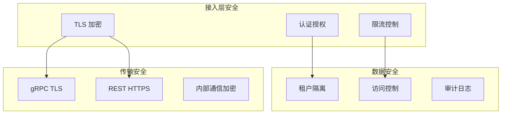

### 13.2 租户隔离

| 隔离级别      | 实现方式                  |
| ------------- | ------------------------- |
| Collection 级 | 每租户独立 Collection     |
| Partition 级  | 共享 Collection，分区隔离 |
| 查询级        | 强制 tenant_id 过滤条件   |

### 13.3 访问控制

| 操作类型        | 权限要求 |
| --------------- | -------- |
| 检索            | READ     |
| 索引文档        | WRITE    |
| 删除文档        | DELETE   |
| 管理 Collection | ADMIN    |

---

## 14. 配置管理

### 14.1 配置分层

```mermaid
graph TD
    subgraph 配置层级
        Env[环境变量]
        ConfigFile[配置文件]
        Default[代码默认值]
    end

    Env -->|最高优先级| ConfigFile
    ConfigFile --> Default
```

### 14.2 核心配置项

| 配置分类  | 配置项                  | 默认值          | 说明               |
| --------- | ----------------------- | --------------- | ------------------ |
| gRPC      | grpc.port               | 50051           | gRPC 端口          |
| REST      | http.port               | 8000            | HTTP 端口          |
| Milvus    | milvus.host             | localhost       | Milvus 地址        |
| Milvus    | milvus.port             | 19530           | Milvus 端口        |
| Embedding | embedding.endpoint      | -               | Embedding API      |
| Embedding | embedding.model         | bge-m3          | Embedding 模型     |
| Retrieval | retrieval.default_top_k | 10              | 默认 Top-K         |
| Retrieval | retrieval.strategy      | hybrid          | 默认检索策略       |
| Rerank    | rerank.enabled          | true            | 是否启用 Rerank    |
| Rerank    | rerank.model            | bge-reranker-v2 | Rerank 模型        |
| Cache     | cache.embedding_ttl     | 3600            | Embedding 缓存 TTL |

---

## 15. 部署架构

### 15.1 开发环境

```mermaid
graph TD
    subgraph 本地开发
        IDE[IDE]
        LocalService[rag-service<br/>localhost:8000/50051]
        LocalMilvus[Milvus Standalone]
    end

    IDE --> LocalService
    LocalService --> LocalMilvus
```

### 15.2 生产环境

```mermaid
graph TD
    subgraph K8s Cluster
        subgraph rag-service Deployment
            Pod1[Pod 1]
            Pod2[Pod 2]
            PodN[Pod N]
        end

        Service[K8s Service]
        HPA[Horizontal Pod Autoscaler]
        ConfigMap[ConfigMap]
    end

    subgraph Storage
        Milvus[Milvus Cluster]
        Redis[Redis Cache]
    end

    Service --> Pod1
    Service --> Pod2
    Service --> PodN
    HPA --> Pod1
    Pod1 --> Milvus
    Pod1 --> Redis
```

### 15.3 资源配置建议

| 环境 | CPU  | 内存  | 副本数 | GPU (Reranker)  |
| ---- | ---- | ----- | ------ | --------------- |
| 开发 | 2 核 | 4 GB  | 1      | 可选            |
| 测试 | 4 核 | 8 GB  | 2      | 1x T4           |
| 生产 | 8 核 | 16 GB | 3-6    | 2x T4 或 1x A10 |

---

## 16. 测试策略

### 16.1 测试金字塔

```mermaid
graph TD
    subgraph 测试层级
        E2E[端到端测试<br/>10%]
        Integration[集成测试<br/>30%]
        Unit[单元测试<br/>60%]
    end

    E2E --> Integration
    Integration --> Unit
```

### 16.2 测试场景

| 测试类型   | 覆盖场景                              |
| ---------- | ------------------------------------- |
| 单元测试   | Query 改写、分数融合、结果合并        |
| 集成测试   | Milvus 交互、gRPC 通信、Reranker 调用 |
| 端到端测试 | 完整检索流程、多路召回、重排序        |
| 性能测试   | 并发检索、大批量索引、延迟分布        |
| 召回率测试 | 标准数据集评估 (BEIR/MTEB)            |

### 16.3 评估指标

| 指标        | 说明               | 目标值  |
| ----------- | ------------------ | ------- |
| Recall@10   | Top-10 召回率      | > 90%   |
| MRR         | 平均倒数排名       | > 0.7   |
| NDCG@10     | 归一化折损累计增益 | > 0.8   |
| Latency P99 | 99 分位延迟        | < 500ms |

---

## 17. 扩展性设计

### 17.1 扩展点

```mermaid
graph TD
    subgraph 扩展点
        RetrieverExt[Retriever 扩展]
        RerankerExt[Reranker 扩展]
        QueryExt[Query Processor 扩展]
    end

    subgraph 实现
        CustomRetriever[自定义 Retriever]
        CustomReranker[自定义 Reranker]
        CustomQueryRewriter[自定义 Query 改写]
    end

    RetrieverExt --> CustomRetriever
    RerankerExt --> CustomReranker
    QueryExt --> CustomQueryRewriter
```

### 17.2 扩展接口

| 扩展点        | 接口/基类         | 扩展方式          |
| ------------- | ----------------- | ----------------- |
| Retriever     | BaseRetriever     | 继承实现 retrieve |
| Reranker      | BaseReranker      | 继承实现 rerank   |
| QueryRewriter | BaseQueryRewriter | 继承实现 rewrite  |
| Embedder      | BaseEmbedder      | 继承实现 embed    |

---

## 18. 相关文档

- [后端开发计划总览](../backend-development-plan.md)
- [Data Service 设计](./01-data-service-design.md)
- [Inference Service 设计](./02-inference-service-design.md)
- [AI Core Service 设计](./03-ai-core-service-design.md)
- [PostgreSQL & Milvus 存储指南](../../技术选型/postgresql-milvus-guide.md)
- [Spring AI & LangChain 对比](../../技术选型/spring-ai-langchain-guide.md)
