# ETL Service 详细设计文档

> 版本：v1.0 | 优先级：P2 | 技术栈：Python 3.11+ / Unstructured.io 0.18.x

## 1. 服务概述

### 1.1 服务定位

**etl-service** 是 AI 产品后端架构中的**文档处理服务层**，专注于非结构化文档的解析、清洗、切片与向量化入库。作为 RAG 系统的数据入口，它支持 64+ 种文档格式的处理，并通过 VLM (Vision Language Model) 增强复杂文档的理解能力。

### 1.2 核心职责

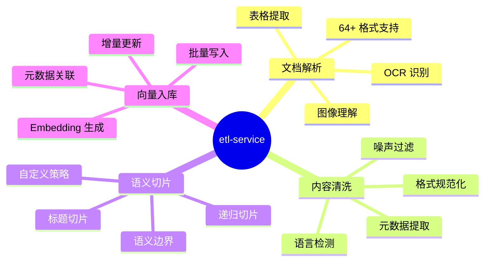
```mermaid
mindmap
  root((etl-service))
    文档解析
      64+ 格式支持
      OCR 识别
      表格提取
      图像理解
    内容清洗
      噪声过滤
      格式规范化
      元数据提取
      语言检测
    语义切片
      标题切片
      语义边界
      递归切片
      自定义策略
    向量入库
      Embedding 生成
      批量写入
      增量更新
      元数据关联
```

### 1.3 服务边界

| 属于本服务职责         | 不属于本服务职责       |
| ---------------------- | ---------------------- |
| 文档格式解析与转换     | 向量检索 (rag-service) |
| 文本清洗与规范化       | 模型推理 (inference)   |
| 语义切片与分块         | 业务逻辑处理 (ai-core) |
| 向量化与入库           | 元数据业务存储 (data)  |
| OCR 与图像文字提取     | 对话管理 (ai-core)     |
| VLM 增强的复杂文档理解 | 知识库管理界面 (dify)  |
| 异步任务队列管理       | 用户权限管理 (data)    |

---

## 2. 系统架构

### 2.1 整体架构图

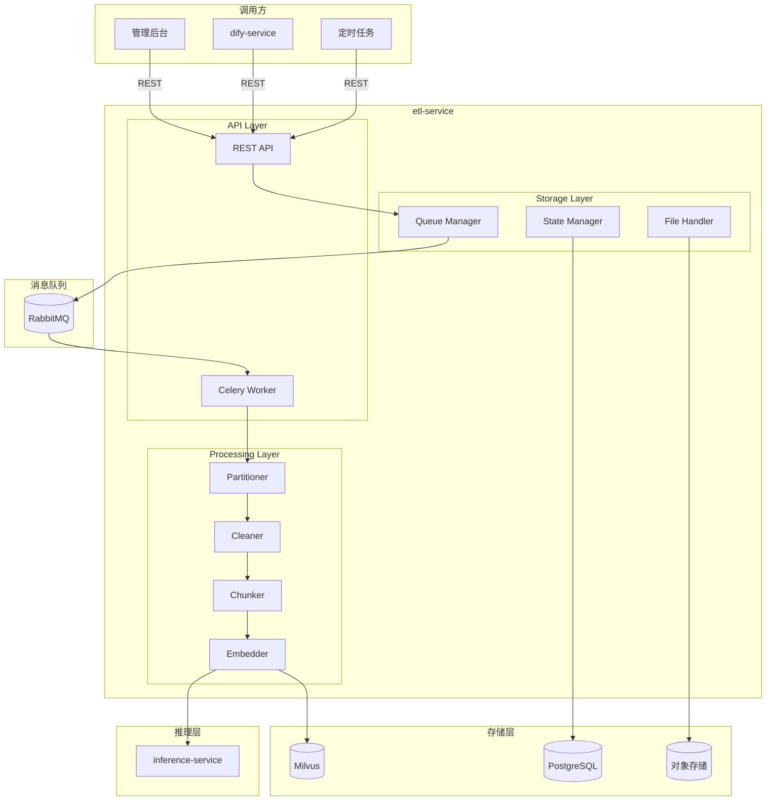
```mermaid
graph TD
    subgraph 调用方
        Admin[管理后台]
        Dify[dify-service]
        Scheduler[定时任务]
    end

    subgraph etl-service
        subgraph API Layer
            REST[REST API]
            Worker[Celery Worker]
        end

        subgraph Processing Layer
            Partitioner[Partitioner]
            Cleaner[Cleaner]
            Chunker[Chunker]
            Embedder[Embedder]
        end

        subgraph Storage Layer
            FileHandler[File Handler]
            QueueManager[Queue Manager]
            StateManager[State Manager]
        end
    end

    subgraph 消息队列
        RabbitMQ[(RabbitMQ)]
    end

    subgraph 存储层
        Milvus[(Milvus)]
        PG[(PostgreSQL)]
        S3[(对象存储)]
    end

    subgraph 推理层
        Inference[inference-service]
    end

    Admin -->|REST| REST
    Dify -->|REST| REST
    Scheduler -->|REST| REST

    REST --> QueueManager
    QueueManager --> RabbitMQ
    RabbitMQ --> Worker

    Worker --> Partitioner
    Partitioner --> Cleaner
    Cleaner --> Chunker
    Chunker --> Embedder

    FileHandler --> S3
    Embedder --> Inference
    Embedder --> Milvus
    StateManager --> PG
```

### 2.2 处理流水线架构

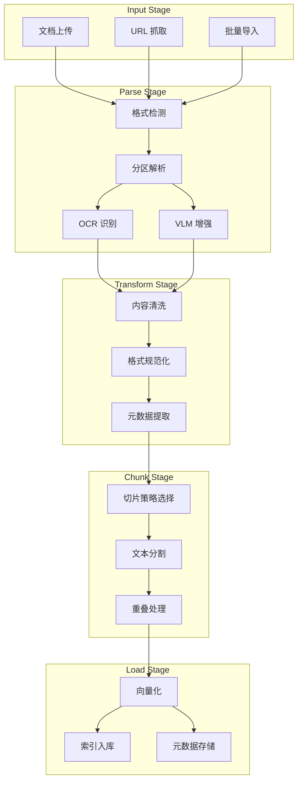
```mermaid
flowchart TD
    subgraph Input Stage
        Upload[文档上传]
        URL[URL 抓取]
        Batch[批量导入]
    end

    subgraph Parse Stage
        Detect[格式检测]
        Partition[分区解析]
        OCR[OCR 识别]
        VLM[VLM 增强]
    end

    subgraph Transform Stage
        Clean[内容清洗]
        Normalize[格式规范化]
        Extract[元数据提取]
    end

    subgraph Chunk Stage
        Strategy[切片策略选择]
        Split[文本分割]
        Overlap[重叠处理]
    end

    subgraph Load Stage
        Embed[向量化]
        Index[索引入库]
        Metadata[元数据存储]
    end

    Upload --> Detect
    URL --> Detect
    Batch --> Detect

    Detect --> Partition
    Partition --> OCR
    Partition --> VLM

    OCR --> Clean
    VLM --> Clean
    Clean --> Normalize
    Normalize --> Extract

    Extract --> Strategy
    Strategy --> Split
    Split --> Overlap

    Overlap --> Embed
    Embed --> Index
    Embed --> Metadata
```

### 2.3 分层架构设计

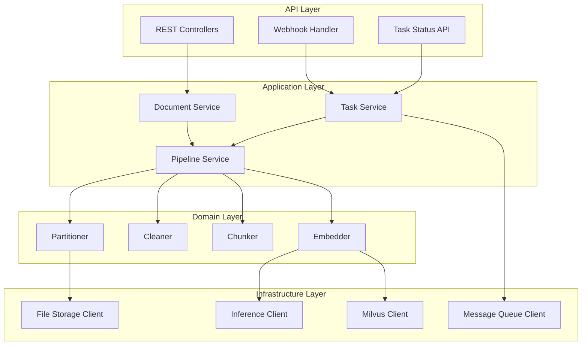
```mermaid
graph TB
    subgraph API Layer
        REST[REST Controllers]
        Webhook[Webhook Handler]
        TaskAPI[Task Status API]
    end

    subgraph Application Layer
        DocumentService[Document Service]
        TaskService[Task Service]
        PipelineService[Pipeline Service]
    end

    subgraph Domain Layer
        Partitioner[Partitioner]
        Cleaner[Cleaner]
        Chunker[Chunker]
        Embedder[Embedder]
    end

    subgraph Infrastructure Layer
        FileStorage[File Storage Client]
        QueueClient[Message Queue Client]
        MilvusClient[Milvus Client]
        InferenceClient[Inference Client]
    end

    REST --> DocumentService
    Webhook --> TaskService
    TaskAPI --> TaskService

    DocumentService --> PipelineService
    TaskService --> PipelineService

    PipelineService --> Partitioner
    PipelineService --> Cleaner
    PipelineService --> Chunker
    PipelineService --> Embedder

    Partitioner --> FileStorage
    Embedder --> InferenceClient
    Embedder --> MilvusClient
    TaskService --> QueueClient
```

---

## 3. 文档解析设计

### 3.1 支持的文档格式

```mermaid
graph TD
    subgraph 文档格式分类
        Office[Office 文档]
        PDF[PDF 文档]
        Web[Web 格式]
        Data[数据格式]
        Image[图像格式]
        Other[其他格式]
    end

    subgraph Office 文档
        DOCX[.docx]
        DOC[.doc]
        XLSX[.xlsx]
        XLS[.xls]
        PPTX[.pptx]
        PPT[.ppt]
    end

    subgraph PDF 文档
        PDFText[文本 PDF]
        PDFScan[扫描 PDF]
        PDFMixed[混合 PDF]
    end

    subgraph Web 格式
        HTML[.html]
        MD[.md]
        RST[.rst]
        XML[.xml]
    end

    subgraph 数据格式
        CSV[.csv]
        JSON[.json]
        TSV[.tsv]
    end

    subgraph 图像格式
        PNG[.png]
        JPG[.jpg]
        TIFF[.tiff]
    end

    Office --> DOCX
    Office --> DOC
    Office --> XLSX
    Office --> PPTX

    PDF --> PDFText
    PDF --> PDFScan
    PDF --> PDFMixed

    Web --> HTML
    Web --> MD

    Data --> CSV
    Data --> JSON

    Image --> PNG
    Image --> JPG
```

### 3.2 格式支持详情

| 分类     | 格式                       | 解析方式       | 特殊处理      |
| -------- | -------------------------- | -------------- | ------------- |
| Office   | docx, doc, xlsx, pptx, odt | python-docx 等 | 表格/图片提取 |
| PDF      | pdf (文本/扫描/混合)       | pdfminer + OCR | VLM 增强      |
| Web      | html, htm, xml             | BeautifulSoup  | 标签清理      |
| Markdown | md, markdown, rst          | 原生解析       | 代码块保留    |
| 纯文本   | txt, log, csv              | 编码检测       | 结构推断      |
| 图像     | png, jpg, jpeg, tiff, bmp  | OCR            | VLM 图像理解  |
| 邮件     | eml, msg                   | email 解析     | 附件递归处理  |
| 电子书   | epub                       | epub 解析      | 章节保留      |

### 3.3 解析策略配置

| 策略       | 说明                 | 适用场景         |
| ---------- | -------------------- | ---------------- |
| `auto`     | 自动检测最佳策略     | 通用场景         |
| `fast`     | 快速解析，精度较低   | 大批量处理       |
| `hi_res`   | 高精度解析，速度较慢 | 复杂文档、扫描件 |
| `ocr_only` | 仅 OCR 模式          | 纯图像文档       |

### 3.4 Unstructured 解析流程

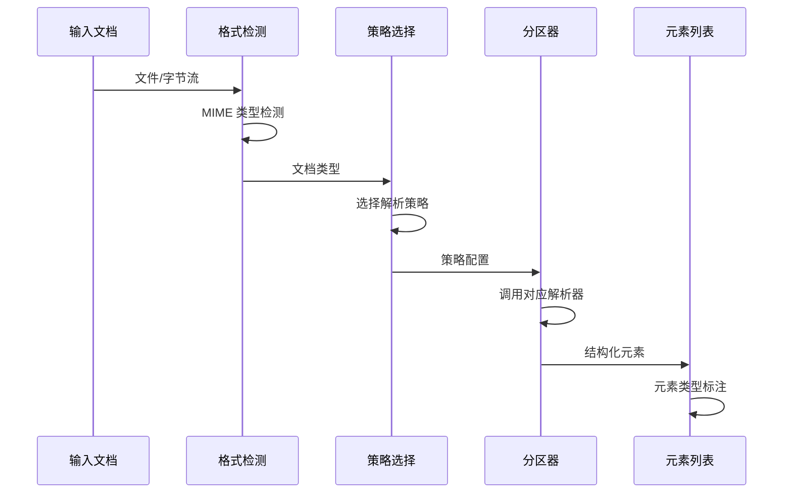
```mermaid
sequenceDiagram
    participant Input as 输入文档
    participant Detect as 格式检测
    participant Strategy as 策略选择
    participant Partition as 分区器
    participant Elements as 元素列表

    Input->>Detect: 文件/字节流
    Detect->>Detect: MIME 类型检测
    Detect->>Strategy: 文档类型
    Strategy->>Strategy: 选择解析策略
    Strategy->>Partition: 策略配置
    Partition->>Partition: 调用对应解析器
    Partition->>Elements: 结构化元素
    Elements->>Elements: 元素类型标注
```

### 3.5 解析元素类型

| 元素类型        | 说明     | 处理方式           |
| --------------- | -------- | ------------------ |
| `Title`         | 标题     | 作为切片边界       |
| `NarrativeText` | 正文段落 | 主要内容           |
| `ListItem`      | 列表项   | 保持列表结构       |
| `Table`         | 表格     | Markdown/HTML 转换 |
| `Image`         | 图像     | VLM 描述生成       |
| `Header`        | 页眉     | 可选过滤           |
| `Footer`        | 页脚     | 可选过滤           |
| `PageBreak`     | 分页符   | 元数据记录         |
| `Formula`       | 公式     | LaTeX 保留         |
| `CodeSnippet`   | 代码块   | 语言标注           |

---

## 4. 内容清洗设计

### 4.1 清洗流程

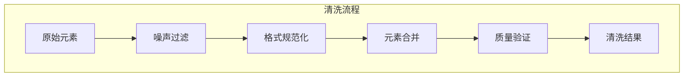
```mermaid
flowchart TD
    subgraph 清洗流程
        Input[原始元素]
        Filter[噪声过滤]
        Normalize[格式规范化]
        Merge[元素合并]
        Validate[质量验证]
        Output[清洗结果]
    end

    Input --> Filter
    Filter --> Normalize
    Normalize --> Merge
    Merge --> Validate
    Validate --> Output
```

### 4.2 噪声过滤规则

| 过滤类型      | 规则                   | 可配置 |
| ------------- | ---------------------- | ------ |
| 短文本过滤    | 字符数 < N (默认 10)   | ✅     |
| 页眉页脚      | Header/Footer 元素     | ✅     |
| 特殊字符      | 控制字符、异常 Unicode | ✅     |
| 重复内容      | 连续重复段落           | ✅     |
| 水印/版权声明 | 正则匹配模式           | ✅     |
| 空白元素      | 仅含空格/换行          | ❌     |

### 4.3 格式规范化

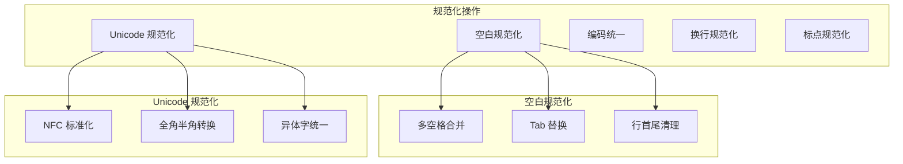
```mermaid
graph TD
    subgraph 规范化操作
        Whitespace[空白规范化]
        Unicode[Unicode 规范化]
        Encoding[编码统一]
        LineBreak[换行规范化]
        Punctuation[标点规范化]
    end

    subgraph 空白规范化
        MultiSpace[多空格合并]
        TabReplace[Tab 替换]
        TrimLine[行首尾清理]
    end

    subgraph Unicode 规范化
        NFCNorm[NFC 标准化]
        WidthConvert[全角半角转换]
        VariantUnify[异体字统一]
    end

    Whitespace --> MultiSpace
    Whitespace --> TabReplace
    Whitespace --> TrimLine

    Unicode --> NFCNorm
    Unicode --> WidthConvert
    Unicode --> VariantUnify
```

### 4.4 元数据提取

| 元数据字段    | 来源              | 说明         |
| ------------- | ----------------- | ------------ |
| `filename`    | 文件名            | 原始文件名   |
| `file_type`   | MIME 检测         | 文件类型     |
| `file_size`   | 文件属性          | 字节大小     |
| `page_number` | 解析元素          | 所在页码     |
| `languages`   | 语言检测          | 检测到的语言 |
| `created_at`  | 文件属性/当前时间 | 创建时间     |
| `author`      | 文档属性          | 作者信息     |
| `title`       | 文档属性          | 文档标题     |
| `keywords`    | 文档属性          | 关键词       |

---

## 5. 语义切片设计

### 5.1 切片策略

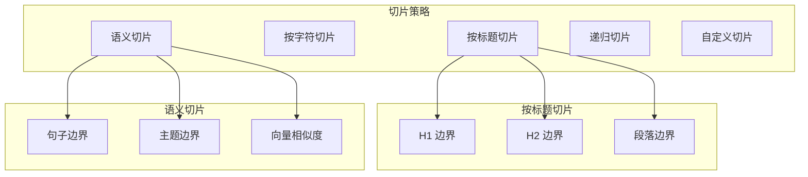
```mermaid
graph TD
    subgraph 切片策略
        ByTitle[按标题切片]
        ByCharacter[按字符切片]
        BySemantic[语义切片]
        Recursive[递归切片]
        Custom[自定义切片]
    end

    subgraph 按标题切片
        H1[H1 边界]
        H2[H2 边界]
        Paragraph[段落边界]
    end

    subgraph 语义切片
        Sentence[句子边界]
        Topic[主题边界]
        Embedding[向量相似度]
    end

    ByTitle --> H1
    ByTitle --> H2
    ByTitle --> Paragraph

    BySemantic --> Sentence
    BySemantic --> Topic
    BySemantic --> Embedding
```

### 5.2 切片策略对比

| 策略     | 优势         | 劣势         | 适用场景   |
| -------- | ------------ | ------------ | ---------- |
| 按标题   | 保持文档结构 | 块大小不均   | 结构化文档 |
| 按字符数 | 块大小均匀   | 可能切断语义 | 通用场景   |
| 语义切片 | 语义完整性高 | 计算成本高   | 高质量需求 |
| 递归切片 | 灵活适应     | 配置复杂     | 混合内容   |

### 5.3 切片参数配置

| 参数               | 类型 | 默认值 | 说明             |
| ------------------ | ---- | ------ | ---------------- |
| `strategy`         | enum | title  | 切片策略         |
| `max_characters`   | int  | 1000   | 最大字符数       |
| `min_characters`   | int  | 100    | 最小字符数       |
| `overlap`          | int  | 100    | 重叠字符数       |
| `overlap_all`      | bool | false  | 是否全部重叠     |
| `combine_under`    | int  | 200    | 合并小于此值的块 |
| `respect_sentence` | bool | true   | 尊重句子边界     |
| `preserve_tables`  | bool | true   | 保持表格完整     |

### 5.4 按标题切片流程

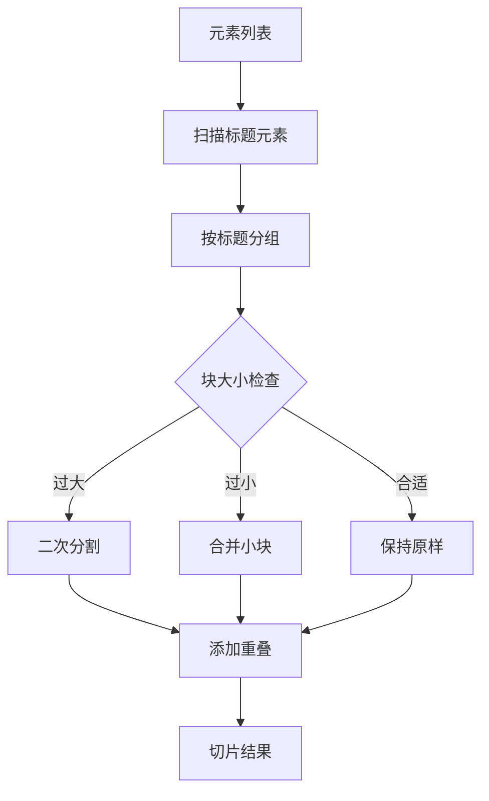
```mermaid
flowchart TD
    Start[元素列表] --> Scan[扫描标题元素]
    Scan --> Group[按标题分组]
    Group --> Check{块大小检查}

    Check -->|过大| Split[二次分割]
    Check -->|过小| Merge[合并小块]
    Check -->|合适| Keep[保持原样]

    Split --> Overlap[添加重叠]
    Merge --> Overlap
    Keep --> Overlap

    Overlap --> Output[切片结果]
```

### 5.5 重叠处理策略

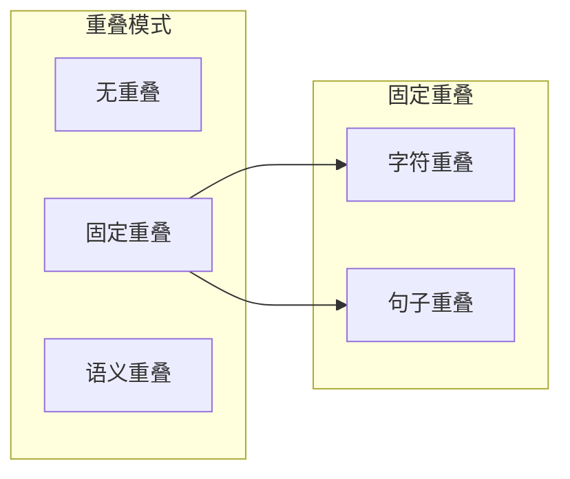
```mermaid
graph LR
    subgraph 重叠模式
        NoOverlap[无重叠]
        FixedOverlap[固定重叠]
        SemanticOverlap[语义重叠]
    end

    subgraph 固定重叠
        CharOverlap[字符重叠]
        SentenceOverlap[句子重叠]
    end

    FixedOverlap --> CharOverlap
    FixedOverlap --> SentenceOverlap
```

| 重叠模式 | 说明               | 参数配置            |
| -------- | ------------------ | ------------------- |
| 无重叠   | 块之间无交集       | overlap=0           |
| 字符重叠 | 固定字符数重叠     | overlap=100         |
| 句子重叠 | 按句子边界重叠     | overlap_sentences=2 |
| 语义重叠 | 根据语义相似度确定 | semantic_threshold  |

---

## 6. VLM 增强设计

### 6.1 VLM 增强架构

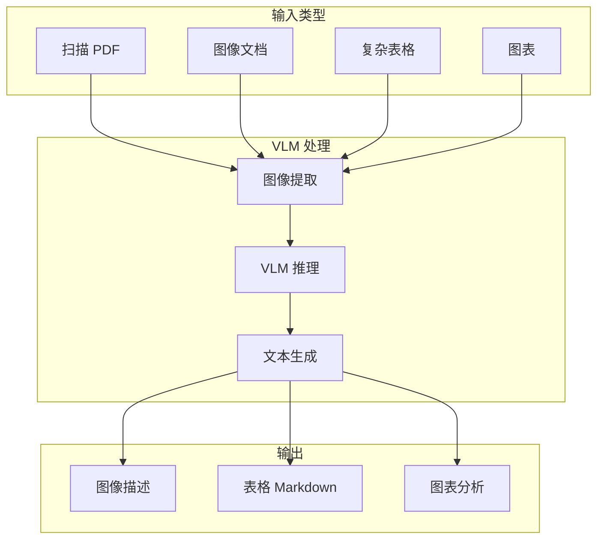
```mermaid
graph TD
    subgraph 输入类型
        ScanPDF[扫描 PDF]
        ImageDoc[图像文档]
        ComplexTable[复杂表格]
        Chart[图表]
    end

    subgraph VLM 处理
        ImageExtract[图像提取]
        VLMInference[VLM 推理]
        TextGenerate[文本生成]
    end

    subgraph 输出
        Description[图像描述]
        TableMarkdown[表格 Markdown]
        ChartAnalysis[图表分析]
    end

    ScanPDF --> ImageExtract
    ImageDoc --> ImageExtract
    ComplexTable --> ImageExtract
    Chart --> ImageExtract

    ImageExtract --> VLMInference
    VLMInference --> TextGenerate

    TextGenerate --> Description
    TextGenerate --> TableMarkdown
    TextGenerate --> ChartAnalysis
```

### 6.2 VLM 使用场景

| 场景          | 传统 OCR 问题 | VLM 解决方案           |
| ------------- | ------------- | ---------------------- |
| 复杂表格      | 结构识别困难  | 理解表格语义，生成描述 |
| 流程图/架构图 | 无法识别关系  | 生成结构化描述         |
| 扫描文档      | OCR 错误率高  | 结合上下文理解         |
| 图文混排      | 图文关联丢失  | 理解图文关系           |
| 图表          | 仅识别数字    | 解读图表含义           |

### 6.3 VLM 调用策略

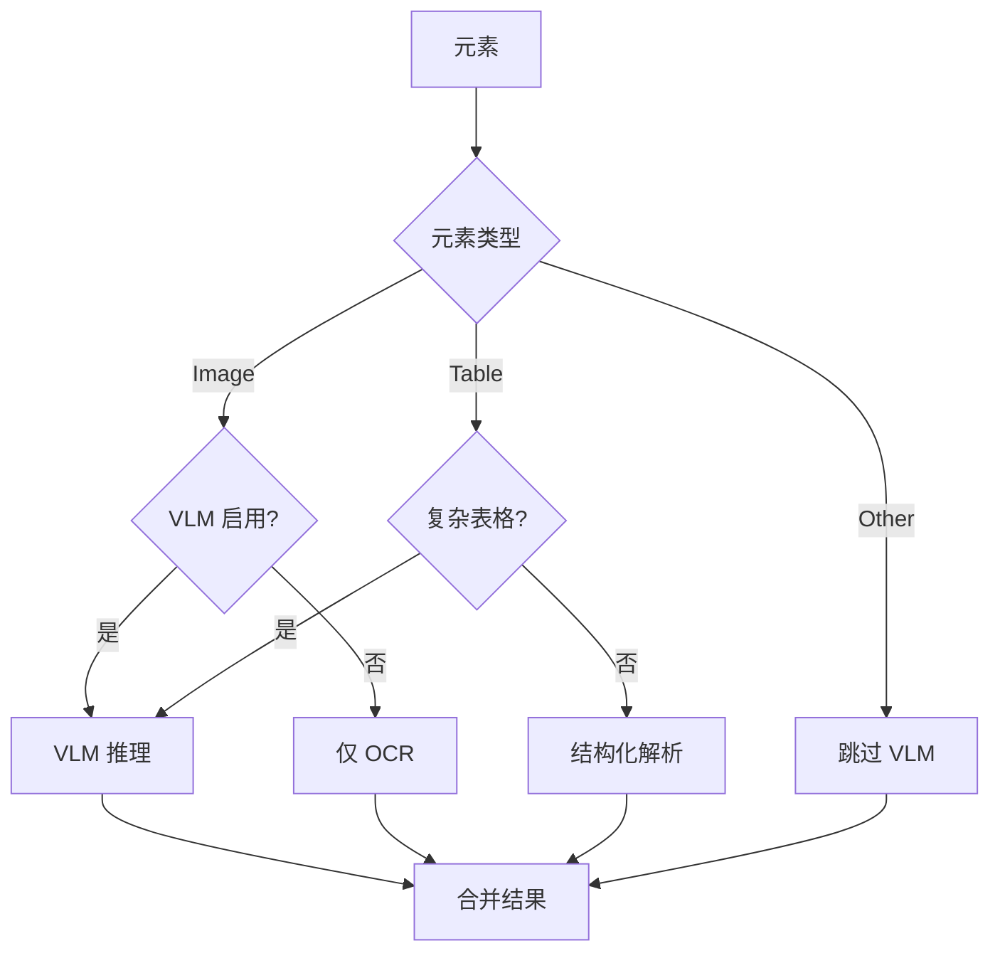
```mermaid
flowchart TD
    Element[元素] --> TypeCheck{元素类型}

    TypeCheck -->|Image| VLMCheck{VLM 启用?}
    TypeCheck -->|Table| TableCheck{复杂表格?}
    TypeCheck -->|Other| Skip[跳过 VLM]

    VLMCheck -->|是| VLMCall[VLM 推理]
    VLMCheck -->|否| OCROnly[仅 OCR]

    TableCheck -->|是| VLMCall
    TableCheck -->|否| StructParse[结构化解析]

    VLMCall --> Merge[合并结果]
    OCROnly --> Merge
    StructParse --> Merge
    Skip --> Merge
```

### 6.4 VLM 配置参数

| 参数               | 类型   | 默认值 | 说明              |
| ------------------ | ------ | ------ | ----------------- |
| `enable_vlm`       | bool   | false  | 是否启用 VLM      |
| `vlm_model`        | string | -      | VLM 模型名称      |
| `vlm_endpoint`     | string | -      | VLM 服务端点      |
| `image_min_size`   | int    | 100    | 最小处理图像尺寸  |
| `table_complexity` | int    | 5      | 表格复杂度阈值    |
| `max_concurrent`   | int    | 4      | 最大并发 VLM 调用 |
| `timeout`          | int    | 30     | 单次调用超时 (秒) |

---

## 7. 向量化入库设计

### 7.1 入库流程

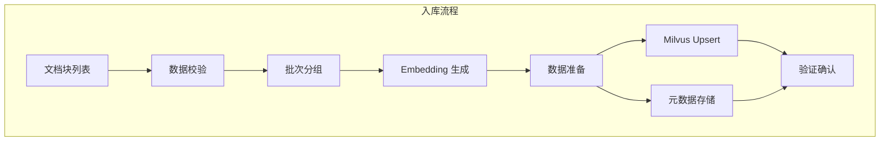
```mermaid
flowchart TD
    subgraph 入库流程
        Chunks[文档块列表]
        Validate[数据校验]
        BatchGroup[批次分组]
        Embed[Embedding 生成]
        Prepare[数据准备]
        Upsert[Milvus Upsert]
        Metadata[元数据存储]
        Verify[验证确认]
    end

    Chunks --> Validate
    Validate --> BatchGroup
    BatchGroup --> Embed
    Embed --> Prepare
    Prepare --> Upsert
    Prepare --> Metadata
    Upsert --> Verify
    Metadata --> Verify
```

### 7.2 Embedding 生成

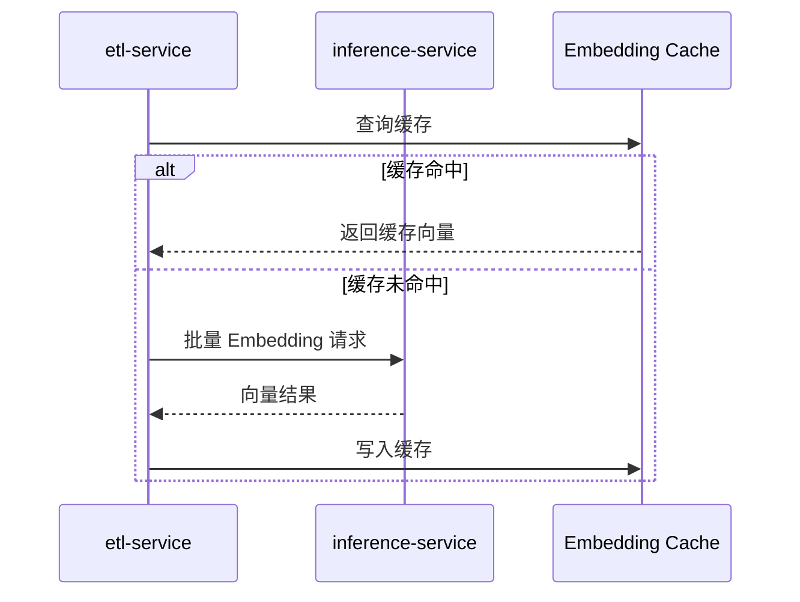
```mermaid
sequenceDiagram
    participant ETL as etl-service
    participant Inference as inference-service
    participant Cache as Embedding Cache

    ETL->>Cache: 查询缓存
    alt 缓存命中
        Cache-->>ETL: 返回缓存向量
    else 缓存未命中
        ETL->>Inference: 批量 Embedding 请求
        Inference-->>ETL: 向量结果
        ETL->>Cache: 写入缓存
    end
```

### 7.3 批量处理策略

| 策略项   | 配置          | 说明                  |
| -------- | ------------- | --------------------- |
| 批次大小 | 100-500       | 单批次块数量          |
| 并发度   | 4-8           | 并行 Embedding 任务数 |
| 重试策略 | 3 次指数退避  | 失败重试机制          |
| 超时设置 | 60s           | 单批次超时            |
| 去重策略 | 基于内容 hash | 重复内容过滤          |

### 7.4 数据存储映射

| 字段          | 存储位置    | 说明           |
| ------------- | ----------- | -------------- |
| `chunk_id`    | Milvus PK   | 块唯一标识     |
| `vector`      | Milvus 向量 | Embedding 向量 |
| `content`     | Milvus 标量 | 文本内容       |
| `doc_id`      | Milvus + PG | 文档 ID        |
| `chunk_index` | Milvus      | 块序号         |
| `metadata`    | PG JSON     | 扩展元数据     |
| `file_info`   | PG          | 文件详细信息   |

---

## 8. 异步任务设计

### 8.1 任务队列架构

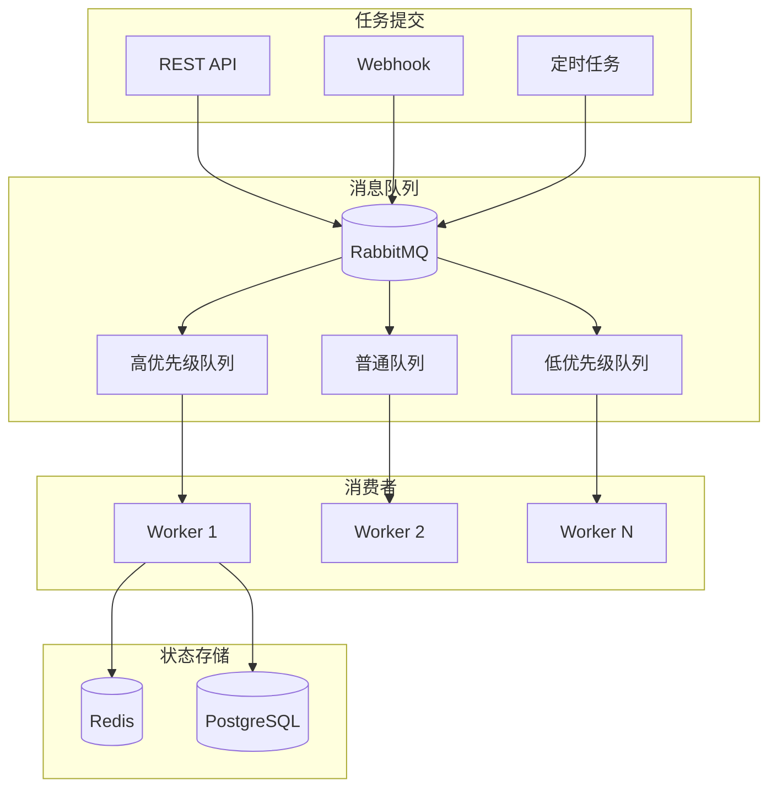
```mermaid
graph TD
    subgraph 任务提交
        API[REST API]
        Webhook[Webhook]
        Scheduler[定时任务]
    end

    subgraph 消息队列
        RabbitMQ[(RabbitMQ)]
        HighPriority[高优先级队列]
        NormalPriority[普通队列]
        LowPriority[低优先级队列]
    end

    subgraph 消费者
        Worker1[Worker 1]
        Worker2[Worker 2]
        WorkerN[Worker N]
    end

    subgraph 状态存储
        Redis[(Redis)]
        PG[(PostgreSQL)]
    end

    API --> RabbitMQ
    Webhook --> RabbitMQ
    Scheduler --> RabbitMQ

    RabbitMQ --> HighPriority
    RabbitMQ --> NormalPriority
    RabbitMQ --> LowPriority

    HighPriority --> Worker1
    NormalPriority --> Worker2
    LowPriority --> WorkerN

    Worker1 --> Redis
    Worker1 --> PG
```

### 8.2 任务类型

| 任务类型         | 优先级 | 超时时间 | 说明       |
| ---------------- | ------ | -------- | ---------- |
| `parse_document` | Normal | 30min    | 单文档解析 |
| `batch_import`   | Low    | 2h       | 批量导入   |
| `reindex`        | Low    | 1h       | 重新索引   |
| `delete_docs`    | High   | 5min     | 删除文档   |
| `update_chunks`  | Normal | 15min    | 更新分块   |

### 8.3 任务状态机

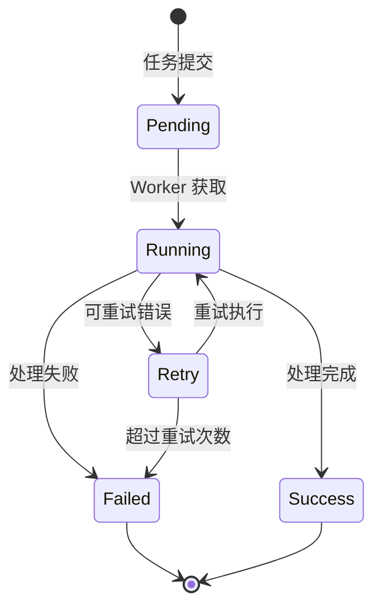
```mermaid
stateDiagram-v2
    [*] --> Pending: 任务提交
    Pending --> Running: Worker 获取
    Running --> Success: 处理完成
    Running --> Failed: 处理失败
    Running --> Retry: 可重试错误
    Retry --> Running: 重试执行
    Retry --> Failed: 超过重试次数
    Failed --> [*]
    Success --> [*]
```

### 8.4 任务进度追踪

| 字段              | 类型     | 说明               |
| ----------------- | -------- | ------------------ |
| `task_id`         | string   | 任务唯一标识       |
| `status`          | enum     | 任务状态           |
| `progress`        | float    | 进度百分比 (0-100) |
| `total_items`     | int      | 总项目数           |
| `processed_items` | int      | 已处理项目数       |
| `failed_items`    | int      | 失败项目数         |
| `error_message`   | string   | 错误信息           |
| `started_at`      | datetime | 开始时间           |
| `completed_at`    | datetime | 完成时间           |

---

## 9. REST API 设计

### 9.1 接口概览

| 端点                               | 方法   | 描述            |
| ---------------------------------- | ------ | --------------- |
| `/api/v1/documents`                | POST   | 上传文档        |
| `/api/v1/documents/{id}`           | GET    | 获取文档信息    |
| `/api/v1/documents/{id}`           | DELETE | 删除文档        |
| `/api/v1/documents/{id}/chunks`    | GET    | 获取文档分块    |
| `/api/v1/documents/{id}/reprocess` | POST   | 重新处理文档    |
| `/api/v1/batch`                    | POST   | 批量导入        |
| `/api/v1/tasks/{id}`               | GET    | 获取任务状态    |
| `/api/v1/tasks/{id}/cancel`        | POST   | 取消任务        |
| `/health`                          | GET    | 健康检查        |
| `/metrics`                         | GET    | Prometheus 指标 |

### 9.2 上传文档接口

#### 请求参数

| 字段           | 类型   | 必填 | 说明            |
| -------------- | ------ | ---- | --------------- |
| `file`         | file   | ✅   | 文档文件        |
| `collection`   | string | ✅   | 目标 Collection |
| `kb_id`        | string | ✅   | 知识库 ID       |
| `tenant_id`    | string | ✅   | 租户 ID         |
| `strategy`     | string | ❌   | 解析策略        |
| `chunk_config` | object | ❌   | 切片配置        |
| `metadata`     | object | ❌   | 自定义元数据    |
| `callback_url` | string | ❌   | 完成回调 URL    |

#### 响应结构

| 字段             | 类型   | 说明              |
| ---------------- | ------ | ----------------- |
| `task_id`        | string | 任务 ID           |
| `document_id`    | string | 文档 ID           |
| `status`         | string | 初始状态          |
| `estimated_time` | int    | 预估处理时间 (秒) |

### 9.3 批量导入接口

#### 请求参数

| 字段         | 类型   | 必填 | 说明            |
| ------------ | ------ | ---- | --------------- |
| `files`      | array  | ✅   | 文件列表        |
| `collection` | string | ✅   | 目标 Collection |
| `kb_id`      | string | ✅   | 知识库 ID       |
| `parallel`   | int    | ❌   | 并行处理数      |
| `on_error`   | string | ❌   | 错误处理策略    |

### 9.4 任务状态接口

#### 响应结构

| 字段         | 类型   | 说明       |
| ------------ | ------ | ---------- |
| `task_id`    | string | 任务 ID    |
| `status`     | enum   | 任务状态   |
| `progress`   | float  | 进度百分比 |
| `result`     | object | 处理结果   |
| `error`      | object | 错误信息   |
| `created_at` | string | 创建时间   |
| `updated_at` | string | 更新时间   |

---

## 10. 性能优化设计

### 10.1 优化策略

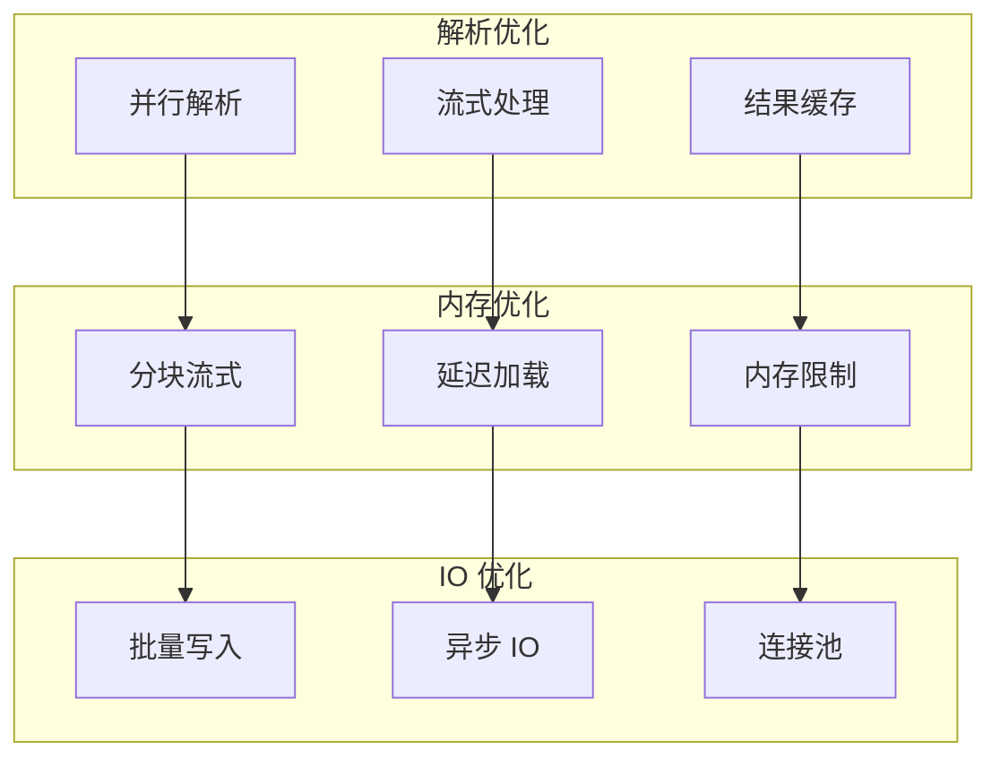
```mermaid
graph TD
    subgraph 解析优化
        ParallelParse[并行解析]
        StreamProcess[流式处理]
        CacheResult[结果缓存]
    end

    subgraph 内存优化
        ChunkStream[分块流式]
        LazyLoad[延迟加载]
        MemoryLimit[内存限制]
    end

    subgraph IO 优化
        BatchWrite[批量写入]
        AsyncIO[异步 IO]
        ConnectionPool[连接池]
    end

    ParallelParse --> ChunkStream
    StreamProcess --> LazyLoad
    CacheResult --> MemoryLimit

    ChunkStream --> BatchWrite
    LazyLoad --> AsyncIO
    MemoryLimit --> ConnectionPool
```

### 10.2 大文件处理

| 文件大小     | 处理策略            |
| ------------ | ------------------- |
| < 10MB       | 内存直接处理        |
| 10MB - 100MB | 流式分页处理        |
| 100MB - 1GB  | 分块处理 + 临时文件 |
| > 1GB        | 专用队列 + 资源隔离 |

### 10.3 性能指标

| 指标           | 目标值         | 说明      |
| -------------- | -------------- | --------- |
| 解析速度       | > 10 页/秒     | PDF 文档  |
| Embedding 速度 | > 100 块/秒    | 批量处理  |
| 内存占用       | < 4GB          | 单 Worker |
| 队列吞吐       | > 50 任务/分钟 | 普通任务  |

---

## 11. 可观测性设计

### 11.1 链路追踪

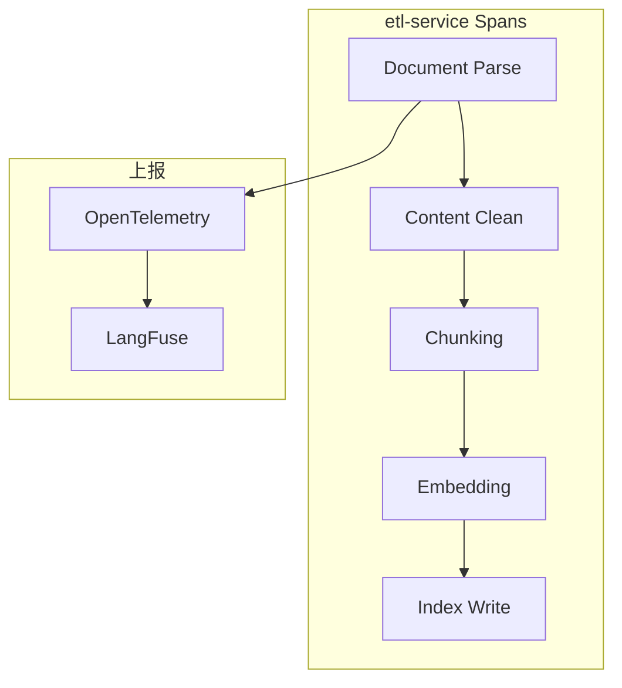
```mermaid
graph TD
    subgraph etl-service Spans
        ParseSpan[Document Parse]
        CleanSpan[Content Clean]
        ChunkSpan[Chunking]
        EmbedSpan[Embedding]
        IndexSpan[Index Write]
    end

    subgraph 上报
        OTLP[OpenTelemetry]
        LangFuse[LangFuse]
    end

    ParseSpan --> CleanSpan
    CleanSpan --> ChunkSpan
    ChunkSpan --> EmbedSpan
    EmbedSpan --> IndexSpan

    ParseSpan --> OTLP
    OTLP --> LangFuse
```

### 11.2 关键指标

| 指标名称                  | 类型      | 说明           |
| ------------------------- | --------- | -------------- |
| `etl.documents.processed` | Counter   | 处理文档总数   |
| `etl.documents.failed`    | Counter   | 失败文档数     |
| `etl.parse.duration`      | Histogram | 解析耗时       |
| `etl.chunk.count`         | Histogram | 切片数量分布   |
| `etl.embedding.duration`  | Histogram | Embedding 耗时 |
| `etl.queue.length`        | Gauge     | 队列长度       |
| `etl.worker.active`       | Gauge     | 活跃 Worker 数 |
| `etl.file.size`           | Histogram | 文件大小分布   |

### 11.3 日志规范

| 日志级别 | 使用场景                       |
| -------- | ------------------------------ |
| ERROR    | 解析失败、入库错误、队列异常   |
| WARN     | OCR 质量低、超时重试、资源紧张 |
| INFO     | 任务开始/完成、文档统计        |
| DEBUG    | 切片详情、元素类型、处理步骤   |
| TRACE    | 完整内容、原始解析结果         |

---

## 12. 错误处理设计

### 12.1 错误分类

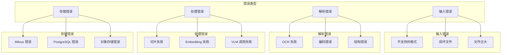
```mermaid
graph TD
    subgraph 错误类型
        Input[输入错误]
        Parse[解析错误]
        Process[处理错误]
        Storage[存储错误]
    end

    subgraph 输入错误
        UnsupportedFormat[不支持的格式]
        CorruptFile[损坏文件]
        TooLarge[文件过大]
    end

    subgraph 解析错误
        OCRFailed[OCR 失败]
        EncodingError[编码错误]
        StructureError[结构错误]
    end

    subgraph 处理错误
        ChunkFailed[切片失败]
        EmbedFailed[Embedding 失败]
        VLMFailed[VLM 调用失败]
    end

    subgraph 存储错误
        MilvusError[Milvus 错误]
        PGError[PostgreSQL 错误]
        S3Error[对象存储错误]
    end

    Input --> UnsupportedFormat
    Input --> CorruptFile
    Input --> TooLarge

    Parse --> OCRFailed
    Parse --> EncodingError
    Parse --> StructureError

    Process --> ChunkFailed
    Process --> EmbedFailed
    Process --> VLMFailed

    Storage --> MilvusError
    Storage --> PGError
    Storage --> S3Error
```

### 12.2 错误处理策略

| 错误类型        | 处理策略             | 是否重试  |
| --------------- | -------------------- | --------- |
| 不支持的格式    | 返回错误，标记跳过   | ❌        |
| 文件损坏        | 尝试修复，失败则跳过 | ❌        |
| OCR 失败        | 降级为纯文本提取     | ✅ (1 次) |
| Embedding 超时  | 重试后使用备用模型   | ✅ (3 次) |
| Milvus 连接失败 | 重试后进入死信队列   | ✅ (5 次) |
| VLM 调用失败    | 降级跳过 VLM 增强    | ✅ (2 次) |

### 12.3 降级策略

| 降级场景           | 降级策略               |
| ------------------ | ---------------------- |
| VLM 服务不可用     | 禁用 VLM，使用传统 OCR |
| Embedding 服务超时 | 使用本地轻量模型       |
| Milvus 写入失败    | 暂存本地，稍后重试     |
| 内存不足           | 降低并发，启用流式处理 |

---

## 13. 安全设计

### 13.1 文件安全

```mermaid
graph TD
    subgraph 文件安全
        Scan[病毒扫描]
        TypeCheck[类型验证]
        SizeLimit[大小限制]
        Sanitize[内容消毒]
    end

    subgraph 病毒扫描
        ClamAV[ClamAV]
        ThirdParty[第三方服务]
    end

    subgraph 类型验证
        MagicBytes[魔数检测]
        Extension[扩展名验证]
        MIMECheck[MIME 验证]
    end

    Scan --> ClamAV
    Scan --> ThirdParty
    TypeCheck --> MagicBytes
    TypeCheck --> Extension
    TypeCheck --> MIMECheck
```

### 13.2 安全措施

| 安全措施     | 说明               |
| ------------ | ------------------ |
| 文件类型验证 | 白名单 + 魔数检测  |
| 文件大小限制 | 单文件最大 500MB   |
| 路径遍历防护 | 禁止 `..` 等路径   |
| 临时文件清理 | 处理完成后立即删除 |
| 内容脱敏     | 可配置敏感信息过滤 |
| 租户隔离     | 存储路径按租户隔离 |

### 13.3 访问控制

| 操作         | 权限要求      |
| ------------ | ------------- |
| 上传文档     | WRITE         |
| 查看任务状态 | READ          |
| 删除文档     | DELETE        |
| 批量导入     | WRITE + BATCH |
| 管理配置     | ADMIN         |

---

## 14. 配置管理

### 14.1 配置分层

```mermaid
graph TD
    subgraph 配置层级
        Env[环境变量]
        ConfigFile[配置文件]
        Default[代码默认值]
    end

    Env -->|最高优先级| ConfigFile
    ConfigFile --> Default
```

### 14.2 核心配置项

| 配置分类  | 配置项               | 默认值      | 说明          |
| --------- | -------------------- | ----------- | ------------- |
| Server    | http.port            | 8001        | HTTP 端口     |
| Parse     | parse.strategy       | auto        | 默认解析策略  |
| Parse     | parse.ocr_languages  | chi_sim,eng | OCR 语言      |
| Chunk     | chunk.max_characters | 1000        | 最大字符数    |
| Chunk     | chunk.overlap        | 100         | 重叠字符数    |
| VLM       | vlm.enabled          | false       | VLM 启用      |
| VLM       | vlm.model            | -           | VLM 模型      |
| Embedding | embedding.endpoint   | -           | Embedding API |
| Embedding | embedding.batch_size | 100         | 批处理大小    |
| Queue     | queue.broker_url     | -           | RabbitMQ URL  |
| Queue     | queue.concurrency    | 4           | Worker 并发数 |
| Storage   | storage.milvus_host  | localhost   | Milvus 地址   |
| Storage   | storage.s3_bucket    | -           | S3 存储桶     |

---

## 15. 部署架构

### 15.1 开发环境

```mermaid
graph TD
    subgraph 本地开发
        IDE[IDE]
        LocalService[etl-service<br/>localhost:8001]
        LocalQueue[RabbitMQ]
        LocalMilvus[Milvus]
    end

    IDE --> LocalService
    LocalService --> LocalQueue
    LocalService --> LocalMilvus
```

### 15.2 生产环境

```mermaid
graph TD
    subgraph K8s Cluster
        subgraph API Deployment
            API1[API Pod 1]
            API2[API Pod 2]
        end

        subgraph Worker Deployment
            Worker1[Worker Pod 1]
            Worker2[Worker Pod 2]
            WorkerN[Worker Pod N]
        end

        APIService[API Service]
        HPA[Horizontal Pod Autoscaler]
    end

    subgraph Message Queue
        RabbitMQ[RabbitMQ Cluster]
    end

    subgraph Storage
        Milvus[Milvus Cluster]
        S3[对象存储]
    end

    APIService --> API1
    APIService --> API2
    API1 --> RabbitMQ
    RabbitMQ --> Worker1
    RabbitMQ --> Worker2
    RabbitMQ --> WorkerN
    HPA --> Worker1
    Worker1 --> Milvus
    Worker1 --> S3
```

### 15.3 资源配置建议

| 环境 | API Pod | Worker Pod | 副本数              |
| ---- | ------- | ---------- | ------------------- |
| 开发 | 1C 1G   | 2C 2G      | 1 API + 1 Worker    |
| 测试 | 2C 2G   | 4C 4G      | 2 API + 2 Worker    |
| 生产 | 4C 4G   | 8C 8G      | 3 API + 5-10 Worker |

---

## 16. 测试策略

### 16.1 测试金字塔

```mermaid
graph TD
    subgraph 测试层级
        E2E[端到端测试<br/>10%]
        Integration[集成测试<br/>30%]
        Unit[单元测试<br/>60%]
    end

    E2E --> Integration
    Integration --> Unit
```

### 16.2 测试场景

| 测试类型     | 覆盖场景                              |
| ------------ | ------------------------------------- |
| 单元测试     | 解析器、清洗器、切片器逻辑            |
| 集成测试     | Milvus 写入、消息队列、Embedding 调用 |
| 端到端测试   | 完整文档处理流程、批量导入            |
| 格式兼容测试 | 64+ 种文档格式解析正确性              |
| 压力测试     | 大文件处理、高并发任务、队列堆积      |

### 16.3 测试数据集

| 数据集     | 用途           | 规模               |
| ---------- | -------------- | ------------------ |
| 格式样本集 | 格式兼容性测试 | 每种格式 10+ 样本  |
| 边界测试集 | 异常文件处理   | 损坏/超大/加密文件 |
| 性能测试集 | 处理速度基准   | 1000+ 文档         |

---

## 17. 扩展性设计

### 17.1 扩展点

```mermaid
graph TD
    subgraph 扩展点
        ParserExt[Parser 扩展]
        CleanerExt[Cleaner 扩展]
        ChunkerExt[Chunker 扩展]
        StorageExt[Storage 扩展]
    end

    subgraph 实现
        CustomParser[自定义解析器]
        CustomCleaner[自定义清洗器]
        CustomChunker[自定义切片器]
        CustomStorage[自定义存储]
    end

    ParserExt --> CustomParser
    CleanerExt --> CustomCleaner
    ChunkerExt --> CustomChunker
    StorageExt --> CustomStorage
```

### 17.2 扩展接口

| 扩展点   | 接口/基类    | 扩展方式       |
| -------- | ------------ | -------------- |
| Parser   | BaseParser   | 继承实现 parse |
| Cleaner  | BaseCleaner  | 继承实现 clean |
| Chunker  | BaseChunker  | 继承实现 chunk |
| Embedder | BaseEmbedder | 继承实现 embed |
| Storage  | BaseStorage  | 继承实现 write |

---

## 18. 相关文档

- [后端开发计划总览](../backend-development-plan.md)
- [Data Service 设计](./01-data-service-design.md)
- [Inference Service 设计](./02-inference-service-design.md)
- [AI Core Service 设计](./03-ai-core-service-design.md)
- [RAG Service 设计](./04-rag-service-design.md)
- [Unstructured ETL 指南](../../技术选型/unstructured-etl-guide.md)
- [PostgreSQL & Milvus 存储指南](../../技术选型/postgresql-milvus-guide.md)
