# Dify Service 详细设计文档

> 版本：v1.1 | 优先级：P2 | 更新日期：2025-01
> 技术栈：Dify 1.11.x

## 1. 服务概述

### 1.1 服务定位

**dify-service** 是 AI 产品后端架构中的**低代码编排层**，基于 Dify 开源平台构建。它为非技术人员提供可视化的 AI 应用开发能力，同时通过 MCP (Model Context Protocol) 与 ai-core-service 实现深度集成，形成"低代码 + 专业开发"双轨并行的灵活架构。

### 1.2 核心职责

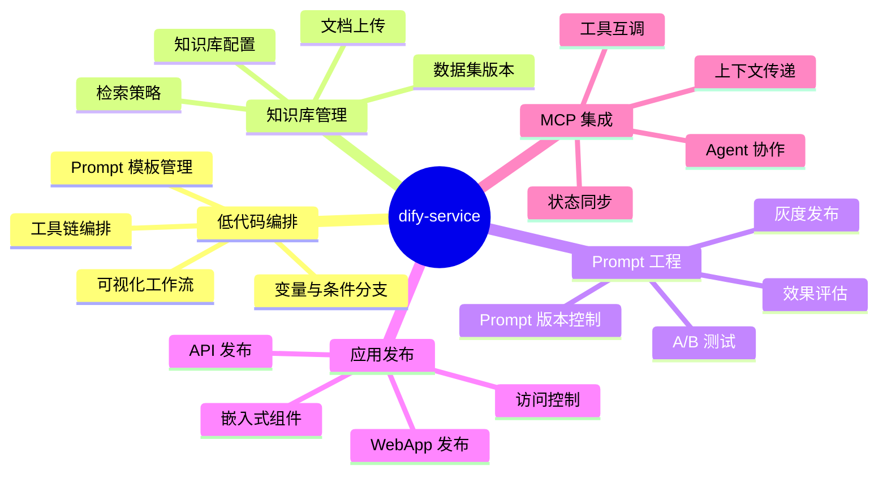
```mermaid
mindmap
  root((dify-service))
    低代码编排
      可视化工作流
      Prompt 模板管理
      变量与条件分支
      工具链编排
    知识库管理
      文档上传
      知识库配置
      检索策略
      数据集版本
    Prompt 工程
      Prompt 版本控制
      灰度发布
      A/B 测试
      效果评估
    应用发布
      API 发布
      WebApp 发布
      嵌入式组件
      访问控制
    MCP 集成
      工具互调
      Agent 协作
      上下文传递
      状态同步
```

### 1.3 服务边界

| 属于本服务职责      | 不属于本服务职责           |
| ------------------- | -------------------------- |
| 可视化工作流设计    | 底层 Agent 框架 (ai-core)  |
| 知识库上传与管理    | 高级 RAG 策略 (rag)        |
| Prompt 模板与版本   | 模型推理执行 (inference)   |
| 应用发布与 API 管理 | 文档解析处理 (etl)         |
| 非技术人员入口      | 业务数据存储 (data)        |
| MCP 协议通信        | 底层向量存储 (Milvus)      |
| 简单对话应用构建    | 复杂多智能体编排 (ai-core) |
| 灰度发布与 A/B 测试 | 链路追踪分析 (观测服务)    |
| 事件驱动工作流触发  | 业务规则引擎               |
| Knowledge Pipeline  | 底层存储管理               |

### 1.4 Dify 长期保留策略

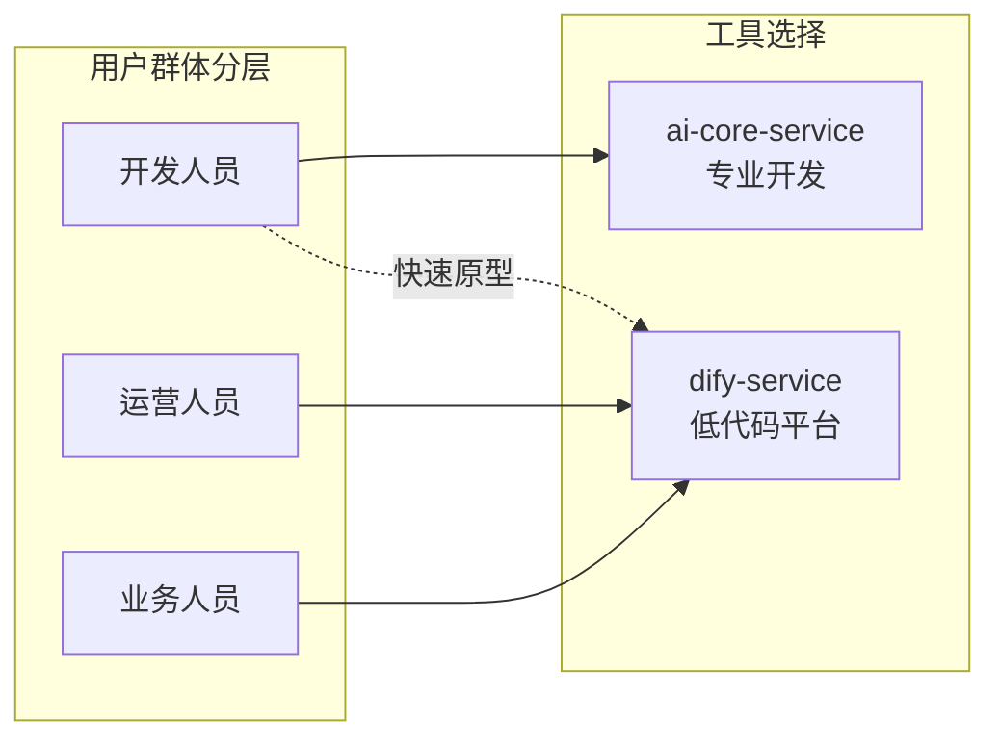
```mermaid
graph LR
    subgraph 用户群体分层
        Dev[开发人员]
        Ops[运营人员]
        Biz[业务人员]
    end

    subgraph 工具选择
        Core[ai-core-service<br/>专业开发]
        Dify[dify-service<br/>低代码平台]
    end

    Dev --> Core
    Ops --> Dify
    Biz --> Dify
    Dev -.->|快速原型| Dify
```

**保留理由**：

1. **降低使用门槛**：业务人员无需编程即可构建 AI 应用
2. **快速原型验证**：开发人员可快速验证想法后再转入代码开发
3. **Prompt 管理中心**：统一管理和版本控制 Prompt 模板
4. **灰度发布能力**：内置 A/B 测试和灰度发布机制

---

## 2. 系统架构

### 2.1 整体架构图

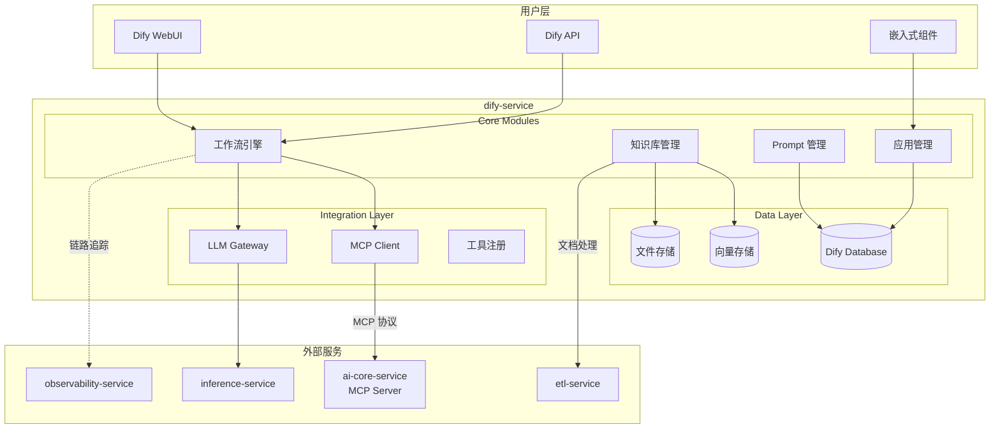
```mermaid
graph TD
    subgraph 用户层
        WebUI[Dify WebUI]
        API[Dify API]
        Embed[嵌入式组件]
    end

    subgraph dify-service
        subgraph Core Modules
            Workflow[工作流引擎]
            Knowledge[知识库管理]
            Prompt[Prompt 管理]
            App[应用管理]
        end

        subgraph Integration Layer
            MCPClient[MCP Client]
            LLMGateway[LLM Gateway]
            ToolRegistry[工具注册]
        end

        subgraph Data Layer
            DifyDB[(Dify Database)]
            VectorDB[(向量存储)]
            FileStore[(文件存储)]
        end
    end

    subgraph 外部服务
        AICore[ai-core-service<br/>MCP Server]
        Inference[inference-service]
        ETL[etl-service]
        Obs[observability-service]
    end

    WebUI --> Workflow
    API --> Workflow
    Embed --> App

    Workflow --> MCPClient
    Workflow --> LLMGateway
    Knowledge --> VectorDB
    Knowledge --> FileStore
    Prompt --> DifyDB
    App --> DifyDB

    MCPClient -->|MCP 协议| AICore
    LLMGateway --> Inference
    Knowledge -->|文档处理| ETL
    Workflow -.->|链路追踪| Obs
```

### 2.2 与 ai-core-service 的协作架构

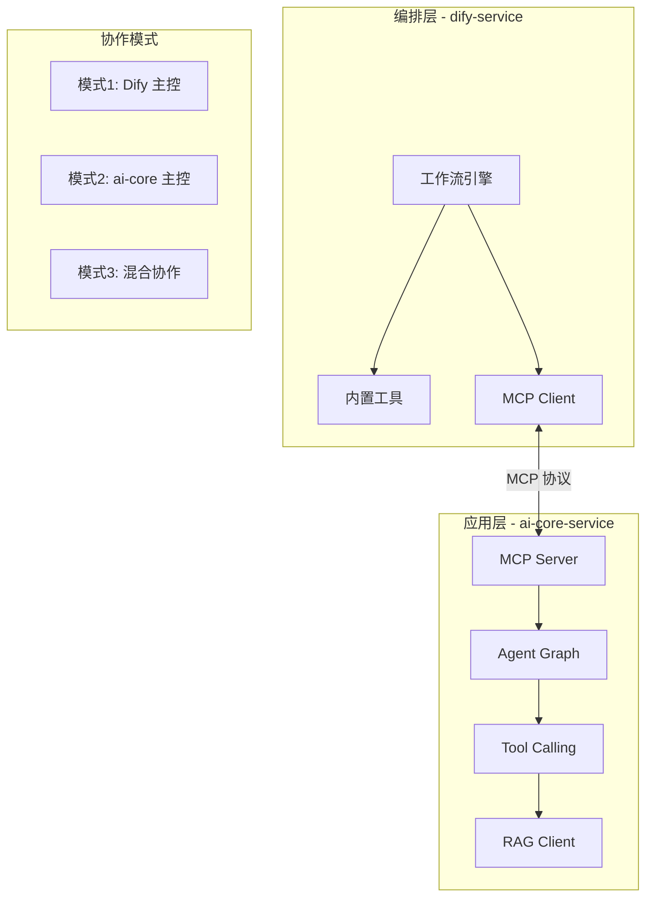
```mermaid
graph TB
    subgraph 编排层 - dify-service
        DifyFlow[工作流引擎]
        DifyTool[内置工具]
        DifyMCP[MCP Client]
    end

    subgraph 应用层 - ai-core-service
        MCPServer[MCP Server]
        AgentGraph[Agent Graph]
        ToolCalling[Tool Calling]
        RAGClient[RAG Client]
    end

    subgraph 协作模式
        Mode1[模式1: Dify 主控]
        Mode2[模式2: ai-core 主控]
        Mode3[模式3: 混合协作]
    end

    DifyFlow --> DifyTool
    DifyFlow --> DifyMCP
    DifyMCP <-->|MCP 协议| MCPServer

    MCPServer --> AgentGraph
    AgentGraph --> ToolCalling
    ToolCalling --> RAGClient
```

### 2.3 MCP 协议集成架构

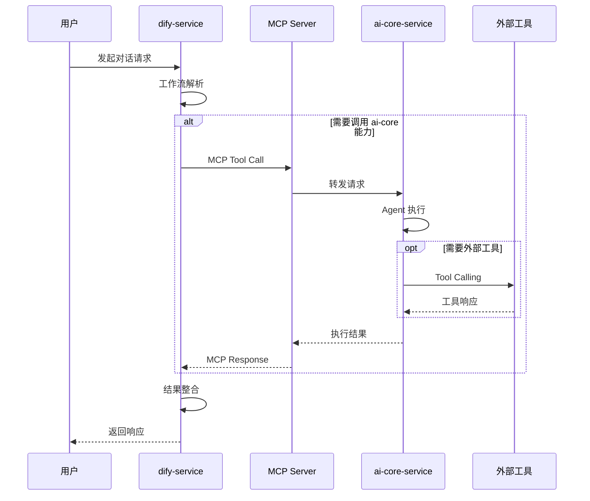
```mermaid
sequenceDiagram
    participant User as 用户
    participant Dify as dify-service
    participant MCP as MCP Server
    participant Core as ai-core-service
    participant Tools as 外部工具

    User->>Dify: 发起对话请求
    Dify->>Dify: 工作流解析

    alt 需要调用 ai-core 能力
        Dify->>MCP: MCP Tool Call
        MCP->>Core: 转发请求
        Core->>Core: Agent 执行

        opt 需要外部工具
            Core->>Tools: Tool Calling
            Tools-->>Core: 工具响应
        end

        Core-->>MCP: 执行结果
        MCP-->>Dify: MCP Response
    end

    Dify->>Dify: 结果整合
    Dify-->>User: 返回响应
```

---

## 3. 核心模块设计

### 3.1 工作流引擎

#### 3.1.1 工作流类型

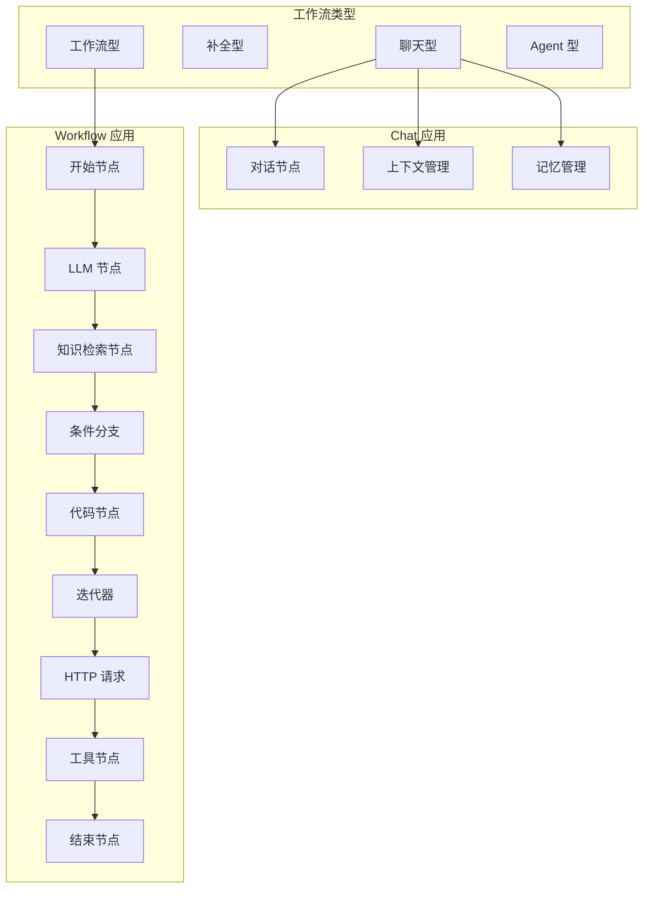
```mermaid
graph TD
    subgraph 工作流类型
        Chat[聊天型]
        Completion[补全型]
        Workflow[工作流型]
        Agent[Agent 型]
    end

    subgraph Chat 应用
        ChatNode[对话节点]
        Context[上下文管理]
        Memory[记忆管理]
    end

    subgraph Workflow 应用
        Start[开始节点]
        LLM[LLM 节点]
        Knowledge[知识检索节点]
        Code[代码节点]
        Condition[条件分支]
        Iterator[迭代器]
        HTTP[HTTP 请求]
        Tool[工具节点]
        End[结束节点]
    end

    Chat --> ChatNode
    Chat --> Context
    Chat --> Memory

    Workflow --> Start
    Start --> LLM
    LLM --> Knowledge
    Knowledge --> Condition
    Condition --> Code
    Code --> Iterator
    Iterator --> HTTP
    HTTP --> Tool
    Tool --> End
```

#### 3.1.2 节点类型详解

| 节点类型 | 功能描述               | 适用场景              |
| -------- | ---------------------- | --------------------- |
| LLM      | 调用大语言模型         | 文本生成、对话        |
| 知识检索 | 从知识库检索相关内容   | RAG 场景              |
| 代码执行 | 执行 Python/JavaScript | 数据处理、逻辑计算    |
| 条件分支 | 根据条件路由           | 业务逻辑分流          |
| 迭代器   | 循环处理列表数据       | 批量处理              |
| HTTP     | 调用外部 API           | 第三方服务集成        |
| 工具     | 调用注册的工具         | 扩展能力              |
| 变量聚合 | 合并多路输出           | 分支汇聚              |
| 模板转换 | Jinja2 模板渲染        | 格式化输出            |
| 问题分类 | 意图识别与分类         | 多轮对话路由          |
| Trigger  | 事件驱动触发 (v1.10+)  | Webhook/定时/插件触发 |

#### 3.1.3 工作流执行流程

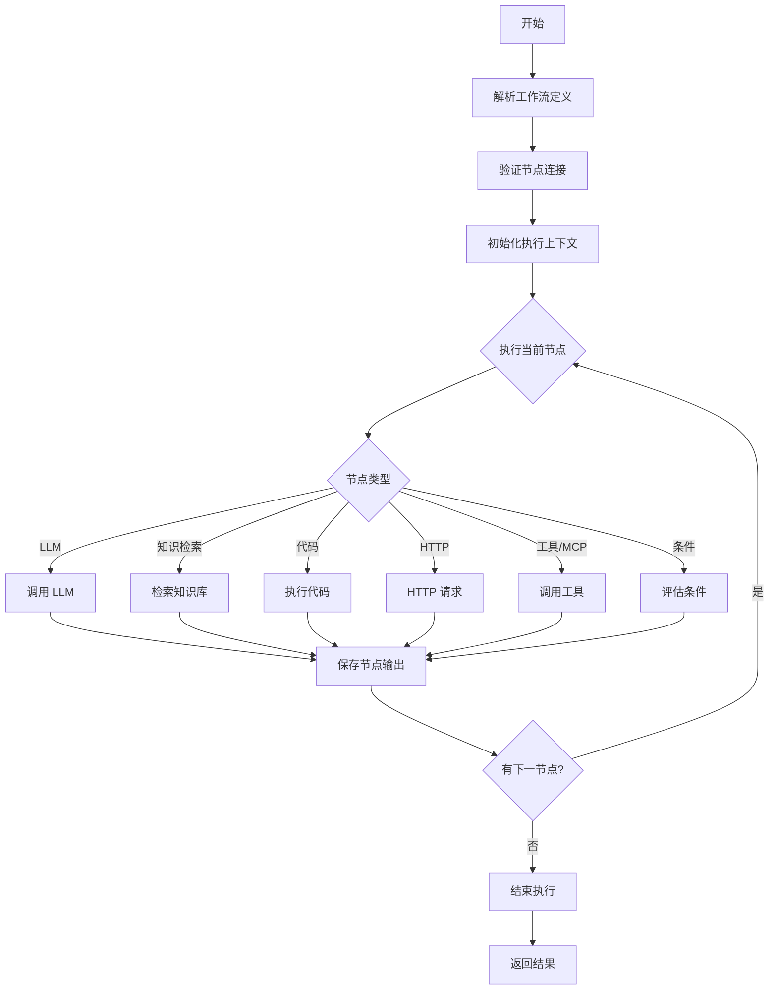
```mermaid
flowchart TD
    Start[开始] --> Parse[解析工作流定义]
    Parse --> Validate[验证节点连接]
    Validate --> Init[初始化执行上下文]

    Init --> Execute{执行当前节点}
    Execute --> NodeType{节点类型}

    NodeType -->|LLM| LLMExec[调用 LLM]
    NodeType -->|知识检索| KBExec[检索知识库]
    NodeType -->|代码| CodeExec[执行代码]
    NodeType -->|HTTP| HTTPExec[HTTP 请求]
    NodeType -->|工具/MCP| ToolExec[调用工具]
    NodeType -->|条件| CondExec[评估条件]

    LLMExec --> SaveOutput[保存节点输出]
    KBExec --> SaveOutput
    CodeExec --> SaveOutput
    HTTPExec --> SaveOutput
    ToolExec --> SaveOutput
    CondExec --> SaveOutput

    SaveOutput --> NextNode{有下一节点?}
    NextNode -->|是| Execute
    NextNode -->|否| Finish[结束执行]

    Finish --> Return[返回结果]
```

### 3.2 知识库管理

#### 3.2.1 知识库架构

> **v1.9+ 新增 Knowledge Pipeline**：支持可定制的知识处理流水线，包括模板化配置、自定义数据源、图片提取等高级功能。

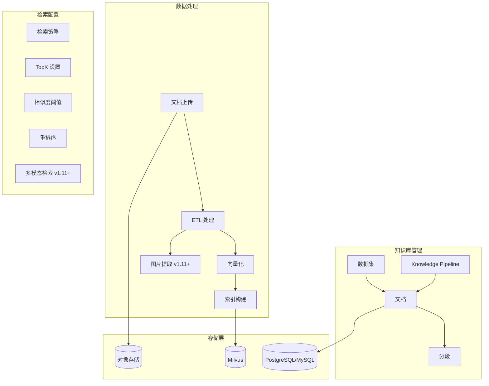
```mermaid
graph TD
    subgraph 知识库管理
        Dataset[数据集]
        Document[文档]
        Segment[分段]
        Pipeline[Knowledge Pipeline]
    end

    subgraph 数据处理
        Upload[文档上传]
        ETLProcess[ETL 处理]
        Embedding[向量化]
        Index[索引构建]
        ImageExtract[图片提取 v1.11+]
    end

    subgraph 检索配置
        Strategy[检索策略]
        TopK[TopK 设置]
        Score[相似度阈值]
        Rerank[重排序]
        Multimodal[多模态检索 v1.11+]
    end

    subgraph 存储层
        Milvus[(Milvus)]
        PG[(PostgreSQL/MySQL)]
        S3[(对象存储)]
    end

    Dataset --> Document
    Document --> Segment
    Pipeline --> Document

    Upload --> ETLProcess
    ETLProcess --> Embedding
    ETLProcess --> ImageExtract
    Embedding --> Index

    Index --> Milvus
    Document --> PG
    Upload --> S3
```

#### 3.2.2 知识库与 etl-service 集成

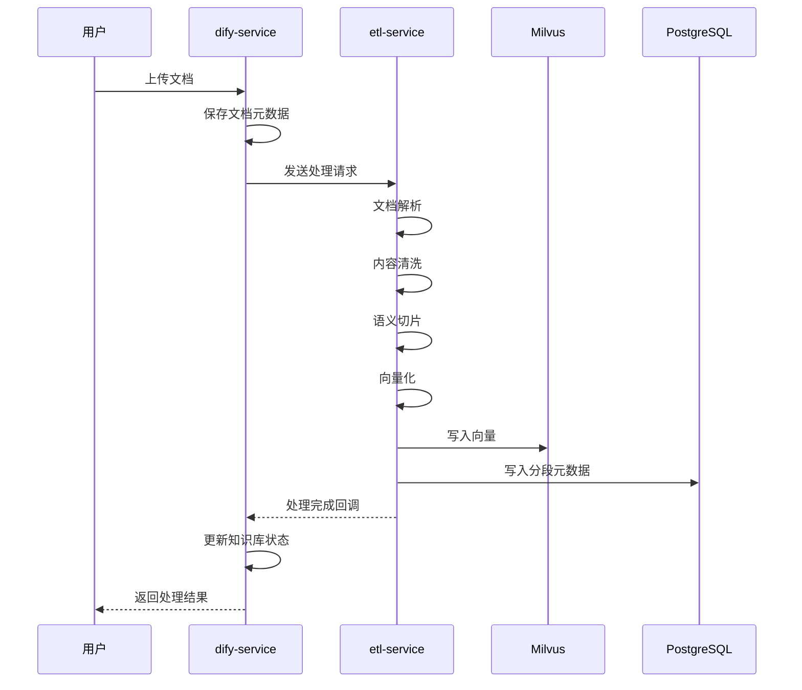
```mermaid
sequenceDiagram
    participant User as 用户
    participant Dify as dify-service
    participant ETL as etl-service
    participant Milvus as Milvus
    participant PG as PostgreSQL

    User->>Dify: 上传文档
    Dify->>Dify: 保存文档元数据
    Dify->>ETL: 发送处理请求

    ETL->>ETL: 文档解析
    ETL->>ETL: 内容清洗
    ETL->>ETL: 语义切片
    ETL->>ETL: 向量化

    ETL->>Milvus: 写入向量
    ETL->>PG: 写入分段元数据
    ETL-->>Dify: 处理完成回调

    Dify->>Dify: 更新知识库状态
    Dify-->>User: 返回处理结果
```

#### 3.2.3 检索策略配置

| 策略类型 | 描述                   | 适用场景     |
| -------- | ---------------------- | ------------ |
| 向量检索 | 基于语义相似度         | 通用场景     |
| 全文检索 | 基于关键词匹配         | 精确匹配场景 |
| 混合检索 | 向量 + 全文加权融合    | 综合场景     |
| N 选 1   | 多知识库轮询           | 领域划分场景 |
| 多路召回 | 多知识库并行检索后融合 | 跨领域场景   |
| 优先级   | 按知识库优先级顺序检索 | 层级知识场景 |
| 多模态   | 图文混合检索 (v1.11+)  | 图文问答场景 |

### 3.3 Prompt 管理

#### 3.3.1 Prompt 模板结构

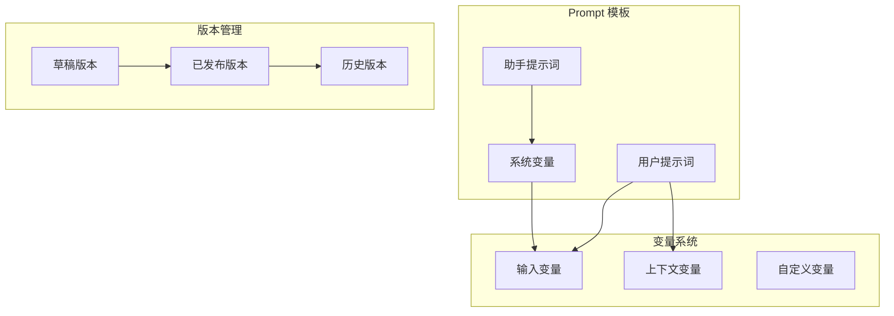
```mermaid
graph TD
    subgraph Prompt 模板
        System[系统提示词]
        User[用户提示词]
        Assistant[助手提示词]
    end

    subgraph 变量系统
        Input[输入变量]
        Context[上下文变量]
        System[系统变量]
        Custom[自定义变量]
    end

    subgraph 版本管理
        Draft[草稿版本]
        Published[已发布版本]
        History[历史版本]
    end

    System --> Input
    User --> Input
    User --> Context
    Assistant --> System

    Draft --> Published
    Published --> History
```

#### 3.3.2 Prompt 版本控制流程

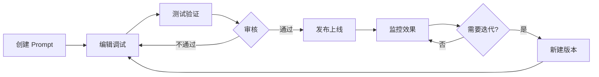
```mermaid
flowchart LR
    Create[创建 Prompt] --> Edit[编辑调试]
    Edit --> Test[测试验证]
    Test --> Review{审核}

    Review -->|通过| Publish[发布上线]
    Review -->|不通过| Edit

    Publish --> Monitor[监控效果]
    Monitor --> Iterate{需要迭代?}

    Iterate -->|是| NewVersion[新建版本]
    Iterate -->|否| Monitor

    NewVersion --> Edit
```

#### 3.3.3 灰度发布策略

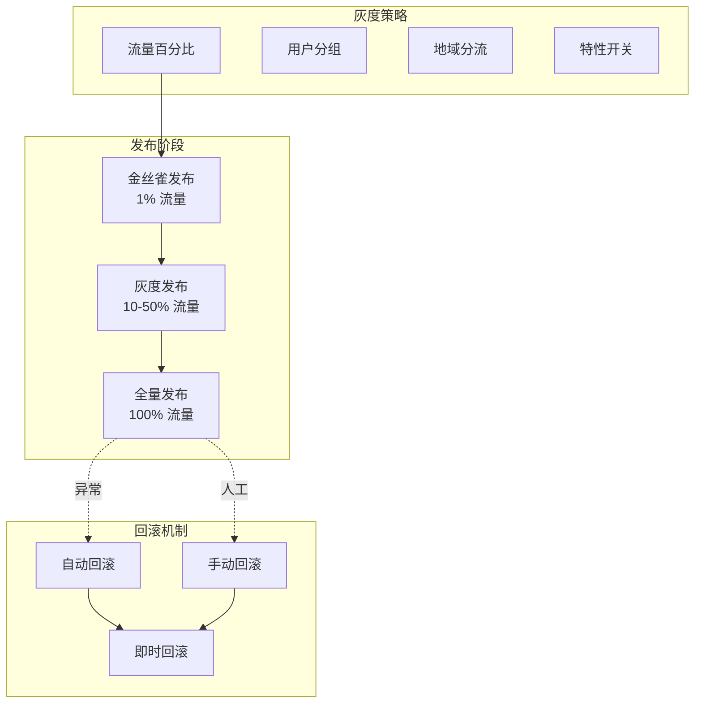
```mermaid
graph TD
    subgraph 灰度策略
        Percentage[流量百分比]
        UserGroup[用户分组]
        Region[地域分流]
        Feature[特性开关]
    end

    subgraph 发布阶段
        Canary[金丝雀发布<br/>1% 流量]
        Gray[灰度发布<br/>10-50% 流量]
        Full[全量发布<br/>100% 流量]
    end

    subgraph 回滚机制
        Auto[自动回滚]
        Manual[手动回滚]
        Instant[即时回滚]
    end

    Percentage --> Canary
    Canary --> Gray
    Gray --> Full

    Full -.->|异常| Auto
    Full -.->|人工| Manual
    Auto --> Instant
    Manual --> Instant
```

---

## 4. MCP 集成设计

### 4.1 MCP 协议概述

> **注意**：Dify v1.10.0 实现了 MCP specification 2025-06-18 版本。

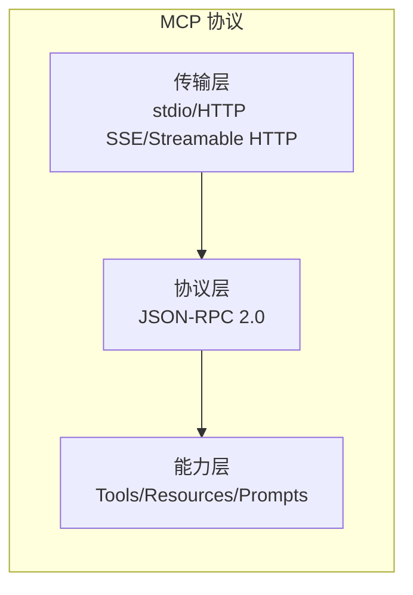
```mermaid
graph LR
    subgraph MCP 协议
        Transport[传输层<br/>stdio/HTTP SSE/Streamable HTTP]
        Protocol[协议层<br/>JSON-RPC 2.0]
        Capability[能力层<br/>Tools/Resources/Prompts]
    end

    Transport --> Protocol
    Protocol --> Capability
```

### 4.2 工具注册与发现

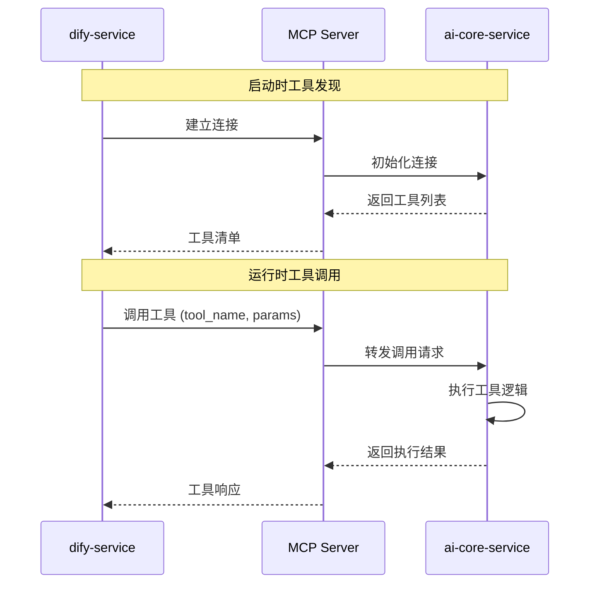
```mermaid
sequenceDiagram
    participant Dify as dify-service
    participant MCP as MCP Server
    participant Core as ai-core-service

    Note over Dify,Core: 启动时工具发现

    Dify->>MCP: 建立连接
    MCP->>Core: 初始化连接
    Core-->>MCP: 返回工具列表
    MCP-->>Dify: 工具清单

    Note over Dify,Core: 运行时工具调用

    Dify->>MCP: 调用工具 (tool_name, params)
    MCP->>Core: 转发调用请求
    Core->>Core: 执行工具逻辑
    Core-->>MCP: 返回执行结果
    MCP-->>Dify: 工具响应
```

### 4.3 MCP 工具分类

| 工具类别   | 来源            | 示例工具                    |
| ---------- | --------------- | --------------------------- |
| RAG 工具   | ai-core-service | search_knowledge, query_doc |
| 数据工具   | ai-core-service | get_user_data, save_record  |
| Agent 工具 | ai-core-service | run_agent, multi_agent_task |
| 外部工具   | ai-core-service | web_search, send_email      |
| 计算工具   | ai-core-service | calculate, data_analysis    |

### 4.4 上下文传递机制

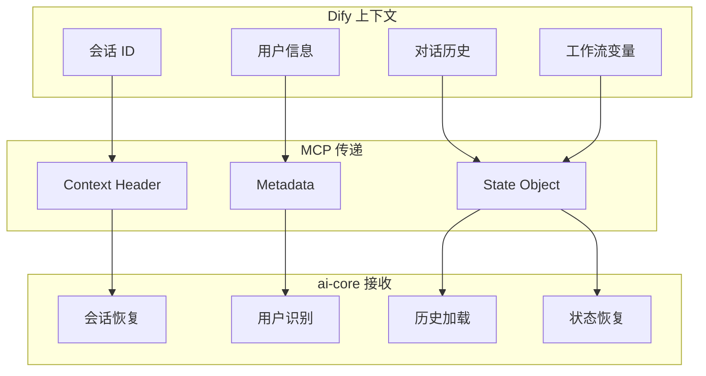
```mermaid
graph TD
    subgraph Dify 上下文
        Session[会话 ID]
        User[用户信息]
        History[对话历史]
        Vars[工作流变量]
    end

    subgraph MCP 传递
        Context[Context Header]
        Metadata[Metadata]
        State[State Object]
    end

    subgraph ai-core 接收
        CoreSession[会话恢复]
        CoreUser[用户识别]
        CoreHistory[历史加载]
        CoreState[状态恢复]
    end

    Session --> Context
    User --> Metadata
    History --> State
    Vars --> State

    Context --> CoreSession
    Metadata --> CoreUser
    State --> CoreHistory
    State --> CoreState
```

---

## 5. 事件驱动工作流 (Trigger) - v1.10+

### 5.1 Trigger 功能概述

Dify v1.10 引入了事件驱动工作流能力，允许工作流由外部事件自动触发执行，而非仅通过 API 调用。

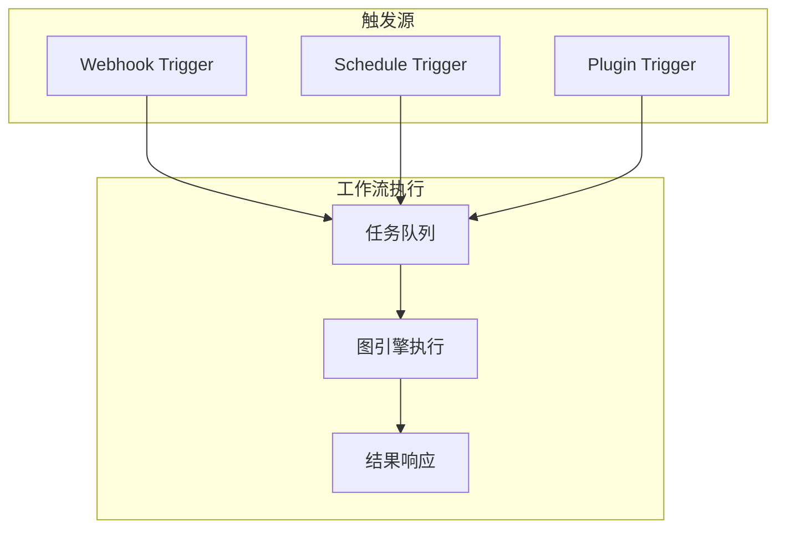
```mermaid
graph TD
    subgraph 触发源
        Webhook[Webhook Trigger]
        Schedule[Schedule Trigger]
        Plugin[Plugin Trigger]
    end

    subgraph 工作流执行
        Queue[任务队列]
        Engine[图引擎执行]
        Response[结果响应]
    end

    Webhook --> Queue
    Schedule --> Queue
    Plugin --> Queue
    Queue --> Engine
    Engine --> Response
```

### 5.2 Trigger 类型

| Trigger 类型 | 描述                           | 适用场景                                |
| ------------ | ------------------------------ | --------------------------------------- |
| Webhook      | 接收外部 HTTP 请求触发         | 第三方系统集成、GitHub PR、Discord 消息 |
| Schedule     | 定时触发（分钟/小时/天/周/月） | 定期报告生成、数据同步                  |
| Plugin       | 通过插件扩展的触发器           | 自定义事件源                            |

### 5.3 Trigger 配置示例

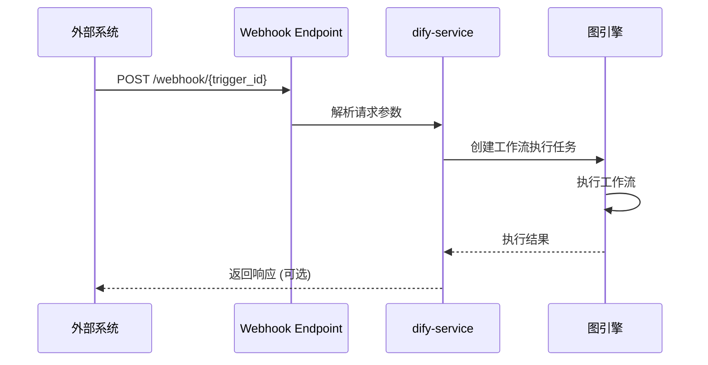
```mermaid
sequenceDiagram
    participant Ext as 外部系统
    participant Webhook as Webhook Endpoint
    participant Dify as dify-service
    participant Engine as 图引擎

    Ext->>Webhook: POST /webhook/{trigger_id}
    Webhook->>Dify: 解析请求参数
    Dify->>Engine: 创建工作流执行任务
    Engine->>Engine: 执行工作流
    Engine-->>Dify: 执行结果
    Dify-->>Ext: 返回响应 (可选)
```

### 5.4 与传统 API 调用的对比

| 特性     | API 调用         | Trigger        |
| -------- | ---------------- | -------------- |
| 触发方式 | 主动调用         | 被动触发       |
| 实时性   | 同步             | 异步/同步      |
| 适用场景 | 业务系统集成     | 事件驱动自动化 |
| 复杂度   | 需要开发集成代码 | 可视化配置     |

---

## 6. 应用发布设计

### 5.1 发布渠道

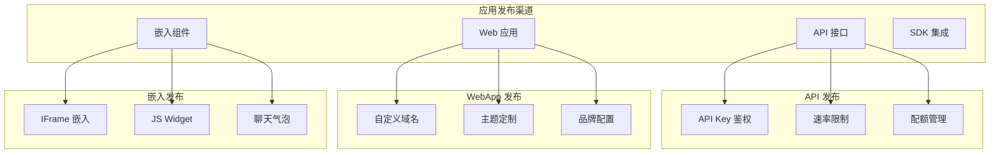
```mermaid
graph TD
    subgraph 应用发布渠道
        API[API 接口]
        WebApp[Web 应用]
        Embed[嵌入组件]
        SDK[SDK 集成]
    end

    subgraph API 发布
        APIKey[API Key 鉴权]
        RateLimit[速率限制]
        Quota[配额管理]
    end

    subgraph WebApp 发布
        CustomDomain[自定义域名]
        Theme[主题定制]
        Branding[品牌配置]
    end

    subgraph 嵌入发布
        IFrame[IFrame 嵌入]
        JSWidget[JS Widget]
        ChatBubble[聊天气泡]
    end

    API --> APIKey
    API --> RateLimit
    API --> Quota

    WebApp --> CustomDomain
    WebApp --> Theme
    WebApp --> Branding

    Embed --> IFrame
    Embed --> JSWidget
    Embed --> ChatBubble
```

### 5.2 访问控制

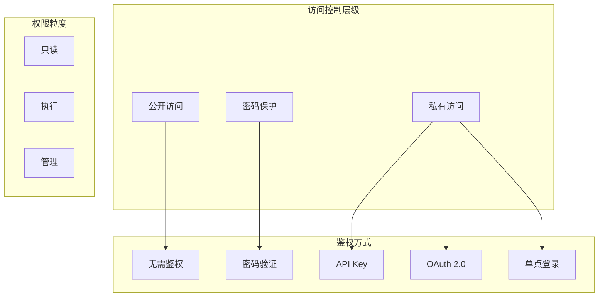
```mermaid
graph TD
    subgraph 访问控制层级
        Public[公开访问]
        Protected[密码保护]
        Private[私有访问]
    end

    subgraph 鉴权方式
        None[无需鉴权]
        Password[密码验证]
        APIKey[API Key]
        OAuth[OAuth 2.0]
        SSO[单点登录]
    end

    subgraph 权限粒度
        Read[只读]
        Execute[执行]
        Admin[管理]
    end

    Public --> None
    Protected --> Password
    Private --> APIKey
    Private --> OAuth
    Private --> SSO
```

### 5.3 应用监控

| 监控维度 | 指标                 | 告警阈值         |
| -------- | -------------------- | ---------------- |
| 调用量   | QPS、日调用次数      | 超过配额 80%     |
| 延迟     | P50、P95、P99 延迟   | P99 > 10s        |
| 成功率   | 成功/失败比例        | 成功率 < 95%     |
| Token    | 输入/输出 Token 消耗 | 单次 > 16K Token |
| 费用     | 累计 API 调用费用    | 超预算 90%       |
| 用户     | DAU、MAU、留存率     | 日活下降 > 20%   |

---

## 7. 数据模型设计

### 6.1 核心实体关系

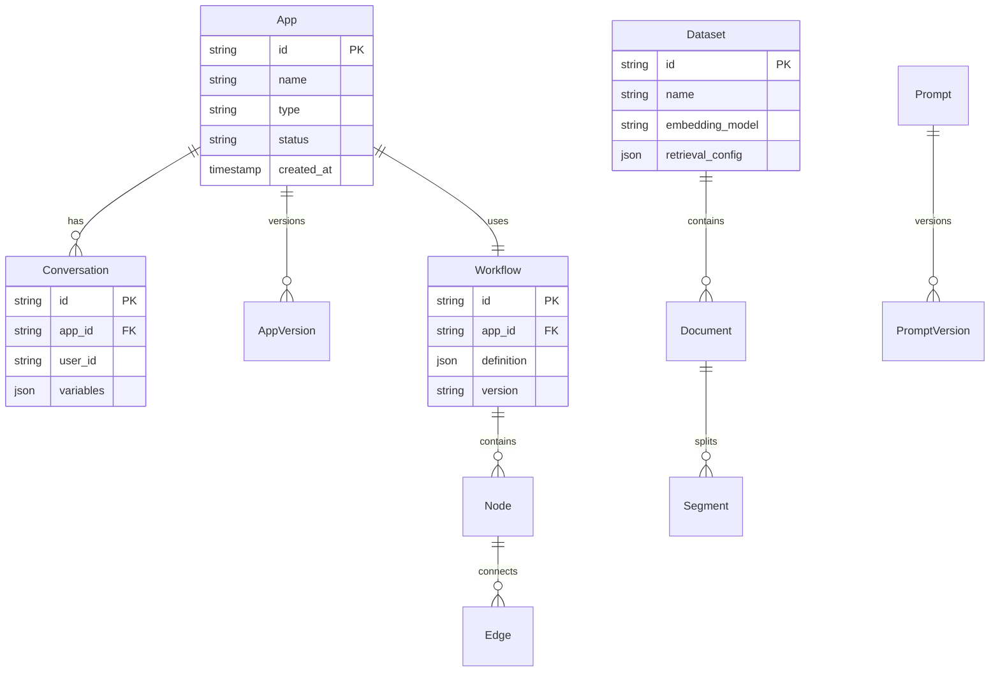
```mermaid
erDiagram
    App ||--o{ Conversation : has
    App ||--o{ AppVersion : versions
    App ||--|| Workflow : uses

    Workflow ||--o{ Node : contains
    Node ||--o{ Edge : connects

    Dataset ||--o{ Document : contains
    Document ||--o{ Segment : splits

    Prompt ||--o{ PromptVersion : versions

    App {
        string id PK
        string name
        string type
        string status
        timestamp created_at
    }

    Workflow {
        string id PK
        string app_id FK
        json definition
        string version
    }

    Dataset {
        string id PK
        string name
        string embedding_model
        json retrieval_config
    }

    Conversation {
        string id PK
        string app_id FK
        string user_id
        json variables
    }
```

### 6.2 工作流定义模型

```mermaid
graph TD
    subgraph Workflow Definition
        Meta[元信息]
        Graph[图结构]
        Config[配置]
    end

    subgraph Graph 结构
        Nodes[节点列表]
        Edges[边列表]
        Variables[变量定义]
    end

    subgraph Node 定义
        NodeID[节点 ID]
        NodeType[节点类型]
        NodeConfig[节点配置]
        Position[位置坐标]
    end

    subgraph Edge 定义
        Source[源节点]
        Target[目标节点]
        Condition[条件表达式]
    end

    Meta --> Graph
    Graph --> Config

    Graph --> Nodes
    Graph --> Edges
    Graph --> Variables

    Nodes --> NodeID
    Nodes --> NodeType
    Nodes --> NodeConfig
    Nodes --> Position

    Edges --> Source
    Edges --> Target
    Edges --> Condition
```

---

## 8. 部署架构

### 7.1 部署拓扑

```mermaid
graph TD
    subgraph 负载均衡
        LB[Nginx / Traefik]
    end

    subgraph Dify 服务
        API1[Dify API 1]
        API2[Dify API 2]
        Worker1[Celery Worker 1]
        Worker2[Celery Worker 2]
        Web[Dify Web]
    end

    subgraph 缓存层
        Redis[(Redis)]
    end

    subgraph 消息队列
        RabbitMQ[(RabbitMQ)]
    end

    subgraph 数据层
        PG[(PostgreSQL)]
        Milvus[(Milvus)]
        S3[(对象存储)]
    end

    LB --> API1
    LB --> API2
    LB --> Web

    API1 --> Redis
    API2 --> Redis
    API1 --> RabbitMQ
    API2 --> RabbitMQ

    RabbitMQ --> Worker1
    RabbitMQ --> Worker2

    API1 --> PG
    API2 --> PG
    Worker1 --> Milvus
    Worker2 --> Milvus
    Worker1 --> S3
    Worker2 --> S3
```

### 7.2 容器化部署

| 服务     | 镜像                       | 资源配置    | 副本数 |
| -------- | -------------------------- | ----------- | ------ |
| dify-api | langgenius/dify-api:1.11.x | 2C4G        | 2      |
| dify-web | langgenius/dify-web:1.11.x | 1C2G        | 2      |
| worker   | langgenius/dify-api:1.11.x | 2C4G        | 2      |
| redis    | redis:7                    | 1C2G        | 1      |
| sandbox  | langgenius/dify-sandbox    | 2C4G (隔离) | 1      |

### 7.3 环境配置

| 环境变量                     | 说明                | 示例值                  |
| ---------------------------- | ------------------- | ----------------------- |
| SECRET_KEY                   | 应用密钥            | sk-xxx                  |
| DB_TYPE                      | 数据库类型 (v1.10+) | postgresql / mysql      |
| DB_HOST                      | 数据库地址          | postgres                |
| REDIS_HOST                   | Redis 地址          | redis                   |
| STORAGE_TYPE                 | 存储类型            | s3                      |
| VECTOR_STORE                 | 向量库类型          | milvus                  |
| MCP_SERVER_URL               | MCP 服务地址        | http://ai-core:8080/mcp |
| LANGFUSE_ENABLED             | 是否启用 LangFuse   | true                    |
| LANGFUSE_PUBLIC_KEY          | LangFuse 公钥       | pk-xxx                  |
| WORKFLOW_MAX_EXECUTION_STEPS | 最大执行步数        | 500                     |
| WORKFLOW_MAX_EXECUTION_TIME  | 最大执行时间(秒)    | 1200                    |

---

## 9. 可观测性设计

### 8.1 监控指标

```mermaid
graph TD
    subgraph 业务指标
        AppMetrics[应用指标]
        WorkflowMetrics[工作流指标]
        KnowledgeMetrics[知识库指标]
    end

    subgraph 应用指标
        Calls[调用次数]
        Latency[响应延迟]
        Tokens[Token 消耗]
        Errors[错误率]
    end

    subgraph 工作流指标
        ExecTime[执行时间]
        NodeStats[节点统计]
        BranchRatio[分支比例]
    end

    subgraph 知识库指标
        QueryQPS[检索 QPS]
        HitRate[命中率]
        Relevance[相关性分数]
    end

    AppMetrics --> Calls
    AppMetrics --> Latency
    AppMetrics --> Tokens
    AppMetrics --> Errors

    WorkflowMetrics --> ExecTime
    WorkflowMetrics --> NodeStats
    WorkflowMetrics --> BranchRatio

    KnowledgeMetrics --> QueryQPS
    KnowledgeMetrics --> HitRate
    KnowledgeMetrics --> Relevance
```

### 8.2 日志规范

| 日志级别 | 场景                 | 示例                       |
| -------- | -------------------- | -------------------------- |
| DEBUG    | 工作流节点执行详情   | 节点输入输出变量           |
| INFO     | 应用调用、工作流执行 | 调用开始/结束、执行时长    |
| WARN     | 重试、降级           | MCP 调用重试、模型降级     |
| ERROR    | 执行失败、异常       | 节点执行失败、工具调用异常 |

### 8.3 链路追踪集成

```mermaid
sequenceDiagram
    participant Dify as dify-service
    participant LangFuse as LangFuse
    participant Core as ai-core-service

    Dify->>LangFuse: 创建 Trace
    Dify->>Dify: 工作流执行

    loop 每个节点
        Dify->>LangFuse: 记录 Span (节点执行)
    end

    alt MCP 调用
        Dify->>Core: MCP 请求
        Core->>LangFuse: 记录 Span (ai-core)
        Core-->>Dify: MCP 响应
    end

    Dify->>LangFuse: 结束 Trace
```

---

## 10. 安全设计

### 9.1 安全层级

```mermaid
graph TD
    subgraph 网络层
        TLS[TLS 加密传输]
        Firewall[防火墙规则]
        VPC[VPC 隔离]
    end

    subgraph 应用层
        Auth[身份认证]
        RBAC[角色权限]
        RateLimit[速率限制]
    end

    subgraph 数据层
        Encrypt[数据加密]
        Mask[敏感脱敏]
        Backup[数据备份]
    end

    subgraph 运行时
        Sandbox[代码沙箱]
        Isolation[进程隔离]
        Audit[审计日志]
    end
```

### 9.2 代码执行沙箱

```mermaid
graph LR
    subgraph 沙箱架构
        CodeNode[代码节点] --> Sandbox[DifySandbox]
        Sandbox --> Container[隔离容器]
        Container --> Execute[受限执行]
    end

    subgraph 安全限制
        NoNetwork[禁止网络]
        NoFS[禁止文件系统]
        Timeout[执行超时]
        Memory[内存限制]
        CPU[CPU 限制]
    end

    Execute --> NoNetwork
    Execute --> NoFS
    Execute --> Timeout
    Execute --> Memory
    Execute --> CPU
```

### 9.3 API 安全

| 安全措施 | 实现方式               | 说明             |
| -------- | ---------------------- | ---------------- |
| 身份认证 | API Key / Bearer Token | 每个应用独立密钥 |
| 速率限制 | Token Bucket 算法      | 按应用/用户限流  |
| 输入校验 | Schema 验证            | 防止注入攻击     |
| 输出过滤 | 敏感词过滤             | 内容安全检测     |
| 审计日志 | 全量请求记录           | 可追溯           |

---

## 11. 运维设计

### 10.1 健康检查

| 检查项      | 端点           | 正常标准      |
| ----------- | -------------- | ------------- |
| API 存活    | /health        | HTTP 200      |
| 数据库连接  | /health/db     | 连接可用      |
| Redis 连接  | /health/redis  | 连接可用      |
| Worker 状态 | /health/worker | 至少 1 个活跃 |
| 向量库连接  | /health/vector | 连接可用      |

### 10.2 备份策略

| 备份对象   | 备份频率 | 保留周期 | 备份方式 |
| ---------- | -------- | -------- | -------- |
| PostgreSQL | 每日     | 30 天    | pg_dump  |
| 知识库文件 | 实时同步 | 永久     | S3 同步  |
| 应用配置   | 每次变更 | 100 版本 | 版本控制 |
| 工作流定义 | 每次变更 | 无限制   | 内置版本 |

### 10.3 故障恢复

```mermaid
flowchart TD
    Failure[服务故障] --> Detect[故障检测]
    Detect --> Alert[告警通知]

    Alert --> Assess{评估影响}

    Assess -->|轻微| Retry[自动重试]
    Assess -->|中等| Failover[故障转移]
    Assess -->|严重| Manual[人工介入]

    Retry --> Recover[服务恢复]
    Failover --> Recover
    Manual --> Recover

    Recover --> Verify[恢复验证]
    Verify --> PostMortem[复盘总结]
```

---

## 12. 接口设计

### 11.1 与 ai-core-service 的 MCP 接口

| 接口类型 | 方向           | 协议 | 说明             |
| -------- | -------------- | ---- | ---------------- |
| 工具发现 | dify → ai-core | MCP  | 获取可用工具列表 |
| 工具调用 | dify → ai-core | MCP  | 执行工具         |
| 状态同步 | dify ↔ ai-core | MCP  | 会话状态传递     |
| 回调通知 | ai-core → dify | HTTP | 异步结果回调     |

### 11.2 与 etl-service 的接口

| 接口类型 | 方向       | 协议 | 说明             |
| -------- | ---------- | ---- | ---------------- |
| 文档处理 | dify → etl | REST | 提交文档处理任务 |
| 状态查询 | dify → etl | REST | 查询处理状态     |
| 完成回调 | etl → dify | HTTP | 处理完成通知     |

### 11.3 与 observability-service 的接口

| 接口类型 | 方向       | 协议          | 说明         |
| -------- | ---------- | ------------- | ------------ |
| 链路追踪 | dify → obs | OpenTelemetry | 上报执行链路 |
| 指标上报 | dify → obs | Prometheus    | 业务指标采集 |

---

## 13. 开发里程碑

### 12.1 阶段规划

| 阶段   | 周期   | 主要目标        | 交付物               |
| ------ | ------ | --------------- | -------------------- |
| 阶段一 | Week 1 | 环境部署与配置  | Dify 服务可访问      |
| 阶段二 | Week 2 | MCP Server 对接 | ai-core 工具可调用   |
| 阶段三 | Week 3 | 知识库集成      | etl-service 对接完成 |
| 阶段四 | Week 4 | 应用发布与监控  | 完整应用上线能力     |

### 12.2 验收标准

| 里程碑     | 验收标准                                |
| ---------- | --------------------------------------- |
| 环境部署   | Dify WebUI 可访问，API 可调用           |
| MCP 集成   | 工作流可调用 ai-core 工具，返回正确结果 |
| 知识库就绪 | 文档上传后可被检索，召回结果准确        |
| 应用发布   | 应用可通过 API/WebApp 访问，监控正常    |

---

## 14. 附录

### 14.1 相关文档

- [后端开发计划](../backend-development-plan.md)
- [ai-core-service 设计](03-ai-core-service-design.md)
- [etl-service 设计](05-etl-service-design.md)
- [Dify 官方文档](https://docs.dify.ai/)
- [Dify GitHub Releases](https://github.com/langgenius/dify/releases)
- [MCP 协议规范](https://modelcontextprotocol.io/)

### 14.2 术语表

| 术语               | 说明                                   |
| ------------------ | -------------------------------------- |
| MCP                | Model Context Protocol，模型上下文协议 |
| 工作流             | Workflow，可视化编排的执行流程         |
| 知识库             | Dataset，用于 RAG 检索的文档集合       |
| 应用               | App，基于工作流的可发布 AI 应用        |
| 灰度发布           | Canary Release，渐进式发布策略         |
| Trigger            | 事件触发器，支持 Webhook/定时/插件触发 |
| Knowledge Pipeline | 知识处理流水线，可定制文档处理流程     |
