# Observability Service 详细设计文档

> 版本：v1.0 | 优先级：P1 | 技术栈：LangFuse 1.0.x + Promptfoo

## 1. 服务概述

### 1.1 服务定位

**observability-service** 是 AI 产品后端架构中的**可观测性层**，基于 LangFuse 和 Promptfoo 构建。它为整个 AI 系统提供全链路追踪、Token 消耗统计、成本分析、Prompt 质量测试与回归验证能力，是保障 AI 应用质量与成本可控的核心基础设施。

### 1.2 核心职责

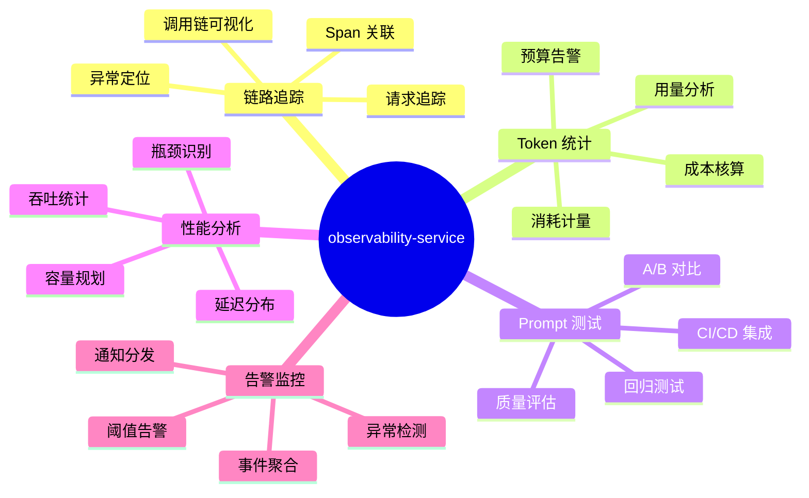

### 1.3 服务边界

| 属于本服务职责         | 不属于本服务职责          |
| ---------------------- | ------------------------- |
| LLM 调用链路追踪       | 业务日志存储 (ELK)        |
| Token 消耗统计与分析   | 基础设施监控 (Prometheus) |
| Prompt 版本测试与回归  | 应用性能监控 (APM)        |
| 成本核算与预算管理     | 安全审计日志              |
| AI 质量评估指标        | 业务指标统计              |
| OpenTelemetry 数据接收 | 通用链路追踪 (Jaeger)     |
| Prompt 劣化告警        | 容器/K8s 监控             |

### 1.4 与传统 APM 的差异

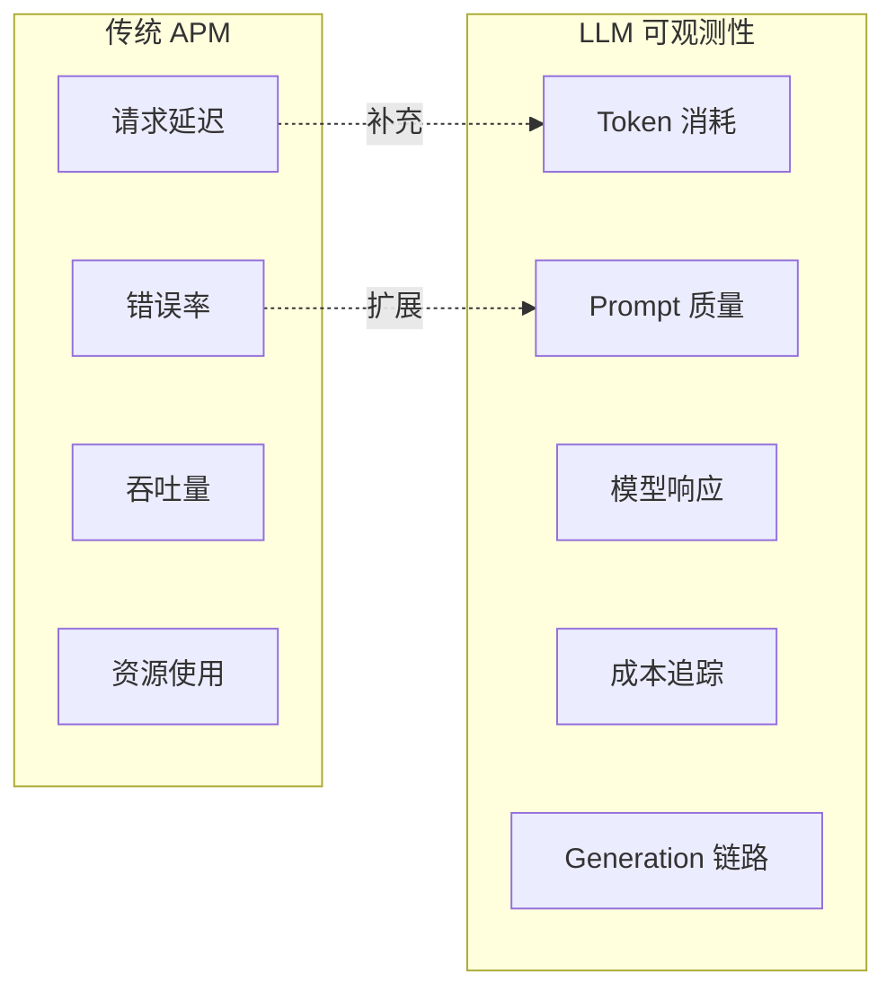

**核心差异**：

- **粒度不同**：追踪到每次 LLM 调用、每个 Prompt 模板
- **指标不同**：Token 消耗、Prompt 质量分数、模型输出评估
- **成本模型**：按 Token 计费，需要精确计量

---

## 2. 系统架构

### 2.1 整体架构图

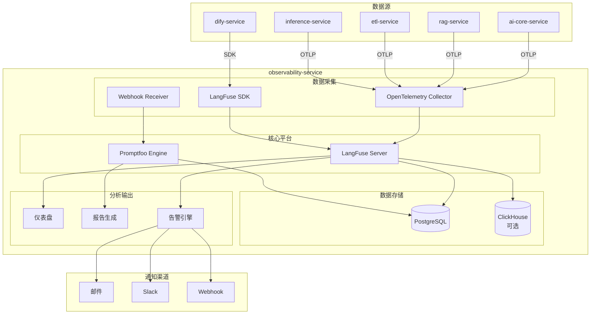

### 2.2 数据流架构

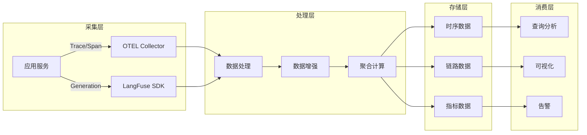

### 2.3 组件职责划分

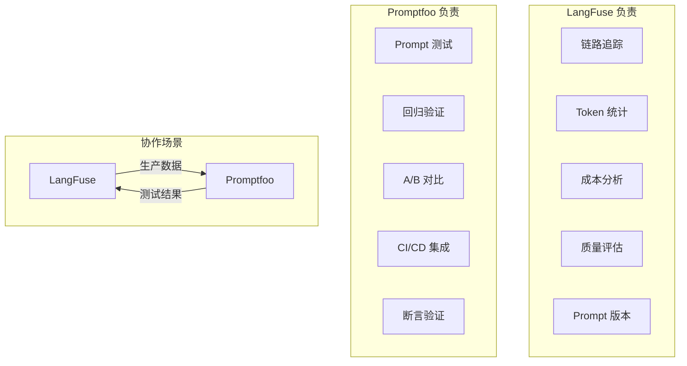

---

## 3. LangFuse 集成设计

### 3.1 核心概念模型

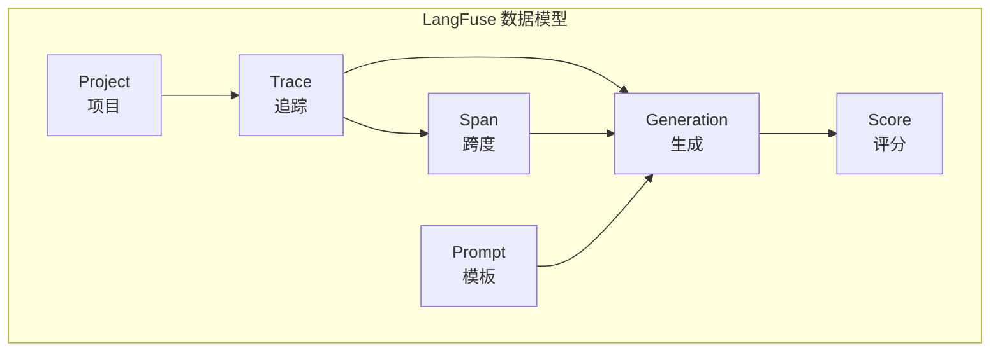

| 概念       | 说明                 | 用途              |
| ---------- | -------------------- | ----------------- |
| Project    | 项目隔离单元         | 多租户/多环境隔离 |
| Trace      | 一次完整请求的追踪   | 端到端链路可视化  |
| Span       | 追踪中的一个操作步骤 | 细粒度耗时分析    |
| Generation | LLM 调用记录         | Token/成本统计    |
| Score      | 质量评分             | Prompt 效果评估   |
| Prompt     | Prompt 模板与版本    | 版本管理与回滚    |

### 3.2 Trace 结构设计

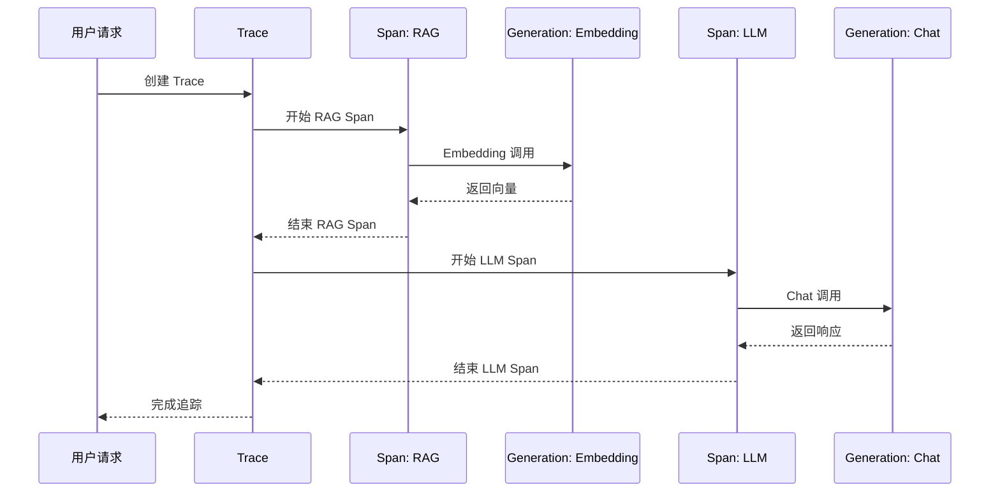

### 3.3 Generation 记录字段

| 字段           | 类型   | 说明                |
| -------------- | ------ | ------------------- |
| name           | string | 调用名称            |
| model          | string | 模型名称            |
| input          | object | 输入 Prompt         |
| output         | string | 模型输出            |
| usage.input    | int    | 输入 Token 数       |
| usage.output   | int    | 输出 Token 数       |
| usage.total    | int    | 总 Token 数         |
| cost           | float  | 成本（美元）        |
| latency        | float  | 延迟（毫秒）        |
| prompt_id      | string | 关联 Prompt 模板 ID |
| prompt_version | int    | Prompt 版本号       |
| metadata       | object | 自定义元数据        |

### 3.4 OpenTelemetry 集成

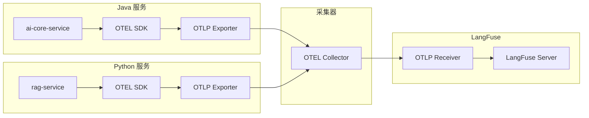

### 3.5 SDK 集成模式

| 集成方式       | 适用场景       | 特点                 |
| -------------- | -------------- | -------------------- |
| OpenTelemetry  | Java/通用服务  | 标准协议，低侵入     |
| Python SDK     | Python 服务    | 功能完整，装饰器简洁 |
| REST API       | 任意语言       | 灵活但需自行封装     |
| LangChain 回调 | LangChain 项目 | 开箱即用，自动采集   |

---

## 4. Token 统计与成本分析

### 4.1 成本核算模型

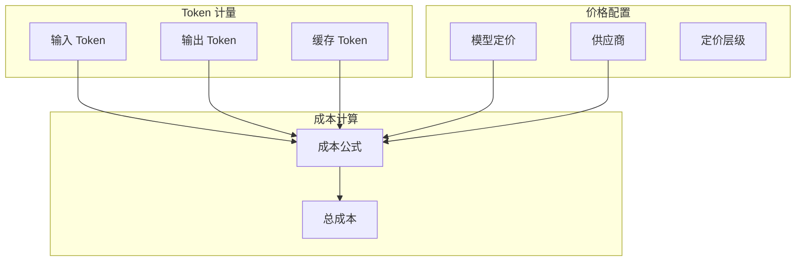

### 4.2 成本计算公式

$$
\text{Cost} = \frac{\text{Input Tokens}}{1000} \times P_{input} + \frac{\text{Output Tokens}}{1000} \times P_{output}
$$

其中：

- $P_{input}$：输入 Token 单价（$/1K tokens）
- $P_{output}$：输出 Token 单价（$/1K tokens）

### 4.3 模型定价配置

| 模型                 | 输入价格 ($/1M) | 输出价格 ($/1M) | 备注      |
| -------------------- | --------------- | --------------- | --------- |
| gpt-4o               | 2.50            | 10.00           | OpenAI    |
| gpt-4o-mini          | 0.15            | 0.60            | OpenAI    |
| claude-3.5-sonnet    | 3.00            | 15.00           | Anthropic |
| qwen2.5-72b-instruct | 自建成本        | 自建成本        | 本地部署  |
| deepseek-r1          | 自建成本        | 自建成本        | 本地部署  |

### 4.4 成本分析维度

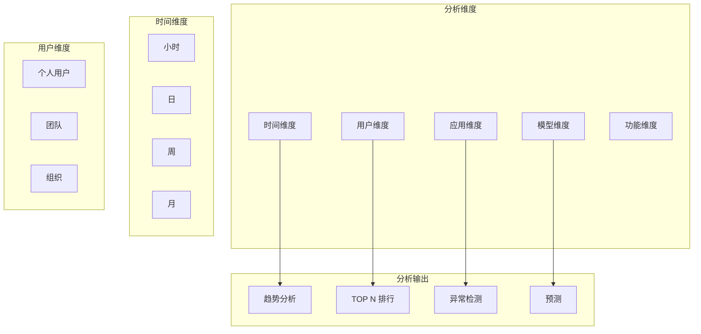

### 4.5 预算告警规则

| 告警类型   | 阈值条件          | 通知级别 | 动作        |
| ---------- | ----------------- | -------- | ----------- |
| 日预算告警 | 当日消耗 > 80%    | Warning  | 通知        |
| 日预算超限 | 当日消耗 > 100%   | Critical | 通知 + 限流 |
| 月预算告警 | 当月消耗 > 70%    | Warning  | 通知        |
| 月预算超限 | 当月消耗 > 90%    | Critical | 通知 + 审批 |
| 异常消耗   | 同比增长 > 200%   | Warning  | 通知        |
| 单用户超限 | 用户日消耗 > 配额 | Info     | 限流        |

---

## 5. Prompt 测试设计

### 5.1 Promptfoo 核心能力

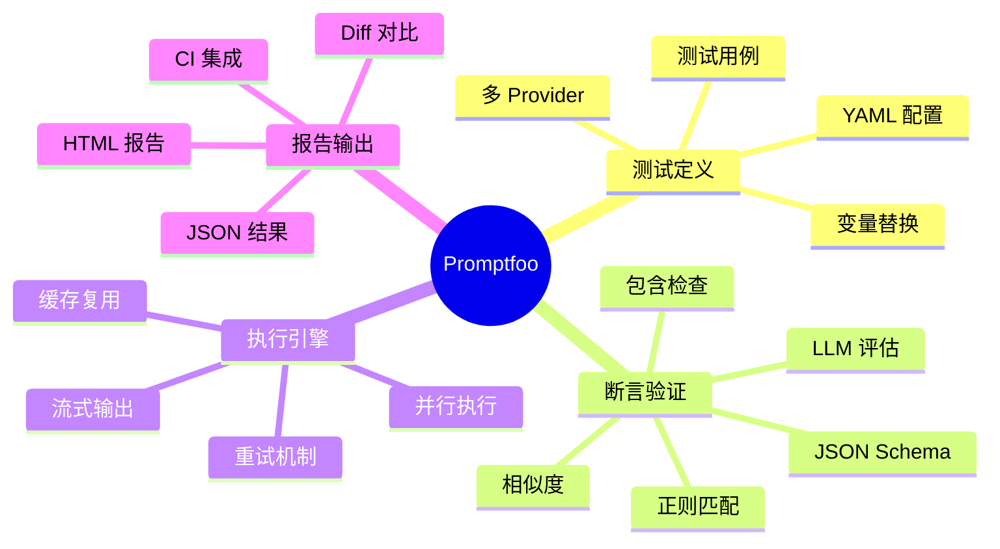

### 5.2 测试配置结构

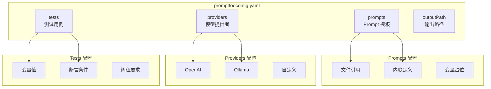

### 5.3 断言类型

| 断言类型      | 说明           | 示例                   |
| ------------- | -------------- | ---------------------- |
| contains      | 包含指定文本   | 输出包含 "成功"        |
| not-contains  | 不包含指定文本 | 输出不包含 "错误"      |
| equals        | 精确匹配       | 输出等于预期值         |
| regex         | 正则匹配       | 匹配日期格式           |
| starts-with   | 前缀匹配       | 以 "答案：" 开头       |
| is-json       | JSON 格式验证  | 输出是有效 JSON        |
| contains-json | 包含 JSON 结构 | 包含指定 JSON 字段     |
| javascript    | JS 函数验证    | 自定义逻辑验证         |
| llm-rubric    | LLM 评分       | 使用 LLM 评估输出质量  |
| similar       | 语义相似度     | 与预期答案相似度 > 0.8 |
| cost          | 成本限制       | 单次调用成本 < $0.01   |
| latency       | 延迟限制       | 响应时间 < 3000ms      |

### 5.4 测试场景分类

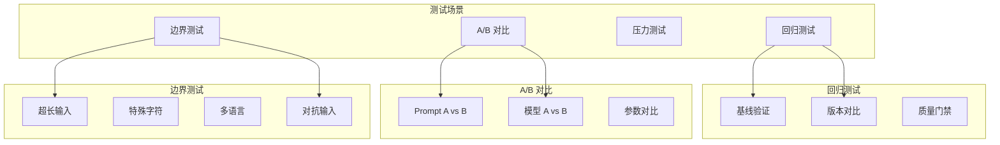

### 5.5 CI/CD 集成流程

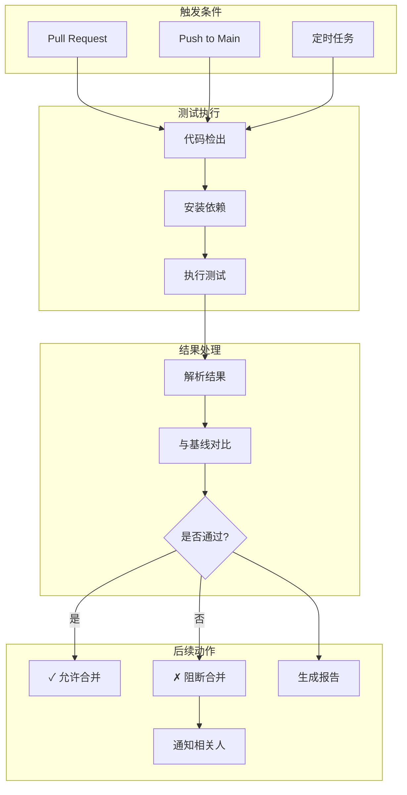

---

## 6. 质量评估设计

### 6.1 评估指标体系

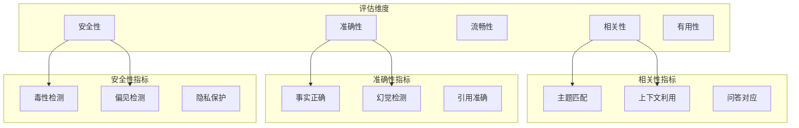

### 6.2 评分方式

| 评分方式 | 实现方法         | 适用场景       |
| -------- | ---------------- | -------------- |
| 人工评分 | 标注平台         | 高价值样本     |
| LLM 评分 | GPT-4 作为评判者 | 大规模自动评估 |
| 规则评分 | 正则/关键词匹配  | 格式化输出验证 |
| 模型评分 | 专用评估模型     | 特定维度评估   |
| 用户反馈 | 点赞/点踩        | 真实用户偏好   |

### 6.3 评分流程

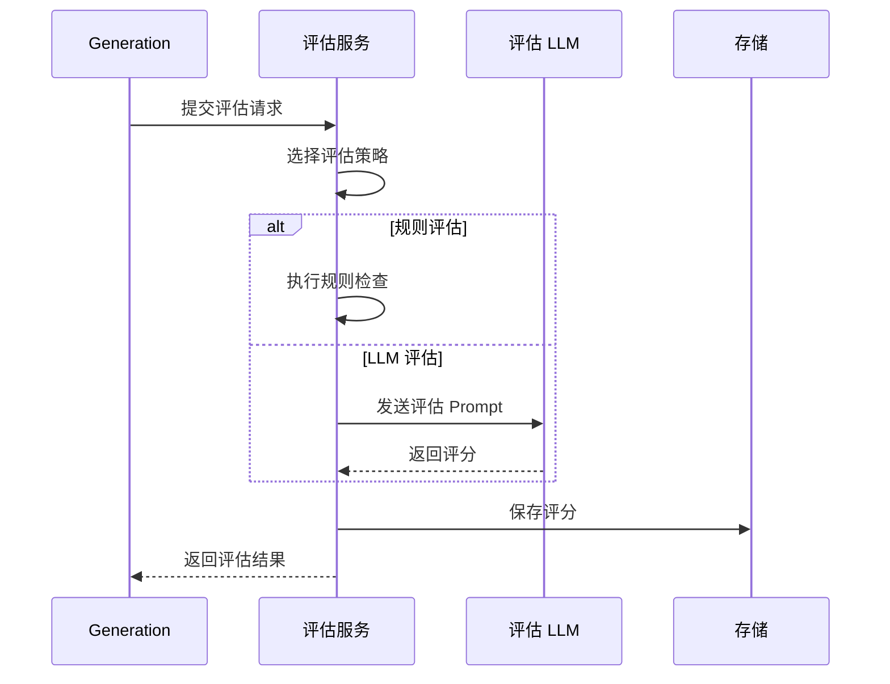

### 6.4 评估报告维度

| 报告维度    | 内容                 | 更新频率 |
| ----------- | -------------------- | -------- |
| 整体质量    | 平均分、分布、趋势   | 实时     |
| Prompt 对比 | 不同版本 Prompt 效果 | 每次变更 |
| 模型对比    | 不同模型输出质量     | 按需     |
| 时间趋势    | 质量随时间变化       | 每日     |
| 异常检测    | 质量突降告警         | 实时     |

---

## 7. 告警监控设计

### 7.1 告警规则分类

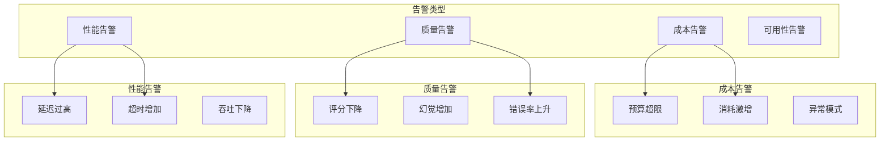

### 7.2 告警规则配置

| 告警名称        | 条件              | 级别     | 通知渠道   |
| --------------- | ----------------- | -------- | ---------- |
| 日成本超限      | 日成本 > 预算     | Critical | 邮件+Slack |
| 质量评分下降    | 评分 < 基线 20%   | Warning  | Slack      |
| P99 延迟过高    | P99 > 10s         | Warning  | Slack      |
| 模型错误率      | 错误率 > 5%       | Critical | 邮件+电话  |
| Token 异常消耗  | 单次 > 50K tokens | Info     | Slack      |
| Prompt 测试失败 | CI 测试失败       | Critical | 邮件       |

### 7.3 告警处理流程

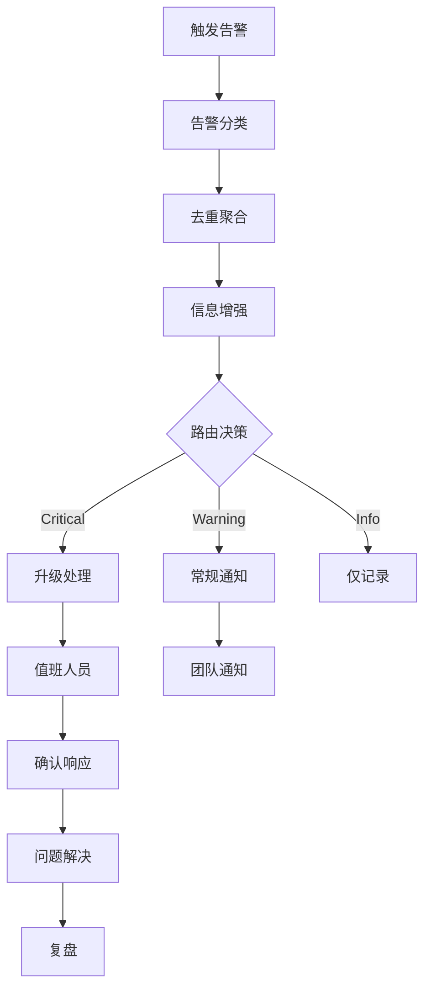

---

## 8. 数据模型设计

### 8.1 核心实体关系

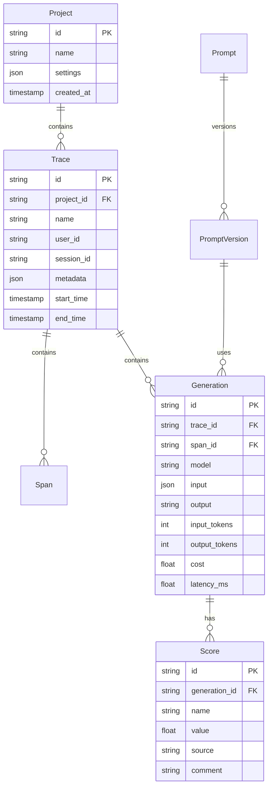

### 8.2 时序数据模型

| 指标名称         | 类型      | 标签                   | 说明         |
| ---------------- | --------- | ---------------------- | ------------ |
| llm_tokens_total | Counter   | model, type, project   | Token 总消耗 |
| llm_cost_total   | Counter   | model, project         | 成本总计     |
| llm_latency      | Histogram | model, project         | 延迟分布     |
| llm_requests     | Counter   | model, status, project | 请求计数     |
| prompt_score     | Gauge     | prompt_id, version     | Prompt 评分  |
| eval_score       | Gauge     | dimension, project     | 各维度评分   |

### 8.3 数据保留策略

| 数据类型   | 保留周期 | 存储方式   | 归档策略      |
| ---------- | -------- | ---------- | ------------- |
| Trace 详情 | 30 天    | PostgreSQL | 压缩归档至 S3 |
| Generation | 90 天    | PostgreSQL | 采样保留      |
| 聚合指标   | 1 年     | ClickHouse | 降采样        |
| 评分数据   | 永久     | PostgreSQL | -             |
| 告警记录   | 1 年     | PostgreSQL | -             |
| 测试结果   | 180 天   | PostgreSQL | -             |

---

## 9. 部署架构

### 9.1 部署拓扑

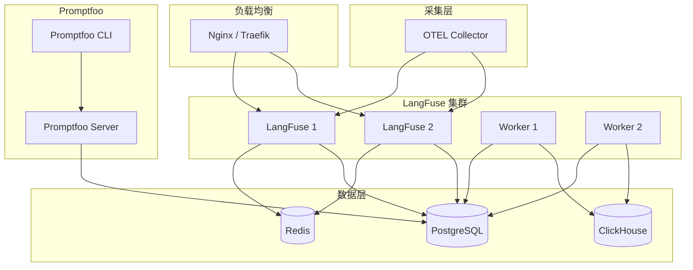

### 9.2 容器化配置

| 服务            | 镜像                         | 资源配置 | 副本数 |
| --------------- | ---------------------------- | -------- | ------ |
| langfuse-web    | langfuse/langfuse:2.x        | 2C4G     | 2      |
| langfuse-worker | langfuse/langfuse:2.x        | 2C4G     | 2      |
| otel-collector  | otel/opentelemetry-collector | 1C2G     | 2      |
| promptfoo       | promptfoo/promptfoo          | 1C2G     | 1      |
| redis           | redis:7                      | 1C2G     | 1      |
| clickhouse      | clickhouse/clickhouse        | 4C8G     | 1      |

### 9.3 环境配置

| 环境变量               | 说明              | 示例值                 |
| ---------------------- | ----------------- | ---------------------- |
| DATABASE_URL           | PostgreSQL 连接串 | postgresql://...       |
| REDIS_URL              | Redis 连接地址    | redis://redis:6379     |
| NEXTAUTH_SECRET        | 认证密钥          | xxx                    |
| SALT                   | 加密盐值          | xxx                    |
| CLICKHOUSE_URL         | ClickHouse 连接串 | http://clickhouse:8123 |
| OTEL_EXPORTER_ENDPOINT | OTLP 导出端点     | http://langfuse:4318   |

---

## 10. 服务集成设计

### 10.1 与各服务的集成方式

```mermaid
graph TD
    subgraph Java 服务
        AICore[ai-core-service]
        Data[data-service]
    end

    subgraph Python 服务
        RAG[rag-service]
        ETL[etl-service]
    end

    subgraph 编排层
        Dify[dify-service]
    end

    subgraph observability-service
        OTEL[OTEL Collector]
        LangFuse[LangFuse]
    end

    AICore -->|OTLP| OTEL
    Data -->|OTLP| OTEL
    RAG -->|Python SDK| LangFuse
    ETL -->|Python SDK| LangFuse
    Dify -->|内置集成| LangFuse

    OTEL --> LangFuse
```

### 10.2 集成接口规范

| 服务              | 集成方式      | 协议      | 数据格式 |
| ----------------- | ------------- | --------- | -------- |
| ai-core-service   | OpenTelemetry | OTLP/gRPC | Protobuf |
| rag-service       | LangFuse SDK  | HTTP      | JSON     |
| etl-service       | LangFuse SDK  | HTTP      | JSON     |
| dify-service      | 内置集成      | HTTP      | JSON     |
| inference-service | OpenTelemetry | OTLP/gRPC | Protobuf |

### 10.3 数据采集要求

| 服务              | 必采数据                 | 可选数据           |
| ----------------- | ------------------------ | ------------------ |
| ai-core-service   | Trace、Generation、Token | 用户信息、Session  |
| rag-service       | 检索延迟、召回数量       | 文档 ID、分数分布  |
| etl-service       | 处理耗时、文档数量       | 切片统计、错误详情 |
| dify-service      | 工作流执行、节点耗时     | 变量值、分支路径   |
| inference-service | 模型调用、Token 消耗     | 批次大小、队列深度 |

---

## 11. 运维设计

### 11.1 健康检查

| 检查项         | 端点          | 正常标准 |
| -------------- | ------------- | -------- |
| LangFuse API   | /api/health   | HTTP 200 |
| OTEL Collector | :13133/health | HTTP 200 |
| PostgreSQL     | 连接检查      | 连接成功 |
| Redis          | PING          | PONG     |
| ClickHouse     | /ping         | Ok       |

### 11.2 容量规划

| 场景规模    | 日 Trace 量 | 存储需求/月 | 推荐配置  |
| ----------- | ----------- | ----------- | --------- |
| 小型 (PoC)  | < 10K       | 10GB        | 2C4G × 1  |
| 中型 (生产) | 10K-100K    | 100GB       | 4C8G × 2  |
| 大型        | 100K-1M     | 1TB         | 8C16G × 3 |
| 超大型      | > 1M        | 10TB+       | 集群部署  |

### 11.3 备份策略

| 备份对象    | 备份频率 | 保留周期 | 备份方式      |
| ----------- | -------- | -------- | ------------- |
| PostgreSQL  | 每日     | 30 天    | pg_dump       |
| ClickHouse  | 每日     | 14 天    | 快照          |
| 配置文件    | 每次变更 | 永久     | Git           |
| Prompt 模板 | 实时     | 永久     | LangFuse 内置 |

### 11.4 性能优化

| 优化项   | 方法               | 效果           |
| -------- | ------------------ | -------------- |
| 写入性能 | 批量写入、异步队列 | 10x 吞吐提升   |
| 查询性能 | 索引优化、分区表   | 查询延迟降低   |
| 存储成本 | 数据压缩、冷热分离 | 存储成本降 50% |
| 采集开销 | 采样策略、本地聚合 | 网络开销降低   |

---

## 12. 开发里程碑

### 12.1 阶段规划

| 阶段   | 周期   | 主要目标           | 交付物                   |
| ------ | ------ | ------------------ | ------------------------ |
| 阶段一 | Week 1 | LangFuse 部署配置  | 平台可访问，基础采集就绪 |
| 阶段二 | Week 2 | OpenTelemetry 集成 | Java/Python 服务数据上报 |
| 阶段三 | Week 3 | Promptfoo 集成     | CI/CD 测试流水线         |
| 阶段四 | Week 4 | 告警与报告         | 完整监控告警能力         |

### 12.2 验收标准

| 里程碑      | 验收标准                          |
| ----------- | --------------------------------- |
| 平台部署    | LangFuse UI 可访问，API 可调用    |
| 数据采集    | 各服务 Trace 可在 LangFuse 查看   |
| Token 统计  | 成本报表准确，与实际消耗偏差 < 5% |
| Prompt 测试 | PR 触发测试，结果阻断不合格合并   |
| 告警就绪    | 成本/质量/性能告警正常触发与通知  |

---

## 13. 附录

### 13.1 相关文档

- [后端开发计划](../backend-development-plan.md)
- [ai-core-service 设计](03-ai-core-service-design.md)
- [LangFuse 官方文档](https://langfuse.com/docs)
- [Promptfoo 官方文档](https://promptfoo.dev/docs/intro)
- [OpenTelemetry 文档](https://opentelemetry.io/docs/)

### 13.2 术语表

| 术语       | 说明                                 |
| ---------- | ------------------------------------ |
| Trace      | 一次完整请求的追踪记录               |
| Span       | 追踪中的一个操作步骤                 |
| Generation | 一次 LLM 调用的记录                  |
| OTLP       | OpenTelemetry Protocol，标准遥测协议 |
| Promptfoo  | Prompt 测试与评估工具                |
| LangFuse   | LLM 可观测性平台                     |

### 13.3 版本历史

| 版本 | 日期       | 作者 | 变更说明 |
| ---- | ---------- | ---- | -------- |
| v1.0 | 2025-01-01 | -    | 初始版本 |
