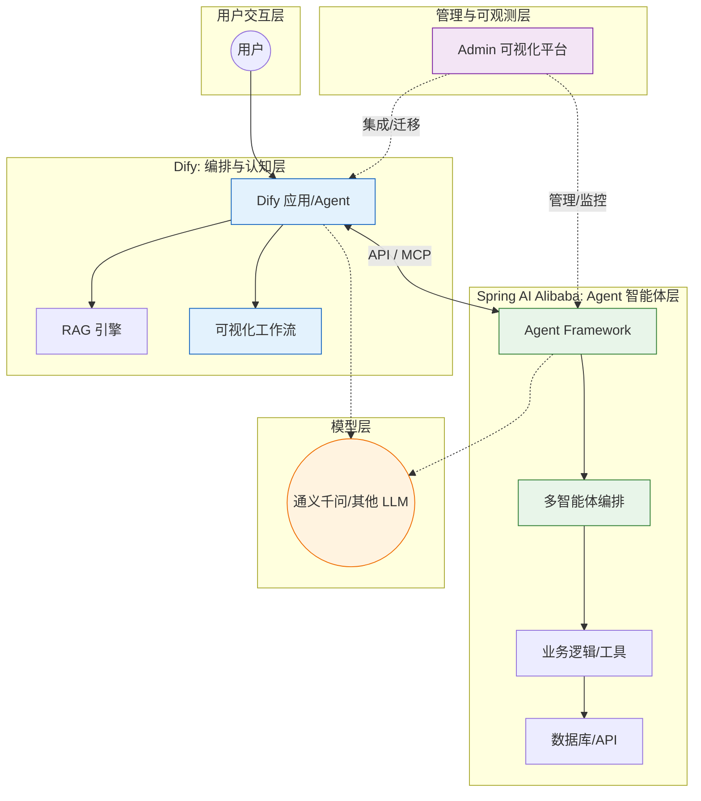

# Dify & Spring AI Alibaba：构建下一代 AI 应用的双重利器

> 2025 年 12 月
> 版本：Dify v1.11.x | Spring AI Alibaba v1.1.x

本文档旨在介绍两款在 AI 应用开发领域备受关注的工具：**Dify**（开源 LLM 应用开发平台）和 **Spring AI Alibaba**（Java 生态的 AI 开发框架），并探讨它们各自的优势及协同模式。

## 1. Dify：开源 LLM 应用开发平台

Dify 是一款开源的 LLM 应用开发平台，旨在帮助开发者（甚至是非技术人员）快速构建和运营生成式 AI 应用。它融合了 Backend-as-a-Service (BaaS) 和 LLMOps 的理念。

### 核心特性

- **可视化工作流编排 (Workflow Orchestration)**：通过拖拽式的画布，将 LLM、工具、逻辑分支等节点组合成复杂的业务流程，极大地降低了开发门槛。
- **强大的 RAG 引擎**：内置了文档解析、分段、清洗和检索功能，支持多种向量数据库，能够轻松构建基于私有数据的问答助手。
- **Agent 智能体构建**：支持 Function Calling 和 ReAct 模式，可以让 AI 自主调用工具（如搜索、API）来完成任务。
- **模型中立**：支持接入 OpenAI、Anthropic、Llama 以及国内的通义千问、文心一言等主流大模型，切换模型成本极低。
- **API 发布**：构建好的应用可以直接发布为 API，供前端或其他系统调用。
- **MCP 协议支持 (Model Context Protocol)**：支持接入 MCP Server 扩展工具能力，或将 Dify 应用发布为 MCP Server 供其他客户端调用，实现生态互联。

### 适用场景

- 企业内部知识库问答系统。
- 复杂的客户服务 AI Agent。
- 快速原型验证（MVP）和低代码开发。

---

## 2. Spring AI Alibaba：构建 Agent 智能体应用的 Java 框架

Spring AI Alibaba 1.1 是基于 Spring AI 构建的生产就绪框架，专注于构建 **Agentic、Workflow 和 Multi-agent 应用**。它是阿里云通义系列模型及服务在 Java AI 应用开发领域的最佳实践。

> 官网: [java2ai.com](https://java2ai.com/) | 当前版本: **1.1.0.0-RC2**

### 核心架构

- **Agent Framework**：以 `ReactAgent` 为核心的智能体开发框架，内置上下文工程（Context Engineering）和人机协同（Human In The Loop）支持。
- **Graph**：底层工作流运行时，支持条件路由、嵌套图、并行执行和状态管理，可导出为 PlantUML 和 Mermaid 格式。
- **Augmented LLM**：基于 Spring AI 的底层抽象，包括 Model、Tool、MCP、Message、Vector Store 等。

### 核心特性

- **多智能体编排 (Multi-Agent Orchestration)**：内置 `SequentialAgent`、`ParallelAgent`、`RoutingAgent`、`LoopAgent`、`SupervisorAgent` 等模式，轻松组合多个智能体完成复杂任务。
- **上下文工程 (Context Engineering)**：内置最佳实践，包括人机协同、上下文压缩、上下文编辑、模型与工具调用限制、工具重试、规划、动态工具选择等。
- **A2A 支持 (Agent-to-Agent)**：通过 Nacos 集成实现分布式智能体间通信与协作。
- **丰富的模型与 MCP 支持**：支持多种 LLM 提供商（DashScope、OpenAI 等）、工具调用和 Model Context Protocol (MCP)。
- **Admin 可视化平台**：一站式 Agent 平台，支持可视化 Agent 开发、可观测性、评估和 MCP 管理，可与 Dify 等低代码平台集成。
- **结构化输出 (Structured Output)**：将 LLM 输出自动映射为 Java Bean (POJO)。
- **流式传输与错误处理**：实时流式响应，强大的错误恢复和重试机制。

### 适用场景

- 构建具备自主决策能力的 AI Agent 应用。
- 需要多智能体协作的复杂业务场景。
- 现有 Spring Boot 微服务集成 AI 能力。
- 需要深度定制业务逻辑、对性能和并发有要求的后端系统。

---

## 3. 选型对比与协同模式

### 选型建议

| 维度         | Dify (v1.11.x)                      | Spring AI Alibaba (v1.1.x)           |
| :----------- | :---------------------------------- | :----------------------------------- |
| **开发模式** | 低代码/无代码，可视化编排           | 纯代码开发 (Java)，支持 Admin 可视化 |
| **目标用户** | 全栈开发者、产品经理、Prompt 工程师 | Java 后端工程师、架构师              |
| **核心能力** | RAG 引擎、工作流编排、快速原型      | 多智能体编排、上下文工程、A2A 通信   |
| **灵活性**   | 流程编排灵活，但底层逻辑受限于平台  | 逻辑控制极其灵活，可深度集成现有业务 |
| **部署运维** | 需要部署 Dify 平台 (Docker/K8s)     | 随 Spring Boot 应用打包部署          |

### 协同开发模式

在复杂的企业级应用中，两者并非互斥，而是可以互补的：

1.  **Dify 作为“大脑”与编排层**：
    利用 Dify 强大的 Prompt 管理和工作流编排能力，处理用户意图识别、上下文管理和复杂的 RAG 检索流程。

2.  **Spring AI Alibaba 作为“手脚”与工具层**：
    使用 Spring AI Alibaba 开发具体的业务功能接口（如查询数据库订单状态、执行复杂的计算逻辑）。将这些接口封装为 API，注册为 Dify 的**自定义工具 (Custom Tool)**。

3.  **基于 MCP 协议的互联**：
    利用 Model Context Protocol (MCP)，Spring AI Alibaba 应用可以作为 MCP Server 运行，直接被 Dify 发现和调用；反之，Dify 应用也可以作为 MCP Server 被 Spring AI Alibaba 的 Agent 调用。

4.  **Admin 平台与 Dify 的集成**：
    Spring AI Alibaba Admin 支持与 Dify 等开源低代码平台集成，可将 Dify DSL 快速迁移为 Spring AI Alibaba 项目，实现从原型到生产的平滑过渡。

5.  **"原型到生产"的渐进式开发**：
    产品经理在 Dify 上快速搭建 MVP 验证想法；验证成功后，开发团队参考 Dify 的流程设计，使用 Spring AI Alibaba 重构核心链路，以获得更高的性能和可维护性。

**场景示例**：
用户在 Dify 构建的客服助手中询问：“我的订单发货了吗？”

1.  Dify 识别意图，决定调用“查询订单状态”工具。
2.  Dify 向 Spring AI Alibaba 后端发送 API 请求。
3.  Spring AI Alibaba 后端查询数据库，返回订单信息。
4.  Dify 接收数据，利用 LLM 生成友好的回复反馈给用户。

---

## 总结

- **Dify** 让 AI 应用的构建变得简单、可视、可运营，适合快速原型验证和 RAG 场景。
- **Spring AI Alibaba** 让 Java 开发者能以最熟悉的方式构建生产级 Agent 智能体应用，支持多智能体编排和复杂工作流。

结合两者的力量，企业可以构建出既具备强大认知能力（Dify），又拥有深厚业务处理能力和智能体协作能力（Spring AI Alibaba）的现代化 AI 应用。
