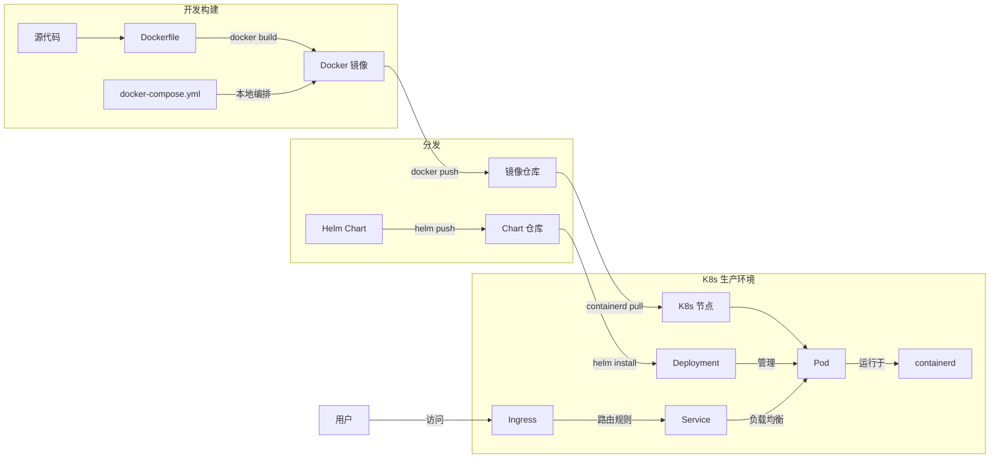

# Docker & Kubernetes：云原生时代的基石

> 2025 年 12 月
> 版本：Docker 24.x | Kubernetes 1.30.x

本文档旨在介绍现代云计算和微服务架构中不可或缺的两大核心技术：**Docker**（容器化标准）和 **Kubernetes**（容器编排霸主），帮助开发者理解它们如何改变了软件交付与运行的方式。

## 1. Docker：应用交付的标准集装箱

Docker 是一种开源的容器化平台，它将应用程序及其所有依赖项（代码、运行时、系统工具、库）打包到一个轻量级、可移植的容器中。

### 核心概念

- **镜像 (Image)**：
  - 应用的只读模板，类似于“类”或“安装包”。它包含了运行应用所需的一切。
  - 分层存储（Layered Storage）机制使得镜像构建和传输非常高效。
- **容器 (Container)**：
  - 镜像的运行实例，类似于“对象”或“进程”。
  - 容器之间相互隔离，启动速度极快（毫秒级），且资源占用远少于传统虚拟机（VM）。
- **Dockerfile**：
  - 用于构建镜像的文本脚本，定义了镜像的构建步骤（如：基于什么系统、安装什么软件、复制什么代码）。

### 核心优势

- **环境一致性**：解决了“在我的机器上能跑，在服务器上跑不起来”的经典问题。无论在开发、测试还是生产环境，容器内的行为完全一致。
- **轻量高效**：直接利用宿主机内核，无需模拟硬件和运行完整操作系统，启动快，密度高。
- **敏捷交付**：配合 CI/CD 流水线，可以实现分钟级的应用构建与部署。

### Docker Desktop：开发者的一站式工具

**Docker Desktop** 是一个易于安装的桌面应用程序（支持 Mac、Windows、Linux），它集成了：

- Docker 守护进程 (`dockerd`) 和 Docker 客户端 (`docker`)
- Docker Compose
- 内置的 Kubernetes 集群（可选启用）
- Docker Content Trust 和凭证助手

这使得开发者可以在本地轻松构建、测试容器化应用，甚至无需额外配置即可使用 Kubernetes。

### Docker Compose：多容器编排利器

在开发环境中，一个应用往往由多个服务组成（如 Web 应用 + 数据库 + 缓存）。**Docker Compose** 是一个用于定义和运行多容器 Docker 应用程序的工具。

- 通过一个 YAML 文件来配置应用的所有服务。
- 使用一个命令，就可以从配置中创建并启动所有服务。
- 支持生产、预发布、开发、测试环境以及 CI 工作流。

---

## 2. Kubernetes (K8s)：容器舰队的指挥官

当你的应用从几个容器扩展到成百上千个容器，分布在多台服务器上时，手动管理（启动、停止、重启、扩容）就变得不可能了。这时就需要 **Kubernetes**。

Kubernetes（常简称为 K8s）是 Google 开源的容器编排平台，用于自动化容器化应用程序的部署、扩展和管理。

### 核心概念

- **Pod**：
  - K8s 中最小的部署单元。一个 Pod 可以包含一个或多个紧密协作的容器（通常是一个）。它们共享网络 IP 和存储卷。
- **Node (节点)**：
  - 运行 Pod 的物理机或虚拟机。
- **Deployment**：
  - 定义应用的期望状态（如：我要运行 3 个 Nginx 副本）。K8s 会自动维持这个状态，如果有一个挂了，它会自动补一个新的。
- **Service**：
  - 为一组 Pod 提供统一的访问入口（负载均衡）。无论 Pod 的 IP 如何变化，Service 的 IP 始终稳定。
- **Ingress**：
  - 管理外部访问集群内服务的规则（通常是 HTTP/HTTPS），提供 URL 路由、SSL 终端等功能。
- **Namespace (命名空间)**：
  - 用于在同一集群中隔离资源，类似于“虚拟集群”。常用于区分开发、测试、生产环境。
- **ConfigMap & Secret**：
  - **ConfigMap** 用于存储非机密的配置数据（如配置文件）。
  - **Secret** 用于存储敏感数据（如密码、Token），并进行加密。
  - 实现了配置与代码的分离。
- **Volume (存储卷)**：
  - 解决了容器重启后数据丢失的问题。
  - **PV (PersistentVolume)** 和 **PVC (PersistentVolumeClaim)** 提供了持久化存储的抽象，让应用可以使用云盘、NFS 等存储资源。

### 核心能力

- **自动扩缩容 (Auto-scaling)**：根据 CPU/内存使用率或自定义指标，自动增加或减少 Pod 数量。
- **自我修复 (Self-healing)**：当容器失败、节点故障时，自动重启或重新调度容器，保证服务高可用。
- **服务发现与负载均衡**：自动为容器分配 IP 和 DNS 名，并在它们之间分配流量。
- **滚动更新与回滚**：在不中断服务的情况下更新应用版本，如果出问题还能一键回滚。
- **IPv4/IPv6 双栈**：支持同时为 Pod 和 Service 分配 IPv4 和 IPv6 地址。
- **批处理执行**：除了长期运行的服务外，还可以管理批处理和 CI 工作负载。
- **可扩展性设计**：无需修改上游源代码即可为集群添加新功能。

### Kubernetes 的包管理器：Helm

**Helm** 是 Kubernetes 的包管理工具，类似于 Linux 的 `apt` 或 `yum`。Helm 是 CNCF 毕业项目，目前最新版本为 **v4.0.0**（2025 年发布）。

- **Chart**：Helm 的打包格式，包含了一组相关的 K8s 资源定义。
- **Repository**：Chart 仓库，可以在 [Artifact Hub](https://artifacthub.io/) 上搜索 800+ 公开 Charts。
- **优势**：简化了复杂应用的部署和管理，支持版本控制和一键升级/回滚。
- **Helm 4 新特性**：引入了新的架构模式和增强功能，同时保持对 Charts 的向后兼容性。

---

## 3. Docker 与 Kubernetes 的关系

一个常见的误解是“Docker vs Kubernetes”，实际上它们是**互补**关系，而非竞争关系。

- **Docker** 负责**造船**（打包应用为容器）。
- **Kubernetes** 负责**掌舵和指挥舰队**（管理和调度这些容器）。

| 维度         | Docker (Engine)                 | Kubernetes                      |
| :----------- | :------------------------------ | :------------------------------ |
| **关注点**   | 单个容器的生命周期 (构建、运行) | 容器集群的生命周期 (编排、调度) |
| **作用范围** | 单机 (通常)                     | 多机集群                        |
| **类比**     | 乐高积木块                      | 乐高搭建说明书与搭建者          |
| **使用场景** | 开发环境、简单的单机部署        | 生产环境、大规模微服务集群      |

> **注**：虽然 Docker 也有自己的编排工具 Docker Swarm，但在工业界，Kubernetes 已经成为了事实上的标准。从 **Kubernetes 1.24 版本**（2022 年）开始，K8s 正式移除了对 Docker Engine（dockershim）的直接支持，转而使用 **containerd** 或 **CRI-O** 等符合 CRI（Container Runtime Interface）标准的运行时。但这对开发者几乎没有影响——开发者依然使用 Docker 工具链来构建镜像，这些镜像完全兼容任何符合 OCI 标准的容器运行时。

---

## 4. 总结

- **Docker** 改变了我们**打包和分发**软件的方式，实现了“一次构建，到处运行”。
- **Kubernetes** 改变了我们**运行和管理**软件的方式，实现了“自动化运维”和“云原生架构”。

掌握这两者，是成为现代云原生开发者的必经之路。
