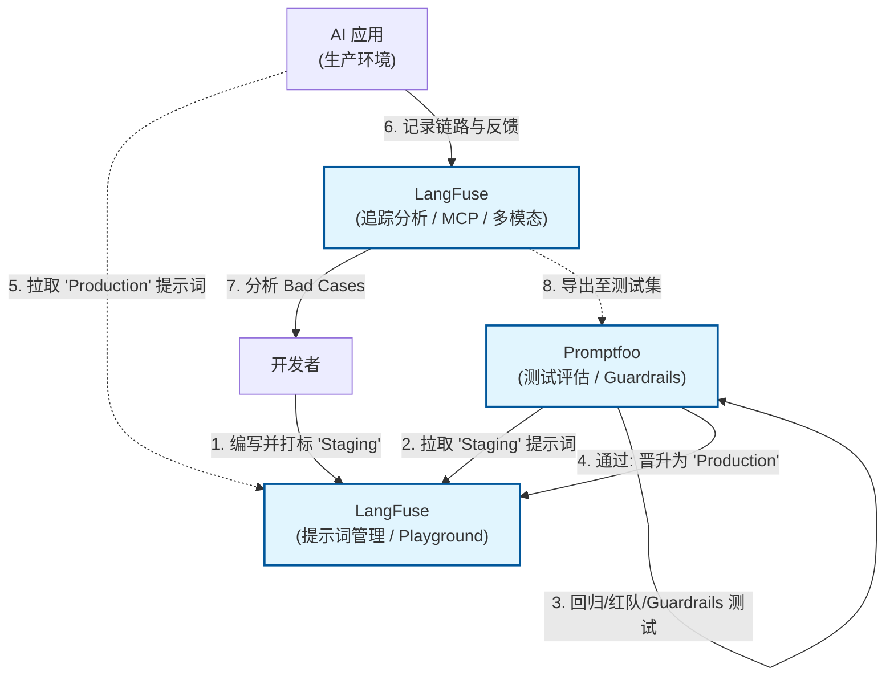

# LangFuse & Promptfoo：LLM 应用的观测与评估双壁

> 2025 年 12 月
> 版本：LangFuse v1.0.x | Promptfoo v0.9.x

本文档旨在介绍两款在 LLM 工程化（LLMOps）中不可或缺的工具：**LangFuse**（全链路观测与管理平台）和 **Promptfoo**（专业的提示词测试与评估工具），帮助开发者构建可靠、可迭代的 AI 应用。

### 核心工作流概览



## 1. LangFuse：开源的 LLM 工程化平台

LangFuse 是一款开源的 LLM 工程平台，专注于解决 LLM 应用在开发、测试和生产阶段的“黑盒”问题。它提供了从调试到生产监控的全套解决方案。

### 核心特性

- **全链路追踪 (Tracing)**：
  - 可视化展示 LLM 调用的完整链路（Trace），包括输入、输出、耗时、Token 消耗和成本。
  - 支持 LangChain, LlamaIndex, OpenAI SDK, Vercel AI SDK 等主流框架的无缝集成。
  - **基于 OpenTelemetry**：增强兼容性，减少供应商锁定。
  - **Agent Graphs**：能够深入查看 Agent 的每一步思考过程、工具调用详情及复杂的多轮交互。
  - **MCP Tracing**：支持 Model Context Protocol (MCP) 的链路追踪。
  - **多模态支持 (Multi-Modality)**：支持文本、图像等多种模态的追踪。
- **提示词管理 (Prompt Management)**：
  - 将 Prompt 从代码中解耦，在 LangFuse 平台上进行版本管理、编辑和发布。
  - **Playground**：内置交互式沙箱，可直接在平台上调试 Prompt 并即时查看效果。
  - 支持在代码中通过 SDK 动态拉取最新版本的 Prompt，实现"运营配置，代码即更"。
  - **Prompt 组合 (Composability)**：支持 Prompt 模块化组合。
  - **GitHub 集成**：可与 GitHub 仓库同步 Prompt 版本。
  - **MCP Server**：提供 MCP 服务器支持，便于与其他 AI 工具集成。
- **评估与数据集 (Evaluation & Datasets)**：
  - 支持基于真实生产数据构建数据集。
  - 提供基于模型（LLM-as-a-Judge）或人工标注的评分机制，持续监控回答质量。
  - **Annotation Queues**：支持标注队列，便于团队协作进行人工评估。
  - **Experiments**：支持 A/B 测试和基于数据集的实验，量化对比不同 Prompt 或模型版本的表现。
- **指标与分析 (Metrics & Analytics)**：
  - 提供 Token 使用量、延迟、成本、错误率等关键指标的实时仪表盘。
  - **自定义仪表盘 (Custom Dashboards)**：可创建自定义的数据可视化看板。
  - **Metrics API**：提供指标 API，支持导出数据到 PostHog、Mixpanel 等分析工具。
- **API 与数据平台**：
  - 支持导出到 Blob 存储、用于模型微调的数据导出。
  - 提供 Python、JavaScript/TypeScript 及 **Java SDK**。
- **部署灵活**：
  - 支持 SaaS 版，也提供基于 Docker 和 Kubernetes 的**私有化部署 (Self-Hosting)** 方案，满足数据合规需求。
  - 符合 SOC 2 Type II、ISO 27001、GDPR、HIPAA 等安全合规标准。

### 适用场景

- **生产环境监控**：实时监控 AI 应用的运行状态和成本。
- **调试与排错**：快速定位 Bad Case，查看具体的 Prompt 和 Context。
- **持续优化**：基于用户反馈（点赞/点踩）和评分数据，迭代优化 Prompt。

---

## 2. Promptfoo：开发者友好的 LLM 测试工具

Promptfoo 是一款专注于 LLM 提示词（Prompt）测试和评估的 CLI 工具。它采用“测试驱动开发”（TDD）的理念，帮助开发者在代码提交前确保 Prompt 的质量和稳定性。

### 核心特性

- **配置驱动测试**：
  - 通过 YAML 或 JSON 文件定义测试用例。
  - **广泛的模型支持**：不仅支持 OpenAI, Anthropic 等云端模型，还原生支持 **Ollama, vLLM, LocalAI** 等本地模型，方便低成本测试。
  - 支持矩阵测试：一次性对比多个模型（如 GPT-4 vs Claude 3）、多个 Prompt 版本和多组输入变量。
- **丰富的断言 (Assertions)**：
  - 内置多种评估标准，如：`contains`（包含特定关键词）、`similar`（语义相似度）、`cost`（成本限制）、`latency`（延迟限制）。
  - 支持使用 LLM 作为裁判（LLM-as-a-Judge）来评估输出的语气、准确性等主观指标。
- **可视化报告**：
  - 生成直观的 HTML 矩阵视图，清晰展示不同模型/Prompt 在各种测试用例下的表现差异。
  - 提供 `npx promptfoo view` 命令启动本地 Web 查看器，方便团队协作分析。
- **安全与红队测试 (Red Teaming)**：
  - 自动化扫描潜在的安全漏洞，如越狱 (Jailbreaks)、PII 泄露、Prompt 注入和有害内容生成。 - 符合 OWASP LLM Top 10、NIST AI RMF 等安全标准。
- **Guardrails（防护栏）**：
  - 提供运行时防护功能，实时检测和拦截有害输出。
- **MCP Proxy**：
  - 支持 Model Context Protocol 代理，便于监控和测试 MCP 服务。- **CI/CD 集成**：
  - 作为命令行工具，极易集成到 GitHub Actions 或 GitLab CI 中，防止 Prompt 修改导致的“劣化”（Regression）。

### 适用场景

- **模型选型**：对比不同模型在特定业务场景下的表现和性价比。
- **Prompt 调优**：修改 Prompt 后，一键运行回归测试，确保没有破坏之前的 Case。
- **红队测试 (Red Teaming)**：批量测试潜在的越狱或有害输入，评估安全性。

---

## 3. 协同工作流：从开发到生产

LangFuse 和 Promptfoo 分别把守了 LLM 应用生命周期的不同阶段，结合使用可构建闭环的质量保障体系。

| 阶段                               | 工具                      | 核心任务                                                                              |
| :--------------------------------- | :------------------------ | :------------------------------------------------------------------------------------ |
| **开发/测试阶段 (Pre-production)** | **Promptfoo**             | **离线评估**。在代码合并前，批量运行测试用例，对比 Prompt 变动的影响，确保基准质量。  |
| **生产/运营阶段 (Production)**     | **LangFuse**              | **在线观测**。记录真实用户交互，监控成本和延迟，收集 Bad Case。                       |
| **迭代闭环**                       | **LangFuse -> Promptfoo** | 将 LangFuse 中收集到的真实 Bad Case 导出，添加到 Promptfoo 的测试集中，防止问题复发。 |

### 深度集成：Promptfoo 直接调用 LangFuse Prompts

Promptfoo 支持通过 `langfuse://` 协议直接拉取 LangFuse 中管理的 Prompt 进行测试，打通了“管理-测试”的自动化链路。

**配置示例 (`promptfooconfig.yaml`)**:

```yaml
prompts:
  # 使用 @ 语法直接引用 LangFuse 中的 Prompt（推荐）
  - 'langfuse://my-chat-prompt@production' # production 标签的文本提示词
  - 'langfuse://my-chat-prompt@staging:chat' # staging 标签的聊天提示词
  # 也支持按版本号引用
  - 'langfuse://my-chat-prompt:3:text' # 版本 3 的文本提示词

providers:
  - 'openai:gpt-4'

tests:
  - vars:
      user_query: '如何重置密码？' # 自动注入到 LangFuse Prompt 的变量中
      context: '用户帮助文档'
```

### 最佳实践流程

1.  **编写与管理 (LangFuse)**：在 LangFuse 平台上编写 Prompt，利用 Playground 调试，并打上 `staging` 标签。
2.  **自动化测试 (Promptfoo)**：配置 Promptfoo 直接拉取 `langfuse://...@staging` 的 Prompt，运行回归测试集。
3.  **发布上线**：测试通过后，在 LangFuse 上将该 Prompt 版本晋升为 `production` 标签。
4.  **应用更新**：生产环境的应用代码通过 LangFuse SDK 自动拉取 `production` 标签的 Prompt，无需重新部署代码。
5.  **监控闭环**：LangFuse 持续监控线上效果，发现 Bad Case 后导出给 Promptfoo 补充测试用例。

---

## 总结

- **Promptfoo** 是你的**测试实验室**，确保"发版前"的质量，拒绝盲目上线。新增 Guardrails 和 MCP Proxy 功能进一步增强了安全防护能力。
- **LangFuse** 是你的**飞行记录仪**，保障"上线后"的可视化，提供优化依据。基于 OpenTelemetry 标准，支持多模态追踪和 MCP 协议。

两者结合，让 LLM 应用开发从"玄学"走向"工程化"。

---

> 📅 最后更新：2025 年 12 月
