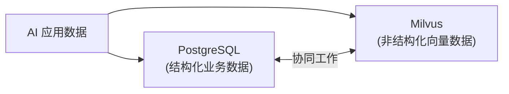
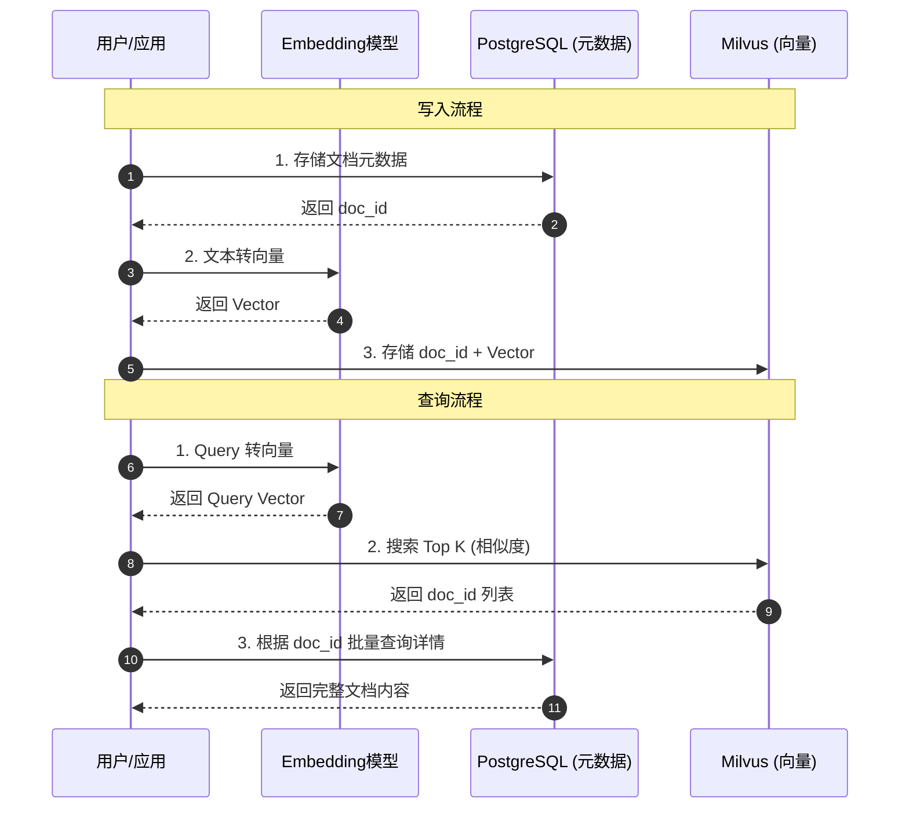

# PostgreSQL & Milvus：结构化与非结构化数据的存储双雄

> 2025 年 12 月
> 版本：PostgreSQL v15.x | pgvector v0.8.1

本文档旨在介绍两款在现代数据架构中至关重要的数据库：**PostgreSQL**（全能型关系数据库）和 **Milvus**（高性能向量数据库），并探讨它们在 AI 时代的角色及协同应用。



## 1. PostgreSQL：世界上最先进的开源关系型数据库

PostgreSQL 是一款功能强大、开源的对象-关系型数据库系统（ORDBMS），以其可靠性、功能的稳健性和性能著称。在 AI 浪潮下，通过插件扩展，它也成为了向量存储的有力竞争者。

### 核心特性

- **极致的可靠性与 ACID**：支持复杂的事务处理，确保数据的一致性和完整性，是核心业务数据的首选存储。
- **强大的扩展性 (Extensions)**：拥有丰富的插件生态。最著名的是 **pgvector**（当前版本 v0.8.1），它让 PostgreSQL 原生支持向量存储和相似度搜索。支持 **IVFFlat** 和 **HNSW** 索引，大大提升了查询性能。
- **多种向量类型**：支持 `vector`（最高 16,000 维）、`halfvec`（半精度，最高 16,000 维）、`sparsevec`（稀疏向量）、`bit`（二进制向量）等多种类型。
- **丰富的距离函数**：支持 L2 距离 (`<->`)、内积 (`<#>`)、余弦距离 (`<=>`)、L1 距离 (`<+>`)、汉明距离 (`<~>`)、杰卡德距离 (`<%>`) 等。
- **JSON 支持**：优秀的 JSONB 数据类型支持，使其能像 NoSQL 数据库一样处理半结构化数据。
- **标准 SQL**：完全兼容 SQL 标准，拥有强大的查询优化器和复杂的联结（Join）能力。

### 适用场景

- **核心业务系统**：用户管理、订单交易、金融账务等需要强一致性的场景。
- **轻量级 AI 应用**：利用 `pgvector` 插件，在同一个数据库中同时存储业务数据和向量数据（如知识库 Embeddings），简化架构，避免数据同步问题。
- **混合查询**：需要同时进行“向量相似度搜索”和“结构化字段过滤”（如：查找“语义相似”且“价格低于 100 元”的商品）的场景。

---

## 2. Milvus：为 AI 而生的云原生向量数据库

Milvus 是一款开源的云原生向量数据库，专为处理非结构化数据（文本、图像、音频、视频等转化后的向量）而设计。它在大规模向量检索领域表现卓越。当前稳定版本为 **v2.5.x**，PyMilvus SDK 最新版本为 **v2.5.16**。

### 核心特性

- **高性能向量检索**：专为向量运算优化，支持多种索引类型（IVF, HNSW, DiskANN 等），能在亿级数据规模下实现毫秒级响应。
- **灵活的部署模式**：
  - **Milvus Lite**：可像 SQLite 一样嵌入 Python 应用，适合开发测试及轻量级场景（支持最多几百万向量）。
  - **Milvus Standalone**：单机部署，适合中等规模生产环境（可扩展至 1 亿向量）。
  - **Milvus Distributed**：云原生分布式部署（存储计算分离），适合大规模生产环境（支持数百亿向量）。
- **多模态支持**：不仅支持文本向量，还能高效处理图像、视频、音频等多模态数据的向量检索。
- **混合搜索 (Hybrid Search)**：支持在向量检索的同时进行标量过滤，虽然比传统 DB 弱，但在不断增强。
- **丰富的 SDK 支持**：Python、Java、Go、Node.js、C#、RESTful 等多语言客户端。

### 适用场景

- **大规模 RAG 系统**：企业级知识库，文档切片数量达到千万或亿级。
- **推荐系统**：用户画像与物品向量的实时匹配。
- **以图搜图/视频检索**：涉及海量多媒体数据的特征检索。
- **生物特征识别**：人脸识别、指纹比对等。

---

## 3. 选型对比与协同模式

### 选型建议：pgvector 还是 Milvus？

| 维度             | PostgreSQL (pgvector v0.8.1)       | Milvus (v2.5.x)                      |
| :--------------- | :--------------------------------- | :----------------------------------- |
| **数据规模**     | 中小规模 (百万级向量以内表现良好)  | 大规模 (千万级至百亿级向量)          |
| **架构复杂度**   | **低** (复用现有 DB，无需新增组件) | **中/高** (需要独立部署和维护)       |
| **向量维度**     | 最高 16,000 维 (halfvec)           | 无硬性限制                           |
| **检索性能**     | 够用 (随着数据量增加性能下降较快)  | **极致** (专为高并发、低延迟设计)    |
| **数据一致性**   | 强一致性 (ACID)                    | 最终一致性 (通常情况)                |
| **混合查询能力** | **极强** (SQL 极其成熟)            | 较好 (支持标量过滤，但不如 SQL 灵活) |

### 协同开发模式

在构建复杂的企业级 AI 应用时，往往需要结合两者的优势：

**架构模式：结构化元数据 + 非结构化向量**

1.  **PostgreSQL 负责业务与元数据**：
    存储用户表、权限表、文档的元信息（作者、创建时间、分类标签）、原始文本内容等。利用其强大的事务能力保证数据准确。

2.  **Milvus 负责向量索引**：
    仅存储数据的唯一标识符（ID）和对应的向量 Embedding。利用其高性能引擎处理相似度计算。

**工作流示例**：



- **写入**：
  1.  将文档存入 PostgreSQL，获取生成的 `doc_id`。
  2.  将文档内容转化为向量，连同 `doc_id` 一起写入 Milvus。
- **查询**：
  1.  用户发起搜索，将 Query 转化为向量。
  2.  在 Milvus 中搜索最相似的 Top K 向量，返回一组 `doc_id`。
  3.  拿着这组 `doc_id` 去 PostgreSQL 中查询文档的详细内容（标题、正文、作者），并返回给前端。

---

## 4. 实战代码示例

### PostgreSQL (pgvector) 简单示例

```sql
-- 1. 启用插件
CREATE EXTENSION vector;

-- 2. 创建表
CREATE TABLE items (
    id bigserial PRIMARY KEY,
    content text,
    embedding vector(3) -- 3维向量示例
);

-- 3. 插入数据
INSERT INTO items (content, embedding) VALUES
('Apple', '[1,1,1]'),
('Banana', '[1,1,2]'),
('Cat', '[2,2,2]');

-- 4. 创建 HNSW 索引 (推荐，支持 L2/内积/余弦/L1 等距离)
CREATE INDEX ON items USING hnsw (embedding vector_l2_ops);

-- 5. 相似度查询 (查找与 [1,1,1] 最相似的 2 条数据)
-- 使用 L2 距离
SELECT content, embedding <-> '[1,1,1]' as distance
FROM items
ORDER BY distance
LIMIT 2;

-- 6. 启用迭代索引扫描 (v0.8.0+ 新特性，改善过滤查询)
SET hnsw.iterative_scan = strict_order;
```

### Milvus (Python SDK) 简单示例

```python
from pymilvus import MilvusClient

# 1. 连接 Milvus
# 方式一：使用 Milvus Lite 本地文件（开发测试推荐）
client = MilvusClient("milvus_demo.db")

# 方式二：连接 Milvus Standalone/Distributed 服务器
# client = MilvusClient(uri="http://localhost:19530")

# 2. 创建集合
if client.has_collection(collection_name="demo_collection"):
    client.drop_collection(collection_name="demo_collection")
client.create_collection(
    collection_name="demo_collection",
    dimension=3,  # 向量维度
)

# 3. 插入数据
data = [
    {"id": 1, "vector": [1.0, 1.0, 1.0], "content": "Apple"},
    {"id": 2, "vector": [1.0, 1.0, 2.0], "content": "Banana"},
    {"id": 3, "vector": [2.0, 2.0, 2.0], "content": "Cat"},
]
client.insert(collection_name="demo_collection", data=data)

# 4. 相似度搜索
res = client.search(
    collection_name="demo_collection",
    data=[[1.0, 1.0, 1.0]],
    limit=2,
    output_fields=["content"]
)

print(res)
```

> **安装 PyMilvus**：`pip install --upgrade pymilvus==2.5.16`

---

## 总结

- **PostgreSQL** 是**全能选手**，对于大多数起步阶段或中等规模的 AI 应用，配合 `pgvector`（v0.8.1）是性价比最高的选择，架构最简单。新版本支持最高 16,000 维向量、多种距离函数、迭代索引扫描等高级特性。
- **Milvus** 是**专业选手**，当你的向量数据量巨大，或者对检索性能有极致要求时，它是不可或缺的基础设施。v2.5.x 版本提供 Lite/Standalone/Distributed 三种部署模式，灵活适配不同规模。

根据业务发展阶段灵活选择，甚至可以从 PG 开始，随着数据量增长平滑迁移至 Milvus。

---

> **版本信息**（更新于 2025 年 12 月）：
>
> - pgvector: v0.8.1
> - PyMilvus: v2.5.16
> - Milvus: v2.5.x
