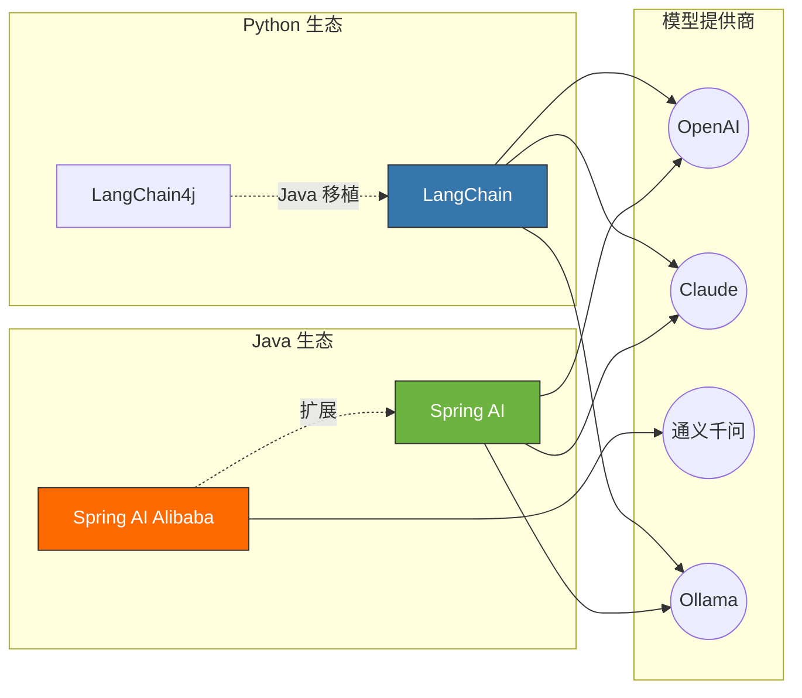

# Spring AI vs LangChain：Java 与 Python AI 框架全面对比

> 2025 年 12 月
> 版本：Spring AI 1.1.x (稳定) / 2.0.0-M1 (预览) / Spring AI Alibaba 1.1.x | LangChain 1.x (langchain-core 1.2.x)

本文档旨在全面对比两大主流 AI 应用开发框架：**Spring AI**（Java 生态）和 **LangChain**（Python 生态），帮助团队做出合理的技术选型决策。



---

## 1. 框架概述

### 1.1 LangChain

**LangChain** 是 2022 年底推出的开源框架，迅速成为 Python 生态中构建 LLM 应用的事实标准。它提供了一套完整的抽象层，用于连接大语言模型与外部数据源、工具和 API。2025 年 LangChain 已演进至 1.x 版本，架构更加成熟稳定。

- **官网**：[langchain.com](https://www.langchain.com/)
- **GitHub Stars**：100k+
- **核心理念**：通过预构建的 Agent 架构和模型集成快速构建 AI 应用

### 1.2 Spring AI

**Spring AI** 是 Spring 官方于 2024 年正式发布的 AI 应用开发框架，将 Spring 的设计哲学（依赖注入、自动配置、声明式编程）应用于 AI 领域。2025 年已发布 1.1.x 稳定版和 2.0.0 预览版（基于 Spring Boot 4.0）。

- **官网**：[spring.io/projects/spring-ai](https://spring.io/projects/spring-ai)
- **扩展**：Spring AI Alibaba（阿里云增强版）
- **核心理念**：Spring 风格的 AI 开发体验

---

## 2. 核心架构对比

### 2.1 设计哲学

| 维度         | LangChain                                   | Spring AI             |
| :----------- | :------------------------------------------ | :-------------------- |
| **编程范式** | 函数式 + 链式组合                           | 面向对象 + 依赖注入   |
| **配置方式** | 代码即配置                                  | 配置文件 + 自动配置   |
| **组件组合** | LCEL 表达式 (LangChain Expression Language) | Builder 模式 + 注解   |
| **扩展机制** | 回调 (Callbacks) + 钩子                     | Spring AOP + 事件机制 |

### 2.2 核心抽象对比

```
LangChain 核心概念                 Spring AI 对应概念
─────────────────────────────────────────────────────
ChatModel                    ─→    ChatModel / ChatClient
PromptTemplate               ─→    PromptTemplate
Chain (LCEL)                 ─→    Advisor / ChatClient 流式调用
Agent + Tools                ─→    Function Calling / Tool
VectorStore                  ─→    VectorStore
Retriever                    ─→    DocumentRetriever
Memory                       ─→    ChatMemory / Advisor
Document Loader              ─→    DocumentReader
Text Splitter                ─→    DocumentTransformer
```

---

## 3. 功能特性对比

### 3.1 模型支持

| 模型/服务                  | LangChain | Spring AI              |
| :------------------------- | :-------- | :--------------------- |
| OpenAI (GPT-4o, GPT-5, o1) | ✅        | ✅                     |
| Anthropic (Claude 4.5)     | ✅        | ✅                     |
| Google (Gemini 3)          | ✅        | ✅                     |
| Azure OpenAI               | ✅        | ✅                     |
| AWS Bedrock                | ✅        | ✅                     |
| 通义千问 (DashScope)       | ✅        | ✅ (Spring AI Alibaba) |
| 文心一言                   | ✅        | ⚠️ 社区支持            |
| Ollama (本地)              | ✅        | ✅                     |
| HuggingFace                | ✅        | ✅                     |

### 3.2 核心功能

| 功能                 | LangChain       | Spring AI            | 说明                              |
| :------------------- | :-------------- | :------------------- | :-------------------------------- |
| **Prompt 模板**      | ✅ 强大         | ✅ 支持              | LangChain 模板功能更丰富          |
| **流式输出**         | ✅              | ✅                   | 两者都良好支持                    |
| **Function Calling** | ✅              | ✅                   | 两者都支持                        |
| **RAG**              | ✅ 成熟         | ✅ 支持              | LangChain 生态更丰富              |
| **Agent**            | ✅ 成熟         | ✅ 增强中            | Spring AI Alibaba 1.1 大幅增强    |
| **多智能体**         | ✅ LangGraph    | ✅ Spring AI Alibaba | 两者都支持复杂编排                |
| **Memory/对话历史**  | ✅ 多种实现     | ✅ ChatMemory        | LangChain 选项更多                |
| **MCP 协议**         | ✅              | ✅                   | 两者都支持 Model Context Protocol |
| **可观测性**         | ⚠️ 需 LangSmith | ✅ 原生              | Spring 可观测性更成熟             |
| **结构化输出**       | ✅              | ✅                   | Spring AI 类型安全更好            |

### 3.3 向量数据库支持

| 向量数据库            | LangChain | Spring AI |
| :-------------------- | :-------- | :-------- |
| Milvus                | ✅        | ✅        |
| Pinecone              | ✅        | ✅        |
| Weaviate              | ✅        | ✅        |
| Qdrant                | ✅        | ✅        |
| Chroma                | ✅        | ✅        |
| PostgreSQL (pgvector) | ✅        | ✅        |
| Redis                 | ✅        | ✅        |
| Elasticsearch         | ✅        | ✅        |
| 阿里云向量检索        | ⚠️        | ✅        |

---

## 4. 代码示例对比

### 4.1 基础对话

**LangChain (Python)**：

```python
from langchain_openai import ChatOpenAI
from langchain_core.messages import HumanMessage, SystemMessage

# 初始化模型
model = ChatOpenAI(model="gpt-4o", temperature=0.7)

# 发送消息
messages = [
    SystemMessage(content="你是一个有帮助的助手。"),
    HumanMessage(content="介绍一下你自己")
]
response = model.invoke(messages)
print(response.content)
```

**Spring AI (Java)**：

```java
@Service
public class ChatService {

    private final ChatClient chatClient;

    public ChatService(ChatClient.Builder builder) {
        this.chatClient = builder
            .defaultSystem("你是一个有帮助的助手。")
            .build();
    }

    public String chat(String userMessage) {
        return chatClient.prompt()
            .user(userMessage)
            .call()
            .content();
    }
}
```

### 4.2 RAG 实现

**LangChain (Python)**：

```python
from langchain_openai import OpenAIEmbeddings, ChatOpenAI
from langchain_community.vectorstores import Chroma
from langchain.chains import RetrievalQA
from langchain_community.document_loaders import TextLoader
from langchain.text_splitter import RecursiveCharacterTextSplitter

# 1. 加载文档
loader = TextLoader("knowledge.txt")
documents = loader.load()

# 2. 分割文档
splitter = RecursiveCharacterTextSplitter(chunk_size=1000, chunk_overlap=200)
splits = splitter.split_documents(documents)

# 3. 创建向量存储
vectorstore = Chroma.from_documents(splits, OpenAIEmbeddings())

# 4. 创建 RAG 链
qa_chain = RetrievalQA.from_chain_type(
    llm=ChatOpenAI(model="gpt-4o"),
    retriever=vectorstore.as_retriever(),
    return_source_documents=True
)

# 5. 查询
result = qa_chain.invoke({"query": "什么是向量数据库？"})
print(result["result"])
```

**Spring AI (Java)**：

```java
@Service
public class RagService {

    private final ChatClient chatClient;
    private final VectorStore vectorStore;

    public RagService(ChatClient.Builder builder, VectorStore vectorStore) {
        this.vectorStore = vectorStore;
        this.chatClient = builder
            .defaultAdvisors(new QuestionAnswerAdvisor(vectorStore))
            .build();
    }

    // 加载文档
    public void loadDocuments(Resource resource) {
        var reader = new TextReader(resource);
        var documents = reader.get();

        var splitter = new TokenTextSplitter();
        var splitDocs = splitter.apply(documents);

        vectorStore.add(splitDocs);
    }

    // RAG 查询
    public String query(String question) {
        return chatClient.prompt()
            .user(question)
            .call()
            .content();
    }
}
```

### 4.3 Agent 与工具调用

**LangChain (Python)**：

```python
from langchain_openai import ChatOpenAI
from langchain.agents import create_tool_calling_agent, AgentExecutor
from langchain_core.tools import tool
from langchain_core.prompts import ChatPromptTemplate

# 定义工具
@tool
def get_weather(city: str) -> str:
    """获取指定城市的天气信息"""
    return f"{city}今天晴，气温 25°C"

@tool
def search_database(query: str) -> str:
    """搜索数据库"""
    return f"找到关于 '{query}' 的 10 条记录"

# 创建 Agent
llm = ChatOpenAI(model="gpt-4o")
tools = [get_weather, search_database]

prompt = ChatPromptTemplate.from_messages([
    ("system", "你是一个有帮助的助手，可以使用工具来回答问题。"),
    ("human", "{input}"),
    ("placeholder", "{agent_scratchpad}")
])

agent = create_tool_calling_agent(llm, tools, prompt)
executor = AgentExecutor(agent=agent, tools=tools, verbose=True)

# 执行
result = executor.invoke({"input": "北京今天天气怎么样？"})
print(result["output"])
```

**Spring AI (Java)**：

```java
@Service
public class AgentService {

    private final ChatClient chatClient;

    public AgentService(ChatClient.Builder builder) {
        this.chatClient = builder
            .defaultSystem("你是一个有帮助的助手，可以使用工具来回答问题。")
            .defaultTools(new WeatherTool(), new DatabaseTool())
            .build();
    }

    public String execute(String input) {
        return chatClient.prompt()
            .user(input)
            .call()
            .content();
    }
}

// 工具定义
@Component
public class WeatherTool {

    @Tool(description = "获取指定城市的天气信息")
    public String getWeather(@ToolParam(description = "城市名称") String city) {
        return city + "今天晴，气温 25°C";
    }
}

@Component
public class DatabaseTool {

    @Tool(description = "搜索数据库")
    public String searchDatabase(@ToolParam(description = "搜索关键词") String query) {
        return "找到关于 '" + query + "' 的 10 条记录";
    }
}
```

### 4.4 多智能体编排

**LangChain (LangGraph)**：

```python
from langgraph.graph import StateGraph, END
from typing import TypedDict

class AgentState(TypedDict):
    messages: list
    next_agent: str

def researcher(state: AgentState) -> AgentState:
    # 研究员逻辑
    return {"messages": state["messages"] + ["研究完成"], "next_agent": "writer"}

def writer(state: AgentState) -> AgentState:
    # 写作员逻辑
    return {"messages": state["messages"] + ["写作完成"], "next_agent": "end"}

# 构建图
workflow = StateGraph(AgentState)
workflow.add_node("researcher", researcher)
workflow.add_node("writer", writer)
workflow.add_edge("researcher", "writer")
workflow.add_edge("writer", END)
workflow.set_entry_point("researcher")

app = workflow.compile()
result = app.invoke({"messages": [], "next_agent": "researcher"})
```

**Spring AI Alibaba (Multi-Agent)**：

```java
@Service
public class MultiAgentService {

    private final ChatClient chatClient;

    public MultiAgentService(ChatClient.Builder builder) {
        this.chatClient = builder.build();
    }

    public String execute(String task) {
        // 创建研究员 Agent
        ReactAgent researcher = ReactAgent.builder()
            .chatClient(chatClient)
            .name("researcher")
            .description("负责研究和收集信息")
            .build();

        // 创建写作员 Agent
        ReactAgent writer = ReactAgent.builder()
            .chatClient(chatClient)
            .name("writer")
            .description("负责撰写内容")
            .build();

        // 顺序编排
        SequentialAgent pipeline = SequentialAgent.builder()
            .agents(researcher, writer)
            .build();

        return pipeline.run(task);
    }
}
```

---

## 5. 生态系统对比

### 5.1 LangChain 生态

```
LangChain 生态系统
├── langchain-core         # 核心抽象 (v1.2.x)
├── langchain-community    # 社区集成
├── langchain-openai       # OpenAI 集成 (v1.1.x)
├── langchain-anthropic    # Anthropic 集成
├── langgraph              # 多智能体编排
├── langserve              # API 部署
├── langsmith              # 可观测性平台（商业）
└── langchain-cli          # CLI 工具
```

**优势**：

- 社区活跃，第三方集成极其丰富
- 文档加载器支持 100+ 格式
- LangSmith 提供强大的追踪和评估能力

### 5.2 Spring AI 生态

```
Spring AI 生态系统
├── spring-ai-core              # 核心抽象
├── spring-ai-openai            # OpenAI 集成 (支持 GPT-5)
├── spring-ai-anthropic         # Anthropic 集成 (支持 Claude 4.5)
├── spring-ai-ollama            # Ollama 集成
├── spring-ai-alibaba           # 阿里云增强
│   ├── Agent Framework         # 智能体框架
│   ├── Graph                   # 工作流引擎
│   ├── Multi-Agent             # 多智能体
│   ├── Studio                  # 可视化聊天窗口
│   └── Admin                   # 可视化平台
└── spring-ai-vectorstore-*     # 向量存储集成
```

**优势**：

- 与 Spring 生态无缝集成
- 企业级特性（安全、事务、可观测性）
- Spring AI Alibaba 提供生产就绪特性

---

## 6. 性能与生产就绪性

| 维度         | LangChain                  | Spring AI                    |
| :----------- | :------------------------- | :--------------------------- |
| **并发处理** | 依赖 Python 异步 (asyncio) | JVM 多线程 + 虚拟线程        |
| **内存管理** | Python GC，大规模时需注意  | JVM GC，成熟可控             |
| **类型安全** | 动态类型，运行时错误       | 静态类型，编译期检查         |
| **企业集成** | 需额外工作                 | Spring 原生支持              |
| **可观测性** | LangSmith（商业）          | Spring Actuator + Micrometer |
| **错误处理** | 回调机制                   | 异常体系 + 重试机制          |
| **部署**     | Python 环境依赖            | JAR 包 / 容器化成熟          |

---

## 7. 选型决策树

```
                        ┌─────────────────┐
                        │  你的技术栈是？  │
                        └────────┬────────┘
                                 │
              ┌──────────────────┼──────────────────┐
              ▼                  ▼                  ▼
         ┌────────┐         ┌────────┐         ┌────────┐
         │ Python │         │  Java  │         │  混合   │
         └────┬───┘         └────┬───┘         └────┬───┘
              │                  │                  │
              ▼                  ▼                  ▼
        ┌──────────┐      ┌────────────┐    ┌────────────┐
        │LangChain │      │ Spring AI  │    │  两者结合   │
        └──────────┘      └────────────┘    └────────────┘
              │                  │                  │
              ▼                  ▼                  ▼
    ┌─────────────────┐  ┌─────────────────┐  ┌─────────────────┐
    │ • 快速原型       │  │ • 企业级应用    │  │ • Python 处理   │
    │ • 数据科学       │  │ • 微服务集成    │  │   复杂 AI 逻辑  │
    │ • AI 研究        │  │ • 类型安全      │  │ • Java 处理     │
    │ • 丰富生态       │  │ • 可观测性      │  │   业务逻辑      │
    └─────────────────┘  └─────────────────┘  └─────────────────┘
```

### 7.1 选择 LangChain 的场景

- ✅ 团队主要使用 **Python** 技术栈
- ✅ 需要 **快速原型验证** 和实验
- ✅ 项目需要使用 **丰富的 AI/ML 生态**（HuggingFace、scikit-learn 等）
- ✅ 需要处理 **多种格式的文档**（100+ 格式支持）
- ✅ 团队有 **数据科学背景**

### 7.2 选择 Spring AI 的场景

- ✅ 团队主要使用 **Java/Spring** 技术栈
- ✅ 需要与 **现有 Spring Boot 微服务** 深度集成
- ✅ 重视 **类型安全** 和编译期检查
- ✅ 需要 **企业级特性**（安全、事务、审计、可观测性）
- ✅ 项目需要 **长期维护** 和稳定性
- ✅ 使用 **阿里云** 服务（推荐 Spring AI Alibaba）

---

## 8. 混合架构方案

在大型企业中，Python 和 Java 往往共存。以下是推荐的混合架构：

```
┌─────────────────────────────────────────────────────────────────┐
│                         用户界面层                               │
│                    (Web / Mobile / API)                         │
└───────────────────────────┬─────────────────────────────────────┘
                            │
┌───────────────────────────▼─────────────────────────────────────┐
│                    API 网关 / BFF 层                             │
│                      (Spring Cloud)                              │
└───────────────────────────┬─────────────────────────────────────┘
                            │
        ┌───────────────────┴───────────────────┐
        ▼                                       ▼
┌───────────────────────────┐   ┌───────────────────────────────┐
│    Spring AI Alibaba       │   │     业务微服务 (Spring Boot)    │
│    ──────────────────      │   │     ─────────────────────     │
│    • 智能体编排            │   │     • 订单服务                 │
│    • 对话管理              │   │     • 用户服务                 │
│    • 业务工具调用          │   │     • 支付服务                 │
│    • API 封装              │   │     • ...                     │
└───────────┬───────────────┘   └───────────────────────────────┘
            │
            │ gRPC / HTTP
            ▼
┌─────────────────────────────────────────────────────────────────┐
│                   LangChain Python 服务                          │
│                   ───────────────────                            │
│     • 复杂 RAG 流程           • 文档处理 (100+ 格式)             │
│     • 模型微调/评估           • 实验性 AI 功能                   │
│     • 数据预处理              • 研究原型                         │
└─────────────────────────────────────────────────────────────────┘
            │
            ▼
┌─────────────────────────────────────────────────────────────────┐
│                        基础设施层                                │
│     ┌──────────┐  ┌──────────┐  ┌──────────┐  ┌──────────┐      │
│     │  LLM API  │  │ 向量数据库 │  │   缓存    │  │  消息队列  │      │
│     │ (通义/GPT)│  │ (Milvus) │  │  (Redis) │  │  (Kafka) │      │
│     └──────────┘  └──────────┘  └──────────┘  └──────────┘      │
└─────────────────────────────────────────────────────────────────┘
```

### 混合架构的优势

1. **各取所长**：Python 处理复杂 AI 逻辑，Java 处理业务逻辑
2. **渐进式迁移**：可以逐步将成熟的 Python 组件用 Java 重写
3. **团队协作**：AI 团队和业务团队可以使用各自擅长的技术
4. **风险分散**：核心业务不依赖单一技术栈

---

## 9. 迁移指南

### 9.1 从 LangChain 迁移到 Spring AI

| LangChain 概念             | Spring AI 替代方案                                |
| :------------------------- | :------------------------------------------------ |
| `ChatOpenAI`               | `OpenAiChatModel` + `ChatClient`                  |
| `PromptTemplate`           | `PromptTemplate`                                  |
| `ConversationBufferMemory` | `InMemoryChatMemory` + `MessageChatMemoryAdvisor` |
| `RetrievalQA`              | `QuestionAnswerAdvisor`                           |
| `@tool` 装饰器             | `@Tool` 注解                                      |
| `AgentExecutor`            | `ReactAgent` (Spring AI Alibaba)                  |
| `LangGraph`                | `Graph` (Spring AI Alibaba)                       |

### 9.2 关键差异注意事项

1. **异步处理**：LangChain 使用 `async/await`，Spring AI 使用 `Flux`/`Mono`
2. **配置方式**：LangChain 代码配置，Spring AI 支持 `application.yml`
3. **依赖注入**：Spring AI 天然支持，LangChain 需要手动管理
4. **错误处理**：Spring AI 使用异常体系，LangChain 使用回调

---

## 10. 总结与建议

### 核心结论

| 维度                       | 推荐选择            |
| :------------------------- | :------------------ |
| **Python 团队 + 快速原型** | LangChain           |
| **Java 团队 + 企业应用**   | Spring AI (Alibaba) |
| **复杂 AI + 业务集成**     | 混合架构            |
| **阿里云生态**             | Spring AI Alibaba   |

### 2025 年趋势观察

1. **Spring AI 2.0 预览发布**：基于 Spring Boot 4.0 和 Spring Framework 7.0，支持最新 Java 特性
2. **LangChain 1.x 正式发布**：架构更加成熟，Agent 抽象成为核心
3. **MCP 协议统一**：两者都支持 MCP，互操作性增强
4. **多智能体成为标配**：LangGraph 和 Spring AI Alibaba 都在强化
5. **新模型支持**：两个框架都已支持 GPT-5、Claude 4.5、Gemini 3 等最新模型

### 最终建议

> **不要为了技术而技术，选择与团队技能匹配的框架。**
>
> - 如果团队是 Java 栈，不要因为 LangChain 生态丰富就强行引入 Python
> - 如果团队是 Python 栈，不要因为企业级需求就强行引入 Java
> - 如果必须混合，清晰定义边界，使用 API/消息队列解耦

---

## 参考资源

- [Spring AI 官方文档](https://docs.spring.io/spring-ai/reference/)
- [Spring AI Alibaba 官网](https://java2ai.com/)
- [LangChain 官方文档](https://python.langchain.com/)
- [LangGraph 文档](https://langchain-ai.github.io/langgraph/)
- [LangChain4j (Java)](https://docs.langchain4j.dev/)
