# VS Code Copilot & Cursor：前后端高效开发协同指南

> 2025 年 12 月
> 版本：VS Code v1.107.x | GitHub Copilot v1.107.x | Cursor v2.1.x

本文档旨在介绍如何结合使用 **VS Code + GitHub Copilot** 进行前端开发，以及使用 **Cursor** 进行 Java 后端开发，以构建高效的 AI 辅助全栈开发工作流。

```mermaid
graph TD
    subgraph Frontend_Zone [前端开发: VS Code + Copilot]
        direction TB
        F1[UI 组件生成]
        F2[交互逻辑编写]
        F3[前端重构]
        F4[Agent 模式]
        F5[MCP 服务器扩展]
    end

    subgraph Backend_Zone [后端开发: Cursor]
        direction TB
        B1[API 接口定义]
        B2[核心业务逻辑]
        B3[单元测试 & 调试]
        B4[Agent 模式 & 代码库嵌入]
        B5[Bugbot 代码审查]
    end

    subgraph Models [多模型支持]
        M1[GPT-5.x / Claude 4.5 / Gemini 3]
    end

    subgraph Integration [协同联调]
        API{API 契约 / Swagger}
    end

    Frontend_Zone -->|API 调用| API
    Backend_Zone -->|接口实现| API
    Models -.->|模型切换| Frontend_Zone
    Models -.->|模型切换| Backend_Zone
```



## 1. 前端开发：VS Code + GitHub Copilot

VS Code 拥有庞大的插件生态，是前端开发的首选编辑器。结合 GitHub Copilot，可以极大地提升 HTML/CSS/JavaScript/TypeScript 以及主流框架（React, Vue, Angular）的开发效率。

### 核心优势

- **强大的生态系统**：ESLint, Prettier, Tailwind CSS 等插件完美集成。
- **Copilot Chat**：集成在侧边栏，可随时提问、解释代码或生成代码片段。
- **Inline Chat (行内对话)**：直接在编辑器中通过 `Ctrl+I` (Windows) / `Cmd+I` (Mac) 唤起，进行代码生成或重构。

### 实战场景

#### 1.1 组件生成

在编写 React 或 Vue 组件时，可以通过注释描述需求，Copilot 会自动补全整个组件结构。

**示例**：
在 `.tsx` 文件中输入注释：

```typescript
// 创建一个响应式的导航栏组件，包含 Logo、菜单项（首页、产品、关于我们）和登录按钮，使用 Tailwind CSS 样式
```

Copilot 将自动生成包含 JSX 结构和 Tailwind 类名的完整代码。

#### 1.2 样式辅助

编写 CSS 或使用 CSS-in-JS 时，Copilot 能根据上下文推断样式属性。

#### 1.3 代码解释与重构

选中一段复杂的逻辑代码，右键选择 "Copilot" -> "Explain This"（解释这段代码），或者使用 Inline Chat 指令 `/fix` 修复 Lint 错误。

#### 1.4 终端命令辅助

在 VS Code 终端中，如果遇到报错或不知道如何写命令，可以直接输入 `Cmd+I` (Mac) / `Ctrl+I` (Windows) 唤起 Copilot，它会根据上下文生成正确的 Shell 命令（如 Git 操作、依赖安装等）。

#### 1.5 多文件编辑

VS Code Copilot 支持跨文件编辑会话：

- 通过单个提示即可对项目中的多个文件进行协调修改
- Copilot 会分析项目结构并进行协调变更
- 结合 **Agent 模式** 可实现更复杂的跨组件重构

> 💡 **提示**：现已演进为更强大的 Agent 模式，详见 1.7 节

#### 1.6 模型选择

GitHub Copilot 支持多模型切换。用户可以在 Chat 界面中选择不同模型，包括：

- **GPT-5.2** / **GPT-5.1** / **GPT-5.1-Codex-Max**（OpenAI 最新模型）
- **Claude Opus 4.5** / **Claude Sonnet 4.5**（Anthropic 最新模型）
- **Gemini 3 Pro** / **Gemini 3 Flash**（Google 模型）

此外，VS Code 还支持 **Auto 模型选择**，可根据任务自动选择最优模型。

#### 1.7 Agent 模式（自主编码代理）

最新的 Copilot 引入了 **Agent 模式**，可以自主规划和执行复杂的开发任务：

- 自动执行终端命令、创建文件、搜索文档
- 支持跨文件协调修改
- 可安装 **MCP 服务器** 扩展能力（如数据库查询、外部 API 连接）
- 在 Chat 视图中通过 Agent 选择器切换模式（快捷键 `Ctrl+Alt+I`）

**示例任务**：

> 使用 OAuth 实现身份认证
> 将代码库迁移到新框架
> 调试失败的测试并应用修复

#### 1.8 自定义指令与 MCP

- **自定义指令**：定义项目特定的编码规范，AI 将按照您的风格生成代码
- **自定义代理**：创建专注于特定工作流的 Agent（如架构讨论）
- **MCP 服务器**：扩展 Chat 功能，添加数据库查询、外部 API 等工具

---

## 2. 后端开发：Cursor (Java)

Cursor 是一款基于 VS Code 二次开发的 AI 原生编辑器，它对代码库的索引和理解能力非常出色，特别适合处理强类型的 Java 后端项目（如 Spring Boot）。

### 核心优势

- **全库索引 (Codebase Indexing)**：Cursor 会索引整个项目文件，理解类之间的依赖关系，这对于复杂的 Java 项目至关重要。
- **Cursor Tab**：超越传统自动补全的“预测性编程”功能。它不仅补全代码，还能预测你的下一个光标位置和修改意图，支持多行差异（Diff）预览，按 `Tab` 键即可一键采纳。
- **Cmd+K (Ctrl+K)**：强大的行内编辑功能，可以直接修改现有代码逻辑。
- **Chat with Codebase**：在对话框中使用 `@Codebase`，可以基于整个项目上下文回答问题，例如“找到所有使用了 UserDTO 的 Controller”。

### 实战场景

#### 2.1 Spring Boot 样板代码生成

Java 开发往往涉及大量的样板代码（Controller, Service, Repository, DTO）。

**示例**：
在 Chat 中输入：

> 创建一个用户管理模块，包含 User 实体（id, name, email），对应的 JPA Repository，Service 接口及实现，以及 RESTful Controller。使用 Lombok 注解。

Cursor 会一次性生成多个文件的代码建议，并考虑到项目现有的包结构。

#### 2.2 单元测试生成

Java 强调测试覆盖率。选中一个 Service 方法，使用 `Cmd+K` 输入 "Generate JUnit 5 tests for this method, mocking dependencies with Mockito"。Cursor 能精准地生成包含 Mock 逻辑的测试用例。

#### 2.3 遗留代码理解与维护

对于接手的老旧 Java 项目，使用 `@Codebase` 提问：“分析一下订单处理的完整流程，从 Controller 入口到数据库落库”。Cursor 会跨文件追踪调用链并给出解释。

#### 2.4 Agent 模式（原 Composer）

Cursor 的核心功能 **Agent** 允许进行深度代码库理解和多文件协同编辑：

- **代码库嵌入**：深度理解项目结构和依赖关系
- **自主执行**：自动执行终端命令、创建文件、搜索文档
- **MCP 服务器**：连接外部工具和数据源
- **计划模式**：复杂任务自动规划执行步骤

**示例任务**：

> 添加一个新的 API 端点，包括 Controller, Service, DTO 和数据库迁移
> 实现用户认证功能并编写测试

💡 Agent 可从 Slack、问题跟踪器、移动端等启动任务，在 IDE 中完成。

#### 2.5 灵活的模型选择

Cursor 支持多种顶级模型切换：

| 模型                            | 提供商    | 特点                           |
| ------------------------------- | --------- | ------------------------------ |
| **Claude 4.5 Opus / Sonnet**    | Anthropic | 擅长编码和逻辑推理，支持思维链 |
| **GPT-5.2 / GPT-5.1-Codex-Max** | OpenAI    | 最新 GPT 系列，高速高质量      |
| **Gemini 3 Pro / Flash**        | Google    | 支持超长上下文（200k+）        |
| **Grok Code**                   | xAI       | 专为代码优化                   |
| **Composer 1**                  | Cursor    | Cursor 自研代理模型            |

Cursor 还支持 **Auto 模式**，根据任务自动选择最优模型。

#### 2.6 最新功能（2025 年 12 月）

- **调试模式**：智能调试和错误修复
- **计划模式**：复杂任务的步骤规划
- **多智能体评审**：代码审查与建议
- **Bugbot**：自动识别问题并一键修复
- **CLI 支持**：在任意终端运行 Agent
- **规则与记忆**：通过可复用的作用域指令自定义模型行为

---

## 3. 协同工作流建议

虽然可以在同一个编辑器中完成所有工作，但根据工具特性进行分工可以最大化效率：

| 开发领域                  | 推荐工具              | 理由                                                                                                                         |
| :------------------------ | :-------------------- | :--------------------------------------------------------------------------------------------------------------------------- |
| **前端 (Web/Mobile)**     | **VS Code + Copilot** | 适合习惯原生 VS Code 体验、需要企业级合规管理的团队。Agent 模式 + MCP 扩展能力强大。支持 GPT-5/Claude 4.5/Gemini 3。         |
| **后端 (Java/Go/Python)** | **Cursor**            | 后端逻辑通常更复杂，依赖引用多。Cursor 的代码库嵌入和 Agent 模式能更好地处理跨文件重构和复杂业务逻辑。支持 Bugbot 代码审查。 |

### 最佳实践

1.  **前端**：在 VS Code 中打开前端项目文件夹，利用 Copilot 快速构建 UI 和交互逻辑。
2.  **后端**：在 Cursor 中打开后端项目文件夹，利用其深度理解能力编写业务逻辑和 API 接口。
3.  **联调**：前后端通过 API 文档（如 Swagger/OpenAPI）对接，AI 工具均可辅助生成 API 调用代码。

---

## 总结

- **VS Code Copilot** 胜在**原生集成**、**企业级生态**与**Agent 自主编码能力**，支持 MCP 服务器扩展，是前端开发和企业环境的稳健选择。
- **Cursor** 胜在**深度代码库理解**、**Agent 模式**与 **Bugbot 代码审查**，是处理复杂后端逻辑和全栈重构的强力引擎。

两者现已支持最新的 **GPT-5 系列**、**Claude 4.5 系列** 和 **Gemini 3** 模型，合理搭配将显著提升全栈开发的产出速度与代码质量。

---

> 📅 **文档更新时间**：2025 年 12 月
